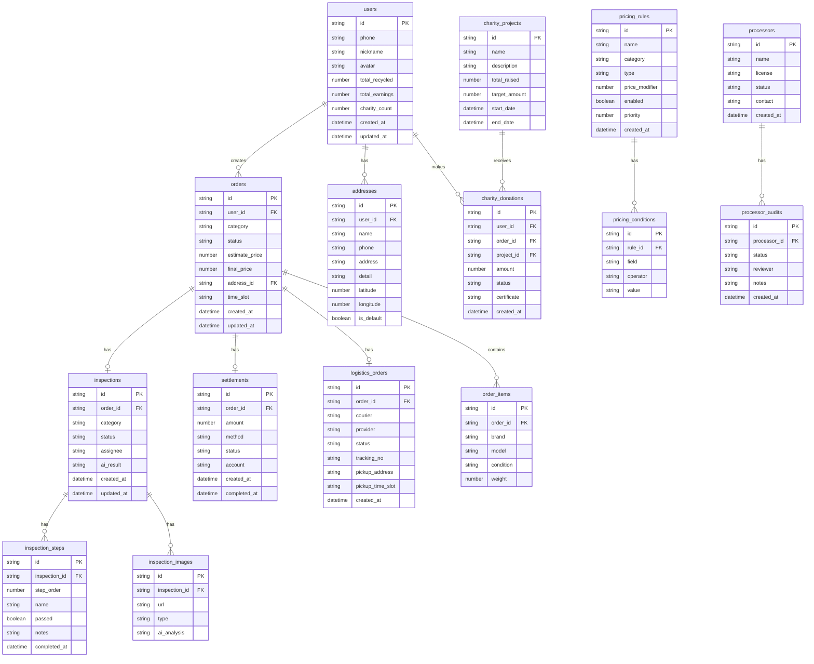

## 1. 架构设计

```mermaid
flowchart TB
    subgraph "前端层"
        "React用户端" --> "React Router"
        "React运营端" --> "React Router"
    end

    subgraph "后端层"
        "Express API Gateway" --> "订单服务"
        "Express API Gateway" --> "质检服务"
        "Express API Gateway" --> "定价服务"
        "Express API Gateway" --> "分账服务"
        "Express API Gateway" --> "物流服务"
        "Express API Gateway" --> "用户服务"
        "Express API Gateway" --> "公益服务"
        "Express API Gateway" --> "看板服务"
    end

    subgraph "数据层"
        "SQLite数据库" --> "订单表"
        "SQLite数据库" --> "质检工单表"
        "SQLite数据库" --> "定价规则表"
        "SQLite数据库" --> "分账流水表"
        "SQLite数据库" --> "用户表"
        "SQLite数据库" --> "物流表"
        "SQLite数据库" --> "公益记录表"
    end

    subgraph "外部服务"
        "顺丰物流API"
        "京东物流API"
        "微信支付API"
        "AI质检模拟服务"
    end

    "React用户端" --> "Express API Gateway"
    "React运营端" --> "Express API Gateway"
    "订单服务" --> "SQLite数据库"
    "质检服务" --> "SQLite数据库"
    "定价服务" --> "SQLite数据库"
    "分账服务" --> "SQLite数据库"
    "物流服务" --> "顺丰物流API"
    "物流服务" --> "京东物流API"
    "分账服务" --> "微信支付API"
    "质检服务" --> "AI质检模拟服务"
```

## 2. 技术说明

- 前端：React@18 + TailwindCSS@3 + Vite
- 初始化工具：vite-init
- 后端：Express@4 + TypeScript（ESM格式）
- 数据库：SQLite（better-sqlite3），使用Mock数据填充
- 状态管理：Zustand
- 路由：react-router-dom
- 图标：lucide-react
- 图表：recharts
- 日期处理：dayjs

## 3. 路由定义

| 路由 | 用途 |
|------|------|
| `/` | 首页，平台介绍与品类入口 |
| `/estimate` | 智能估价页，品类选择与参数输入 |
| `/appointment` | 预约下单页，地址与时间窗口选择 |
| `/orders` | 订单中心页，订单列表 |
| `/orders/:id` | 订单详情页，全链路状态跟踪 |
| `/admin/inspection` | 质检工单页（运营侧），工单列表与SOP质检 |
| `/admin/inspection/:id` | 质检详情页，SOP流程与AI初筛 |
| `/admin/pricing` | 定价规则页（运营侧），规则列表与编辑 |
| `/admin/settlement` | 分账管理页（运营侧），结算列表与打款 |
| `/admin/logistics` | 物流调度页（运营侧），调度看板 |
| `/admin/audit` | 资质审核页（运营侧），处理商审核工作流 |
| `/charity` | 公益追溯页，捐赠记录与项目展示 |
| `/admin/dashboard` | 数据看板页（运营侧），统计图表 |

## 4. API定义

### 4.1 用户相关

```typescript
// POST /api/users/register
interface RegisterRequest {
  phone: string;
  code: string;
  nickname?: string;
}
interface RegisterResponse {
  id: string;
  phone: string;
  nickname: string;
  token: string;
}

// GET /api/users/:id/profile
interface UserProfile {
  id: string;
  phone: string;
  nickname: string;
  avatar?: string;
  totalRecycled: number;
  totalEarnings: number;
  charityCount: number;
}
```

### 4.2 估价相关

```typescript
// POST /api/estimate
interface EstimateRequest {
  category: "clothing" | "book" | "phone";
  brand?: string;
  model?: string;
  condition: "new" | "good" | "fair" | "poor";
  weight?: number;
  age?: number;
}
interface EstimateResponse {
  estimateId: string;
  priceRange: { min: number; max: number };
  suggestedPrice: number;
  confidence: number;
  factors: Array<{ name: string; impact: number }>;
}
```

### 4.3 订单相关

```typescript
// POST /api/orders
interface CreateOrderRequest {
  estimateId: string;
  addressId: string;
  timeSlotId: string;
  category: "clothing" | "book" | "phone";
  items: Array<{
    brand?: string;
    model?: string;
    condition: string;
    weight?: number;
  }>;
}
interface OrderResponse {
  id: string;
  status: "pending" | "dispatched" | "picked_up" | "inspecting" | "priced" | "confirmed" | "settled" | "donated" | "rejected";
  createdAt: string;
  updatedAt: string;
  timeline: Array<{ status: string; time: string; description: string }>;
  estimatePrice: number;
  finalPrice?: number;
  category: string;
}

// GET /api/orders?status=&page=&limit=
interface OrderListResponse {
  total: number;
  page: number;
  limit: number;
  orders: OrderResponse[];
}
```

### 4.4 质检工单相关

```typescript
// GET /api/inspections?status=&page=&limit=
interface InspectionListResponse {
  total: number;
  inspections: Array<{
    id: string;
    orderId: string;
    category: string;
    status: "pending" | "ai_screening" | "manual_check" | "completed" | "rejected";
    assignee?: string;
    createdAt: string;
    aiResult?: {
      category: string;
      condition: string;
      defects: string[];
      confidence: number;
    };
  }>;
}

// PUT /api/inspections/:id/check
interface InspectionCheckRequest {
  step: number;
  passed: boolean;
  notes?: string;
  images?: string[];
}

// POST /api/inspections/:id/ai-screen
interface AIScreenResponse {
  category: string;
  condition: string;
  defects: string[];
  confidence: number;
  suggestedPrice: number;
}
```

### 4.5 定价规则相关

```typescript
// GET /api/pricing/rules
interface PricingRule {
  id: string;
  name: string;
  category: "clothing" | "book" | "phone";
  type: "weight" | "model" | "market";
  conditions: Array<{
    field: string;
    operator: string;
    value: string | number;
  }>;
  priceModifier: number;
  enabled: boolean;
  priority: number;
  createdAt: string;
}

// POST /api/pricing/rules
interface CreatePricingRuleRequest {
  name: string;
  category: string;
  type: string;
  conditions: Array<{
    field: string;
    operator: string;
    value: string | number;
  }>;
  priceModifier: number;
  priority: number;
}

// POST /api/pricing/calculate
interface CalculatePriceRequest {
  category: string;
  brand?: string;
  model?: string;
  condition: string;
  weight?: number;
}
interface CalculatePriceResponse {
  basePrice: number;
  adjustments: Array<{ rule: string; modifier: number }>;
  finalPrice: number;
}
```

### 4.6 分账相关

```typescript
// GET /api/settlements?status=&page=&limit=
interface SettlementListResponse {
  total: number;
  settlements: Array<{
    id: string;
    orderId: string;
    amount: number;
    method: "wechat" | "bank";
    status: "pending" | "processing" | "completed" | "failed";
    createdAt: string;
    completedAt?: string;
  }>;
}

// POST /api/settlements/:id/execute
interface ExecuteSettlementRequest {
  method: "wechat" | "bank";
  account: string;
}

// POST /api/settlements/batch
interface BatchSettlementRequest {
  settlementIds: string[];
}
```

### 4.7 物流相关

```typescript
// GET /api/logistics/orders?status=
interface LogisticsOrderListResponse {
  total: number;
  orders: Array<{
    id: string;
    recycleOrderId: string;
    courier: string;
    provider: "sf" | "jd";
    status: "dispatched" | "picking_up" | "picked_up" | "in_transit" | "delivered";
    trackingNo?: string;
    pickupAddress: string;
    pickupTimeSlot: string;
  }>;
}

// POST /api/logistics/dispatch
interface DispatchRequest {
  orderId: string;
  provider: "sf" | "jd";
  pickupAddress: string;
  pickupTimeSlot: string;
}
```

### 4.8 公益相关

```typescript
// GET /api/charity/donations?userId=
interface DonationListResponse {
  total: number;
  donations: Array<{
    id: string;
    userId: string;
    orderId: string;
    amount: number;
    project: string;
    status: "pending" | "completed";
    certificate?: string;
    createdAt: string;
  }>;
}

// GET /api/charity/projects
interface CharityProject {
  id: string;
  name: string;
  description: string;
  totalRaised: number;
  targetAmount: number;
  startDate: string;
  endDate: string;
}
```

### 4.9 数据看板相关

```typescript
// GET /api/dashboard/stats
interface DashboardStats {
  totalOrders: number;
  totalWeight: number;
  totalEarnings: number;
  totalCarbonSaved: number;
  categoryDistribution: Array<{ category: string; count: number; percentage: number }>;
  monthlyTrend: Array<{ month: string; orders: number; earnings: number }>;
  topBrands: Array<{ brand: string; count: number }>;
  userFrequency: Array<{ range: string; count: number }>;
}

// GET /api/dashboard/trends?period=week|month|year
interface TrendData {
  period: string;
  data: Array<{
    date: string;
    orders: number;
    earnings: number;
    weight: number;
  }>;
}
```

## 5. 服务端架构图

```mermaid
flowchart LR
    subgraph "Controller层"
        "OrderController"
        "InspectionController"
        "PricingController"
        "SettlementController"
        "LogisticsController"
        "CharityController"
        "DashboardController"
    end

    subgraph "Service层"
        "OrderService"
        "InspectionService"
        "PricingService"
        "SettlementService"
        "LogisticsService"
        "CharityService"
        "DashboardService"
    end

    subgraph "Repository层"
        "OrderRepo"
        "InspectionRepo"
        "PricingRepo"
        "SettlementRepo"
        "LogisticsRepo"
        "CharityRepo"
    end

    subgraph "数据库"
        "SQLite"
    end

    "OrderController" --> "OrderService"
    "InspectionController" --> "InspectionService"
    "PricingController" --> "PricingService"
    "SettlementController" --> "SettlementService"
    "LogisticsController" --> "LogisticsService"
    "CharityController" --> "CharityService"
    "DashboardController" --> "DashboardService"

    "OrderService" --> "OrderRepo"
    "InspectionService" --> "InspectionRepo"
    "PricingService" --> "PricingRepo"
    "SettlementService" --> "SettlementRepo"
    "LogisticsService" --> "LogisticsRepo"
    "CharityService" --> "CharityRepo"
    "DashboardService" --> "OrderRepo"

    "OrderRepo" --> "SQLite"
    "InspectionRepo" --> "SQLite"
    "PricingRepo" --> "SQLite"
    "SettlementRepo" --> "SQLite"
    "LogisticsRepo" --> "SQLite"
    "CharityRepo" --> "SQLite"
```

## 6. 数据模型

### 6.1 数据模型定义



### 6.2 数据定义语言

```sql
CREATE TABLE users (
    id TEXT PRIMARY KEY,
    phone TEXT NOT NULL UNIQUE,
    nickname TEXT,
    avatar TEXT,
    total_recycled INTEGER DEFAULT 0,
    total_earnings REAL DEFAULT 0,
    charity_count INTEGER DEFAULT 0,
    created_at TEXT DEFAULT (datetime('now')),
    updated_at TEXT DEFAULT (datetime('now'))
);

CREATE TABLE addresses (
    id TEXT PRIMARY KEY,
    user_id TEXT NOT NULL REFERENCES users(id),
    name TEXT NOT NULL,
    phone TEXT NOT NULL,
    address TEXT NOT NULL,
    detail TEXT,
    latitude REAL,
    longitude REAL,
    is_default INTEGER DEFAULT 0,
    created_at TEXT DEFAULT (datetime('now'))
);

CREATE TABLE orders (
    id TEXT PRIMARY KEY,
    user_id TEXT NOT NULL REFERENCES users(id),
    category TEXT NOT NULL CHECK(category IN ('clothing', 'book', 'phone')),
    status TEXT NOT NULL DEFAULT 'pending' CHECK(status IN ('pending', 'dispatched', 'picked_up', 'inspecting', 'priced', 'confirmed', 'settled', 'donated', 'rejected')),
    estimate_price REAL,
    final_price REAL,
    address_id TEXT REFERENCES addresses(id),
    time_slot TEXT,
    created_at TEXT DEFAULT (datetime('now')),
    updated_at TEXT DEFAULT (datetime('now'))
);

CREATE TABLE order_items (
    id TEXT PRIMARY KEY,
    order_id TEXT NOT NULL REFERENCES orders(id) ON DELETE CASCADE,
    brand TEXT,
    model TEXT,
    condition TEXT NOT NULL,
    weight REAL
);

CREATE TABLE inspections (
    id TEXT PRIMARY KEY,
    order_id TEXT NOT NULL REFERENCES orders(id),
    category TEXT NOT NULL,
    status TEXT NOT NULL DEFAULT 'pending' CHECK(status IN ('pending', 'ai_screening', 'manual_check', 'completed', 'rejected')),
    assignee TEXT,
    ai_result TEXT,
    created_at TEXT DEFAULT (datetime('now')),
    updated_at TEXT DEFAULT (datetime('now'))
);

CREATE TABLE inspection_steps (
    id TEXT PRIMARY KEY,
    inspection_id TEXT NOT NULL REFERENCES inspections(id) ON DELETE CASCADE,
    step_order INTEGER NOT NULL,
    name TEXT NOT NULL,
    passed INTEGER DEFAULT NULL,
    notes TEXT,
    completed_at TEXT
);

CREATE TABLE inspection_images (
    id TEXT PRIMARY KEY,
    inspection_id TEXT NOT NULL REFERENCES inspections(id) ON DELETE CASCADE,
    url TEXT NOT NULL,
    type TEXT,
    ai_analysis TEXT
);

CREATE TABLE pricing_rules (
    id TEXT PRIMARY KEY,
    name TEXT NOT NULL,
    category TEXT NOT NULL CHECK(category IN ('clothing', 'book', 'phone')),
    type TEXT NOT NULL CHECK(type IN ('weight', 'model', 'market')),
    price_modifier REAL NOT NULL,
    enabled INTEGER DEFAULT 1,
    priority INTEGER DEFAULT 0,
    created_at TEXT DEFAULT (datetime('now'))
);

CREATE TABLE pricing_conditions (
    id TEXT PRIMARY KEY,
    rule_id TEXT NOT NULL REFERENCES pricing_rules(id) ON DELETE CASCADE,
    field TEXT NOT NULL,
    operator TEXT NOT NULL,
    value TEXT NOT NULL
);

CREATE TABLE settlements (
    id TEXT PRIMARY KEY,
    order_id TEXT NOT NULL REFERENCES orders(id),
    amount REAL NOT NULL,
    method TEXT NOT NULL CHECK(method IN ('wechat', 'bank')),
    status TEXT NOT NULL DEFAULT 'pending' CHECK(status IN ('pending', 'processing', 'completed', 'failed')),
    account TEXT,
    created_at TEXT DEFAULT (datetime('now')),
    completed_at TEXT
);

CREATE TABLE logistics_orders (
    id TEXT PRIMARY KEY,
    order_id TEXT NOT NULL REFERENCES orders(id),
    courier TEXT,
    provider TEXT NOT NULL CHECK(provider IN ('sf', 'jd')),
    status TEXT NOT NULL DEFAULT 'dispatched' CHECK(status IN ('dispatched', 'picking_up', 'picked_up', 'in_transit', 'delivered')),
    tracking_no TEXT,
    pickup_address TEXT,
    pickup_time_slot TEXT,
    created_at TEXT DEFAULT (datetime('now'))
);

CREATE TABLE charity_projects (
    id TEXT PRIMARY KEY,
    name TEXT NOT NULL,
    description TEXT,
    total_raised REAL DEFAULT 0,
    target_amount REAL NOT NULL,
    start_date TEXT,
    end_date TEXT
);

CREATE TABLE charity_donations (
    id TEXT PRIMARY KEY,
    user_id TEXT NOT NULL REFERENCES users(id),
    order_id TEXT NOT NULL REFERENCES orders(id),
    project_id TEXT NOT NULL REFERENCES charity_projects(id),
    amount REAL NOT NULL,
    status TEXT NOT NULL DEFAULT 'pending' CHECK(status IN ('pending', 'completed')),
    certificate TEXT,
    created_at TEXT DEFAULT (datetime('now'))
);

CREATE TABLE processors (
    id TEXT PRIMARY KEY,
    name TEXT NOT NULL,
    license TEXT NOT NULL,
    status TEXT NOT NULL DEFAULT 'pending' CHECK(status IN ('pending', 'initial_review', 'final_review', 'approved', 'rejected')),
    contact TEXT,
    created_at TEXT DEFAULT (datetime('now'))
);

CREATE TABLE processor_audits (
    id TEXT PRIMARY KEY,
    processor_id TEXT NOT NULL REFERENCES processors(id) ON DELETE CASCADE,
    status TEXT NOT NULL,
    reviewer TEXT,
    notes TEXT,
    created_at TEXT DEFAULT (datetime('now'))
);

CREATE INDEX idx_orders_user_id ON orders(user_id);
CREATE INDEX idx_orders_status ON orders(status);
CREATE INDEX idx_inspections_order_id ON inspections(order_id);
CREATE INDEX idx_inspections_status ON inspections(status);
CREATE INDEX idx_settlements_order_id ON settlements(order_id);
CREATE INDEX idx_settlements_status ON settlements(status);
CREATE INDEX idx_logistics_order_id ON logistics_orders(order_id);
CREATE INDEX idx_charity_donations_user_id ON charity_donations(user_id);
CREATE INDEX idx_pricing_rules_category ON pricing_rules(category);
```
