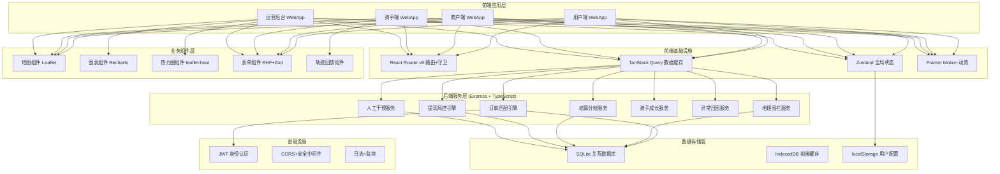
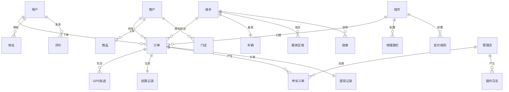

## 1. 技术架构总览



## 2. 技术选型

| 类别 | 技术 | 版本 | 选型理由 |
|--------|------|------|----------|
| 前端框架 | React | 18.x | 组件化、生态丰富 |
| 编程语言 | TypeScript | 5.x | 类型安全、大型项目可维护 |
| 构建工具 | Vite | 5.x | 极速HMR、ESM原生 |
| 样式方案 | TailwindCSS | 3.x | 原子化CSS、设计系统统一 |
| 路由管理 | React Router | v6 | 声明式路由、嵌套路由、守卫完善 |
| 全局状态 | Zustand | 4.x | 轻量、API简洁、TS友好 |
| 服务端状态 | TanStack Query | 5.x | 自动缓存、乐观更新、重试 |
| 地图引擎 | Leaflet + React-Leaflet | 1.9.x | 开源免费、轻量可扩展 |
| 图表库 | Recharts | 2.x | React原生、声明式、动画流畅 |
| 热力图 | leaflet-heat | 0.2.x | Leaflet生态、供需双色叠加 |
| 动效库 | Framer Motion | 11.x | 声明式、流畅自然 |
| 图标库 | Lucide React | 0.x | 线性风格统一、按需导入 |
| 表单处理 | React Hook Form | 7.x | 性能优秀、最小重渲染 |
| 日期处理 | date-fns | 3.x | 函数式、模块化、体积小 |
| 地理计算 | geolib | 3.x | Haversine距离计算、地理围栏 |
| 后端框架 | Express | 4.x | 成熟稳定、中间件生态丰富 |
| 数据库 | SQLite (better-sqlite3) | 11.x | 零配置、高性能、无需外部依赖 |
| 认证 | JWT (jsonwebtoken) | 9.x | 无状态、跨端通用 |
| 密码加密 | bcryptjs | 2.x | 行业标准密码哈希 |
| UUID | uuid | 9.x | 唯一ID生成 |

## 3. 项目目录结构

```
may-89216/
├── .env
├── backend/
│   ├── package.json
│   ├── tsconfig.json
│   ├── data/
│   │   └── app.sqlite
│   └── src/
│       ├── server.ts
│       ├── db/
│       │   ├── index.ts
│       │   └── schema.ts
│       ├── data/
│       │   └── seed.ts
│       ├── routes/
│       │   ├── auth.ts
│       │   ├── user.ts
│       │   ├── merchant.ts
│       │   ├── rider.ts
│       │   ├── admin.ts
│       │   └── common.ts
│       ├── engines/
│       │   ├── matchingEngine.ts
│       │   ├── geofenceEngine.ts
│       │   ├── settlementEngine.ts
│       │   ├── withdrawalRiskEngine.ts
│       │   ├── riderGrowthEngine.ts
│       │   └── anomalyEngine.ts
│       ├── middleware/
│       │   ├── auth.ts
│       │   └── error.ts
│       └── utils/
│           ├── response.ts
│           ├── geo.ts
│           └── date.ts
└── frontend/
    ├── package.json
    ├── vite.config.ts
    ├── tailwind.config.js
    ├── tsconfig.json
    ├── index.html
    └── src/
        ├── main.tsx
        ├── App.tsx
        ├── index.css
        ├── router/
        │   ├── index.tsx
        │   └── guards.ts
        ├── types/
        │   ├── index.ts
        │   ├── order.ts
        │   ├── user.ts
        │   ├── rider.ts
        │   ├── merchant.ts
        │   └── admin.ts
        ├── constants/
        │   ├── index.ts
        │   ├── order.ts
        │   └── cities.ts
        ├── store/
        │   ├── useAuthStore.ts
        │   ├── useOrderStore.ts
        │   └── useUILayoutStore.ts
        ├── services/
        │   ├── request.ts
        │   ├── auth.api.ts
        │   ├── user.api.ts
        │   ├── merchant.api.ts
        │   ├── rider.api.ts
        │   ├── admin.api.ts
        │   └── common.api.ts
        ├── hooks/
        │   ├── useAuth.ts
        │   ├── useGeo.ts
        │   ├── useTrack.ts
        │   └── useOrder.ts
        ├── components/
        │   ├── ui/
        │   │   ├── Button.tsx
        │   │   ├── Card.tsx
        │   │   ├── Tag.tsx
        │   │   ├── Badge.tsx
        │   │   ├── Input.tsx
        │   │   ├── Modal.tsx
        │   │   ├── Toast.tsx
        │   │   ├── Empty.tsx
        │   │   ├── Skeleton.tsx
        │   │   ├── StatCard.tsx
        │   │   └── Switch.tsx
        │   │   └── Slider.tsx
        │   ├── layout/
        │   │   ├── UserLayout.tsx
        │   │   ├── MerchantLayout.tsx
        │   │   ├── RiderLayout.tsx
        │   │   └── AdminLayout.tsx
        │   ├── map/
        │   │   ├── MapContainer.tsx
        │   │   ├── RiderMarker.tsx
        │   │   ├── OrderMarker.tsx
        │   │   ├── RouteLine.tsx
        │   │   ├── GeofencePolygon.tsx
        │   │   ├── HeatmapOverlay.tsx
        │   │   └── TrackPlayer.tsx
        │   ├── chart/
        │   │   ├── LineChart.tsx
        │   │   ├── BarChart.tsx
        │   │   ├── PieChart.tsx
        │   │   └── StatCard.tsx
        │   └── business/
        │       ├── OrderCard.tsx
        │       ├── OrderTimeline.tsx
        │       ├── RiderProfileCard.tsx
        │       ├── MerchantCard.tsx
        │       ├── WalletCard.tsx
        │       ├── LevelBadge.tsx
        │       ├── MedalCard.tsx
        │       └── TicketCard.tsx
        └── pages/
            ├── shared/
            │   ├── Login.tsx
            │   ├── Register.tsx
            │   └── NotFound.tsx
            ├── user/
            │   ├── Home.tsx
            │   ├── CreateOrder.tsx
            │   ├── OrderList.tsx
            │   ├── OrderDetail.tsx
            │   ├── AddressList.tsx
            │   ├── Wallet.tsx
            │   └── Profile.tsx
            ├── merchant/
            │   ├── Register.tsx
            │   ├── Dashboard.tsx
            │   ├── ProductList.tsx
            │   ├── OrderList.tsx
            │   ├── DispatchConfig.tsx
            │   ├── Statistics.tsx
            │   └── Finance.tsx
            ├── rider/
            │   ├── Register.tsx
            │   ├── Dashboard.tsx
            │   ├── OrderHall.tsx
            │   ├── MyTasks.tsx
            │   ├── Earnings.tsx
            │   ├── Growth.tsx
            │   └── Settings.tsx
            └── admin/
                ├── Dashboard.tsx
                ├── Heatmap.tsx
                ├── RiderActivity.tsx
                ├── AnomalyAnalysis.tsx
                ├── Intervention.tsx
                ├── Tickets.tsx
                ├── CityConfig.tsx
                └── Finance.tsx
```

## 4. 路由定义

### 4.1 路由总览

| 路径 | 页面 | 角色 | 权限 |
|------|------|------|------|
| `/login` | 登录 | 通用 | 公开 |
| `/register` | 注册选择 | 通用 | 公开 |
| `/` | 用户端首页 | 用户 | 登录 |
| `/order/create` | 下单页 | 用户 | 登录 |
| `/orders` | 订单列表 | 用户 | 登录 |
| `/orders/:id` | 订单详情 | 用户 | 登录+订单所属 |
| `/address` | 地址管理 | 用户 | 登录 |
| `/wallet` | 我的钱包 | 用户 | 登录 |
| `/profile` | 个人中心 | 用户 | 登录 |
| `/merchant/register` | 商户入驻 | 商户 | 公开 |
| `/merchant` | 商户工作台 | 商户 | 商户认证 |
| `/merchant/products` | 商品管理 | 商户 | 商户认证 |
| `/merchant/orders` | 商户订单 | 商户 | 商户认证 |
| `/merchant/dispatch` | 分发策略 | 商户 | 商户认证 |
| `/merchant/statistics` | 数据统计 | 商户 | 商户认证 |
| `/merchant/finance` | 财务中心 | 商户 | 商户认证 |
| `/rider/register` | 骑手注册 | 骑手 | 公开 |
| `/rider` | 骑手工作台 | 骑手 | 骑手认证 |
| `/rider/hall` | 抢单大厅 | 骑手 | 骑手认证 |
| `/rider/tasks` | 我的任务 | 骑手 | 骑手认证 |
| `/rider/earnings` | 收入中心 | 骑手 | 骑手认证 |
| `/rider/growth` | 成长体系 | 骑手 | 骑手认证 |
| `/rider/settings` | 设置中心 | 骑手 | 骑手认证 |
| `/admin` | 运营看板 | 运营 | 管理员 |
| `/admin/heatmap` | 热力图 | 运营 | 管理员 |
| `/admin/riders` | 骑手活跃度 | 运营 | 管理员 |
| `/admin/anomaly` | 异常归因 | 运营 | 管理员 |
| `/admin/intervention` | 人工干预 | 运营 | 管理员 |
| `/admin/tickets` | 申诉工单 | 运营 | 管理员 |
| `/admin/cities` | 城市配置 | 运营 | 超级管理员 |
| `/admin/finance` | 财务管理 | 运营 | 财务管理员 |

### 4.2 路由守卫

| 守卫类型 | 说明 |
|----------|------|
| 登录守卫 | 检测token，未登录跳转/login |
| 角色守卫 | 检测user.role，无权限跳转403 |
| 认证守卫 | 检测骑手/商户认证状态，未认证跳转对应注册页 |
| 订单所属守卫 | 校验订单归属，防止越权 |

## 5. 核心业务引擎

### 5.1 订单智能匹配引擎

五维度加权匹配算法：

```typescript
interface MatchCandidate {
  riderId: string
  score: number
  distance: number       // 米
  distanceScore: number    // 0-100
  idleScore: number        // 0-100
  fulfillmentScore: number   // 0-100
  levelScore: number       // 0-100
  categoryScore: number    // 0-100
}

class MatchingEngine {
  private weights = {
    distance: 0.40,
    idle: 0.25,
    fulfillment: 0.20,
    level: 0.10,
    category: 0.05
  }

  match(order: Order, riders: Rider[]): MatchCandidate[] {
    return riders
      .filter(r => this.isEligible(r, order))
      .map(r => this.calcScore(r, order))
      .sort((a, b) => b.score - a.score)
  }

  private isEligible(rider: Rider, order: Order): boolean {
    // 服务区域地理围栏检测
    // 在线状态 & 接单状态
    // 信用分 >= 60
    // 当前进行中订单 < 3
    return true
  }

  private calcScore(rider: Rider, order: Order): MatchCandidate {
    const distance = geolib.getDistance(rider.currentLocation, order.pickupLocation)
    const distanceScore = Math.max(0, 100 - (distance / 3000) * 100)
    const idleScore = rider.currentOrders === 0 ? 100 : rider.currentOrders === 1 ? 50 : 0
    const fulfillmentScore = Math.min(100, (rider.fulfillmentRate / 0.98) * 100)
    const levelScore = this.levelToScore(rider.level)
    const categoryScore = rider.categoryExperience[order.category] || 50

    const score =
      distanceScore * this.weights.distance +
      idleScore * this.weights.idle +
      fulfillmentScore * this.weights.fulfillment +
      levelScore * this.weights.level +
      categoryScore * this.weights.category

    return { riderId: rider.id, score, distance, distanceScore, idleScore, fulfillmentScore, levelScore, categoryScore }
  }

  private levelToScore(level: RiderLevel): number {
    const map = { diamond: 100, platinum: 80, gold: 60, silver: 40, bronze: 20 }
    return map[level] || 0
  }
}
```

### 5.2 地理围栏引擎

```typescript
class GeofenceEngine {
  checkPointInPolygon(point: GeoPoint, polygon: GeoPoint[]): boolean {
    // Ray casting 算法
    let inside = false
    for (let i = 0, j = polygon.length - 1; i < polygon.length; j = i++) {
      const xi = polygon[i].lat, yi = polygon[i].lng
      const xj = polygon[j].lat, yj = polygon[j].lng
      if (((yi > point.lng) !== (yj > point.lng)) &&
          (point.lat < (xj - xi) * (point.lng - yi) / (yj - yi) + xi)) {
        inside = !inside
      }
    }
    return inside
  }

  getRidersInServiceArea(orderLocation: GeoPoint, riders: Rider[]): Rider[] {
    return riders.filter(rider =>
      rider.serviceAreas.some(area =>
        this.checkPointInPolygon(orderLocation, area.polygon)
    )
  }

  calculateCrossAreaFee(deliveryLocation: GeoPoint, riderAreas: ServiceArea[]): number {
    const insideAny = riderAreas.some(area => this.checkPointInPolygon(deliveryLocation, area.polygon))
    return insideAny ? 0 : 0.15  // 跨区域补贴15%
  }
}
```

### 5.3 结算分账引擎

```typescript
class SettlementEngine {
  settleOrder(orderId: string): SettlementResult {
    const order = this.getOrder(orderId)
    const platformFeeRate = 0.15  // 平台服务费15%
    const insuranceFee = 0.3      // 意外险0.3元
    const taxRate = 0.03          // 个税3%

    const riderIncome = order.amount * (1 - platformFeeRate - taxRate) - insuranceFee
    const merchantIncome = order.goodsAmount * (1 - 0.05)  // 商户佣金5%
    const platformIncome = order.amount * platformFeeRate + insuranceFee + order.goodsAmount * 0.05

    return {
      riderId: order.riderId,
      riderIncome,
      merchantId: order.merchantId,
      merchantIncome,
      platformIncome,
      settledAt: new Date().toISOString()
    }
  }
}
```

### 5.4 提现风控引擎

```typescript
interface WithdrawalLimit {
  dailyLimit: number
  singleLimit: number
  feeRate: number
  freeMonthlyCount: number
}

const LEVEL_LIMITS: Record<RiderLevel, WithdrawalLimit> = {
  diamond: { dailyLimit: 20000, singleLimit: 5000, feeRate: 0, freeMonthlyCount: 5 },
  platinum: { dailyLimit: 15000, singleLimit: 3000, feeRate: 0.001, freeMonthlyCount: 3 },
  gold: { dailyLimit: 10000, singleLimit: 2000, feeRate: 0.002, freeMonthlyCount: 2 },
  silver: { dailyLimit: 5000, singleLimit: 1000, feeRate: 0.003, freeMonthlyCount: 1 },
  bronze: { dailyLimit: 2000, singleLimit: 500, feeRate: 0.005, freeMonthlyCount: 0 },
}

class WithdrawalRiskEngine {
  validate(rider: Rider, amount: number, bankCard: BankCard): RiskResult {
    const limit = LEVEL_LIMITS[rider.level]
    const warnings: string[] = []
    let needsManualReview = false

    if (rider.realName !== bankCard.holderName) {
      return { pass: false, reason: '银行卡持有人与实名认证姓名不一致' }
    }
    if (amount > limit.singleLimit) {
      return { pass: false, reason: `单笔提现金额超出限额${limit.singleLimit}元` }
    }
    if (this.getDailyWithdrawn(rider.id) + amount > limit.dailyLimit) {
      return { pass: false, reason: `今日提现总额超出限额${limit.dailyLimit}元` }
    }

    const now = new Date()
    const hour = now.getHours()
    if (hour >= 22 || hour < 6) {
      if (amount > 5000) { needsManualReview = true; warnings.push('夜间大额提现需人工审核') }
    }
    if (this.daysSinceRegister(rider.id) < 7 && this.isFirstWithdrawal(rider.id)) {
      needsManualReview = true; warnings.push('新骑手首次提现需人工审核')
    }
    if (this.hasPendingTickets(rider.id)) {
      return { pass: false, reason: '存在未处理申诉工单' }
    }

    const fee = this.calculateFee(rider, amount)
    return { pass: true, needsManualReview, warnings, fee }
  }
}
```

### 5.5 骑手成长引擎

```typescript
const LEVEL_THRESHOLDS = [
  { level: 'bronze', minOrders: 0 },
  { level: 'silver', minOrders: 101 },
  { level: 'gold', minOrders: 501 },
  { level: 'platinum', minOrders: 2001 },
  { level: 'diamond', minOrders: 5001 },
]

class RiderGrowthEngine {
  checkLevelUp(rider: Rider): LevelUpResult {
    const currentLevel = rider.level
    for (let i = LEVEL_THRESHOLDS.length - 1; i >= 0; i--) {
      if (rider.totalOrders >= LEVEL_THRESHOLDS[i].minOrders) {
        const newLevel = LEVEL_THRESHOLDS[i].level as RiderLevel
        if (newLevel !== currentLevel) {
          return { leveledUp: true, newLevel, rewards: this.getLevelRewards(newLevel) }
        }
        break
      }
    }
    return { leveledUp: false }
  }

  awardMedal(riderId: string, type: MedalType): void {
    // 准时王: 月准时率 > 99%
    // 好评王: 月好评率 > 99%
    // 单量王: 月单量城市TOP10
  }
}
```

### 5.6 异常归因引擎

```typescript
type AnomalyType = 'timeout' | 'cancel' | 'complaint' | 'damage' | 'fake'
type ResponsibleParty = 'rider' | 'merchant' | 'user' | 'system' | 'force_majeure'

class AnomalyEngine {
  attribute(anomaly: AnomalyRecord): AttributionResult {
    switch (anomaly.type) {
      case 'timeout':
        return this.attributeTimeout(anomaly)
      case 'cancel':
        return this.attributeCancel(anomaly)
      case 'complaint':
        return this.attributeComplaint(anomaly)
      case 'damage':
        return this.attributeDamage(anomaly)
      case 'fake':
        return { party: 'rider', confidence: 0.95 }
    }
  }

  private attributeTimeout(anomaly: AnomalyRecord): AttributionResult {
    const { order, tracks } = anomaly
    const merchantDelay = order.merchantReadyAt - order.acceptedAt
    const riderPickupDelay = order.pickedUpAt - (order.merchantReadyAt || order.acceptedAt)
    const userNoAnswer = tracks.some(t => t.note === 'user_unreachable')

    if (merchantDelay > 15 * 60 * 1000) return { party: 'merchant', confidence: 0.8 }
    if (userNoAnswer) return { party: 'user', confidence: 0.7 }
    if (riderPickupDelay > 10 * 60 * 1000) return { party: 'rider', confidence: 0.85 }
    return { party: 'system', confidence: 0.5 }
  }

  calculateCompensation(attribution: AttributionResult, order: Order): number {
    if (attribution.party === 'rider' || attribution.party === 'merchant') {
      if (order.amount * 0.3
    }
    return 0
  }
}
```

## 6. 核心数据模型

### 6.1 ER图



### 6.2 核心表DDL

```sql
CREATE TABLE users (
  id VARCHAR(36) PRIMARY KEY,
  phone VARCHAR(20) NOT NULL UNIQUE,
  nickname VARCHAR(50),
  avatar VARCHAR(255),
  real_name VARCHAR(50),
  id_card VARCHAR(18),
  role ENUM('user','rider','merchant','admin') NOT NULL DEFAULT 'user',
  password_hash VARCHAR(255) NOT NULL,
  balance DECIMAL(10,2) DEFAULT 0,
  city_id VARCHAR(36),
  status ENUM('normal','frozen') DEFAULT 'normal',
  created_at TIMESTAMP DEFAULT CURRENT_TIMESTAMP
);

CREATE TABLE riders (
  id VARCHAR(36) PRIMARY KEY,
  user_id VARCHAR(36) NOT NULL UNIQUE,
  level ENUM('bronze','silver','gold','platinum','diamond') DEFAULT 'bronze',
  total_orders INT DEFAULT 0,
  credit_score INT DEFAULT 100,
  fulfillment_rate DECIMAL(5,4) DEFAULT 0.98,
  avg_rating DECIMAL(3,2) DEFAULT 5.00,
  current_orders INT DEFAULT 0,
  online_status ENUM('offline','online','busy') DEFAULT 'offline',
  accept_mode ENUM('grab','dispatch','hybrid') DEFAULT 'hybrid',
  current_lat DECIMAL(10,7),
  current_lng DECIMAL(10,7),
  online_at TIMESTAMP NULL,
  updated_at TIMESTAMP DEFAULT CURRENT_TIMESTAMP
);

CREATE TABLE vehicles (
  id VARCHAR(36) PRIMARY KEY,
  rider_id VARCHAR(36) NOT NULL UNIQUE,
  type ENUM('ebike','motorcycle','car') NOT NULL,
  plate_number VARCHAR(20),
  vehicle_image VARCHAR(255),
  insurance_expire DATE,
  created_at TIMESTAMP
);

CREATE TABLE rider_service_areas (
  id VARCHAR(36) PRIMARY KEY,
  rider_id VARCHAR(36) NOT NULL,
  name VARCHAR(50),
  polygon JSON NOT NULL,
  created_at TIMESTAMP
);

CREATE TABLE merchants (
  id VARCHAR(36) PRIMARY KEY,
  user_id VARCHAR(36) NOT NULL UNIQUE,
  shop_name VARCHAR(100) NOT NULL,
  license_no VARCHAR(50),
  legal_person VARCHAR(50),
  id_card VARCHAR(18),
  category VARCHAR(50),
  audit_status ENUM('pending','approved','rejected') DEFAULT 'pending',
  commission_rate DECIMAL(5,4) DEFAULT 0.05,
  balance DECIMAL(12,2) DEFAULT 0,
  created_at TIMESTAMP
);

CREATE TABLE merchant_stores (
  id VARCHAR(36) PRIMARY KEY,
  merchant_id VARCHAR(36) NOT NULL,
  name VARCHAR(100) NOT NULL,
  address VARCHAR(255),
  lat DECIMAL(10,7),
  lng DECIMAL(10,7),
  business_hours VARCHAR(100),
  delivery_radius INT DEFAULT 3000,
  delivery_fee DECIMAL(10,2) DEFAULT 0,
  status ENUM('open','closed') DEFAULT 'open'
);

CREATE TABLE merchant_products (
  id VARCHAR(36) PRIMARY KEY,
  store_id VARCHAR(36) NOT NULL,
  name VARCHAR(100) NOT NULL,
  category VARCHAR(50),
  price DECIMAL(10,2) NOT NULL,
  image VARCHAR(255),
  stock INT DEFAULT 0,
  status ENUM('on','off') DEFAULT 'on'
);

CREATE TABLE orders (
  id VARCHAR(36) PRIMARY KEY,
  order_no VARCHAR(32) NOT NULL UNIQUE,
  category ENUM('buy','send','fetch','errand') NOT NULL,
  city_id VARCHAR(36) NOT NULL,
  user_id VARCHAR(36) NOT NULL,
  merchant_id VARCHAR(36),
  rider_id VARCHAR(36),
  status ENUM('pending','accepted','picked_up','delivering','completed','cancelled','disputed') DEFAULT 'pending',
  amount DECIMAL(10,2) NOT NULL,
  goods_amount DECIMAL(10,2) DEFAULT 0,
  delivery_fee DECIMAL(10,2) DEFAULT 0,
  distance INT DEFAULT 0,
  weight DECIMAL(5,2) DEFAULT 0,
  premium DECIMAL(10,2) DEFAULT 0,
  coupon_id VARCHAR(36),
  pay_method ENUM('wechat','alipay','balance'),
  pay_status ENUM('unpaid','paid','refunded') DEFAULT 'unpaid',
  pickup_name VARCHAR(50),
  pickup_phone VARCHAR(20),
  pickup_address VARCHAR(255),
  pickup_lat DECIMAL(10,7),
  pickup_lng DECIMAL(10,7),
  deliver_name VARCHAR(50),
  deliver_phone VARCHAR(20),
  deliver_address VARCHAR(255),
  deliver_lat DECIMAL(10,7),
  deliver_lng DECIMAL(10,7),
  goods_description TEXT,
  goods_images JSON,
  remark VARCHAR(500),
  expected_at TIMESTAMP NULL,
  accepted_at TIMESTAMP NULL,
  picked_up_at TIMESTAMP NULL,
  completed_at TIMESTAMP NULL,
  cancelled_at TIMESTAMP NULL,
  cancel_reason VARCHAR(255),
  created_at TIMESTAMP DEFAULT CURRENT_TIMESTAMP,
  INDEX idx_user (user_id, created_at),
  INDEX idx_rider (rider_id, status),
  INDEX idx_city (city_id, status)
);

CREATE TABLE gps_tracks (
  id BIGINT AUTO_INCREMENT PRIMARY KEY,
  order_id VARCHAR(36) NOT NULL,
  rider_id VARCHAR(36) NOT NULL,
  timestamp TIMESTAMP NOT NULL,
  lat DECIMAL(10,7) NOT NULL,
  lng DECIMAL(10,7) NOT NULL,
  speed DECIMAL(5,2),
  accuracy DECIMAL(5,2)
);

CREATE TABLE settlements (
  id VARCHAR(36) PRIMARY KEY,
  order_id VARCHAR(36) NOT NULL UNIQUE,
  rider_id VARCHAR(36) NOT NULL,
  rider_income DECIMAL(10,2) NOT NULL,
  merchant_id VARCHAR(36),
  merchant_income DECIMAL(10,2) DEFAULT 0,
  platform_income DECIMAL(10,2) NOT NULL,
  insurance_fee DECIMAL(10,2) DEFAULT 0,
  tax DECIMAL(10,2) DEFAULT 0,
  settled_at TIMESTAMP DEFAULT CURRENT_TIMESTAMP
);

CREATE TABLE withdrawals (
  id VARCHAR(36) PRIMARY KEY,
  user_id VARCHAR(36) NOT NULL,
  amount DECIMAL(10,2) NOT NULL,
  fee DECIMAL(10,2) DEFAULT 0,
  bank_card VARCHAR(30),
  bank_name VARCHAR(50),
  holder_name VARCHAR(50),
  status ENUM('pending','approved','rejected','paid') DEFAULT 'pending',
  audit_note VARCHAR(255),
  created_at TIMESTAMP,
  paid_at TIMESTAMP NULL
);

CREATE TABLE dispute_tickets (
  id VARCHAR(36) PRIMARY KEY,
  order_id VARCHAR(36) NOT NULL,
  initiator VARCHAR(36) NOT NULL,
  type ENUM('timeout','cancel','complaint','damage','other') NOT NULL,
  description TEXT,
  evidences JSON,
  status ENUM('pending','investigating','resolved','closed') DEFAULT 'pending',
  responsible_party ENUM('rider','merchant','user','shared',
  compensation DECIMAL(10,2) DEFAULT 0,
  assignee VARCHAR(36),
  created_at TIMESTAMP,
  resolved_at TIMESTAMP NULL
);

CREATE TABLE reviews (
  id VARCHAR(36) PRIMARY KEY,
  order_id VARCHAR(36) NOT NULL UNIQUE,
  user_id VARCHAR(36) NOT NULL,
  rating TINYINT NOT NULL,
  tags JSON,
  content TEXT,
  images JSON,
  created_at TIMESTAMP
);

CREATE TABLE rider_medals (
  id VARCHAR(36) PRIMARY KEY,
  rider_id VARCHAR(36) NOT NULL,
  type VARCHAR(50) NOT NULL,
  name VARCHAR(50) NOT NULL,
  awarded_at TIMESTAMP DEFAULT CURRENT_TIMESTAMP
);

CREATE TABLE cities (
  id VARCHAR(36) PRIMARY KEY,
  name VARCHAR(50) NOT NULL,
  province VARCHAR(50),
  tier TINYINT DEFAULT 3,
  center_lat DECIMAL(10,7),
  center_lng DECIMAL(10,7),
  pricing_config JSON,
  status ENUM('active','paused') DEFAULT 'active'
);

CREATE TABLE city_geofences (
  id VARCHAR(36) PRIMARY KEY,
  city_id VARCHAR(36) NOT NULL,
  name VARCHAR(100),
  type ENUM('delivery','forbidden','business') NOT NULL,
  polygon JSON NOT NULL,
  config JSON
);

CREATE TABLE coupons (
  id VARCHAR(36) PRIMARY KEY,
  user_id VARCHAR(36) NOT NULL,
  name VARCHAR(100),
  type ENUM('fixed','percent') NOT NULL,
  value DECIMAL(10,2) NOT NULL,
  min_amount DECIMAL(10,2) DEFAULT 0,
  valid_from DATE,
  valid_to DATE,
  used_at TIMESTAMP NULL
);

CREATE TABLE user_addresses (
  id VARCHAR(36) PRIMARY KEY,
  user_id VARCHAR(36) NOT NULL,
  tag VARCHAR(20),
  name VARCHAR(50),
  phone VARCHAR(20),
  address VARCHAR(255),
  lat DECIMAL(10,7),
  lng DECIMAL(10,7),
  is_default BOOLEAN DEFAULT FALSE
);

CREATE TABLE operation_logs (
  id VARCHAR(36) PRIMARY KEY,
  admin_id VARCHAR(36) NOT NULL,
  action VARCHAR(50),
  target_type VARCHAR(50),
  target_id VARCHAR(36),
  detail JSON,
  created_at TIMESTAMP DEFAULT CURRENT_TIMESTAMP
);
```

## 7. API 类型定义

### 7.1 通用类型

```typescript
interface ApiResponse<T = any> {
  code: number
  message: string
  data: T
  timestamp: string
  traceId: string
}

interface GeoPoint { lat: number; lng: number }

interface User {
  id: string
  phone: string
  nickname: string
  avatar: string
  role: 'user' | 'rider' | 'merchant' | 'admin'
  realName?: string
  balance: number
  cityId: string
  status: 'normal' | 'frozen'
}

interface Rider extends User {
  level: 'bronze' | 'silver' | 'gold' | 'platinum' | 'diamond'
  totalOrders: number
  creditScore: number
  fulfillmentRate: number
  avgRating: number
  currentOrders: number
  onlineStatus: 'offline' | 'online' | 'busy'
  acceptMode: 'grab' | 'dispatch' | 'hybrid'
  currentLocation: GeoPoint
}

interface Merchant extends User {
  shopName: string
  category: string
  auditStatus: 'pending' | 'approved' | 'rejected'
  commissionRate: number
}
```

### 7.2 订单类型

```typescript
type OrderCategory = 'buy' | 'send' | 'fetch' | 'errand'
type OrderStatus = 'pending' | 'accepted' | 'picked_up' | 'delivering' | 'completed' | 'cancelled' | 'disputed'

interface Order {
  id: string
  orderNo: string
  category: OrderCategory
  cityId: string
  userId: string
  merchantId?: string
  riderId?: string
  status: OrderStatus
  amount: number
  goodsAmount: number
  deliveryFee: number
  distance: number
  weight: number
  premium: number
  pickupAddress: string
  pickupLocation: GeoPoint
  deliverAddress: string
  deliverLocation: GeoPoint
  goodsDescription: string
  goodsImages: string[]
  remark: string
  expectedAt?: string
  acceptedAt?: string
  pickedUpAt?: string
  completedAt?: string
  createdAt: string
  rider?: Rider
  tracks?: GpsTrack[]
}

interface GpsTrack {
  timestamp: string
  location: GeoPoint
  speed: number
}
```

## 8. 性能与安全

### 8.1 性能策略
- 代码分割：按端+模块懒加载
- 虚拟滚动：长列表虚拟化
- 轨迹抽稀：Douglas-Peucker算法
- 地图Marker聚类
- IndexedDB缓存GPS轨迹
- API请求防抖节流
- 图片WebP+懒加载

### 8.2 安全策略
- JWT Token+Refresh Token双令牌
- 敏感字段加密存储
- API签名校验防重放
- 速率限制防刷
- SQL注入防护(参数化查询)
- XSS/CSRF防护
- 操作日志审计
- 虚拟号码隐私保护
