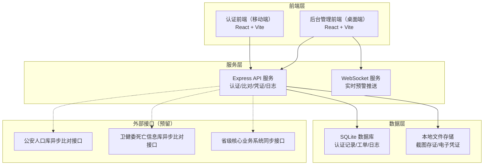
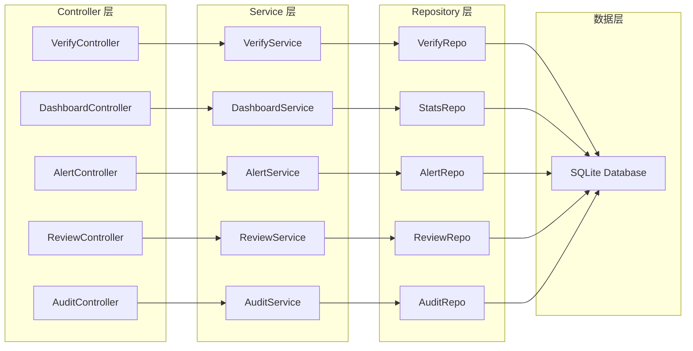
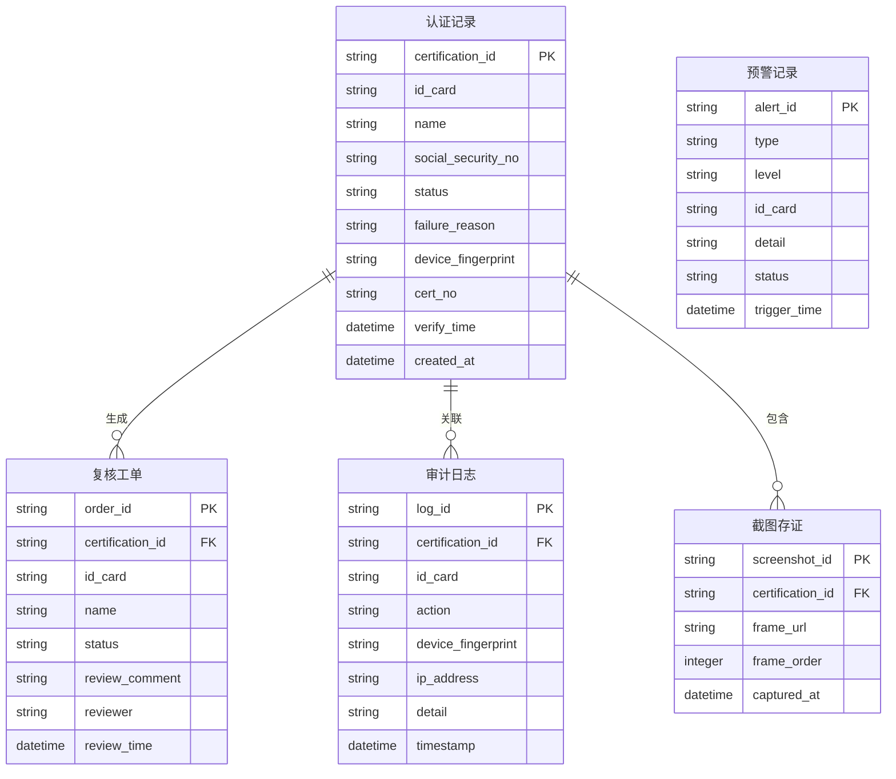

## 1. 架构设计



## 2. 技术说明

- **前端**：React@18 + TailwindCSS@3 + Vite
- **初始化工具**：Vite
- **后端**：Express@4
- **数据库**：SQLite（通过 better-sqlite3 驱动），Mock 数据演示
- **图表库**：Recharts（数据看板可视化）
- **人脸活体检测**：前端 MediaPipe Face Detection 模拟交互，后端模拟比对结果
- **语音引导**：Web Speech API（SpeechSynthesis）
- **离线缓存**：Service Worker + IndexedDB
- **实时推送**：WebSocket（ws 库）
- **路由**：React Router v6

## 3. 路由定义

| 路由 | 用途 |
|------|------|
| `/` | 认证首页（移动端入口） |
| `/verify` | 人脸活体检测认证页 |
| `/result` | 认证结果页（成功/失败） |
| `/admin` | 后台管理首页（数据看板） |
| `/admin/alerts` | 异常预警页 |
| `/admin/review` | 人工复核工单池 |
| `/admin/review/:id` | 工单详情页 |
| `/admin/audit` | 认证日志审计页 |

## 4. API 定义

### 4.1 认证相关

```typescript
interface VerifyRequest {
  idCard: string;
  socialSecurityNo: string;
  faceData: string;
  livenessFrames: string[];
  deviceFingerprint: string;
}

interface VerifyResponse {
  success: boolean;
  certificationId: string;
  timestamp: string;
  failureReason?: string;
  credential?: {
    certNo: string;
    issueTime: string;
    deviceFingerprint: string;
    validUntil: string;
  };
}

// POST /api/verify/submit  提交认证
// GET  /api/verify/status/:idCard  查询认证状态
// GET  /api/verify/credential/:certNo  获取电子凭证
```

### 4.2 数据看板

```typescript
interface DashboardStats {
  totalVerified: number;
  totalFailed: number;
  todayCount: number;
  monthlyTrend: { date: string; count: number }[];
  regionDistribution: { region: string; count: number }[];
  failureReasons: { reason: string; count: number }[];
  hourlyDistribution: { hour: string; count: number }[];
}

// GET /api/dashboard/stats  获取看板统计数据
// GET /api/dashboard/stats?region=xxx&startDate=xxx&endDate=xxx  筛选查询
```

### 4.3 异常预警

```typescript
interface Alert {
  id: string;
  type: "high_frequency" | "remote_cluster" | "face_mismatch";
  level: "warning" | "critical";
  userIdCard: string;
  userName: string;
  detail: string;
  triggerTime: string;
  status: "pending" | "processed";
}

// GET  /api/alerts  获取预警列表
// PUT  /api/alerts/:id  更新预警状态
```

### 4.4 人工复核

```typescript
interface ReviewOrder {
  id: string;
  userIdCard: string;
  userName: string;
  verifyTime: string;
  status: "pending" | "approved" | "rejected" | "transferred";
  failureReason: string;
  screenshots: string[];
  reviewComment?: string;
  reviewer?: string;
  reviewTime?: string;
}

// GET    /api/review/orders  获取工单列表
// GET    /api/review/orders/:id  获取工单详情
// PUT    /api/review/orders/:id  提交复核结果
```

### 4.5 日志审计

```typescript
interface AuditLog {
  id: string;
  certificationId: string;
  userIdCard: string;
  action: string;
  timestamp: string;
  deviceFingerprint: string;
  ipAddress: string;
  screenshots: string[];
  detail: string;
}

// GET  /api/audit/logs  查询审计日志
// GET  /api/audit/logs/:id/screenshots  获取截图存证
// POST /api/audit/export  导出日志
```

## 5. 服务架构图



## 6. 数据模型

### 6.1 数据模型定义



### 6.2 数据定义语言

```sql
CREATE TABLE certifications (
    certification_id TEXT PRIMARY KEY,
    id_card TEXT NOT NULL,
    name TEXT NOT NULL,
    social_security_no TEXT NOT NULL,
    status TEXT NOT NULL CHECK(status IN ('success', 'failed', 'pending', 'reviewing')),
    failure_reason TEXT,
    device_fingerprint TEXT,
    cert_no TEXT,
    verify_time DATETIME NOT NULL,
    created_at DATETIME DEFAULT CURRENT_TIMESTAMP
);

CREATE TABLE alerts (
    alert_id TEXT PRIMARY KEY,
    type TEXT NOT NULL CHECK(type IN ('high_frequency', 'remote_cluster', 'face_mismatch')),
    level TEXT NOT NULL CHECK(level IN ('warning', 'critical')),
    id_card TEXT NOT NULL,
    detail TEXT,
    status TEXT DEFAULT 'pending' CHECK(status IN ('pending', 'processed')),
    trigger_time DATETIME NOT NULL
);

CREATE TABLE review_orders (
    order_id TEXT PRIMARY KEY,
    certification_id TEXT NOT NULL REFERENCES certifications(certification_id),
    id_card TEXT NOT NULL,
    name TEXT NOT NULL,
    status TEXT DEFAULT 'pending' CHECK(status IN ('pending', 'approved', 'rejected', 'transferred')),
    review_comment TEXT,
    reviewer TEXT,
    review_time DATETIME
);

CREATE TABLE audit_logs (
    log_id TEXT PRIMARY KEY,
    certification_id TEXT REFERENCES certifications(certification_id),
    id_card TEXT NOT NULL,
    action TEXT NOT NULL,
    device_fingerprint TEXT,
    ip_address TEXT,
    detail TEXT,
    timestamp DATETIME DEFAULT CURRENT_TIMESTAMP
);

CREATE TABLE screenshots (
    screenshot_id TEXT PRIMARY KEY,
    certification_id TEXT NOT NULL REFERENCES certifications(certification_id),
    frame_url TEXT NOT NULL,
    frame_order INTEGER NOT NULL,
    captured_at DATETIME DEFAULT CURRENT_TIMESTAMP
);

CREATE INDEX idx_certifications_id_card ON certifications(id_card);
CREATE INDEX idx_certifications_status ON certifications(status);
CREATE INDEX idx_certifications_verify_time ON certifications(verify_time);
CREATE INDEX idx_alerts_type ON alerts(type);
CREATE INDEX idx_alerts_status ON alerts(status);
CREATE INDEX idx_review_orders_status ON review_orders(status);
CREATE INDEX idx_audit_logs_certification ON audit_logs(certification_id);
CREATE INDEX idx_audit_logs_timestamp ON audit_logs(timestamp);
```
