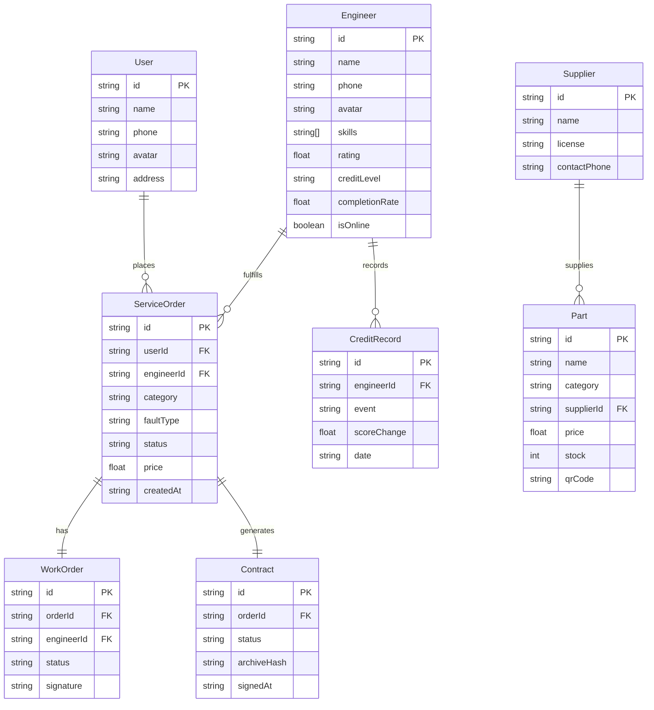

## 1. 架构设计

```mermaid
graph TB
    subgraph "前端层"
        "用户端Web"["用户端Web<br/>React + Vite"]
        "工程师端Web"["工程师端Web<br/>React + Vite"]
        "后台管理Web"["后台管理Web<br/>React + Vite"]
    end

    subgraph "服务层（Mock）"
        "API Gateway"["API Gateway<br/>Mock数据服务"]
        "AI诊断Mock"["AI诊断Mock<br/>图像识别模拟"]
        "直播Mock"["直播服务Mock<br/>视频流模拟"]
    end

    subgraph "数据层"
        "LocalStorage"["LocalStorage<br/>持久化存储"]
        "MockData"["Mock数据<br/>静态JSON"]
    end

    "用户端Web" --> "API Gateway"
    "工程师端Web" --> "API Gateway"
    "后台管理Web" --> "API Gateway"
    "API Gateway" --> "AI诊断Mock"
    "API Gateway" --> "直播Mock"
    "API Gateway" --> "LocalStorage"
    "API Gateway" --> "MockData"
```

## 2. 技术说明

- **前端框架**: React@18 + TypeScript + Vite
- **样式方案**: TailwindCSS@3 + CSS Modules（复杂组件样式隔离）
- **状态管理**: Zustand（轻量级全局状态）
- **路由方案**: React Router@6
- **图表可视化**: Recharts
- **动画库**: Framer Motion
- **图标库**: Lucide React
- **初始化工具**: Vite init (react-ts template)
- **后端服务**: 无后端，全部使用Mock数据模拟
- **数据持久化**: LocalStorage模拟数据存取

## 3. 路由定义

| 路由 | 用途 | 权限 |
|------|------|------|
| `/` | 首页 - 服务品类导航、AI诊断入口、推荐 | 公开 |
| `/diagnosis` | AI诊断页 - 上传照片、识别结果、服务推荐 | 公开 |
| `/compare` | 服务比价页 - 电子价目表、多商比价 | 公开 |
| `/live/:orderId` | 服务直播页 - 实时检修直播、互动 | 用户 |
| `/engineer` | 工程师工作台 - 派单看板、电子工单 | 工程师 |
| `/engineer/order/:id` | 工单详情 - 完工图上传、签字确认 | 工程师 |
| `/supplier` | 供应商管理 - 配件上架、库存、溯源 | 供应商 |
| `/admin` | 后台管理 - 派单引擎、信用评级、AI质检、存证 | 管理员 |

## 4. API定义（Mock）

### 4.1 AI诊断接口

```typescript
interface DiagnosisRequest {
  images: string[];
  description?: string;
}

interface DiagnosisResponse {
  category: 'air_conditioner' | 'water_heater' | 'washing_machine' | 'refrigerator' | 'other';
  categoryLabel: string;
  faultType: string;
  confidence: number;
  description: string;
  recommendedServices: RecommendedService[];
}

interface RecommendedService {
  id: string;
  name: string;
  estimatedPrice: { min: number; max: number };
  estimatedDuration: string;
  urgency: 'low' | 'medium' | 'high';
}
```

### 4.2 派单接口

```typescript
interface DispatchRequest {
  serviceId: string;
  location: { lat: number; lng: number };
  requiredSkills: string[];
  urgency: 'low' | 'medium' | 'high';
}

interface DispatchResponse {
  matchedEngineers: MatchedEngineer[];
  estimatedArrival: string;
}

interface MatchedEngineer {
  id: string;
  name: string;
  avatar: string;
  rating: number;
  distance: number;
  skillMatch: number;
  completionRate: number;
  matchScore: number;
}
```

### 4.3 电子工单接口

```typescript
interface WorkOrder {
  id: string;
  orderId: string;
  engineerId: string;
  userId: string;
  status: 'pending' | 'in_progress' | 'completed' | 'signed';
  category: string;
  faultDescription: string;
  beforePhotos: string[];
  afterPhotos: string[];
  steps: WorkOrderStep[];
  signature?: string;
  createdAt: string;
  completedAt?: string;
  signedAt?: string;
}

interface WorkOrderStep {
  index: number;
  title: string;
  description: string;
  status: 'pending' | 'doing' | 'done';
}
```

### 4.4 信用评级接口

```typescript
interface EngineerCredit {
  engineerId: string;
  score: number;
  level: 'S' | 'A' | 'B' | 'C' | 'D';
  totalOrders: number;
  completionRate: number;
  avgRating: number;
  aiInspectionPassRate: number;
  creditHistory: CreditRecord[];
}

interface CreditRecord {
  date: string;
  event: string;
  scoreChange: number;
  currentScore: number;
}
```

### 4.5 合规存证接口

```typescript
interface ContractRecord {
  id: string;
  orderId: string;
  userId: string;
  engineerId: string;
  templateId: string;
  status: 'draft' | 'pending_sign' | 'signed' | 'archived';
  signedAt?: string;
  archiveHash?: string;
  evidenceChain: EvidenceItem[];
}

interface EvidenceItem {
  type: 'contract' | 'photo_before' | 'photo_after' | 'signature' | 'inspection';
  hash: string;
  timestamp: string;
  description: string;
}
```

## 5. 服务器架构图

本项目为纯前端应用，不涉及后端服务器架构。所有数据通过Mock服务提供，业务逻辑在前端完成。

## 6. 数据模型

### 6.1 数据模型定义



### 6.2 数据定义语言

本前端项目使用TypeScript接口定义数据结构，Mock数据以JSON形式存储在`src/mocks/`目录下，无需DDL语句。
