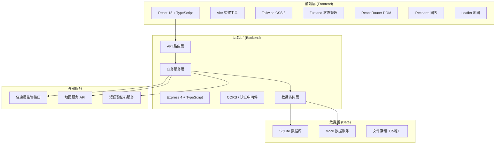
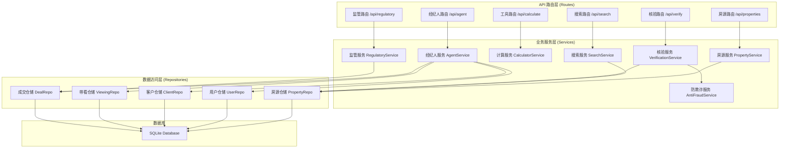
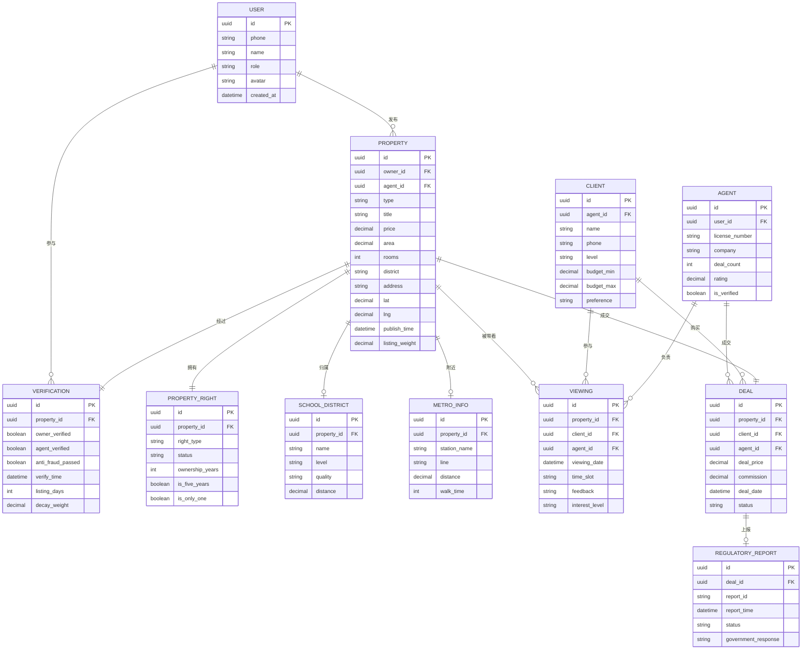

## 1. 架构设计



## 2. 技术描述

- **前端**：React@18 + TypeScript + Vite + Tailwind CSS@3 + Zustand
- **状态管理**：Zustand 轻量级状态管理
- **路由**：React Router DOM v6
- **图表**：Recharts 数据可视化
- **地图**：Leaflet 开源地图组件
- **后端**：Express@4 + TypeScript
- **数据库**：SQLite（本地开发）+ Mock 数据
- **图标**：Lucide React
- **工具函数**：date-fns 日期处理、clsx 类名合并

## 3. 路由定义

### 3.1 前端路由

| 路由路径 | 页面名称 | 功能说明 |
|----------|----------|----------|
| `/` | 首页 | 搜索入口、房源推荐、价格走势、工具箱 |
| `/properties/new` | 新房列表 | 新房房源列表、筛选、地图视图 |
| `/properties/secondhand` | 二手房列表 | 二手房房源列表、筛选、地图视图 |
| `/properties/rent` | 租房列表 | 租房房源列表、筛选、地图视图 |
| `/property/:id` | 房源详情 | 房源完整信息、VR、地图、联系咨询 |
| `/tools/mortgage` | 房贷计算器 | 房贷试算、还款明细 |
| `/tools/tax` | 税费估算器 | 交易税费计算 |
| `/tools/compare` | 楼盘对比 | 多房源横向对比 |
| `/agent/dashboard` | 经纪人工作台 | 仪表盘、待办事项 |
| `/agent/viewings` | 带看记录 | 带看管理、新增带看 |
| `/agent/clients` | 客户管理 | 客户列表、意向分级 |
| `/agent/deals` | 成交管理 | 成交登记、佣金计算 |
| `/publish` | 房源发布 | 发布新房源、核验流程 |
| `/login` | 登录页 | 用户登录、角色选择 |
| `/map-search` | 地图搜索 | 地图圈选、地铁站检索 |

### 3.2 API 路由

| 方法 | 路径 | 功能 |
|------|------|------|
| GET | `/api/properties` | 获取房源列表（支持筛选） |
| GET | `/api/properties/:id` | 获取房源详情 |
| POST | `/api/properties` | 发布房源 |
| PUT | `/api/properties/:id` | 更新房源信息 |
| GET | `/api/properties/map` | 地图范围房源查询 |
| GET | `/api/properties/nearby` | 地铁站半径检索 |
| GET | `/api/school-district` | 学区划片匹配 |
| GET | `/api/price-trend` | 价格走势数据 |
| POST | `/api/calculate/mortgage` | 房贷计算 |
| POST | `/api/calculate/tax` | 税费计算 |
| GET | `/api/compare` | 楼盘对比数据 |
| POST | `/api/verify/owner` | 业主手机号验证 |
| POST | `/api/verify/agent` | 经纪人身份备案 |
| POST | `/api/anti-fraud/image-similarity` | 图片相似度检测 |
| POST | `/api/anti-fraud/list-frequency` | 挂牌频次异常识别 |
| GET | `/api/agent/viewings` | 获取带看记录 |
| POST | `/api/agent/viewings` | 新增带看记录 |
| GET | `/api/agent/clients` | 获取客户列表 |
| POST | `/api/agent/clients` | 新增客户 |
| POST | `/api/agent/deals` | 成交登记 |
| POST | `/api/regulatory/report` | 监管数据上报 |

## 4. API 类型定义

```typescript
// 房源类型
interface Property {
  id: string;
  type: 'new' | 'secondhand' | 'rent';
  title: string;
  price: number;
  unitPrice?: number;
  area: number;
  rooms: number;
  halls: number;
  bathrooms: number;
  floor: string;
  orientation: string;
  decoration: string;
  buildYear: number;
  address: string;
  district: string;
  city: string;
  lat: number;
  lng: number;
  images: string[];
  vrUrl?: string;
  floorPlan?: string;
  description: string;
  propertyRight: PropertyRight;
  schoolDistrict: SchoolDistrict;
  metroInfo: MetroInfo;
  verification: Verification;
  agent?: Agent;
  owner?: Owner;
  publishTime: string;
  listingWeight: number;
  tags: string[];
}

interface PropertyRight {
  type: string;
  status: 'normal' | 'mortgaged' | 'sealed';
  ownershipYears: number;
  isFiveYears: boolean;
  isOnlyOne: boolean;
}

interface SchoolDistrict {
  name: string;
  level: 'primary' | 'middle' | 'high';
  quality: 'key' | 'ordinary';
  distance: number;
  enrollmentPolicy: string;
}

interface MetroInfo {
  nearestStation: string;
  line: string;
  distance: number;
  walkTime: number;
}

interface Verification {
  ownerVerified: boolean;
  agentVerified: boolean;
  antiFraudPassed: boolean;
  verifyTime: string;
  listingDays: number;
  decayWeight: number;
}

interface Agent {
  id: string;
  name: string;
  phone: string;
  company: string;
  licenseNumber: string;
  avatar: string;
  dealCount: number;
  rating: number;
}

// 搜索筛选
interface SearchFilters {
  type?: 'new' | 'secondhand' | 'rent';
  priceMin?: number;
  priceMax?: number;
  areaMin?: number;
  areaMax?: number;
  rooms?: number[];
  orientation?: string[];
  decoration?: string[];
  district?: string[];
  nearMetro?: boolean;
  schoolDistrict?: boolean;
  hasVR?: boolean;
  verifiedOnly?: boolean;
  sortBy?: 'price' | 'price-desc' | 'area' | 'time';
}

// 地图搜索
interface MapSearchParams {
  bounds: {
    southWest: { lat: number; lng: number };
    northEast: { lat: number; lng: number };
  };
  filters: SearchFilters;
}

interface MetroSearchParams {
  stationName: string;
  radius: number;
  filters: SearchFilters;
}

// 价格走势
interface PriceTrendPoint {
  date: string;
  avgPrice: number;
  changeRate: number;
  volume: number;
}

// 房贷计算
interface MortgageParams {
  totalPrice: number;
  downPaymentRatio: number;
  loanYears: number;
  interestRate: number;
  repaymentType: 'equal-principal' | 'equal-interest';
}

interface MortgageResult {
  downPayment: number;
  loanAmount: number;
  monthlyPayment: number;
  totalPayment: number;
  totalInterest: number;
  monthlyDetails: {
    month: number;
    principal: number;
    interest: number;
    remaining: number;
  }[];
}

// 税费计算
interface TaxParams {
  propertyType: 'new' | 'secondhand';
  totalPrice: number;
  area: number;
  isFirstHouse: boolean;
  isFiveYears: boolean;
  isOnlyOne: boolean;
  originalPrice?: number;
}

interface TaxResult {
  deedTax: number;
  incomeTax: number;
  valueAddedTax: number;
  stampDuty: number;
  agencyFee: number;
  total: number;
  breakdown: { name: string; amount: number; rate: string }[];
}

// 经纪人相关
interface ViewingRecord {
  id: string;
  propertyId: string;
  clientId: string;
  agentId: string;
  date: string;
  timeSlot: string;
  feedback: string;
  interestLevel: 'high' | 'medium' | 'low';
}

interface Client {
  id: string;
  name: string;
  phone: string;
  level: 'A' | 'B' | 'C';
  budget: [number, number];
  preference: string;
  followUpRecords: { date: string; content: string }[];
}

interface Deal {
  id: string;
  propertyId: string;
  clientId: string;
  agentId: string;
  dealPrice: number;
  commission: number;
  dealDate: string;
  status: 'pending' | 'completed' | 'reported';
}

// 监管上报
interface RegulatoryReport {
  reportId: string;
  propertyId: string;
  dealId: string;
  reportTime: string;
  reportStatus: 'pending' | 'success' | 'failed';
  governmentResponse?: string;
}
```

## 5. 服务端架构



## 6. 数据模型

### 6.1 ER 图



### 6.2 数据库初始化

```sql
-- 用户表
CREATE TABLE users (
  id TEXT PRIMARY KEY,
  phone TEXT UNIQUE NOT NULL,
  name TEXT,
  role TEXT NOT NULL CHECK (role IN ('user', 'owner', 'agent', 'admin')),
  avatar TEXT,
  created_at DATETIME DEFAULT CURRENT_TIMESTAMP
);

-- 经纪人表
CREATE TABLE agents (
  id TEXT PRIMARY KEY,
  user_id TEXT NOT NULL,
  license_number TEXT UNIQUE,
  company TEXT,
  deal_count INTEGER DEFAULT 0,
  rating REAL DEFAULT 5.0,
  is_verified BOOLEAN DEFAULT 0,
  FOREIGN KEY (user_id) REFERENCES users(id)
);

-- 房源表
CREATE TABLE properties (
  id TEXT PRIMARY KEY,
  type TEXT NOT NULL CHECK (type IN ('new', 'secondhand', 'rent')),
  title TEXT NOT NULL,
  price REAL NOT NULL,
  unit_price REAL,
  area REAL NOT NULL,
  rooms INTEGER NOT NULL,
  halls INTEGER DEFAULT 0,
  bathrooms INTEGER DEFAULT 1,
  floor TEXT,
  orientation TEXT,
  decoration TEXT,
  build_year INTEGER,
  address TEXT NOT NULL,
  district TEXT NOT NULL,
  city TEXT DEFAULT '本地',
  lat REAL NOT NULL,
  lng REAL NOT NULL,
  description TEXT,
  owner_id TEXT,
  agent_id TEXT,
  publish_time DATETIME DEFAULT CURRENT_TIMESTAMP,
  listing_weight REAL DEFAULT 1.0,
  FOREIGN KEY (owner_id) REFERENCES users(id),
  FOREIGN KEY (agent_id) REFERENCES agents(id)
);

-- 房源图片表
CREATE TABLE property_images (
  id TEXT PRIMARY KEY,
  property_id TEXT NOT NULL,
  url TEXT NOT NULL,
  type TEXT CHECK (type IN ('normal', 'vr', 'floorplan')),
  sort_order INTEGER DEFAULT 0,
  FOREIGN KEY (property_id) REFERENCES properties(id)
);

-- 产权信息表
CREATE TABLE property_rights (
  id TEXT PRIMARY KEY,
  property_id TEXT NOT NULL,
  right_type TEXT,
  status TEXT DEFAULT 'normal',
  ownership_years INTEGER,
  is_five_years BOOLEAN DEFAULT 0,
  is_only_one BOOLEAN DEFAULT 0,
  FOREIGN KEY (property_id) REFERENCES properties(id)
);

-- 学区信息表
CREATE TABLE school_districts (
  id TEXT PRIMARY KEY,
  property_id TEXT NOT NULL,
  name TEXT NOT NULL,
  level TEXT CHECK (level IN ('primary', 'middle', 'high')),
  quality TEXT CHECK (quality IN ('key', 'ordinary')),
  distance REAL,
  enrollment_policy TEXT,
  FOREIGN KEY (property_id) REFERENCES properties(id)
);

-- 地铁信息表
CREATE TABLE metro_infos (
  id TEXT PRIMARY KEY,
  property_id TEXT NOT NULL,
  nearest_station TEXT NOT NULL,
  line TEXT,
  distance REAL NOT NULL,
  walk_time INTEGER,
  FOREIGN KEY (property_id) REFERENCES properties(id)
);

-- 核验信息表
CREATE TABLE verifications (
  id TEXT PRIMARY KEY,
  property_id TEXT NOT NULL,
  owner_verified BOOLEAN DEFAULT 0,
  agent_verified BOOLEAN DEFAULT 0,
  anti_fraud_passed BOOLEAN DEFAULT 0,
  verify_time DATETIME,
  listing_days INTEGER DEFAULT 0,
  decay_weight REAL DEFAULT 1.0,
  fraud_flags TEXT,
  FOREIGN KEY (property_id) REFERENCES properties(id)
);

-- 客户表
CREATE TABLE clients (
  id TEXT PRIMARY KEY,
  agent_id TEXT NOT NULL,
  name TEXT NOT NULL,
  phone TEXT NOT NULL,
  level TEXT CHECK (level IN ('A', 'B', 'C')),
  budget_min REAL,
  budget_max REAL,
  preference TEXT,
  created_at DATETIME DEFAULT CURRENT_TIMESTAMP,
  FOREIGN KEY (agent_id) REFERENCES agents(id)
);

-- 带看记录表
CREATE TABLE viewing_records (
  id TEXT PRIMARY KEY,
  property_id TEXT NOT NULL,
  client_id TEXT NOT NULL,
  agent_id TEXT NOT NULL,
  viewing_date DATE NOT NULL,
  time_slot TEXT NOT NULL,
  feedback TEXT,
  interest_level TEXT CHECK (interest_level IN ('high', 'medium', 'low')),
  created_at DATETIME DEFAULT CURRENT_TIMESTAMP,
  FOREIGN KEY (property_id) REFERENCES properties(id),
  FOREIGN KEY (client_id) REFERENCES clients(id),
  FOREIGN KEY (agent_id) REFERENCES agents(id)
);

-- 成交表
CREATE TABLE deals (
  id TEXT PRIMARY KEY,
  property_id TEXT NOT NULL,
  client_id TEXT NOT NULL,
  agent_id TEXT NOT NULL,
  deal_price REAL NOT NULL,
  commission REAL,
  deal_date DATE NOT NULL,
  status TEXT DEFAULT 'pending' CHECK (status IN ('pending', 'completed', 'reported')),
  created_at DATETIME DEFAULT CURRENT_TIMESTAMP,
  FOREIGN KEY (property_id) REFERENCES properties(id),
  FOREIGN KEY (client_id) REFERENCES clients(id),
  FOREIGN KEY (agent_id) REFERENCES agents(id)
);

-- 监管上报记录表
CREATE TABLE regulatory_reports (
  id TEXT PRIMARY KEY,
  deal_id TEXT NOT NULL,
  report_id TEXT UNIQUE,
  report_time DATETIME,
  status TEXT DEFAULT 'pending' CHECK (status IN ('pending', 'success', 'failed')),
  government_response TEXT,
  created_at DATETIME DEFAULT CURRENT_TIMESTAMP,
  FOREIGN KEY (deal_id) REFERENCES deals(id)
);

-- 价格趋势表
CREATE TABLE price_trends (
  id INTEGER PRIMARY KEY AUTOINCREMENT,
  date DATE NOT NULL,
  district TEXT,
  property_type TEXT,
  avg_price REAL NOT NULL,
  change_rate REAL,
  volume INTEGER,
  UNIQUE(date, district, property_type)
);

-- 防欺诈记录表
CREATE TABLE anti_fraud_records (
  id TEXT PRIMARY KEY,
  property_id TEXT NOT NULL,
  check_type TEXT NOT NULL,
  result TEXT NOT NULL,
  score REAL,
  details TEXT,
  created_at DATETIME DEFAULT CURRENT_TIMESTAMP,
  FOREIGN KEY (property_id) REFERENCES properties(id)
);

-- 创建索引
CREATE INDEX idx_properties_type ON properties(type);
CREATE INDEX idx_properties_price ON properties(price);
CREATE INDEX idx_properties_district ON properties(district);
CREATE INDEX idx_properties_location ON properties(lat, lng);
CREATE INDEX idx_properties_publish_time ON properties(publish_time);
CREATE INDEX idx_viewings_agent ON viewing_records(agent_id);
CREATE INDEX idx_clients_agent ON clients(agent_id);
CREATE INDEX idx_deals_agent ON deals(agent_id);
```
