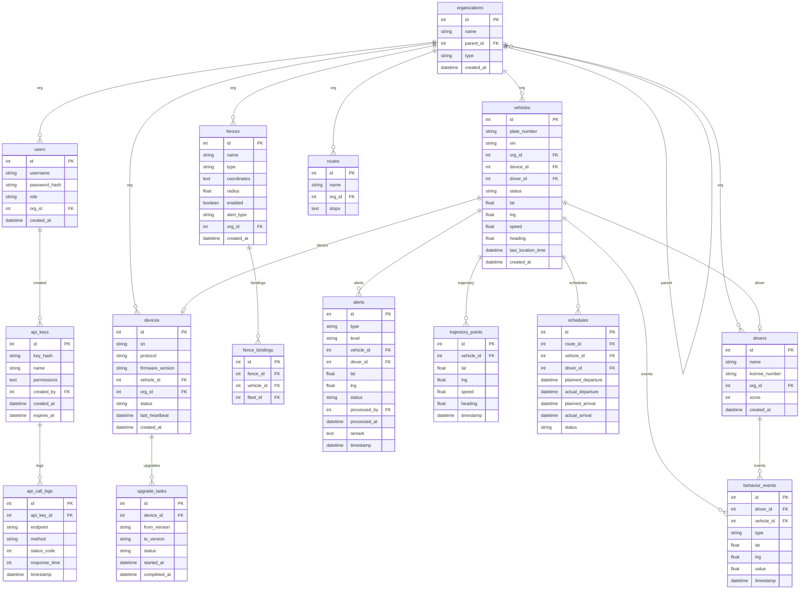

## 1. 架构设计

```mermaid
graph TB
    subgraph "前端层"
        "Web控制台(React)"
        "H5移动端(响应式)"
    end
    subgraph "API网关层"
        "Express路由"
        "认证中间件"
        "限流中间件"
        "API Key校验"
    end
    subgraph "业务服务层"
        "车辆监控服务"
        "告警引擎服务"
        "轨迹服务"
        "围栏服务"
        "设备管理服务"
        "班次统计服务"
        "行为分析服务"
        "组织权限服务"
    end
    subgraph "数据层"
        "SQLite主库"
        "历史归档(按月分表)"
    end
    subgraph "实时通信层"
        "WebSocket推送"
        "协议解析模拟器"
    end
    "Web控制台(React)" --> "API网关层"
    "H5移动端(响应式)" --> "API网关层"
    "API网关层" --> "业务服务层"
    "业务服务层" --> "数据层"
    "协议解析模拟器" --> "业务服务层"
    "业务服务层" --> "WebSocket推送"
    "WebSocket推送" --> "Web控制台(React)"
```

## 2. 技术说明

- **前端**：React@18 + TypeScript + Tailwind CSS@3 + Vite + Zustand
- **地图库**：Leaflet + React-Leaflet（开源免费，支持自定义瓦片源）
- **图表库**：Recharts
- **初始化工具**：vite-init (react-express-ts 模板)
- **后端**：Express@4 + TypeScript (ESM)
- **数据库**：SQLite（better-sqlite3），历史数据按月归档
- **实时通信**：WebSocket (ws库)
- **认证**：JWT Token + RBAC权限模型

## 3. 路由定义

| 路由 | 用途 |
|------|------|
| `/login` | 登录页 |
| `/dashboard` | 实时监控大屏 |
| `/monitor` | 实时监控地图 |
| `/trajectory` | 轨迹回放 |
| `/fence` | 电子围栏管理 |
| `/alerts` | 告警中心 |
| `/schedule` | 班次准点率统计 |
| `/driver-behavior` | 驾驶员行为分析 |
| `/devices` | 设备管理 |
| `/organization` | 组织管理 |
| `/api-gateway` | API网关管理 |

## 4. API定义

### 4.1 认证接口

```typescript
POST /api/auth/login
Request: { username: string; password: string }
Response: { token: string; user: { id: number; username: string; role: string; orgId: number } }

GET /api/auth/profile
Headers: { Authorization: "Bearer <token>" }
Response: { id: number; username: string; role: string; orgId: number; orgName: string }
```

### 4.2 车辆监控接口

```typescript
GET /api/vehicles
Query: { orgId?: number; status?: "online"|"offline"|"all"; page?: number; pageSize?: number }
Response: { list: Vehicle[]; total: number }

GET /api/vehicles/:id
Response: Vehicle

GET /api/vehicles/:id/realtime
Response: { lat: number; lng: number; speed: number; heading: number; status: string; timestamp: string }
```

### 4.3 轨迹接口

```typescript
GET /api/vehicles/:id/trajectory
Query: { startTime: string; endTime: string }
Response: { points: TrajectoryPoint[] }

interface TrajectoryPoint {
  lat: number;
  lng: number;
  speed: number;
  heading: number;
  timestamp: string;
}
```

### 4.4 电子围栏接口

```typescript
GET /api/fences
Query: { orgId?: number; page?: number; pageSize?: number }
Response: { list: Fence[]; total: number }

POST /api/fences
Request: CreateFenceDTO
Response: Fence

PUT /api/fences/:id
Request: UpdateFenceDTO
Response: Fence

DELETE /api/fences/:id
Response: { success: boolean }

interface Fence {
  id: number;
  name: string;
  type: "circle" | "polygon";
  coordinates: { lat: number; lng: number }[];
  radius?: number;
  enabled: boolean;
  alertType: "enter" | "exit" | "both";
  bindVehicles: number[];
  bindFleets: number[];
  orgId: number;
}
```

### 4.5 告警接口

```typescript
GET /api/alerts
Query: { type?: string; level?: string; status?: string; vehicleId?: number; startTime?: string; endTime?: string; page?: number; pageSize?: number }
Response: { list: Alert[]; total: number }

PUT /api/alerts/:id/process
Request: { action: "acknowledge" | "resolve" | "dismiss"; remark?: string }
Response: Alert

interface Alert {
  id: number;
  type: "fence_violation" | "overspeed" | "abnormal_stop" | "fatigue" | "harsh_accel" | "harsh_brake";
  level: "critical" | "warning" | "info";
  vehicleId: number;
  vehiclePlate: string;
  driverId?: number;
  driverName?: string;
  lat: number;
  lng: number;
  timestamp: string;
  status: "pending" | "acknowledged" | "resolved" | "dismissed";
  processedBy?: string;
  processedAt?: string;
  remark?: string;
}
```

### 4.6 班次准点率接口

```typescript
GET /api/schedules/stats
Query: { orgId?: number; routeId?: number; date: string }
Response: { onTimeRate: number; totalTrips: number; onTimeTrips: number; lateTrips: number; earlyTrips: number }

GET /api/schedules/trips
Query: { routeId?: number; date: string; page?: number; pageSize?: number }
Response: { list: TripRecord[]; total: number }
```

### 4.7 驾驶员行为接口

```typescript
GET /api/drivers/behavior/stats
Query: { orgId?: number; startTime?: string; endTime?: string }
Response: { drivers: DriverBehaviorStat[] }

GET /api/drivers/behavior/events
Query: { driverId?: number; type?: string; startTime?: string; endTime?: string; page?: number; pageSize?: number }
Response: { list: BehaviorEvent[]; total: number }

interface DriverBehaviorStat {
  driverId: number;
  driverName: string;
  score: number;
  harshAccelCount: number;
  harshBrakeCount: number;
  fatigueCount: number;
  overspeedCount: number;
}
```

### 4.8 设备管理接口

```typescript
GET /api/devices
Query: { orgId?: number; status?: string; page?: number; pageSize?: number }
Response: { list: Device[]; total: number }

POST /api/devices
Request: { sn: string; protocol: "JTT808" | "GBT35658"; vehicleId?: number; orgId: number }
Response: Device

PUT /api/devices/:id
Request: { vehicleId?: number; orgId?: number }
Response: Device

POST /api/devices/:id/upgrade
Request: { firmwareVersion: string; targetVersion: string }
Response: { taskId: number }

GET /api/devices/upgrade-tasks
Query: { status?: string; page?: number; pageSize?: number }
Response: { list: UpgradeTask[]; total: number }
```

### 4.9 组织管理接口

```typescript
GET /api/orgs/tree
Response: OrgNode[]

POST /api/orgs
Request: { name: string; parentId: number; type: "group" | "branch" | "fleet" }
Response: Org

PUT /api/orgs/:id
Request: { name?: string }
Response: Org

DELETE /api/orgs/:id
Response: { success: boolean }

GET /api/users
Query: { orgId?: number; page?: number; pageSize?: number }
Response: { list: User[]; total: number }

POST /api/users
Request: { username: string; password: string; role: string; orgId: number }
Response: User
```

### 4.10 API网关接口

```typescript
GET /api/gateway/keys
Response: ApiKey[]

POST /api/gateway/keys
Request: { name: string; permissions: string[] }
Response: { id: number; key: string; name: string; permissions: string[]; createdAt: string }

DELETE /api/gateway/keys/:id
Response: { success: boolean }

GET /api/gateway/stats
Query: { startTime?: string; endTime?: string }
Response: { totalCalls: number; successRate: number; avgResponseTime: number; byEndpoint: EndpointStat[] }
```

### 4.11 WebSocket事件

```typescript
WS /ws?token=<jwt>
Client <-- Server:
  "vehicle_update": { vehicleId: number; lat: number; lng: number; speed: number; heading: number; timestamp: string }
  "alert": Alert
  "device_status": { deviceId: number; status: "online" | "offline" }
```

## 5. 服务端架构图

```mermaid
graph LR
    subgraph "路由层"
        "authRoutes"
        "vehicleRoutes"
        "fenceRoutes"
        "alertRoutes"
        "scheduleRoutes"
        "driverRoutes"
        "deviceRoutes"
        "orgRoutes"
        "gatewayRoutes"
    end
    subgraph "中间件层"
        "authMiddleware"
        "rbacMiddleware"
        "rateLimitMiddleware"
    end
    subgraph "服务层"
        "AuthService"
        "VehicleService"
        "FenceService"
        "AlertEngine"
        "ScheduleService"
        "DriverService"
        "DeviceService"
        "OrgService"
        "GatewayService"
        "ProtocolParser"
    end
    subgraph "数据层"
        "SQLiteRepository"
        "ArchiveManager"
    end
    "路由层" --> "中间件层"
    "中间件层" --> "服务层"
    "服务层" --> "数据层"
    "ProtocolParser" --> "AlertEngine"
    "AlertEngine" --> "WebSocket推送"
```

## 6. 数据模型

### 6.1 数据模型定义



### 6.2 数据定义语言

```sql
CREATE TABLE organizations (
    id INTEGER PRIMARY KEY AUTOINCREMENT,
    name TEXT NOT NULL,
    parent_id INTEGER REFERENCES organizations(id),
    type TEXT NOT NULL CHECK(type IN ('group', 'branch', 'fleet')),
    created_at DATETIME DEFAULT CURRENT_TIMESTAMP
);

CREATE TABLE users (
    id INTEGER PRIMARY KEY AUTOINCREMENT,
    username TEXT NOT NULL UNIQUE,
    password_hash TEXT NOT NULL,
    role TEXT NOT NULL CHECK(role IN ('group_admin', 'branch_admin', 'dispatcher', 'safety_officer', 'api_consumer')),
    org_id INTEGER REFERENCES organizations(id),
    created_at DATETIME DEFAULT CURRENT_TIMESTAMP
);

CREATE TABLE vehicles (
    id INTEGER PRIMARY KEY AUTOINCREMENT,
    plate_number TEXT NOT NULL UNIQUE,
    vin TEXT,
    org_id INTEGER REFERENCES organizations(id),
    device_id INTEGER REFERENCES devices(id),
    driver_id INTEGER REFERENCES drivers(id),
    status TEXT DEFAULT 'offline' CHECK(status IN ('online', 'offline', 'alarm')),
    lat REAL DEFAULT 0,
    lng REAL DEFAULT 0,
    speed REAL DEFAULT 0,
    heading REAL DEFAULT 0,
    last_location_time DATETIME,
    created_at DATETIME DEFAULT CURRENT_TIMESTAMP
);

CREATE TABLE drivers (
    id INTEGER PRIMARY KEY AUTOINCREMENT,
    name TEXT NOT NULL,
    license_number TEXT,
    org_id INTEGER REFERENCES organizations(id),
    score INTEGER DEFAULT 100,
    created_at DATETIME DEFAULT CURRENT_TIMESTAMP
);

CREATE TABLE devices (
    id INTEGER PRIMARY KEY AUTOINCREMENT,
    sn TEXT NOT NULL UNIQUE,
    protocol TEXT NOT NULL CHECK(protocol IN ('JTT808', 'GBT35658')),
    firmware_version TEXT DEFAULT '1.0.0',
    vehicle_id INTEGER REFERENCES vehicles(id),
    org_id INTEGER REFERENCES organizations(id),
    status TEXT DEFAULT 'offline' CHECK(status IN ('online', 'offline', 'upgrading')),
    last_heartbeat DATETIME,
    created_at DATETIME DEFAULT CURRENT_TIMESTAMP
);

CREATE TABLE fences (
    id INTEGER PRIMARY KEY AUTOINCREMENT,
    name TEXT NOT NULL,
    type TEXT NOT NULL CHECK(type IN ('circle', 'polygon')),
    coordinates TEXT NOT NULL,
    radius REAL,
    enabled INTEGER DEFAULT 1,
    alert_type TEXT NOT NULL CHECK(alert_type IN ('enter', 'exit', 'both')),
    org_id INTEGER REFERENCES organizations(id),
    created_at DATETIME DEFAULT CURRENT_TIMESTAMP
);

CREATE TABLE fence_bindings (
    id INTEGER PRIMARY KEY AUTOINCREMENT,
    fence_id INTEGER REFERENCES fences(id),
    vehicle_id INTEGER REFERENCES vehicles(id),
    fleet_id INTEGER REFERENCES organizations(id)
);

CREATE TABLE alerts (
    id INTEGER PRIMARY KEY AUTOINCREMENT,
    type TEXT NOT NULL CHECK(type IN ('fence_violation', 'overspeed', 'abnormal_stop', 'fatigue', 'harsh_accel', 'harsh_brake')),
    level TEXT NOT NULL CHECK(level IN ('critical', 'warning', 'info')),
    vehicle_id INTEGER REFERENCES vehicles(id),
    driver_id INTEGER REFERENCES drivers(id),
    lat REAL,
    lng REAL,
    status TEXT DEFAULT 'pending' CHECK(status IN ('pending', 'acknowledged', 'resolved', 'dismissed')),
    processed_by INTEGER REFERENCES users(id),
    processed_at DATETIME,
    remark TEXT,
    timestamp DATETIME DEFAULT CURRENT_TIMESTAMP
);

CREATE TABLE trajectory_points (
    id INTEGER PRIMARY KEY AUTOINCREMENT,
    vehicle_id INTEGER NOT NULL REFERENCES vehicles(id),
    lat REAL NOT NULL,
    lng REAL NOT NULL,
    speed REAL DEFAULT 0,
    heading REAL DEFAULT 0,
    timestamp DATETIME NOT NULL
);

CREATE INDEX idx_trajectory_vehicle_time ON trajectory_points(vehicle_id, timestamp);

CREATE TABLE routes (
    id INTEGER PRIMARY KEY AUTOINCREMENT,
    name TEXT NOT NULL,
    org_id INTEGER REFERENCES organizations(id),
    stops TEXT
);

CREATE TABLE schedules (
    id INTEGER PRIMARY KEY AUTOINCREMENT,
    route_id INTEGER REFERENCES routes(id),
    vehicle_id INTEGER REFERENCES vehicles(id),
    driver_id INTEGER REFERENCES drivers(id),
    planned_departure DATETIME,
    actual_departure DATETIME,
    planned_arrival DATETIME,
    actual_arrival DATETIME,
    status TEXT DEFAULT 'scheduled' CHECK(status IN ('scheduled', 'on_time', 'late', 'early', 'cancelled'))
);

CREATE TABLE behavior_events (
    id INTEGER PRIMARY KEY AUTOINCREMENT,
    driver_id INTEGER REFERENCES drivers(id),
    vehicle_id INTEGER REFERENCES vehicles(id),
    type TEXT NOT NULL CHECK(type IN ('harsh_accel', 'harsh_brake', 'fatigue', 'overspeed')),
    lat REAL,
    lng REAL,
    value REAL,
    timestamp DATETIME NOT NULL
);

CREATE INDEX idx_behavior_driver_time ON behavior_events(driver_id, timestamp);

CREATE TABLE upgrade_tasks (
    id INTEGER PRIMARY KEY AUTOINCREMENT,
    device_id INTEGER REFERENCES devices(id),
    from_version TEXT,
    to_version TEXT,
    status TEXT DEFAULT 'pending' CHECK(status IN ('pending', 'in_progress', 'completed', 'failed')),
    started_at DATETIME,
    completed_at DATETIME
);

CREATE TABLE api_keys (
    id INTEGER PRIMARY KEY AUTOINCREMENT,
    key_hash TEXT NOT NULL UNIQUE,
    name TEXT NOT NULL,
    permissions TEXT,
    created_by INTEGER REFERENCES users(id),
    created_at DATETIME DEFAULT CURRENT_TIMESTAMP,
    expires_at DATETIME
);

CREATE TABLE api_call_logs (
    id INTEGER PRIMARY KEY AUTOINCREMENT,
    api_key_id INTEGER REFERENCES api_keys(id),
    endpoint TEXT NOT NULL,
    method TEXT NOT NULL,
    status_code INTEGER,
    response_time INTEGER,
    timestamp DATETIME DEFAULT CURRENT_TIMESTAMP
);

CREATE INDEX idx_api_logs_key_time ON api_call_logs(api_key_id, timestamp);
```
