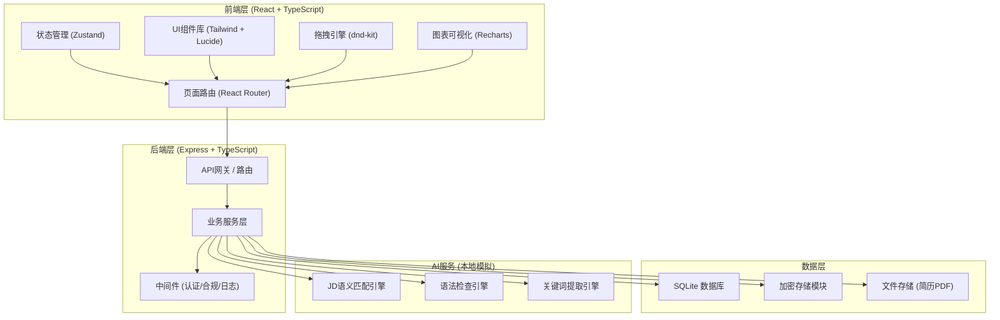
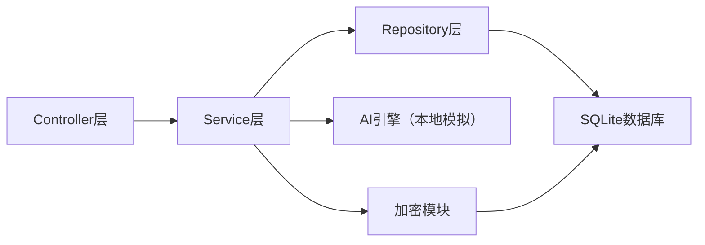
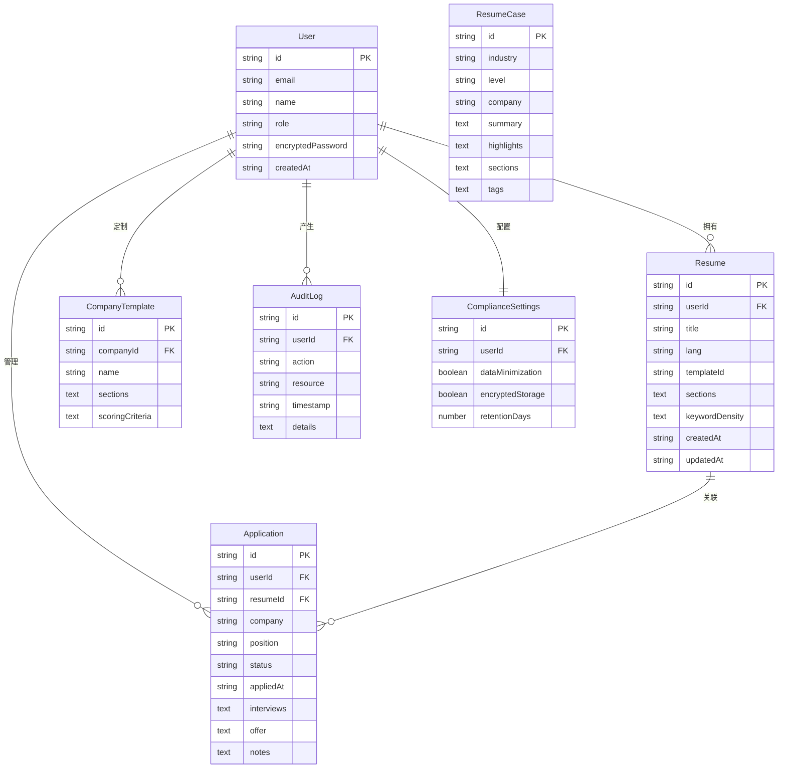

## 1. 架构设计



## 2. 技术说明

- **前端**：React@18 + TypeScript + TailwindCSS@3 + Vite
- **初始化工具**：vite-init (react-express-ts 模板)
- **后端**：Express@4 + TypeScript (ESM)
- **数据库**：SQLite (better-sqlite3)，开发阶段使用mock数据
- **状态管理**：Zustand
- **拖拽引擎**：@dnd-kit/core + @dnd-kit/sortable
- **图表可视化**：Recharts
- **图标**：lucide-react
- **字体**：Google Fonts (Playfair Display, DM Sans, Noto Serif SC, Noto Sans SC)
- **AI服务**：本地模拟实现（关键词匹配算法 + 基于规则的语法检查），不依赖外部API

## 3. 路由定义

| 路由 | 用途 |
|------|------|
| `/` | 首页/工作台，展示平台概览与快速入口 |
| `/resume` | 简历列表页，管理所有简历 |
| `/resume/editor/:id` | 简历编辑器，拖拽编辑+实时预览 |
| `/resume/diagnosis/:id` | 智能诊断页，JD匹配+语法检查+评分 |
| `/cases` | 案例库首页，筛选与浏览大牛简历 |
| `/cases/:id` | 案例详情页，结构化解析视图 |
| `/tracking` | 求职管理看板，网申+面试+Offer追踪 |
| `/hr` | HR协作空间首页，模板+评分+投递管理 |
| `/hr/screening` | AI初筛设置与管理 |
| `/hr/analytics` | 投递分析报告 |
| `/compliance` | 合规中心，数据管理与审计日志 |

## 4. API定义

### 4.1 简历相关

```typescript
interface Resume {
  id: string
  userId: string
  title: string
  lang: "zh" | "en"
  templateId: string
  sections: ResumeSection[]
  keywordDensity: KeywordDensity
  createdAt: string
  updatedAt: string
}

interface ResumeSection {
  id: string
  type: "personal" | "education" | "experience" | "skills" | "projects" | "custom"
  order: number
  content: Record<string, unknown>
}

interface KeywordDensity {
  keywords: { word: string; count: number; density: number }[]
  atsScore: number
}

// GET /api/resumes - 获取用户简历列表
// GET /api/resumes/:id - 获取简历详情
// POST /api/resumes - 创建简历
// PUT /api/resumes/:id - 更新简历
// DELETE /api/resumes/:id - 删除简历
// POST /api/resumes/:id/export - 导出PDF
```

### 4.2 智能诊断相关

```typescript
interface DiagnosisResult {
  resumeId: string
  jdMatchScore: number
  matchedSkills: string[]
  missingSkills: string[]
  grammarErrors: GrammarError[]
  fitnessScore: FitnessScore
  suggestions: Suggestion[]
}

interface GrammarError {
  text: string
  offset: number
  length: number
  message: string
  suggestion: string
}

interface FitnessScore {
  overall: number
  dimensions: { name: string; score: number; benchmark: number }[]
}

interface Suggestion {
  priority: "high" | "medium" | "low"
  category: string
  content: string
}

// POST /api/diagnosis/match - JD匹配分析
// POST /api/diagnosis/grammar - 语法检查
// GET /api/diagnosis/fitness/:resumeId - 适配度评分
```

### 4.3 案例库相关

```typescript
interface ResumeCase {
  id: string
  industry: string
  level: string
  company: string
  summary: string
  highlights: string[]
  sections: CaseSection[]
  tags: string[]
}

// GET /api/cases - 案例列表（支持筛选）
// GET /api/cases/:id - 案例详情
// GET /api/cases/filters - 获取筛选项（行业/职级/公司）
```

### 4.4 求职管理相关

```typescript
interface Application {
  id: string
  userId: string
  company: string
  position: string
  status: "todo" | "applied" | "interview" | "offer" | "rejected"
  resumeId: string
  appliedAt: string
  interviews: Interview[]
  offer?: Offer
  notes: string
}

interface Interview {
  id: string
  date: string
  type: "phone" | "technical" | "onsite" | "hr"
  notes: string
}

interface Offer {
  baseSalary: number
  bonus: string
  benefits: string[]
  equity: string
  deadline: string
}

// GET /api/applications - 获取投递列表
// POST /api/applications - 新增投递
// PUT /api/applications/:id - 更新投递
// PUT /api/applications/:id/status - 更新状态
// POST /api/applications/compare - Offer对比
```

### 4.5 HR相关

```typescript
interface CompanyTemplate {
  id: string
  companyId: string
  name: string
  sections: ResumeSection[]
  scoringCriteria: ScoringCriteria
}

interface ScoringCriteria {
  dimensions: { name: string; weight: number }[]
  thresholds: { autoReject: number; autoAdvance: number }
}

// GET /api/hr/templates - 企业模板列表
// POST /api/hr/templates - 创建模板
// PUT /api/hr/templates/:id - 更新模板
// POST /api/hr/screening - AI初筛配置
// GET /api/hr/analytics - 投递分析报告
```

### 4.6 合规相关

```typescript
interface ComplianceSettings {
  dataMinimization: boolean
  encryptedStorage: boolean
  retentionDays: number
}

interface AuditLog {
  id: string
  userId: string
  action: string
  resource: string
  timestamp: string
  details: string
}

// GET /api/compliance/settings - 获取合规设置
// PUT /api/compliance/settings - 更新合规设置
// POST /api/compliance/delete-account - 一键删除账户及数据
// GET /api/compliance/audit-logs - 获取审计日志
```

## 5. 服务端架构图



## 6. 数据模型

### 6.1 数据模型定义



### 6.2 数据定义语言

```sql
CREATE TABLE users (
  id TEXT PRIMARY KEY,
  email TEXT UNIQUE NOT NULL,
  name TEXT NOT NULL,
  role TEXT NOT NULL DEFAULT 'seeker',
  encrypted_password TEXT NOT NULL,
  created_at TEXT NOT NULL DEFAULT (datetime('now'))
);

CREATE TABLE resumes (
  id TEXT PRIMARY KEY,
  user_id TEXT NOT NULL REFERENCES users(id) ON DELETE CASCADE,
  title TEXT NOT NULL,
  lang TEXT NOT NULL DEFAULT 'zh',
  template_id TEXT NOT NULL,
  sections TEXT NOT NULL DEFAULT '[]',
  keyword_density TEXT NOT NULL DEFAULT '{}',
  created_at TEXT NOT NULL DEFAULT (datetime('now')),
  updated_at TEXT NOT NULL DEFAULT (datetime('now'))
);

CREATE TABLE resume_cases (
  id TEXT PRIMARY KEY,
  industry TEXT NOT NULL,
  level TEXT NOT NULL,
  company TEXT NOT NULL,
  summary TEXT NOT NULL DEFAULT '',
  highlights TEXT NOT NULL DEFAULT '[]',
  sections TEXT NOT NULL DEFAULT '[]',
  tags TEXT NOT NULL DEFAULT '[]'
);

CREATE TABLE applications (
  id TEXT PRIMARY KEY,
  user_id TEXT NOT NULL REFERENCES users(id) ON DELETE CASCADE,
  resume_id TEXT REFERENCES resumes(id),
  company TEXT NOT NULL,
  position TEXT NOT NULL,
  status TEXT NOT NULL DEFAULT 'todo',
  applied_at TEXT,
  interviews TEXT NOT NULL DEFAULT '[]',
  offer TEXT,
  notes TEXT NOT NULL DEFAULT '',
  created_at TEXT NOT NULL DEFAULT (datetime('now'))
);

CREATE TABLE company_templates (
  id TEXT PRIMARY KEY,
  company_id TEXT NOT NULL REFERENCES users(id) ON DELETE CASCADE,
  name TEXT NOT NULL,
  sections TEXT NOT NULL DEFAULT '[]',
  scoring_criteria TEXT NOT NULL DEFAULT '{}',
  created_at TEXT NOT NULL DEFAULT (datetime('now'))
);

CREATE TABLE audit_logs (
  id TEXT PRIMARY KEY,
  user_id TEXT NOT NULL REFERENCES users(id),
  action TEXT NOT NULL,
  resource TEXT NOT NULL,
  timestamp TEXT NOT NULL DEFAULT (datetime('now')),
  details TEXT NOT NULL DEFAULT '{}'
);

CREATE TABLE compliance_settings (
  id TEXT PRIMARY KEY,
  user_id TEXT UNIQUE NOT NULL REFERENCES users(id) ON DELETE CASCADE,
  data_minimization INTEGER NOT NULL DEFAULT 1,
  encrypted_storage INTEGER NOT NULL DEFAULT 1,
  retention_days INTEGER NOT NULL DEFAULT 365
);

CREATE INDEX idx_resumes_user_id ON resumes(user_id);
CREATE INDEX idx_applications_user_id ON applications(user_id);
CREATE INDEX idx_applications_status ON applications(status);
CREATE INDEX idx_audit_logs_user_id ON audit_logs(user_id);
CREATE INDEX idx_audit_logs_timestamp ON audit_logs(timestamp);
CREATE INDEX idx_resume_cases_industry ON resume_cases(industry);
CREATE INDEX idx_resume_cases_level ON resume_cases(level);
```
