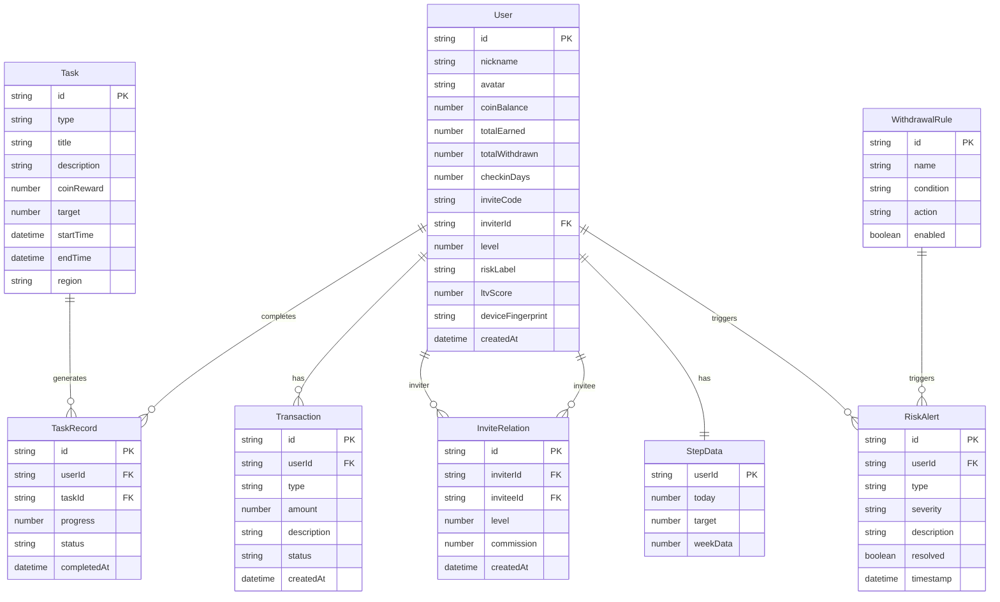

## 1. 架构设计

```mermaid
graph TB
    subgraph "前端层"
        "C端用户界面" --> "React Router"
        "B端管理后台" --> "React Router"
    end

    subgraph "业务逻辑层（Mock Service）"
        "React Router" --> "任务服务"
        "React Router" --> "金币服务"
        "React Router" --> "用户服务"
        "React Router" --> "钱包服务"
        "React Router" --> "风控服务"
        "React Router" --> "广告服务"
        "React Router" --> "数据看板服务"
    end

    subgraph "数据层（Mock Data）"
        "任务服务" --> "Mock Data Store"
        "金币服务" --> "Mock Data Store"
        "用户服务" --> "Mock Data Store"
        "钱包服务" --> "Mock Data Store"
        "风控服务" --> "Mock Data Store"
        "广告服务" --> "Mock Data Store"
        "数据看板服务" --> "Mock Data Store"
    end

    subgraph "外部服务（模拟）"
        "Mock Data Store" --> "健康数据API"
        "Mock Data Store" --> "微信支付API"
        "Mock Data Store" --> "穿山甲SDK"
        "Mock Data Store" --> "优量汇SDK"
    end
```

## 2. 技术说明
- **前端**：React@18 + TypeScript + Tailwind CSS@3 + Vite
- **初始化工具**：Vite
- **后端**：无独立后端，使用 Mock Service Worker (MSW) 模拟API
- **数据库**：使用 localStorage + 内存数据模拟持久化
- **图表库**：Recharts
- **动画库**：Framer Motion
- **路由**：React Router v6
- **状态管理**：Zustand
- **图标库**：Lucide React

## 3. 路由定义

### C端路由
| 路由 | 用途 |
|------|------|
| / | 首页/任务中心 |
| /steps | 步数赚钱页 |
| /video | 视频任务页 |
| /checkin | 签到日历页 |
| /invite | 邀请好友页 |
| /wallet | 钱包页 |

### B端路由
| 路由 | 用途 |
|------|------|
| /admin | 管理后台首页/数据看板 |
| /admin/tasks | 任务管理 |
| /admin/users | 用户管理 |
| /admin/risk | 风控中心 |
| /admin/ads | 广告管理 |

## 4. API定义（Mock）

### 4.1 任务相关
```typescript
interface Task {
  id: string
  type: 'steps' | 'video' | 'checkin' | 'invite' | 'limited' | 'holiday'
  title: string
  description: string
  coinReward: number
  progress: number
  target: number
  status: 'available' | 'in_progress' | 'completed' | 'expired'
  startTime?: string
  endTime?: string
  region?: string[]
  config?: Record<string, unknown>
}

interface TaskListResponse {
  tasks: Task[]
  categories: { key: string; label: string; icon: string }[]
}
```

### 4.2 用户相关
```typescript
interface User {
  id: string
  nickname: string
  avatar: string
  coinBalance: number
  totalEarned: number
  totalWithdrawn: number
  checkinDays: number
  inviteCode: string
  inviterId?: string
  level: number
  riskLabel: 'normal' | 'suspected' | 'blocked'
  ltvScore: number
  deviceFingerprint: string
  createdAt: string
}

interface StepData {
  today: number
  target: number
  weekData: number[]
  coinConversion: { steps: number; coins: number }[]
}
```

### 4.3 钱包相关
```typescript
interface WalletInfo {
  coinBalance: number
  cashEquivalent: number
  exchangeTiers: { minCoins: number; rate: number; label: string }[]
}

interface Transaction {
  id: string
  type: 'earn' | 'withdraw' | 'commission'
  amount: number
  description: string
  createdAt: string
  status: 'success' | 'pending' | 'failed' | 'intercepted'
}

interface WithdrawRequest {
  amount: number
  target: 'wechat'
}
```

### 4.4 邀请相关
```typescript
interface InviteRelation {
  userId: string
  nickname: string
  avatar: string
  level: 1 | 2
  commission: number
  completedTasks: number
  createdAt: string
}
```

### 4.5 风控相关
```typescript
interface RiskAlert {
  id: string
  userId: string
  type: 'device_fingerprint' | 'behavior_sequence' | 'ip_frequency' | 'withdrawal_anomaly'
  severity: 'low' | 'medium' | 'high'
  description: string
  timestamp: string
  resolved: boolean
}

interface WithdrawalRule {
  id: string
  name: string
  condition: string
  action: 'block' | 'review' | 'limit'
  enabled: boolean
}
```

### 4.6 数据看板相关
```typescript
interface DashboardMetrics {
  dau: number
  dauTrend: { date: string; value: number }[]
  newUsers: number
  coinIssued: number
  withdrawalAmount: number
  taskROI: { taskId: string; taskName: string; costPerUser: number; retention7d: number; conversionRate: number }[]
  ltvDistribution: { segment: string; avgLtv: number; userCount: number }[]
}
```

## 5. 服务器架构图

本项目为纯前端应用，使用 Mock Service 模拟后端逻辑：

```mermaid
graph LR
    "React App" --> "Zustand Store"
    "Zustand Store" --> "Mock Service Layer"
    "Mock Service Layer" --> "localStorage"
    "Mock Service Layer" --> "内存数据"
```

## 6. 数据模型

### 6.1 数据模型定义



### 6.2 数据定义语言

```sql
CREATE TABLE users (
  id TEXT PRIMARY KEY,
  nickname TEXT NOT NULL,
  avatar TEXT,
  coin_balance INTEGER DEFAULT 0,
  total_earned INTEGER DEFAULT 0,
  total_withdrawn INTEGER DEFAULT 0,
  checkin_days INTEGER DEFAULT 0,
  invite_code TEXT UNIQUE,
  inviter_id TEXT REFERENCES users(id),
  level INTEGER DEFAULT 1,
  risk_label TEXT DEFAULT 'normal',
  ltv_score REAL DEFAULT 0,
  device_fingerprint TEXT,
  created_at DATETIME DEFAULT CURRENT_TIMESTAMP
);

CREATE TABLE tasks (
  id TEXT PRIMARY KEY,
  type TEXT NOT NULL,
  title TEXT NOT NULL,
  description TEXT,
  coin_reward INTEGER NOT NULL,
  target INTEGER DEFAULT 1,
  start_time DATETIME,
  end_time DATETIME,
  region TEXT
);

CREATE TABLE task_records (
  id TEXT PRIMARY KEY,
  user_id TEXT REFERENCES users(id),
  task_id TEXT REFERENCES tasks(id),
  progress INTEGER DEFAULT 0,
  status TEXT DEFAULT 'available',
  completed_at DATETIME
);

CREATE TABLE transactions (
  id TEXT PRIMARY KEY,
  user_id TEXT REFERENCES users(id),
  type TEXT NOT NULL,
  amount INTEGER NOT NULL,
  description TEXT,
  status TEXT DEFAULT 'success',
  created_at DATETIME DEFAULT CURRENT_TIMESTAMP
);

CREATE TABLE invite_relations (
  id TEXT PRIMARY KEY,
  inviter_id TEXT REFERENCES users(id),
  invitee_id TEXT REFERENCES users(id),
  level INTEGER NOT NULL,
  commission INTEGER DEFAULT 0,
  created_at DATETIME DEFAULT CURRENT_TIMESTAMP
);

CREATE TABLE risk_alerts (
  id TEXT PRIMARY KEY,
  user_id TEXT REFERENCES users(id),
  type TEXT NOT NULL,
  severity TEXT NOT NULL,
  description TEXT,
  resolved BOOLEAN DEFAULT FALSE,
  timestamp DATETIME DEFAULT CURRENT_TIMESTAMP
);

CREATE TABLE withdrawal_rules (
  id TEXT PRIMARY KEY,
  name TEXT NOT NULL,
  condition TEXT NOT NULL,
  action TEXT NOT NULL,
  enabled BOOLEAN DEFAULT TRUE
);
```
