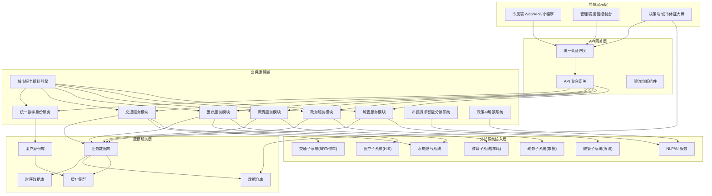
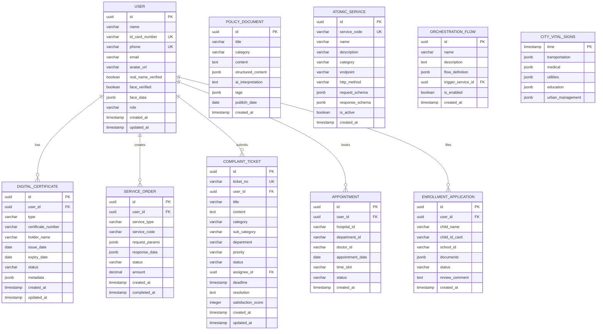

## 1. 架构设计

南宁城市级公共服务操作系统采用微服务架构，前后端分离，支持高并发、高可用的城市级应用场景。系统分为前端展示层、业务服务层、数据服务层和基础设施层，通过服务编排引擎实现各子系统的协同工作。



## 2. 技术描述

### 2.1 技术栈选型

- **前端框架**：React 18 + TypeScript
- **构建工具**：Vite 5
- **UI 框架**：TailwindCSS 3 + Ant Design 5
- **状态管理**：Zustand 4
- **路由管理**：React Router 6
- **数据可视化**：ECharts 5 + Recharts 2
- **图表库**：@ant-design/charts
- **图标库**：lucide-react
- **二维码生成**：qrcode.react
- **富文本**：@tiptap/react
- **HTTP客户端**：Axios
- **后端框架**：Express 4 + TypeScript
- **数据库**：PostgreSQL 16（主业务库）+ Redis 7（缓存）+ InfluxDB 2（时序数据）
- **认证授权**：JWT + OAuth 2.0
- **消息队列**：RabbitMQ
- **任务调度**：node-cron
- **NLP服务**：集成Mock AI服务

### 2.2 项目初始化

使用 Vite React TypeScript 模板初始化项目，配合 Express 后端实现全栈应用。

```
pnpm create vite-init@latest . --template react-express-ts --force
```

## 3. 路由定义

| 路由路径 | 页面/组件 | 权限要求 | 描述 |
|----------|-----------|----------|------|
| `/` | 首页仪表盘 | 公开 | 服务入口矩阵、城市动态、快捷功能 |
| `/login` | 登录页 | 公开 | 统一身份认证登录 |
| `/identity` | 数字身份中心 | 已认证 | 电子证照卡包、身份认证管理 |
| `/transportation` | 交通服务 | 已认证 | BRT乘车、停车、违章查询 |
| `/transportation/brt` | BRT乘车码 | 已认证 | 动态乘车二维码 |
| `/transportation/parking` | 智慧停车 | 已认证 | 停车场查询、预约、支付 |
| `/transportation/violation` | 违章查询 | 已认证 | 交通违章查询与处理 |
| `/medical` | 医疗服务 | 已认证 | 医院列表、科室选择 |
| `/medical/appointment` | 挂号缴费 | 已认证 | 预约挂号、在线支付 |
| `/medical/heatmap` | 候诊热力图 | 已认证 | 各医院候诊时长热力图 |
| `/education` | 教育服务 | 已认证 | 学区查询、入学报名 |
| `/education/enrollment` | 入学报名 | 已认证 | 小学入学在线报名 |
| `/government` | 政务服务 | 已认证 | 事项办理、政策查询 |
| `/government/policy` | 政策解读 | 已认证 | 政策文件AI解读 |
| `/urban` | 城管服务 | 已认证 | 12345诉求、城市问题上报 |
| `/urban/complaint` | 诉求提交 | 已认证 | 12345工单提交 |
| `/dashboard` | 城市体征大屏 | 管理员 | 城市运行监测仪表盘 |
| `/orchestration` | 服务编排中心 | 管理员 | 原子能力编排、流程设计 |
| `/profile` | 个人中心 | 已认证 | 个人信息、消息、设置 |

## 4. API 定义

### 4.1 核心类型定义

```typescript
// 通用响应结构
interface ApiResponse<T> {
  code: number;
  message: string;
  data: T;
  timestamp: number;
}

// 用户身份信息
interface UserIdentity {
  id: string;
  name: string;
  idCard: string;
  phone: string;
  avatar?: string;
  realNameVerified: boolean;
  faceVerified: boolean;
}

// 电子证照
interface DigitalCertificate {
  id: string;
  type: 'id_card' | 'social_security' | 'driving_license' | 'vehicle_license' | 'ebike_plate';
  number: string;
  name: string;
  issueDate: string;
  expiryDate: string;
  status: 'active' | 'expired' | 'revoked';
  qrCode?: string;
}

// 服务请求
interface ServiceRequest {
  id: string;
  serviceType: string;
  userId: string;
  params: Record<string, any>;
  status: 'pending' | 'processing' | 'completed' | 'failed';
  createdAt: string;
  updatedAt: string;
}

// 城市体征数据
interface CityVitalSigns {
  timestamp: string;
  transportation: {
    busOnTimeRate: number;
    trafficFlow: number;
    parkingOccupancy: number;
  };
  medical: {
    hospitalWaitTimes: Record<string, number>;
    emergencyLoad: number;
  };
  utilities: {
    waterUsage: number;
    electricityUsage: number;
    gasUsage: number;
  };
  education: {
    schoolEnrollment: number;
  };
}

// 12345工单
interface ComplaintTicket {
  id: string;
  title: string;
  content: string;
  category: 'transportation' | 'medical' | 'education' | 'government' | 'urban_management';
  subCategory?: string;
  department: string;
  status: 'pending' | 'assigned' | 'processing' | 'resolved' | 'closed';
  priority: 'low' | 'medium' | 'high' | 'urgent';
  createdAt: string;
  deadline: string;
}

// 政策文件
interface PolicyDocument {
  id: string;
  title: string;
  category: string;
  publishDate: string;
  content: string;
  structuredContent: PolicySection[];
  aiInterpretation?: string;
  tags: string[];
}

interface PolicySection {
  id: string;
  title: string;
  level: number;
  content: string;
  keyPoints?: string[];
}

// 原子服务
interface AtomicService {
  id: string;
  name: string;
  description: string;
  category: string;
  endpoint: string;
  method: 'GET' | 'POST' | 'PUT' | 'DELETE';
  params: ServiceParam[];
  returnType: string;
  status: 'active' | 'inactive';
}

interface ServiceParam {
  name: string;
  type: string;
  required: boolean;
  description: string;
}
```

### 4.2 API 端点列表

| HTTP方法 | 路径 | 描述 | 请求体 | 响应体 |
|----------|------|------|--------|--------|
| POST | `/api/auth/login` | 用户登录 | `{phone, password}` | `{token, user}` |
| POST | `/api/auth/face-verify` | 人脸认证 | `{faceImage}` | `{verified, confidence}` |
| GET | `/api/identity/certificates` | 获取电子证照列表 | - | `DigitalCertificate[]` |
| POST | `/api/transportation/brt/qrcode` | 生成BRT乘车码 | `{userId}` | `{qrCode, expiresAt}` |
| GET | `/api/transportation/parking/nearby` | 获取附近停车场 | `{lat, lng, radius}` | `ParkingLot[]` |
| GET | `/api/medical/hospitals` | 获取医院列表 | - | `Hospital[]` |
| GET | `/api/medical/wait-times` | 获取候诊时长数据 | - | `WaitTimeData[]` |
| POST | `/api/medical/appointment` | 创建挂号预约 | `{hospitalId, departmentId, date, timeSlot}` | `{appointmentId}` |
| POST | `/api/education/enrollment` | 提交入学报名 | `EnrollmentForm` | `{applicationId, status}` |
| GET | `/api/government/policies` | 获取政策列表 | `{category, page}` | `PolicyDocument[]` |
| GET | `/api/government/policies/:id/interpret` | 获取政策AI解读 | - | `{interpretation, relatedPolicies}` |
| POST | `/api/urban/complaint` | 提交12345诉求 | `{title, content, category, images}` | `{ticketId}` |
| GET | `/api/urban/complaints/:id` | 查询工单详情 | - | `ComplaintTicket` |
| GET | `/api/dashboard/vital-signs` | 获取城市体征数据 | `{timeRange}` | `CityVitalSigns` |
| GET | `/api/orchestration/services` | 获取原子服务列表 | - | `AtomicService[]` |
| POST | `/api/orchestration/flows` | 创建服务编排流程 | `OrchestrationFlow` | `{flowId}` |

## 5. 后端架构设计

```mermaid
graph TD
    subgraph "Controller 控制层"
        AuthController["认证控制器"]
        IdentityController["身份控制器"]
        TransportationController["交通控制器"]
        MedicalController["医疗控制器"]
        EducationController["教育控制器"]
        GovernmentController["政务控制器"]
        UrbanController["城管控制器"]
        DashboardController["仪表盘控制器"]
        OrchestrationController["编排控制器"]
    end
    
    subgraph "Service 业务逻辑层"
        AuthService["认证服务"]
        IdentityService["身份服务"]
        TransportationService["交通服务"]
        MedicalService["医疗服务"]
        EducationService["教育服务"]
        GovernmentService["政务服务"]
        UrbanService["城管服务"]
        DashboardService["仪表盘服务"]
        OrchestrationEngine["编排引擎"]
        NlpService["NLP服务"]
        AiInterpretationService["AI解读服务"]
    end
    
    subgraph "Repository 数据访问层"
        UserRepository["用户仓储"]
        CertificateRepository["证照仓储"]
        OrderRepository["订单仓储"]
        TicketRepository["工单仓储"]
        PolicyRepository["政策仓储"]
        TimeSeriesRepository["时序数据仓储"]
    end
    
    subgraph "Database 数据层"
        PostgreSQL["PostgreSQL 主库"]
        Redis["Redis 缓存"]
        InfluxDB["InfluxDB 时序库"]
    end
    
    subgraph "External 外部系统"
        TrafficSystem["交通子系统"]
        MedicalSystem["医疗子系统"]
        EducationSystem["教育子系统"]
        GovernmentSystem["政务子系统"]
        UtilitySystem["水电燃气系统"]
        AiService["AI/NLP服务"]
    end
    
    AuthController --> AuthService
    IdentityController --> IdentityService
    TransportationController --> TransportationService
    MedicalController --> MedicalService
    EducationController --> EducationService
    GovernmentController --> GovernmentService
    UrbanController --> UrbanService
    DashboardController --> DashboardService
    OrchestrationController --> OrchestrationEngine
    
    AuthService --> UserRepository
    IdentityService --> CertificateRepository
    TransportationService --> OrderRepository
    UrbanService --> TicketRepository
    GovernmentService --> PolicyRepository
    DashboardService --> TimeSeriesRepository
    
    UserRepository --> PostgreSQL
    CertificateRepository --> PostgreSQL
    OrderRepository --> PostgreSQL
    TicketRepository --> PostgreSQL
    PolicyRepository --> PostgreSQL
    TimeSeriesRepository --> InfluxDB
    
    AllServices -.-> Redis
    TransportationService --> TrafficSystem
    MedicalService --> MedicalSystem
    EducationService --> EducationSystem
    GovernmentService --> GovernmentSystem
    DashboardService --> UtilitySystem
    UrbanService --> AiService
    GovernmentService --> AiService
```



## 6. 数据模型设计

### 6.1 ER 实体关系图



### 6.2 DDL 语句

```sql
-- 扩展创建
CREATE EXTENSION IF NOT EXISTS "uuid-ossp";
CREATE EXTENSION IF NOT EXISTS "pgcrypto";

-- 用户表
CREATE TABLE users (
    id UUID PRIMARY KEY DEFAULT uuid_generate_v4(),
    name VARCHAR(100) NOT NULL,
    id_card_number VARCHAR(18) UNIQUE NOT NULL,
    phone VARCHAR(20) UNIQUE NOT NULL,
    email VARCHAR(100),
    avatar_url VARCHAR(500),
    password_hash VARCHAR(255) NOT NULL,
    real_name_verified BOOLEAN DEFAULT FALSE,
    face_verified BOOLEAN DEFAULT FALSE,
    face_data JSONB,
    role VARCHAR(20) DEFAULT 'citizen',
    created_at TIMESTAMP DEFAULT CURRENT_TIMESTAMP,
    updated_at TIMESTAMP DEFAULT CURRENT_TIMESTAMP
);

-- 电子证照表
CREATE TABLE digital_certificates (
    id UUID PRIMARY KEY DEFAULT uuid_generate_v4(),
    user_id UUID REFERENCES users(id) NOT NULL,
    type VARCHAR(50) NOT NULL,
    certificate_number VARCHAR(100) NOT NULL,
    holder_name VARCHAR(100) NOT NULL,
    issue_date DATE NOT NULL,
    expiry_date DATE,
    status VARCHAR(20) DEFAULT 'active',
    metadata JSONB,
    created_at TIMESTAMP DEFAULT CURRENT_TIMESTAMP,
    updated_at TIMESTAMP DEFAULT CURRENT_TIMESTAMP,
    UNIQUE(user_id, type)
);

-- 服务订单表
CREATE TABLE service_orders (
    id UUID PRIMARY KEY DEFAULT uuid_generate_v4(),
    user_id UUID REFERENCES users(id) NOT NULL,
    service_type VARCHAR(50) NOT NULL,
    service_code VARCHAR(100) NOT NULL,
    request_params JSONB,
    response_data JSONB,
    status VARCHAR(20) DEFAULT 'pending',
    amount DECIMAL(10, 2) DEFAULT 0,
    created_at TIMESTAMP DEFAULT CURRENT_TIMESTAMP,
    completed_at TIMESTAMP
);

-- 12345工单表
CREATE TABLE complaint_tickets (
    id UUID PRIMARY KEY DEFAULT uuid_generate_v4(),
    ticket_no VARCHAR(30) UNIQUE NOT NULL,
    user_id UUID REFERENCES users(id) NOT NULL,
    title VARCHAR(200) NOT NULL,
    content TEXT NOT NULL,
    category VARCHAR(50) NOT NULL,
    sub_category VARCHAR(100),
    department VARCHAR(100) NOT NULL,
    priority VARCHAR(20) DEFAULT 'medium',
    status VARCHAR(20) DEFAULT 'pending',
    assignee_id UUID REFERENCES users(id),
    deadline TIMESTAMP,
    resolution TEXT,
    satisfaction_score INTEGER,
    created_at TIMESTAMP DEFAULT CURRENT_TIMESTAMP,
    updated_at TIMESTAMP DEFAULT CURRENT_TIMESTAMP
);

-- 预约表
CREATE TABLE appointments (
    id UUID PRIMARY KEY DEFAULT uuid_generate_v4(),
    user_id UUID REFERENCES users(id) NOT NULL,
    hospital_id VARCHAR(50) NOT NULL,
    department_id VARCHAR(50) NOT NULL,
    doctor_id VARCHAR(50),
    appointment_date DATE NOT NULL,
    time_slot VARCHAR(20) NOT NULL,
    status VARCHAR(20) DEFAULT 'scheduled',
    created_at TIMESTAMP DEFAULT CURRENT_TIMESTAMP
);

-- 入学申请表
CREATE TABLE enrollment_applications (
    id UUID PRIMARY KEY DEFAULT uuid_generate_v4(),
    user_id UUID REFERENCES users(id) NOT NULL,
    child_name VARCHAR(100) NOT NULL,
    child_id_card VARCHAR(18) NOT NULL,
    school_id VARCHAR(50) NOT NULL,
    documents JSONB,
    status VARCHAR(20) DEFAULT 'pending',
    review_comment TEXT,
    created_at TIMESTAMP DEFAULT CURRENT_TIMESTAMP
);

-- 政策文件表
CREATE TABLE policy_documents (
    id UUID PRIMARY KEY DEFAULT uuid_generate_v4(),
    title VARCHAR(500) NOT NULL,
    category VARCHAR(100) NOT NULL,
    content TEXT NOT NULL,
    structured_content JSONB,
    ai_interpretation TEXT,
    tags JSONB,
    publish_date DATE NOT NULL,
    created_at TIMESTAMP DEFAULT CURRENT_TIMESTAMP
);

-- 原子服务表
CREATE TABLE atomic_services (
    id UUID PRIMARY KEY DEFAULT uuid_generate_v4(),
    service_code VARCHAR(100) UNIQUE NOT NULL,
    name VARCHAR(200) NOT NULL,
    description TEXT,
    category VARCHAR(100) NOT NULL,
    endpoint VARCHAR(500) NOT NULL,
    http_method VARCHAR(10) NOT NULL,
    request_schema JSONB,
    response_schema JSONB,
    is_active BOOLEAN DEFAULT TRUE,
    created_at TIMESTAMP DEFAULT CURRENT_TIMESTAMP
);

-- 编排流程表
CREATE TABLE orchestration_flows (
    id UUID PRIMARY KEY DEFAULT uuid_generate_v4(),
    name VARCHAR(200) NOT NULL,
    description TEXT,
    flow_definition JSONB NOT NULL,
    trigger_service_id UUID REFERENCES atomic_services(id),
    is_enabled BOOLEAN DEFAULT TRUE,
    created_at TIMESTAMP DEFAULT CURRENT_TIMESTAMP
);

-- 城市体征时序数据（InfluxDB用SQL表示）
-- 实际使用InfluxDB存储，此处为数据结构说明

-- 索引创建
CREATE INDEX idx_users_phone ON users(phone);
CREATE INDEX idx_users_id_card ON users(id_card_number);
CREATE INDEX idx_certificates_user ON digital_certificates(user_id);
CREATE INDEX idx_orders_user ON service_orders(user_id);
CREATE INDEX idx_orders_status ON service_orders(status);
CREATE INDEX idx_tickets_user ON complaint_tickets(user_id);
CREATE INDEX idx_tickets_status ON complaint_tickets(status);
CREATE INDEX idx_tickets_department ON complaint_tickets(department);
CREATE INDEX idx_appointments_user ON appointments(user_id);
CREATE INDEX idx_appointments_date ON appointments(appointment_date);
CREATE INDEX idx_policies_category ON policy_documents(category);
CREATE INDEX idx_policies_date ON policy_documents(publish_date);
```

### 6.3 初始数据

```sql
-- 初始用户数据
INSERT INTO users (name, id_card_number, phone, email, password_hash, real_name_verified, face_verified, role) VALUES
('张三', '450101199001010001', '13800138001', 'zhangsan@example.com', crypt('123456', gen_salt('bf')), true, true, 'citizen'),
('李四', '450101199002020002', '13800138002', 'lisi@example.com', crypt('123456', gen_salt('bf')), true, true, 'citizen'),
('管理员', '450101198001010099', '13900139000', 'admin@example.com', crypt('admin123', gen_salt('bf')), true, true, 'admin');

-- 初始电子证照数据
INSERT INTO digital_certificates (user_id, type, certificate_number, holder_name, issue_date, expiry_date, status) VALUES
((SELECT id FROM users WHERE phone = '13800138001'), 'id_card', '450101199001010001', '张三', '2010-01-01', '2030-01-01', 'active'),
((SELECT id FROM users WHERE phone = '13800138001'), 'social_security', 'A123456789', '张三', '2015-01-01', NULL, 'active'),
((SELECT id FROM users WHERE phone = '13800138001'), 'driving_license', '450101199001010001', '张三', '2012-06-15', '2028-06-15', 'active'),
((SELECT id FROM users WHERE phone = '13800138001'), 'ebike_plate', '南宁00001', '张三', '2022-03-15', '2027-03-15', 'active');

-- 初始原子服务
INSERT INTO atomic_services (service_code, name, description, category, endpoint, http_method, request_schema, response_schema) VALUES
('brt_generate_qr', 'BRT乘车码生成', '生成BRT乘车动态二维码', 'transportation', '/api/internal/brt/qrcode', 'POST', '{"userId":"string"}', '{"qrCode":"string","expiresAt":"timestamp"}'),
('hospital_query_departments', '查询医院科室', '获取指定医院的科室列表', 'medical', '/api/internal/hospital/departments', 'GET', '{"hospitalId":"string"}', '{"departments":"array"}'),
('school_query_district', '学区查询', '根据地址查询对应学区', 'education', '/api/internal/school/district', 'GET', '{"address":"string"}', '{"schoolId":"string","schoolName":"string"}'),
('ticket_auto_classify', '工单自动分类', 'NLP自动分类工单', 'urban_management', '/api/internal/nlp/classify', 'POST', '{"content":"string"}', '{"category":"string","confidence":"number"}'),
('policy_ai_interpret', '政策AI解读', '对政策文件进行AI解读', 'government', '/api/internal/ai/interpret', 'POST', '{"policyId":"string"}', '{"interpretation":"string","keyPoints":"array"}');

-- 初始政策文件
INSERT INTO policy_documents (title, category, content, tags, publish_date) VALUES
('南宁市关于加强电动车管理的通知', 'urban_management', '为进一步规范我市电动车管理，维护道路交通秩序...', '["电动车","交通管理","新规"]', '2024-01-15'),
('南宁市小学入学报名指导意见', 'education', '根据《中华人民共和国义务教育法》，结合我市实际...', '["入学","教育","小学"]', '2024-03-01'),
('南宁市医疗保障惠民政策', 'medical', '为进一步完善我市医疗保障体系，提高医疗保障水平...', '["医保","惠民","医疗"]', '2024-02-20');
```
