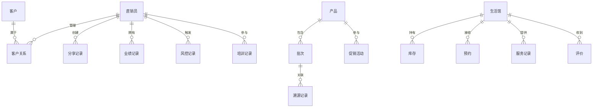

## 1. 架构设计

```mermaid
graph TB
    subgraph "前端层"
        "React SPA" --> "React Router"
        "React Router" --> "页面组件"
        "页面组件" --> "Zustand Store"
        "页面组件" --> "公共组件"
    end

    subgraph "后端层"
        "Express API" --> "路由中间件"
        "路由中间件" --> "业务Service"
        "业务Service" --> "数据访问层"
    end

    subgraph "数据层"
        "Mock数据" --> "JSON数据文件"
    end

    "前端层" -->|"HTTP/REST"| "后端层"
    "后端层" -->|"读写"| "数据层"
```

## 2. 技术说明

- **前端**: React@18 + TypeScript + TailwindCSS@3 + Vite
- **初始化工具**: vite-init
- **后端**: Express@4 + TypeScript（ESM格式）
- **数据库**: Mock数据（JSON文件），后续可迁移至PostgreSQL
- **状态管理**: Zustand
- **路由**: React Router DOM v6
- **图表**: Recharts（数据可视化）
- **图标**: lucide-react

## 3. 路由定义

| 路由 | 用途 |
|------|------|
| / | 首页仪表盘，数据概览与快捷入口 |
| /exhibition | 展业空间，个人数字展业主页 |
| /exhibition/qrcode | 专属二维码生成与管理 |
| /exection/customers | 客户关系图谱 |
| /exhibition/tracking | 分享传播效果追踪 |
| /products | 产品中心列表 |
| /products/trace | 批次溯源查询 |
| /products/inventory | 库存分布式同步 |
| /products/promotions | 促销活动规则引擎 |
| /stores | 生活馆列表 |
| /stores/appointments | 预约到店管理 |
| /stores/services | 服务记录管理 |
| /stores/reviews | 客户评价聚合 |
| /compliance | 合规风控总览 |
| /compliance/speech | 敏感话术AI识别 |
| /compliance/aml | 收入提现反洗钱校验 |
| /compliance/geofence | 跨区域地理围栏 |
| /training | 培训激励总览 |
| /training/courses | 课件中心 |
| /training/exams | 考试题库 |
| /training/rankings | 业绩排行榜 |
| /dashboard | 数据看板总览 |
| /dashboard/fission | 团队裂变图谱 |
| /dashboard/sales | 产品动销分析 |
| /dashboard/saturation | 区域饱和度预警 |

## 4. API定义

### 4.1 展业空间API

```typescript
interface ExhibitionAPI {
  getProfile: () => Promise<DealerProfile>;
  generateQRCode: (params: QRCodeParams) => Promise<QRCodeResult>;
  getCustomerGraph: () => Promise<CustomerNode[]>;
  getShareTracking: (period: string) => Promise<ShareTrackingData>;
}

interface DealerProfile {
  id: string;
  name: string;
  avatar: string;
  level: string;
  teamSize: number;
  monthlySales: number;
  certification: string[];
}

interface QRCodeParams {
  type: 'personal' | 'product' | 'activity';
  targetId: string;
  style?: 'default' | 'brand' | 'minimal';
}

interface CustomerNode {
  id: string;
  name: string;
  level: 'A' | 'B' | 'C' | 'D';
  value: number;
  connections: string[];
  tags: string[];
}
```

### 4.2 产品中心API

```typescript
interface ProductAPI {
  getProducts: (filters: ProductFilters) => Promise<Product[]>;
  getBatchTrace: (batchCode: string) => Promise<BatchTrace>;
  getInventory: (storeId?: string) => Promise<InventoryItem[]>;
  getPromotions: (status?: string) => Promise<Promotion[]>;
  createPromotion: (data: PromotionCreate) => Promise<Promotion>;
}

interface Product {
  id: string;
  name: string;
  category: string;
  price: number;
  batchCode: string;
  stock: number;
  status: 'active' | 'inactive';
}

interface BatchTrace {
  batchCode: string;
  product: string;
  stages: TraceStage[];
  qualityReport: string;
}

interface TraceStage {
  stage: string;
  location: string;
  timestamp: string;
  operator: string;
}
```

### 4.3 生活馆API

```typescript
interface StoreAPI {
  getStores: () => Promise<Store[]>;
  getAppointments: (storeId: string, date: string) => Promise<Appointment[]>;
  createAppointment: (data: AppointmentCreate) => Promise<Appointment>;
  getServiceRecords: (storeId: string) => Promise<ServiceRecord[]>;
  getReviews: (storeId: string) => Promise<Review[]>;
}

interface Store {
  id: string;
  name: string;
  address: string;
  lat: number;
  lng: number;
  rating: number;
  status: 'open' | 'closed';
}

interface Appointment {
  id: string;
  customerName: string;
  date: string;
  timeSlot: string;
  service: string;
  status: 'pending' | 'confirmed' | 'completed' | 'cancelled';
}
```

### 4.4 合规风控API

```typescript
interface ComplianceAPI {
  analyzeSpeech: (content: string) => Promise<SpeechAnalysis>;
  checkAML: (withdrawalId: string) => Promise<AMLResult>;
  getGeofenceAlerts: () => Promise<GeofenceAlert[]>;
}

interface SpeechAnalysis {
  riskLevel: 'safe' | 'warning' | 'danger';
  violations: ViolationItem[];
  suggestion: string;
}

interface AMLResult {
  passed: boolean;
  riskScore: number;
  checks: AMLCheckItem[];
}

interface GeofenceAlert {
  id: string;
  dealerName: string;
  location: string;
  timestamp: string;
  type: 'cross_region' | 'restricted_area';
}
```

### 4.5 培训激励API

```typescript
interface TrainingAPI {
  getCourses: () => Promise<Course[]>;
  getExams: () => Promise<Exam[]>;
  getRankings: (type: string, period: string) => Promise<RankingItem[]>;
}
```

### 4.6 数据看板API

```typescript
interface DashboardAPI {
  getFissionGraph: () => Promise<FissionNode[]>;
  getSalesAnalysis: (period: string) => Promise<SalesData>;
  getSaturationMap: () => Promise<SaturationRegion[]>;
}

interface FissionNode {
  id: string;
  name: string;
  level: number;
  children: string[];
  metrics: { members: number; sales: number; growth: number };
}

interface SaturationRegion {
  region: string;
  saturation: number;
  dealers: number;
  potential: number;
  alert: 'normal' | 'warning' | 'critical';
}
```

## 5. 服务端架构图

```mermaid
graph LR
    "Controller" --> "Service"
    "Service" --> "Repository"
    "Repository" --> "Mock Data"
```

## 6. 数据模型

### 6.1 数据模型定义



### 6.2 数据定义语言

```sql
CREATE TABLE dealers (
  id VARCHAR(36) PRIMARY KEY,
  name VARCHAR(50) NOT NULL,
  phone VARCHAR(20) UNIQUE NOT NULL,
  level VARCHAR(20) NOT NULL,
  team_id VARCHAR(36),
  parent_id VARCHAR(36),
  region VARCHAR(50),
  status VARCHAR(20) DEFAULT 'active',
  created_at TIMESTAMP DEFAULT CURRENT_TIMESTAMP
);

CREATE TABLE customers (
  id VARCHAR(36) PRIMARY KEY,
  name VARCHAR(50) NOT NULL,
  phone VARCHAR(20),
  level VARCHAR(5) DEFAULT 'D',
  source VARCHAR(50),
  dealer_id VARCHAR(36) REFERENCES dealers(id),
  created_at TIMESTAMP DEFAULT CURRENT_TIMESTAMP
);

CREATE TABLE products (
  id VARCHAR(36) PRIMARY KEY,
  name VARCHAR(100) NOT NULL,
  category VARCHAR(50),
  price DECIMAL(10,2),
  description TEXT,
  status VARCHAR(20) DEFAULT 'active',
  created_at TIMESTAMP DEFAULT CURRENT_TIMESTAMP
);

CREATE TABLE stores (
  id VARCHAR(36) PRIMARY KEY,
  name VARCHAR(100) NOT NULL,
  address VARCHAR(200),
  lat DECIMAL(10,6),
  lng DECIMAL(10,6),
  rating DECIMAL(3,2) DEFAULT 5.0,
  status VARCHAR(20) DEFAULT 'open',
  owner_id VARCHAR(36) REFERENCES dealers(id)
);
```
