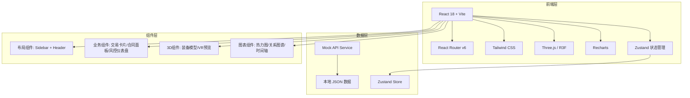
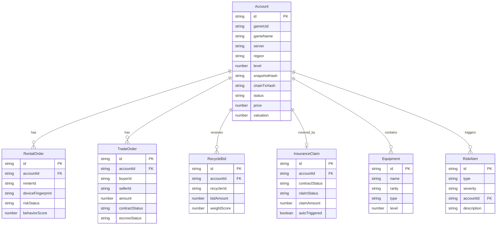

## 1. 架构设计



## 2. 技术说明

- **前端框架**: React@18 + TypeScript
- **构建工具**: Vite
- **样式方案**: Tailwind CSS@3 + CSS Modules（复杂动画）
- **3D渲染**: Three.js + @react-three/fiber + @react-three/drei + @react-three/postprocessing
- **图表可视化**: Recharts（估值报告、数据看板）+ D3.js（关系图谱、热力图）
- **状态管理**: Zustand
- **路由**: React Router v6
- **动画**: Framer Motion
- **后端**: 无后端，使用 Mock 数据服务模拟 API
- **数据**: 本地 JSON + Zustand Store 管理前端状态

## 3. 路由定义

| 路由 | 用途 |
|------|------|
| `/` | 首页大厅 - 平台概览与快捷入口 |
| `/rent` | 租号中心 - 账号租用浏览与下单 |
| `/rent/:id` | 租号详情 - 账号详情与租用流程 |
| `/trade` | 买卖市场 - 账号买卖列表 |
| `/trade/buy/:id` | 买号详情 - 账号详情与购买流程 |
| `/trade/sell` | 卖号发布 - 上架账号表单 |
| `/valuation` | 估值系统 - 智能估值入口 |
| `/valuation/:id` | 估值报告 - 详细估值结果 |
| `/recycle` | 回收竞价 - 回收申请与竞价面板 |
| `/insurance` | 保险理赔 - 保单管理与理赔 |
| `/preview/:id` | VR预览 - 3D装备可视化 |
| `/admin` | 运营后台 - 反作弊看板与合规审计 |

## 4. API 定义（Mock）

```typescript
interface Account {
  id: string
  gameUid: string
  gameName: string
  server: string
  region: string
  level: number
  equipmentSnapshot: Equipment[]
  snapshotHash: string
  chainTxHash: string
  owner: string
  status: "available" | "rented" | "selling" | "sold" | "recycled"
  price: number
  rentPriceHourly: number
  rentPriceDaily: number
  valuation: number
  riskScore: number
  insuranceActive: boolean
  createdAt: string
}

interface Equipment {
  id: string
  name: string
  rarity: "common" | "rare" | "epic" | "legendary"
  type: string
  level: number
  stats: Record<string, number>
  imageUrl: string
}

interface RentalOrder {
  id: string
  accountId: string
  renterId: string
  startTime: string
  endTime: string
  deposit: number
  rentFee: number
  deviceFingerprint: string
  riskStatus: "normal" | "warning" | "alert" | "circuit_break"
  behaviorScore: number
  locationAlerts: LocationAlert[]
}

interface TradeOrder {
  id: string
  accountId: string
  buyerId: string
  sellerId: string
  amount: number
  contractStatus: "pending" | "signed" | "escrow_frozen" | "releasing" | "completed" | "disputed"
  escrowStatus: "frozen" | "releasing" | "released" | "refunded"
  contractHash: string
  disputeStatus?: "pending" | "arbitrating" | "resolved"
}

interface RecycleBid {
  id: string
  recyclerId: string
  recyclerName: string
  accountId: string
  bidAmount: number
  weightScore: number
  heatScore: number
  valuationScore: number
  timelinessScore: number
  estimatedTime: string
  createdAt: string
}

interface InsuranceClaim {
  id: string
  accountId: string
  policyId: string
  contractId: string
  contractStatus: "active" | "breached" | "claimed"
  claimStatus: "pending" | "verifying" | "approved" | "paid"
  claimAmount: number
  autoTriggered: boolean
  triggeredAt?: string
}

interface RiskAlert {
  id: string
  type: "device_change" | "behavior_anomaly" | "remote_login" | "cluster_anomaly" | "brush_order"
  severity: "low" | "medium" | "high" | "critical"
  accountId: string
  description: string
  timestamp: string
}
```

## 5. 数据模型

### 5.1 数据模型定义


