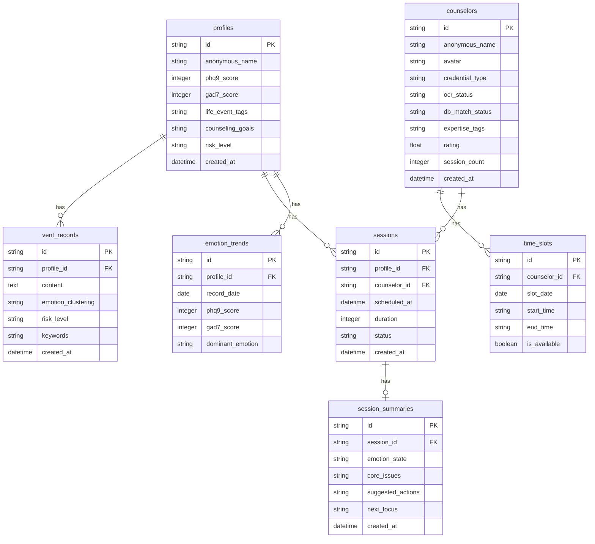

## 1. 架构设计

```mermaid
graph TB
    subgraph "前端层"
        "React 18 + TypeScript" --> "Tailwind CSS"
        "React 18 + TypeScript" --> "Zustand 状态管理"
        "React 18 + TypeScript" --> "React Router"
    end

    subgraph "后端层"
        "Express.js + TypeScript" --> "路由控制器"
        "路由控制器" --> "业务服务层"
        "业务服务层" --> "数据访问层"
    end

    subgraph "数据层"
        "SQLite" --> "用户档案"
        "SQLite" --> "咨询师数据"
        "SQLite" --> "会话记录"
        "SQLite" --> "匹配记录"
    end

    subgraph "外部服务(模拟)"
        "NLP情绪分析" --> "情绪聚类"
        "NLP情绪分析" --> "风险等级"
        "OCR证书识别" --> "资质核验"
        "WebRTC" --> "加密音视频"
    end

    "前端层" -->|"REST API"| "后端层"
    "业务服务层" --> "NLP情绪分析"
    "业务服务层" --> "OCR证书识别"
    "业务服务层" --> "WebRTC"
    "数据访问层" --> "SQLite"
```

## 2. 技术说明

- **前端**：React@18 + TypeScript + Tailwind CSS@3 + Vite
- **初始化工具**：vite-init
- **后端**：Express@4 + TypeScript (ESM)
- **数据库**：SQLite (better-sqlite3)，用于开发演示
- **状态管理**：Zustand
- **图标库**：lucide-react
- **图表**：recharts (情绪趋势图、雷达图)
- **动画**：framer-motion
- **NLP/OCR**：前端模拟实现，展示交互流程与可视化效果

## 3. 路由定义

| 路由 | 用途 |
|------|------|
| / | 首页 - 品牌展示、流程引导、信任背书 |
| /profile | 匿名建档 - PHQ-9/GAD-7量表、生活事件标签、咨询目标 |
| /vent | 倾诉初筛 - 文本输入、情绪聚类可视化、风险初筛 |
| /match | 咨询师匹配 - 智能匹配结果、筛选、咨询师详情 |
| /session/:id | 咨询会话 - 加密通话界面、聊天、摘要生成 |
| /dashboard | 个人中心 - 情绪趋势、咨询历史、隐私设置 |
| /counselor | 咨询师工作台 - 排班、来访列表、资质核验 |
| /admin | 管理后台 - 资质审核、危机预警 |

## 4. API定义

### 4.1 用户档案相关

```typescript
interface UserProfile {
  id: string
  anonymousName: string
  createdAt: string
  phq9Score: number
  gad7Score: number
  lifeEventTags: LifeEventTag[]
  counselingGoals: string
  riskLevel: RiskLevel
}

type LifeEventTag = "恋爱" | "职场" | "学业" | "家庭" | "社交" | "经济" | "健康" | "成长"
type RiskLevel = "low" | "medium" | "high" | "crisis"

// POST /api/profile
interface CreateProfileRequest {
  phq9Answers: number[]
  gad7Answers: number[]
  lifeEventTags: LifeEventTag[]
  counselingGoals: string
}
interface CreateProfileResponse {
  profile: UserProfile
  emotionAnalysis: EmotionAnalysis
  riskLevel: RiskLevel
}
```

### 4.2 倾诉初筛相关

```typescript
interface EmotionAnalysis {
  anxiety: number
  depression: number
  anger: number
  calm: number
  hope: number
  fear: number
}

interface VentAnalysisResponse {
  emotionClustering: EmotionAnalysis
  riskLevel: RiskLevel
  keywords: string[]
  suggestedActions: string[]
}

// POST /api/vent/analyze
interface VentAnalyzeRequest {
  text: string
  profileId: string
}
```

### 4.3 咨询师相关

```typescript
interface Counselor {
  id: string
  anonymousName: string
  avatar: string
  credentials: CounselorCredential[]
  expertiseTags: LifeEventTag[]
  rating: number
  sessionCount: number
  availableSlots: TimeSlot[]
  matchScore?: number
}

interface CounselorCredential {
  type: "二级" | "三级"
  ocrStatus: "pending" | "verified" | "rejected"
  dbMatchStatus: "pending" | "matched" | "mismatched"
}

interface TimeSlot {
  date: string
  startTime: string
  endTime: string
  isAvailable: boolean
}

// GET /api/counselors/match?profileId=xxx
interface MatchResponse {
  counselors: Counselor[]
  matchAlgorithm: {
    expertiseWeight: 0.6
    scheduleWeight: 0.25
    preferenceWeight: 0.15
  }
}
```

### 4.4 会话相关

```typescript
interface Session {
  id: string
  profileId: string
  counselorId: string
  scheduledAt: string
  duration: number
  status: "scheduled" | "in_progress" | "completed" | "cancelled"
  summary?: SessionSummary
}

interface SessionSummary {
  emotionState: string
  coreIssues: string[]
  suggestedActions: string[]
  nextFocus: string
  createdAt: string
}

// POST /api/sessions/:id/summary
// GET /api/sessions/history?profileId=xxx
```

### 4.5 情绪趋势相关

```typescript
interface EmotionTrend {
  date: string
  phq9Score: number
  gad7Score: number
  dominantEmotion: string
}

// GET /api/emotion/trend?profileId=xxx&range=30d
```

## 5. 服务端架构图

```mermaid
graph LR
    "路由控制器" --> "ProfileService"
    "路由控制器" --> "VentService"
    "路由控制器" --> "CounselorService"
    "路由控制器" --> "SessionService"
    "路由控制器" --> "MatchService"
    "路由控制器" --> "AdminService"
    "ProfileService" --> "ProfileRepository"
    "VentService" --> "VentRepository"
    "CounselorService" --> "CounselorRepository"
    "SessionService" --> "SessionRepository"
    "MatchService" --> "CounselorRepository"
    "MatchService" --> "ProfileRepository"
    "ProfileRepository" --> "SQLite"
    "VentRepository" --> "SQLite"
    "CounselorRepository" --> "SQLite"
    "SessionRepository" --> "SQLite"
```

## 6. 数据模型

### 6.1 数据模型定义



### 6.2 数据定义语言

```sql
CREATE TABLE profiles (
  id TEXT PRIMARY KEY,
  anonymous_name TEXT NOT NULL,
  phq9_score INTEGER DEFAULT 0,
  gad7_score INTEGER DEFAULT 0,
  life_event_tags TEXT DEFAULT '[]',
  counseling_goals TEXT DEFAULT '',
  risk_level TEXT DEFAULT 'low',
  created_at TEXT DEFAULT (datetime('now'))
);

CREATE TABLE vent_records (
  id TEXT PRIMARY KEY,
  profile_id TEXT NOT NULL REFERENCES profiles(id),
  content TEXT NOT NULL,
  emotion_clustering TEXT DEFAULT '{}',
  risk_level TEXT DEFAULT 'low',
  keywords TEXT DEFAULT '[]',
  created_at TEXT DEFAULT (datetime('now'))
);

CREATE TABLE counselors (
  id TEXT PRIMARY KEY,
  anonymous_name TEXT NOT NULL,
  avatar TEXT DEFAULT '',
  credential_type TEXT DEFAULT '三级',
  ocr_status TEXT DEFAULT 'pending',
  db_match_status TEXT DEFAULT 'pending',
  expertise_tags TEXT DEFAULT '[]',
  rating REAL DEFAULT 4.5,
  session_count INTEGER DEFAULT 0,
  created_at TEXT DEFAULT (datetime('now'))
);

CREATE TABLE time_slots (
  id TEXT PRIMARY KEY,
  counselor_id TEXT NOT NULL REFERENCES counselors(id),
  slot_date TEXT NOT NULL,
  start_time TEXT NOT NULL,
  end_time TEXT NOT NULL,
  is_available INTEGER DEFAULT 1
);

CREATE TABLE sessions (
  id TEXT PRIMARY KEY,
  profile_id TEXT NOT NULL REFERENCES profiles(id),
  counselor_id TEXT NOT NULL REFERENCES counselors(id),
  scheduled_at TEXT NOT NULL,
  duration INTEGER DEFAULT 50,
  status TEXT DEFAULT 'scheduled',
  created_at TEXT DEFAULT (datetime('now'))
);

CREATE TABLE session_summaries (
  id TEXT PRIMARY KEY,
  session_id TEXT NOT NULL REFERENCES sessions(id),
  emotion_state TEXT DEFAULT '',
  core_issues TEXT DEFAULT '[]',
  suggested_actions TEXT DEFAULT '[]',
  next_focus TEXT DEFAULT '',
  created_at TEXT DEFAULT (datetime('now'))
);

CREATE TABLE emotion_trends (
  id TEXT PRIMARY KEY,
  profile_id TEXT NOT NULL REFERENCES profiles(id),
  record_date TEXT NOT NULL,
  phq9_score INTEGER DEFAULT 0,
  gad7_score INTEGER DEFAULT 0,
  dominant_emotion TEXT DEFAULT 'calm'
);

CREATE INDEX idx_vent_records_profile ON vent_records(profile_id);
CREATE INDEX idx_sessions_profile ON sessions(profile_id);
CREATE INDEX idx_sessions_counselor ON sessions(counselor_id);
CREATE INDEX idx_time_slots_counselor ON time_slots(counselor_id);
CREATE INDEX idx_emotion_trends_profile ON emotion_trends(profile_id);
CREATE INDEX idx_emotion_trends_date ON emotion_trends(record_date);
```
