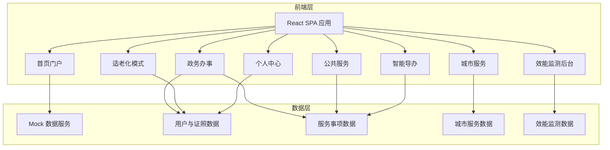
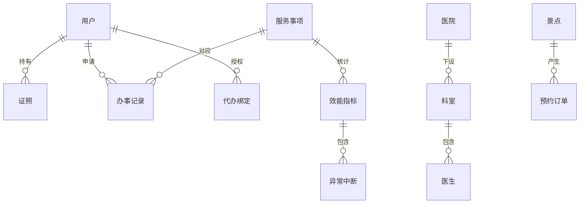

## 1. 架构设计



## 2. 技术说明

- **前端框架**：React@18 + TypeScript
- **样式方案**：TailwindCSS@3 + CSS Modules（复杂组件）
- **构建工具**：Vite
- **路由**：React Router@6
- **图表库**：Recharts（效能监测后台数据可视化）
- **图标库**：Lucide React
- **动画**：Framer Motion
- **状态管理**：React Context + useReducer
- **后端**：无后端，使用 Mock 数据模拟
- **数据库**：无数据库，前端内存数据

## 3. 路由定义

| 路由 | 用途 |
|------|------|
| `/` | 首页门户，展示三域入口、热门服务、公告 |
| `/government` | 政务办事页，社保/公积金/户籍服务列表 |
| `/government/:serviceId` | 具体政务办事详情与申报表单 |
| `/city-service` | 城市服务页，乘车/景点/挂号/缴费入口 |
| `/city-service/transport` | 扫码乘车，公交地铁乘车码 |
| `/city-service/scenic` | 景点预约列表与预约日历 |
| `/city-service/hospital` | 医院挂号选择 |
| `/city-service/education` | 教育缴费 |
| `/public-service` | 公共服务页，政策/公告/应急广播 |
| `/smart-guide` | 智能导办页，自然语言问答+流程图解 |
| `/elderly` | 适老化模式主页，大字体高频服务直达 |
| `/profile` | 个人中心，证照/记录/评价/代办管理 |
| `/admin/monitor` | 效能监测后台仪表盘 |

## 4. API 定义（Mock 数据结构）

### 4.1 用户与证照

```typescript
interface User {
  id: string
  name: string
  idCard: string
  phone: string
  avatar: string
  verified: boolean
  elderlyMode: boolean
  fontSize: number
  proxyBindings: ProxyBinding[]
}

interface ProxyBinding {
  proxyUserId: string
  proxyName: string
  relation: string
  authorizedScopes: string[]
  boundAt: string
}

interface Certificate {
  id: string
  type: '身份证' | '户口簿' | '结婚证' | '社保卡' | '驾驶证' | '房产证'
  holderName: string
  holderIdCard: string
  issueDate: string
  expiryDate: string
  status: '有效' | '过期' | '即将过期'
  details: Record<string, string>
}
```

### 4.2 服务事项

```typescript
interface ServiceItem {
  id: string
  category: '政务办事' | '城市服务' | '公共服务'
  subCategory: string
  name: string
  description: string
  icon: string
  requiredCerts: string[]
  avgProcessingDays: number
  onlineProcessing: boolean
  steps: ServiceStep[]
}

interface ServiceStep {
  order: number
  title: string
  description: string
  requiredMaterials: string[]
  estimatedDays: number
}

interface ApplicationRecord {
  id: string
  serviceId: string
  serviceName: string
  status: '待提交' | '审核中' | '补正中' | '已办结' | '已驳回'
  submittedAt: string
  estimatedCompletion: string
  completedAt?: string
  satisfaction?: number
  feedback?: string
}
```

### 4.3 城市服务

```typescript
interface TransportQRCode {
  type: '公交' | '地铁'
  qrData: string
  expiresAt: string
  balance: number
}

interface ScenicSpot {
  id: string
  name: string
  image: string
  address: string
  rating: number
  ticketPrice: number
  availableDates: string[]
}

interface Hospital {
  id: string
  name: string
  level: string
  departments: Department[]
}

interface Department {
  id: string
  name: string
  doctors: Doctor[]
}

interface Doctor {
  id: string
  name: string
  title: string
  schedule: { date: string; periods: string[] }[]
}
```

### 4.4 效能监测

```typescript
interface EfficiencyMetrics {
  serviceId: string
  serviceName: string
  totalApplications: number
  avgProcessingDays: number
  completionRate: number
  satisfactionAvg: number
  satisfactionDistribution: { score: number; count: number }[]
  abnormalInterruptions: AbnormalInterruption[]
  trendData: { date: string; applications: number; avgDays: number }[]
}

interface AbnormalInterruption {
  id: string
  applicationId: string
  type: '材料不全' | '系统超时' | '用户放弃' | '审核驳回'
  occurredAt: string
  description: string
  resolution?: string
}
```

## 5. 数据模型

### 5.1 数据模型定义



## 6. 项目目录结构

```
src/
├── components/          # 通用组件
│   ├── Layout/          # 布局组件（Header/Sidebar/Footer）
│   ├── Cards/           # 卡片组件
│   ├── Charts/          # 图表组件
│   └── Common/          # 通用UI组件
├── pages/               # 页面组件
│   ├── Home/            # 首页门户
│   ├── Government/      # 政务办事
│   ├── CityService/     # 城市服务
│   ├── PublicService/   # 公共服务
│   ├── SmartGuide/      # 智能导办
│   ├── Elderly/         # 适老化模式
│   ├── Profile/         # 个人中心
│   └── Admin/           # 效能监测后台
├── data/                # Mock数据
├── hooks/               # 自定义Hooks
├── context/             # Context状态管理
├── types/               # TypeScript类型定义
├── utils/               # 工具函数
├── styles/              # 全局样式
├── App.tsx
└── main.tsx
```
