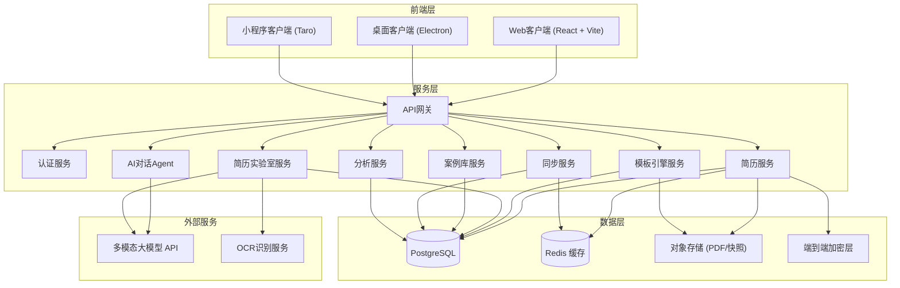
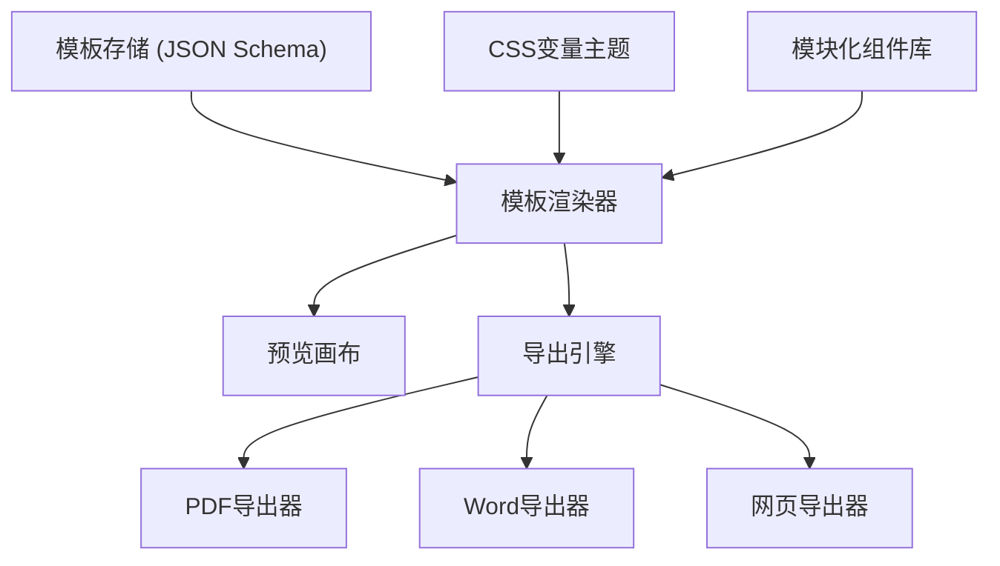
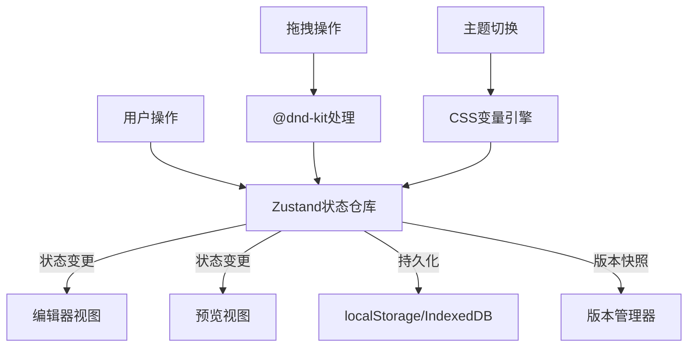
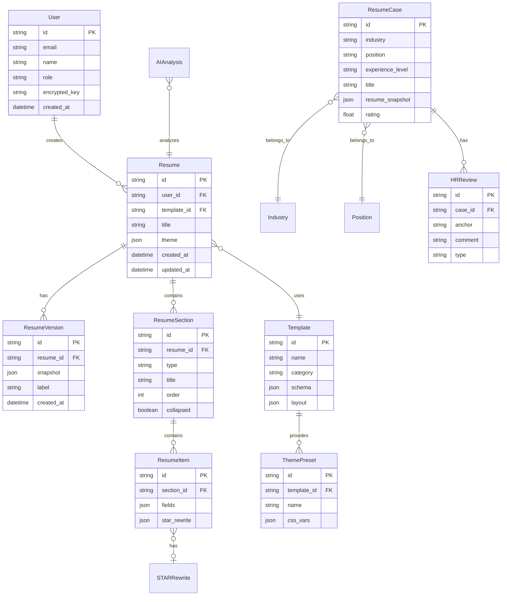

## 1. 架构设计



## 2. 技术说明

- **前端框架**：React@18 + TypeScript + Vite
- **样式方案**：Tailwind CSS@3 + CSS变量主题系统
- **状态管理**：Zustand（轻量级，适合简历编辑器复杂状态）
- **拖拽库**：@dnd-kit/core + @dnd-kit/sortable（模块化拖拽排序）
- **图表库**：Recharts（数据仪表盘趋势图与热力图）
- **PDF处理**：pdfjs-dist（PDF解析预览）+ html2canvas + jsPDF（PDF导出）
- **Word导出**：docx（生成.docx文件）
- **动效库**：framer-motion（页面过渡与交互动画）
- **富文本/编辑**：自研结构化简历编辑器（基于块级编辑模型）
- **初始化工具**：Vite (create-vite)
- **后端**：前端原型阶段采用Mock数据 + localStorage模拟，架构预留API对接层
- **数据库**：前端原型使用localStorage + IndexedDB持久化，架构预留PostgreSQL

## 3. 路由定义

| 路由 | 用途 | 权限 |
|------|------|------|
| `/` | 首页/落地页 | 公开 |
| `/create` | AI对话创作页 | 已登录用户 |
| `/editor/:id` | 简历编辑器页（id为简历ID） | 已登录用户 |
| `/lab` | 简历实验室页 | 已登录用户 |
| `/cases` | 案例库页 | 公开 |
| `/cases/:id` | 案例详情页 | 公开 |
| `/dashboard` | 数据仪表盘页 | 管理员 |
| `/profile` | 个人中心页 | 已登录用户 |

## 4. API定义

### 4.1 简历相关

```typescript
interface Resume {
  id: string;
  userId: string;
  title: string;
  templateId: string;
  theme: ResumeTheme;
  sections: ResumeSection[];
  versions: ResumeVersion[];
  createdAt: string;
  updatedAt: string;
}

interface ResumeSection {
  id: string;
  type: "education" | "experience" | "project" | "skill" | "summary" | "custom";
  title: string;
  order: number;
  collapsed: boolean;
  items: ResumeItem[];
}

interface ResumeItem {
  id: string;
  fields: Record<string, string | string[]>;
  starRewrite?: {
    original: string;
    situation: string;
    task: string;
    action: string;
    result: string;
  };
}

interface ResumeTheme {
  primaryColor: string;
  secondaryColor: string;
  accentColor: string;
  fontHeading: string;
  fontBody: string;
  fontSize: number;
  lineHeight: number;
  sectionSpacing: number;
}

interface ResumeVersion {
  id: string;
  snapshot: Resume;
  label: string;
  createdAt: string;
}
```

### 4.2 AI对话相关

```typescript
interface ChatMessage {
  id: string;
  role: "user" | "assistant";
  content: string;
  timestamp: string;
  structuredData?: Partial<Resume>;
}

interface AIAnalysisResult {
  verbStrength: {
    score: number;
    weakVerbs: string[];
    suggestions: string[];
  };
  quantification: {
    score: number;
    missingAreas: string[];
    suggestions: string[];
  };
  layout: {
    score: number;
    redundancyAreas: string[];
    suggestions: string[];
  };
  atsCompatibility: {
    score: number;
    issues: string[];
  };
  overallScore: number;
}
```

### 4.3 案例相关

```typescript
interface ResumeCase {
  id: string;
  industry: string;
  position: string;
  experienceLevel: "junior" | "mid" | "senior" | "executive";
  title: string;
  resumeSnapshot: Resume;
  hrReviews: HRReview[];
  rating: number;
  tags: string[];
}

interface HRReview {
  id: string;
  anchor: string;
  comment: string;
  type: "positive" | "suggestion" | "warning";
}
```

### 4.4 分析仪表盘相关

```typescript
interface AnalyticsData {
  qualityTrend: {
    date: string;
    avgEdits: number;
    atsPassRate: number;
  }[];
  templateHeatmap: {
    templateId: string;
    industry: string;
    usageCount: number;
  }[];
  userActivity: {
    date: string;
    dau: number;
    mau: number;
    retention: number;
  }[];
}
```

## 5. 核心模块架构

### 5.1 模板引擎架构



### 5.2 简历编辑器状态架构



## 6. 数据模型

### 6.1 数据模型定义



### 6.2 前端持久化方案（原型阶段）

```sql
-- IndexedDB Stores
-- resumes: 存储用户简历数据
-- versions: 存储版本快照
-- templates: 存储模板定义
-- cases: 存储案例数据（预置）
-- settings: 存储用户偏好与主题

-- localStorage Keys
-- auth_token: 模拟认证令牌
-- theme_preference: 用户主题偏好
-- sync_status: 跨端同步状态
-- encryption_key: 端到端加密公钥
```
