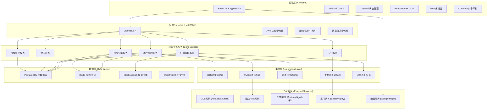
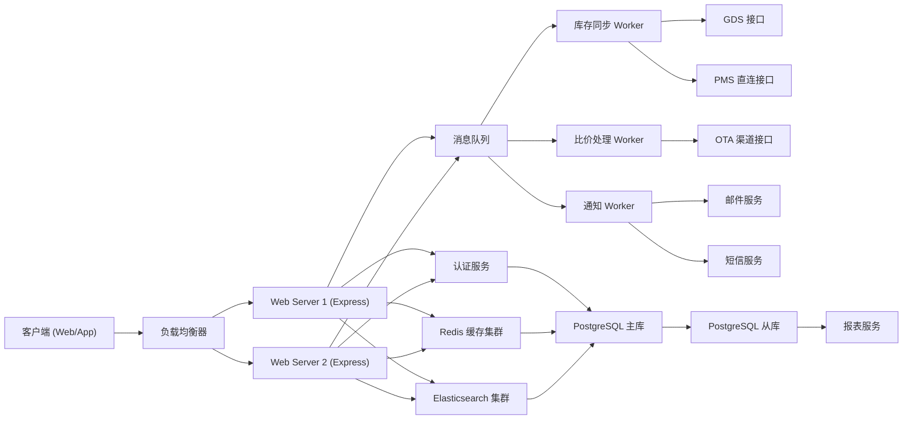
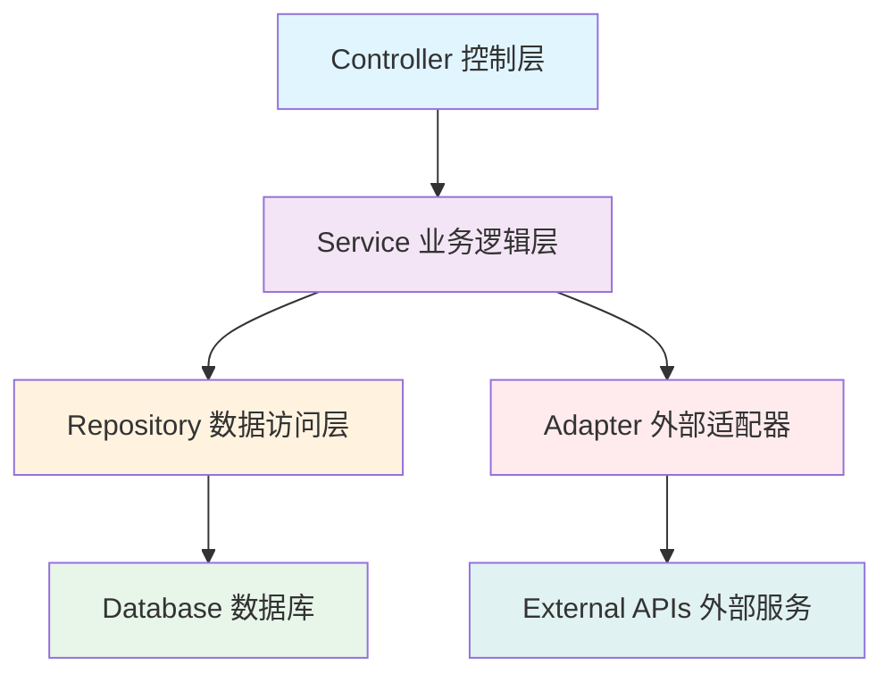
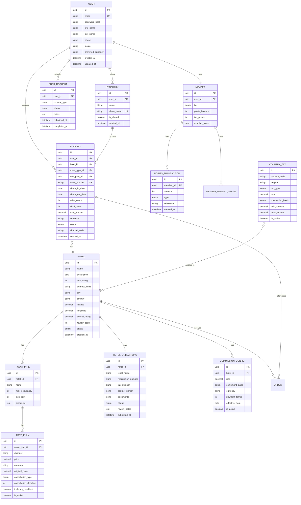

## 1. 架构设计



---

## 2. 技术描述

### 2.1 技术栈

| 层级 | 技术选型 | 版本 | 用途 |
|------|----------|------|------|
| 前端框架 | React | 18.x | 用户界面构建 |
| 前端语言 | TypeScript | 5.x | 类型安全 |
| 构建工具 | Vite | 5.x | 开发构建 |
| CSS框架 | Tailwind CSS | 3.x | 样式系统 |
| 状态管理 | Zustand | 4.x | 全局状态 |
| 路由 | React Router DOM | 6.x | 前端路由 |
| 图标 | lucide-react | 0.x | 图标库 |
| 后端框架 | Express.js | 4.x | API服务 |
| 数据库 | PostgreSQL | 15.x | 关系型数据存储 |
| 缓存 | Redis | 7.x | 缓存/会话/分布式锁 |
| 搜索引擎 | Elasticsearch | 8.x | 酒店全文搜索 |
| ORM | Prisma | 5.x | 数据库访问 |
| 认证 | JWT + bcrypt | - | 用户认证 |
| 多语言 | i18next | 23.x | 国际化 |
| 日期处理 | date-fns | 3.x | 多时区日期处理 |
| 货币处理 | currency.js | 2.x | 多币种计算 |
| 图表 | Recharts | 2.x | 数据可视化 |

### 2.2 项目初始化

- 模板：react-express-ts（React + TypeScript + Express 全栈）
- 包管理：pnpm（优先）
- 代码规范：ESLint + Prettier
- 提交规范：Husky + lint-staged

---

## 3. 路由定义

### 3.1 前台用户端路由

| 路由路径 | 页面名称 | 权限要求 |
|----------|----------|----------|
| `/` | 首页 | 公开 |
| `/search` | 搜索结果页 | 公开 |
| `/hotel/:id` | 酒店详情页 | 公开 |
| `/hotel/:id/book` | 预订确认页 | 已登录 |
| `/book/success/:orderId` | 预订成功页 | 已登录 |
| `/my-trips` | 我的行程列表 | 已登录 |
| `/my-trips/:tripId` | 行程详情页 | 已登录 |
| `/my-trips/share/:token` | 行程分享页 | 公开 |
| `/member` | 会员中心首页 | 已登录 |
| `/member/points` | 积分管理页 | 已登录 |
| `/member/benefits` | 权益详情页 | 已登录 |
| `/auth/login` | 登录页 | 公开 |
| `/auth/register` | 注册页 | 公开 |
| `/auth/forgot-password` | 忘记密码页 | 公开 |
| `/profile` | 个人资料页 | 已登录 |
| `/gdpr/request` | GDPR数据请求页 | 已登录 |

### 3.2 酒店后台路由

| 路由路径 | 页面名称 | 权限要求 |
|----------|----------|----------|
| `/hotel-admin` | 酒店后台首页 | 酒店管理员 |
| `/hotel-admin/onboarding` | 入驻申请页 | 待审核酒店 |
| `/hotel-admin/inventory` | 库存管理页 | 酒店管理员 |
| `/hotel-admin/rates` | 房价管理页 | 酒店管理员 |
| `/hotel-admin/orders` | 订单管理页 | 酒店管理员 |
| `/hotel-admin/reports` | 数据报表页 | 酒店管理员 |

### 3.3 平台运营后台路由

| 路由路径 | 页面名称 | 权限要求 |
|----------|----------|----------|
| `/admin` | 运营后台首页 | 平台运营 |
| `/admin/hotels` | 酒店列表/审核页 | 平台运营 |
| `/admin/hotels/:id/review` | 酒店审核详情页 | 平台运营 |
| `/admin/commission` | 佣金配置页 | 平台运营/财务 |
| `/admin/finance` | 财务结算页 | 财务人员 |
| `/admin/tax` | 税务规则配置页 | 平台运营 |
| `/admin/gdpr` | GDPR请求处理页 | 平台运营 |
| `/admin/users` | 用户管理页 | 平台运营 |

---

## 4. API 定义

### 4.1 类型定义

```typescript
// 共享类型定义
export interface Hotel {
  id: string;
  name: string;
  description: string;
  starRating: number;
  address: {
    line1: string;
    line2?: string;
    city: string;
    country: string;
    postalCode: string;
    lat: number;
    lng: number;
  };
  images: string[];
  facilities: string[];
  overallRating: number;
  reviewCount: number;
  policies: {
    cancellation: CancellationPolicy;
    checkInTime: string;
    checkOutTime: string;
  };
}

export interface RoomType {
  id: string;
  hotelId: string;
  name: string;
  description: string;
  maxOccupancy: number;
  bedType: string;
  sizeSqm: number;
  images: string[];
  amenities: string[];
}

export interface RatePlan {
  id: string;
  roomTypeId: string;
  channel: string;
  price: {
    amount: number;
    currency: string;
  };
  originalPrice?: {
    amount: number;
    currency: string;
  };
  cancellationPolicy: CancellationPolicy;
  includesBreakfast: boolean;
  isRefundable: boolean;
}

export interface CancellationPolicy {
  type: 'free_cancellation' | 'partial_refund' | 'non_refundable';
  deadlineDays: number;
  penaltyPercentage?: number;
}

export interface SearchResult {
  hotel: Hotel;
  bestRate: RatePlan;
  rateComparison: {
    channel: string;
    price: { amount: number; currency: string };
    savings?: number;
  }[];
  compositeScore: number;
  distanceFromSearch?: number;
}

export interface BookingOrder {
  id: string;
  orderNumber: string;
  hotelId: string;
  roomTypeId: string;
  ratePlanId: string;
  checkInDate: string;
  checkOutDate: string;
  guestCount: {
    adults: number;
    children: number;
    infants: number;
  };
  guestInfo: {
    firstName: string;
    lastName: string;
    email: string;
    phone: string;
    specialRequests?: string;
  }[];
  pricing: {
    roomTotal: { amount: number; currency: string };
    taxes: { amount: number; currency: string; breakdown: TaxItem[] };
    fees: { amount: number; currency: string; breakdown: FeeItem[] };
    discounts: { amount: number; currency: string; breakdown: DiscountItem[] };
    grandTotal: { amount: number; currency: string };
  };
  status: 'pending' | 'confirmed' | 'cancelled' | 'checked_in' | 'checked_out' | 'no_show';
  channelCode?: string;
  createdAt: string;
}

export interface TaxItem {
  name: string;
  rate: number;
  amount: { amount: number; currency: string };
  type: 'VAT' | 'city_tax' | 'tourism_tax' | 'other';
}

export interface FeeItem {
  name: string;
  amount: { amount: number; currency: string };
  description?: string;
}

export interface DiscountItem {
  name: string;
  code?: string;
  amount: { amount: number; currency: string };
  percentage?: number;
}

export interface Member {
  id: string;
  userId: string;
  tier: 'Bronze' | 'Silver' | 'Gold';
  points: number;
  tierPoints: number;
  tierPointsToNextLevel: number;
  memberSince: string;
  benefits: MemberBenefit[];
}

export interface MemberBenefit {
  code: string;
  name: string;
  description: string;
  isActive: boolean;
}

export interface Itinerary {
  id: string;
  userId: string;
  name: string;
  bookings: string[];
  shareToken?: string;
  isShared: boolean;
  createdAt: string;
  updatedAt: string;
}

export interface GDPRRequest {
  id: string;
  userId: string;
  type: 'access' | 'rectification' | 'erasure' | 'export' | 'restriction' | 'objection';
  status: 'pending' | 'in_progress' | 'completed' | 'rejected';
  submittedAt: string;
  completedAt?: string;
  notes?: string;
}

export interface HotelOnboardingApplication {
  id: string;
  legalName: string;
  brandName: string;
  registrationNumber: string;
  taxNumber: string;
  contactPerson: {
    name: string;
    email: string;
    phone: string;
    position: string;
  };
  propertyDetails: {
    address: object;
    starRating: number;
    roomCount: number;
    facilities: string[];
  };
  documents: {
    businessLicense: string;
    propertyLicense: string;
    insuranceCertificate: string;
  };
  status: 'draft' | 'submitted' | 'under_review' | 'additional_info_required' | 'approved' | 'rejected';
  reviewNotes?: string;
  createdAt: string;
}

export interface CommissionConfig {
  id: string;
  hotelId: string;
  commissionRate: number;
  settlementCycle: 'weekly' | 'biweekly' | 'monthly';
  currency: string;
  paymentTerms: number;
  effectiveFrom: string;
  effectiveTo?: string;
  isActive: boolean;
}

export interface TaxRule {
  id: string;
  country: string;
  region?: string;
  type: 'VAT' | 'city_tax' | 'tourism_tax';
  rate: number;
  calculationBasis: 'room_rate' | 'per_night' | 'per_guest';
  appliesTo: 'all' | 'residents' | 'non_residents';
  minAmount?: number;
  maxAmount?: number;
  effectiveFrom: string;
  isActive: boolean;
}
```

### 4.2 API 接口清单

| 方法 | 路径 | 模块 | 描述 |
|------|------|------|------|
| POST | `/api/v1/auth/login` | 认证 | 用户登录 |
| POST | `/api/v1/auth/register` | 认证 | 用户注册 |
| POST | `/api/v1/auth/logout` | 认证 | 用户登出 |
| GET | `/api/v1/auth/me` | 认证 | 获取当前用户信息 |
| | | |
| GET | `/api/v1/hotels/search` | 搜索 | 搜索酒店（含比价） |
| GET | `/api/v1/hotels/:id` | 搜索 | 获取酒店详情 |
| GET | `/api/v1/hotels/:id/rates` | 搜索 | 获取酒店房型价格 |
| GET | `/api/v1/hotels/:id/compare` | 比价 | 获取多渠道价格对比 |
| | | |
| POST | `/api/v1/booking/calculate` | 订单 | 计算预订价格 |
| POST | `/api/v1/booking/create` | 订单 | 创建预订订单 |
| GET | `/api/v1/booking/:id` | 订单 | 获取订单详情 |
| POST | `/api/v1/booking/:id/cancel` | 订单 | 取消订单 |
| GET | `/api/v1/booking/orders` | 订单 | 获取我的订单列表 |
| | | |
| GET | `/api/v1/itinerary` | 行程 | 获取我的行程列表 |
| GET | `/api/v1/itinerary/:id` | 行程 | 获取行程详情 |
| POST | `/api/v1/itinerary` | 行程 | 创建新行程 |
| POST | `/api/v1/itinerary/:id/share` | 行程 | 生成行程分享链接 |
| GET | `/api/v1/itinerary/shared/:token` | 行程 | 获取分享的行程 |
| | | |
| GET | `/api/v1/member/profile` | 会员 | 获取会员信息 |
| GET | `/api/v1/member/points` | 会员 | 获取积分明细 |
| GET | `/api/v1/member/benefits` | 会员 | 获取会员权益 |
| POST | `/api/v1/member/points/redeem` | 会员 | 积分兑换 |
| | | |
| POST | `/api/v1/gdpr/request` | GDPR | 提交数据权利请求 |
| GET | `/api/v1/gdpr/request/:id` | GDPR | 获取请求状态 |
| | | |
| POST | `/api/v1/hotel-admin/onboarding` | 酒店后台 | 提交入驻申请 |
| GET | `/api/v1/hotel-admin/onboarding/:id` | 酒店后台 | 获取申请状态 |
| GET | `/api/v1/hotel-admin/inventory` | 酒店后台 | 获取库存状态 |
| PUT | `/api/v1/hotel-admin/inventory` | 酒店后台 | 更新库存 |
| GET | `/api/v1/hotel-admin/orders` | 酒店后台 | 获取订单列表 |
| | | |
| GET | `/api/v1/admin/hotels/pending` | 运营后台 | 获取待审核酒店 |
| POST | `/api/v1/admin/hotels/:id/approve` | 运营后台 | 审核通过酒店 |
| POST | `/api/v1/admin/hotels/:id/reject` | 运营后台 | 拒绝酒店申请 |
| GET | `/api/v1/admin/commission/configs` | 运营后台 | 获取佣金配置 |
| POST | `/api/v1/admin/commission/configs` | 运营后台 | 创建佣金配置 |
| GET | `/api/v1/admin/tax/rules` | 运营后台 | 获取税务规则 |
| POST | `/api/v1/admin/tax/rules` | 运营后台 | 创建税务规则 |
| GET | `/api/v1/admin/gdpr/requests` | 运营后台 | 获取GDPR请求列表 |
| POST | `/api/v1/admin/gdpr/requests/:id/process` | 运营后台 | 处理GDPR请求 |

---

## 5. 服务器架构图



### 5.1 分层架构说明



- **Controller 层**：处理HTTP请求，参数校验，响应格式化
- **Service 层**：核心业务逻辑，事务控制，领域规则
- **Repository 层**：数据访问，查询构建，缓存操作
- **Adapter 层**：外部服务适配，协议转换，错误重试
- **Middleware 层**：认证、限流、日志、CORS等横切关注点

---

## 6. 数据模型

### 6.1 ER 图



### 6.2 DDL 语句

```sql
-- 扩展启用
CREATE EXTENSION IF NOT EXISTS "uuid-ossp";
CREATE EXTENSION IF NOT EXISTS "pg_trgm";

-- 枚举类型定义
CREATE TYPE user_status AS ENUM ('active', 'inactive', 'suspended');
CREATE TYPE booking_status AS ENUM ('pending', 'confirmed', 'cancelled', 'checked_in', 'checked_out', 'no_show');
CREATE TYPE member_tier AS ENUM ('Bronze', 'Silver', 'Gold');
CREATE TYPE points_transaction_type AS ENUM ('earn', 'redeem', 'expire', 'adjust');
CREATE TYPE cancellation_type AS ENUM ('free_cancellation', 'partial_refund', 'non_refundable');
CREATE TYPE onboarding_status AS ENUM ('draft', 'submitted', 'under_review', 'additional_info_required', 'approved', 'rejected');
CREATE TYPE settlement_cycle AS ENUM ('weekly', 'biweekly', 'monthly');
CREATE TYPE tax_type AS ENUM ('VAT', 'city_tax', 'tourism_tax');
CREATE TYPE tax_calculation_basis AS ENUM ('room_rate', 'per_night', 'per_guest');
CREATE TYPE gdpr_request_type AS ENUM ('access', 'rectification', 'erasure', 'export', 'restriction', 'objection');
CREATE TYPE gdpr_request_status AS ENUM ('pending', 'in_progress', 'completed', 'rejected');

-- 用户表
CREATE TABLE users (
    id UUID PRIMARY KEY DEFAULT uuid_generate_v4(),
    email VARCHAR(255) UNIQUE NOT NULL,
    password_hash VARCHAR(255) NOT NULL,
    first_name VARCHAR(100) NOT NULL,
    last_name VARCHAR(100) NOT NULL,
    phone VARCHAR(50),
    locale VARCHAR(10) DEFAULT 'en-US',
    preferred_currency VARCHAR(3) DEFAULT 'USD',
    status user_status DEFAULT 'active',
    last_login_at TIMESTAMP,
    created_at TIMESTAMP DEFAULT CURRENT_TIMESTAMP,
    updated_at TIMESTAMP DEFAULT CURRENT_TIMESTAMP
);

CREATE INDEX idx_users_email ON users(email);
CREATE INDEX idx_users_status ON users(status);

-- 酒店表
CREATE TABLE hotels (
    id UUID PRIMARY KEY DEFAULT uuid_generate_v4(),
    name VARCHAR(255) NOT NULL,
    description TEXT,
    star_rating INT CHECK (star_rating BETWEEN 1 AND 5),
    address_line1 VARCHAR(255),
    address_line2 VARCHAR(255),
    city VARCHAR(100),
    state VARCHAR(100),
    country VARCHAR(100) NOT NULL,
    postal_code VARCHAR(20),
    latitude DECIMAL(10, 8),
    longitude DECIMAL(11, 8),
    overall_rating DECIMAL(3, 2),
    review_count INT DEFAULT 0,
    facilities TEXT[],
    images TEXT[],
    check_in_time TIME,
    check_out_time TIME,
    status VARCHAR(20) DEFAULT 'inactive',
    created_at TIMESTAMP DEFAULT CURRENT_TIMESTAMP,
    updated_at TIMESTAMP DEFAULT CURRENT_TIMESTAMP
);

CREATE INDEX idx_hotels_city ON hotels(city);
CREATE INDEX idx_hotels_country ON hotels(country);
CREATE INDEX idx_hotels_status ON hotels(status);
CREATE INDEX idx_hotels_location ON hotels USING gist (
    point(latitude, longitude)
);

-- 房型表
CREATE TABLE room_types (
    id UUID PRIMARY KEY DEFAULT uuid_generate_v4(),
    hotel_id UUID REFERENCES hotels(id) ON DELETE CASCADE,
    name VARCHAR(100) NOT NULL,
    description TEXT,
    max_occupancy INT NOT NULL,
    bed_type VARCHAR(50),
    size_sqm INT,
    amenities TEXT[],
    images TEXT[],
    is_active BOOLEAN DEFAULT true,
    created_at TIMESTAMP DEFAULT CURRENT_TIMESTAMP
);

CREATE INDEX idx_room_types_hotel_id ON room_types(hotel_id);

-- 价格计划表
CREATE TABLE rate_plans (
    id UUID PRIMARY KEY DEFAULT uuid_generate_v4(),
    room_type_id UUID REFERENCES room_types(id) ON DELETE CASCADE,
    channel VARCHAR(50) NOT NULL,
    price DECIMAL(10, 2) NOT NULL,
    currency VARCHAR(3) NOT NULL,
    original_price DECIMAL(10, 2),
    cancellation_type cancellation_type DEFAULT 'free_cancellation',
    cancellation_deadline_days INT DEFAULT 7,
    cancellation_penalty_percentage DECIMAL(5, 2),
    includes_breakfast BOOLEAN DEFAULT false,
    is_refundable BOOLEAN DEFAULT true,
    valid_from DATE NOT NULL,
    valid_to DATE,
    is_active BOOLEAN DEFAULT true,
    created_at TIMESTAMP DEFAULT CURRENT_TIMESTAMP,
    updated_at TIMESTAMP DEFAULT CURRENT_TIMESTAMP
);

CREATE INDEX idx_rate_plans_room_type_id ON rate_plans(room_type_id);
CREATE INDEX idx_rate_plans_channel ON rate_plans(channel);
CREATE INDEX idx_rate_plans_valid ON rate_plans(valid_from, valid_to);

-- 库存表
CREATE TABLE inventory (
    id UUID PRIMARY KEY DEFAULT uuid_generate_v4(),
    room_type_id UUID REFERENCES room_types(id) ON DELETE CASCADE,
    date DATE NOT NULL,
    total_rooms INT NOT NULL DEFAULT 0,
    available_rooms INT NOT NULL DEFAULT 0,
    updated_at TIMESTAMP DEFAULT CURRENT_TIMESTAMP,
    UNIQUE(room_type_id, date)
);

CREATE INDEX idx_inventory_room_type_date ON inventory(room_type_id, date);

-- 订单表
CREATE TABLE bookings (
    id UUID PRIMARY KEY DEFAULT uuid_generate_v4(),
    user_id UUID REFERENCES users(id),
    hotel_id UUID REFERENCES hotels(id),
    room_type_id UUID REFERENCES room_types(id),
    rate_plan_id UUID REFERENCES rate_plans(id),
    order_number VARCHAR(50) UNIQUE NOT NULL,
    check_in_date DATE NOT NULL,
    check_out_date DATE NOT NULL,
    adult_count INT NOT NULL DEFAULT 1,
    child_count INT NOT NULL DEFAULT 0,
    infant_count INT NOT NULL DEFAULT 0,
    guest_info JSONB,
    special_requests TEXT,
    room_total DECIMAL(10, 2) NOT NULL,
    taxes_total DECIMAL(10, 2) NOT NULL,
    fees_total DECIMAL(10, 2) NOT NULL,
    discounts_total DECIMAL(10, 2) NOT NULL,
    grand_total DECIMAL(10, 2) NOT NULL,
    currency VARCHAR(3) NOT NULL,
    tax_breakdown JSONB,
    status booking_status DEFAULT 'pending',
    channel_code VARCHAR(50),
    payment_status VARCHAR(20) DEFAULT 'unpaid',
    payment_intent_id VARCHAR(255),
    confirmation_number VARCHAR(50),
    created_at TIMESTAMP DEFAULT CURRENT_TIMESTAMP,
    updated_at TIMESTAMP DEFAULT CURRENT_TIMESTAMP
);

CREATE INDEX idx_bookings_user_id ON bookings(user_id);
CREATE INDEX idx_bookings_hotel_id ON bookings(hotel_id);
CREATE INDEX idx_bookings_status ON bookings(status);
CREATE INDEX idx_bookings_checkin ON bookings(check_in_date);
CREATE INDEX idx_bookings_order_number ON bookings(order_number);

-- 会员表
CREATE TABLE members (
    id UUID PRIMARY KEY DEFAULT uuid_generate_v4(),
    user_id UUID UNIQUE REFERENCES users(id) ON DELETE CASCADE,
    tier member_tier DEFAULT 'Bronze',
    points_balance INT DEFAULT 0,
    tier_points INT DEFAULT 0,
    tier_points_to_next_level INT DEFAULT 10000,
    member_since DATE NOT NULL,
    vip_access_enabled BOOLEAN DEFAULT false,
    late_checkout_hours INT DEFAULT 0,
    created_at TIMESTAMP DEFAULT CURRENT_TIMESTAMP,
    updated_at TIMESTAMP DEFAULT CURRENT_TIMESTAMP
);

CREATE INDEX idx_members_tier ON members(tier);

-- 积分交易表
CREATE TABLE points_transactions (
    id UUID PRIMARY KEY DEFAULT uuid_generate_v4(),
    member_id UUID REFERENCES members(id) ON DELETE CASCADE,
    amount INT NOT NULL,
    type points_transaction_type NOT NULL,
    reference_type VARCHAR(50),
    reference_id UUID,
    description TEXT,
    expires_at DATE,
    created_at TIMESTAMP DEFAULT CURRENT_TIMESTAMP
);

CREATE INDEX idx_points_transactions_member_id ON points_transactions(member_id);
CREATE INDEX idx_points_transactions_type ON points_transactions(type);

-- 行程表
CREATE TABLE itineraries (
    id UUID PRIMARY KEY DEFAULT uuid_generate_v4(),
    user_id UUID REFERENCES users(id) ON DELETE CASCADE,
    name VARCHAR(255) NOT NULL,
    description TEXT,
    share_token VARCHAR(64) UNIQUE,
    is_shared BOOLEAN DEFAULT false,
    created_at TIMESTAMP DEFAULT CURRENT_TIMESTAMP,
    updated_at TIMESTAMP DEFAULT CURRENT_TIMESTAMP
);

CREATE INDEX idx_itineraries_user_id ON itineraries(user_id);
CREATE INDEX idx_itineraries_share_token ON itineraries(share_token);

-- 行程-预订关联表
CREATE TABLE itinerary_bookings (
    itinerary_id UUID REFERENCES itineraries(id) ON DELETE CASCADE,
    booking_id UUID REFERENCES bookings(id) ON DELETE CASCADE,
    created_at TIMESTAMP DEFAULT CURRENT_TIMESTAMP,
    PRIMARY KEY (itinerary_id, booking_id)
);

-- 酒店入驻申请表
CREATE TABLE hotel_onboarding_applications (
    id UUID PRIMARY KEY DEFAULT uuid_generate_v4(),
    hotel_id UUID REFERENCES hotels(id),
    legal_name VARCHAR(255) NOT NULL,
    brand_name VARCHAR(255),
    registration_number VARCHAR(100),
    tax_number VARCHAR(100),
    contact_person JSONB NOT NULL,
    property_details JSONB,
    documents JSONB,
    status onboarding_status DEFAULT 'draft',
    review_notes TEXT,
    reviewed_by UUID REFERENCES users(id),
    reviewed_at TIMESTAMP,
    submitted_at TIMESTAMP,
    created_at TIMESTAMP DEFAULT CURRENT_TIMESTAMP,
    updated_at TIMESTAMP DEFAULT CURRENT_TIMESTAMP
);

CREATE INDEX idx_onboarding_status ON hotel_onboarding_applications(status);

-- 佣金配置表
CREATE TABLE commission_configs (
    id UUID PRIMARY KEY DEFAULT uuid_generate_v4(),
    hotel_id UUID REFERENCES hotels(id) ON DELETE CASCADE,
    commission_rate DECIMAL(5, 2) NOT NULL,
    settlement_cycle settlement_cycle NOT NULL,
    currency VARCHAR(3) NOT NULL,
    payment_terms INT NOT NULL DEFAULT 30,
    effective_from DATE NOT NULL,
    effective_to DATE,
    is_active BOOLEAN DEFAULT true,
    created_at TIMESTAMP DEFAULT CURRENT_TIMESTAMP,
    created_by UUID REFERENCES users(id)
);

CREATE INDEX idx_commission_hotel_id ON commission_configs(hotel_id);

-- 税务规则表
CREATE TABLE tax_rules (
    id UUID PRIMARY KEY DEFAULT uuid_generate_v4(),
    country_code VARCHAR(2) NOT NULL,
    region VARCHAR(100),
    type tax_type NOT NULL,
    rate DECIMAL(5, 2) NOT NULL,
    calculation_basis tax_calculation_basis NOT NULL,
    applies_to VARCHAR(20) DEFAULT 'all',
    min_amount DECIMAL(10, 2),
    max_amount DECIMAL(10, 2),
    description TEXT,
    effective_from DATE NOT NULL,
    is_active BOOLEAN DEFAULT true,
    created_at TIMESTAMP DEFAULT CURRENT_TIMESTAMP
);

CREATE INDEX idx_tax_rules_country ON tax_rules(country_code);
CREATE INDEX idx_tax_rules_type ON tax_rules(type);

-- GDPR请求表
CREATE TABLE gdpr_requests (
    id UUID PRIMARY KEY DEFAULT uuid_generate_v4(),
    user_id UUID REFERENCES users(id),
    type gdpr_request_type NOT NULL,
    status gdpr_request_status DEFAULT 'pending',
    description TEXT,
    response_details TEXT,
    processed_by UUID REFERENCES users(id),
    submitted_at TIMESTAMP DEFAULT CURRENT_TIMESTAMP,
    completed_at TIMESTAMP
);

CREATE INDEX idx_gdpr_requests_user_id ON gdpr_requests(user_id);
CREATE INDEX idx_gdpr_requests_status ON gdpr_requests(status);

-- 渠道价格比价缓存表
CREATE TABLE channel_price_cache (
    id UUID PRIMARY KEY DEFAULT uuid_generate_v4(),
    hotel_id UUID REFERENCES hotels(id),
    room_type_id UUID REFERENCES room_types(id),
    check_in_date DATE NOT NULL,
    check_out_date DATE NOT NULL,
    channel_prices JSONB,
    expires_at TIMESTAMP NOT NULL,
    created_at TIMESTAMP DEFAULT CURRENT_TIMESTAMP
);

CREATE INDEX idx_channel_price_cache_search ON channel_price_cache(
    hotel_id, room_type_id, check_in_date, check_out_date
);

-- 自动更新时间戳触发器
CREATE OR REPLACE FUNCTION update_updated_at_column()
RETURNS TRIGGER AS $$
BEGIN
    NEW.updated_at = CURRENT_TIMESTAMP;
    RETURN NEW;
END;
$$ LANGUAGE plpgsql;

CREATE TRIGGER update_users_updated_at BEFORE UPDATE ON users
    FOR EACH ROW EXECUTE FUNCTION update_updated_at_column();
CREATE TRIGGER update_hotels_updated_at BEFORE UPDATE ON hotels
    FOR EACH ROW EXECUTE FUNCTION update_updated_at_column();
CREATE TRIGGER update_bookings_updated_at BEFORE UPDATE ON bookings
    FOR EACH ROW EXECUTE FUNCTION update_updated_at_column();
CREATE TRIGGER update_members_updated_at BEFORE UPDATE ON members
    FOR EACH ROW EXECUTE FUNCTION update_updated_at_column();
```
