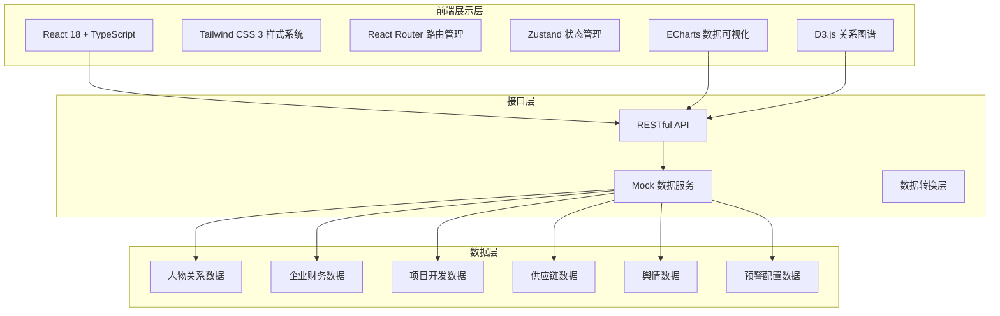

# 房地产全产业链专业数据库与舆情分析平台 - 技术架构文档

## 1. 架构设计



## 2. 技术选型说明

### 2.1 前端技术栈

| 技术 | 版本 | 用途说明 |
|------|------|----------|
| React | 18.x | 核心 UI 框架，函数式组件 + Hooks |
| TypeScript | 5.x | 类型安全，提升代码可维护性 |
| Vite | 5.x | 构建工具，快速开发体验 |
| Tailwind CSS | 3.x | 原子化 CSS，快速构建专业界面 |
| React Router | 6.x | 单页应用路由管理 |
| Zustand | 4.x | 轻量级状态管理，管理全局数据 |
| ECharts | 5.x | 专业数据可视化，图表丰富 |
| D3.js | 7.x | 关系图谱力导向图绘制 |
| Lucide React | latest | 线性图标库 |
| date-fns | 3.x | 日期处理工具库 |

### 2.2 后端技术栈

| 技术 | 版本 | 用途说明 |
|------|------|----------|
| Express | 4.x | 轻量级 Node.js Web 框架 |
| TypeScript | 5.x | 后端类型安全 |
| Mock 数据 | - | 前端独立开发，使用 JSON 模拟数据 |

### 2.3 项目初始化方式

使用 `vite-init` 脚手架初始化 React + TypeScript 项目模板。

## 3. 路由定义

| 路由路径 | 页面名称 | 说明 |
|----------|----------|------|
| `/` | 首页 | 数据概览、快捷入口、预警提醒 |
| `/relationship` | 人物关系图谱 | 高管任职、股权穿透、司法关联可视化 |
| `/finance` | 企业财务数据库 | 年报、债券、土储数据分析 |
| `/projects` | 项目开发全周期 | 拿地-开工-销售-交付全流程 |
| `/supply-chain` | 物业与家居供应链 | 供应商图谱、品类分析 |
| `/search` | 多维交叉检索 | 多条件组合查询、自然语言搜索 |
| `/monitoring` | 财报异动监测 | 预警总览、阈值配置、预警处理 |
| `/sentiment` | 舆情情感分析 | 情感识别、信源评估、传播分析 |
| `/dashboard` | 定制化数据看板 | 拖拽编辑、指标组合、下钻分析 |

## 4. 前端目录结构

```
src/
├── components/          # 通用组件
│   ├── layout/         # 布局组件
│   │   ├── Header.tsx
│   │   ├── Sidebar.tsx
│   │   └── PageContainer.tsx
│   ├── charts/         # 图表组件
│   │   ├── LineChart.tsx
│   │   ├── BarChart.tsx
│   │   ├── PieChart.tsx
│   │   └── HeatMap.tsx
│   ├── graph/          # 关系图谱组件
│   │   ├── GraphCanvas.tsx
│   │   ├── GraphNode.tsx
│   │   └── GraphDetail.tsx
│   ├── ui/             # 基础 UI 组件
│   │   ├── Card.tsx
│   │   ├── Button.tsx
│   │   ├── Tabs.tsx
│   │   ├── Modal.tsx
│   │   ├── Table.tsx
│   │   └── Tag.tsx
│   └── common/         # 业务通用组件
│       ├── MetricCard.tsx
│       ├── SearchBar.tsx
│       └── StatusBadge.tsx
├── pages/              # 页面组件
│   ├── Home.tsx
│   ├── Relationship.tsx
│   ├── Finance.tsx
│   ├── Projects.tsx
│   ├── SupplyChain.tsx
│   ├── MultiSearch.tsx
│   ├── Monitoring.tsx
│   ├── Sentiment.tsx
│   └── Dashboard.tsx
├── stores/             # Zustand 状态管理
│   ├── useAppStore.ts
│   ├── useUserStore.ts
│   └── useDashboardStore.ts
├── hooks/              # 自定义 Hooks
│   ├── useChartData.ts
│   ├── useGraphData.ts
│   └── useDebounce.ts
├── utils/              # 工具函数
│   ├── format.ts
│   ├── date.ts
│   ├── color.ts
│   └── mock.ts
├── data/               # Mock 数据
│   ├── companies.ts
│   ├── persons.ts
│   ├── finance.ts
│   ├── projects.ts
│   ├── supplyChain.ts
│   ├── sentiment.ts
│   └── monitoring.ts
├── types/              # TypeScript 类型定义
│   ├── company.ts
│   ├── person.ts
│   ├── finance.ts
│   ├── project.ts
│   ├── supply.ts
│   ├── sentiment.ts
│   └── dashboard.ts
├── App.tsx
├── main.tsx
└── index.css
```

## 5. 核心数据模型

### 5.1 企业数据模型

```typescript
interface Company {
  id: string;
  name: string;
  shortName: string;
  logo: string;
  type: 'state-owned' | 'private' | 'mixed';
  industry: string;
  region: string;
  scale: 'large' | 'medium' | 'small';
  registeredCapital: number;
  establishDate: string;
  legalPerson: string;
  stockCode?: string;
  creditRating: string;
}
```

### 5.2 人物关系模型

```typescript
interface Person {
  id: string;
  name: string;
  avatar: string;
  gender: 'male' | 'female';
  birthYear: number;
  education: string;
}

interface Position {
  id: string;
  personId: string;
  companyId: string;
  title: string;
  startDate: string;
  endDate?: string;
  isCurrent: boolean;
}

interface EquityRelation {
  id: string;
  fromCompanyId: string;
  toCompanyId: string;
  shareRatio: number;
  type: 'direct' | 'indirect';
}

interface JudicialRisk {
  id: string;
  companyId: string;
  personId?: string;
  type: 'lawsuit' | 'execution' | 'dishonest' | 'freeze';
  amount?: number;
  date: string;
  status: string;
  description: string;
}
```

### 5.3 财务数据模型

```typescript
interface AnnualReport {
  id: string;
  companyId: string;
  year: number;
  revenue: number;
  netProfit: number;
  grossMargin: number;
  netMargin: number;
  totalAssets: number;
  totalLiabilities: number;
  debtRatio: number;
  cashFlow: number;
  salesCollectionRate: number;
  revenueGrowth: number;
  profitGrowth: number;
}

interface Bond {
  id: string;
  companyId: string;
  bondName: string;
  bondCode: string;
  issueAmount: number;
  couponRate: number;
  issueDate: string;
  maturityDate: string;
  term: number;
  status: 'normal' | 'default' | 'matured';
}

interface LandReserve {
  id: string;
  companyId: string;
  region: string;
  city: string;
  area: number;
  landPrice: number;
  floorPrice: number;
  acquireDate: string;
  landUse: string;
}
```

### 5.4 项目开发模型

```typescript
interface Project {
  id: string;
  name: string;
  companyId: string;
  region: string;
  city: string;
  district: string;
  address: string;
  totalArea: number;
  buildingArea: number;
  landCost: number;
  type: 'residential' | 'commercial' | 'industrial' | 'mixed';
  stages: ProjectStage[];
}

interface ProjectStage {
  type: 'land-acquisition' | 'construction' | 'sales' | 'delivery';
  status: 'not-started' | 'in-progress' | 'completed';
  startDate?: string;
  endDate?: string;
  progress?: number;
  data?: Record<string, any>;
}
```

### 5.5 舆情数据模型

```typescript
interface NewsItem {
  id: string;
  title: string;
  summary: string;
  content: string;
  source: string;
  sourceLevel: 'national' | 'provincial' | 'city' | 'industry' | 'self-media';
  sourceAuthority: number;
  publishDate: string;
  sentiment: 'positive' | 'neutral' | 'negative';
  sentimentScore: number;
  keywords: string[];
  relatedCompanies: string[];
  readCount: number;
  forwardCount: number;
  heat: number;
}
```

### 5.6 供应链数据模型

```typescript
interface Supplier {
  id: string;
  name: string;
  category: string;
  subCategory: string;
  scale: string;
  region: string;
  marketShare: number;
  rating: number;
}

interface SupplyRelation {
  id: string;
  supplierId: string;
  developerId: string;
  projectId?: string;
  cooperationType: string;
  contractAmount: number;
  startDate: string;
  endDate?: string;
}
```

### 5.7 预警模型

```typescript
interface Alert {
  id: string;
  type: 'finance' | 'judicial' | 'sentiment' | 'operation';
  level: 'high' | 'medium' | 'low';
  title: string;
  description: string;
  companyId: string;
  metric?: string;
  currentValue?: number;
  threshold?: number;
  deviation?: number;
  status: 'unread' | 'read' | 'processed';
  createTime: string;
}

interface AlertThreshold {
  id: string;
  metric: string;
  metricName: string;
  highThreshold: number;
  mediumThreshold: number;
  lowThreshold: number;
  direction: 'up' | 'down' | 'both';
  enabled: boolean;
}
```

## 6. 状态管理设计

### 6.1 全局应用状态 (useAppStore)

- 当前导航选中项
- 全局搜索关键词
- 主题模式
- 通知消息列表

### 6.2 看板状态 (useDashboardStore)

- 看板列表
- 当前看板 ID
- 看板组件配置
- 拖拽状态

## 7. 关键技术方案

### 7.1 关系图谱实现

- 使用 D3.js force 力导向布局
- 节点分类型着色（企业/人物/司法）
- 支持缩放、平移、拖拽交互
- 点击节点显示详情面板
- 支持多层级展开/收起

### 7.2 数据可视化方案

- 统一封装 ECharts 组件
- 支持图表自适应
- 主题与全局设计系统一致
- 提供下钻联动能力
- 支持数据导出功能

### 7.3 拖拽式看板

- 基于 CSS Grid 布局
- 自定义拖拽交互
- 组件可调整大小
- 实时预览配置效果
- 本地存储看板配置

### 7.4 性能优化

- 图表数据懒加载
- 虚拟滚动长列表
- 组件按需渲染
- 防抖节流优化搜索
- 数据缓存机制
