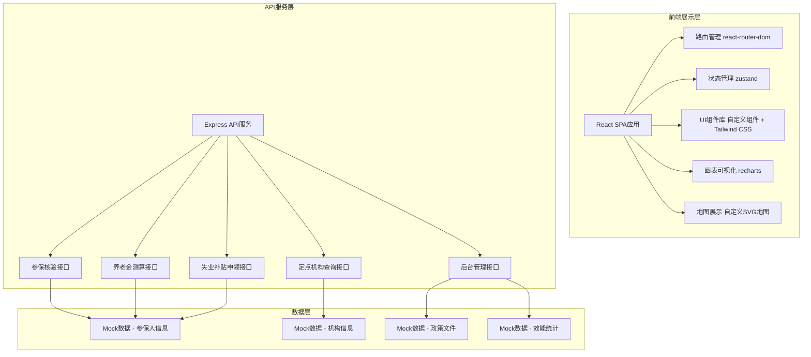
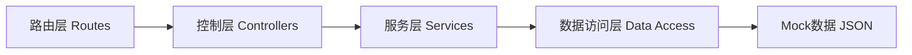

# 省级社保公共服务统一门户系统 技术架构文档

## 1. 架构设计

系统采用前后端分离架构，前端使用React + TypeScript构建单页应用，后端使用Express提供API服务，数据采用本地Mock数据模拟。整体架构如下：



## 2. 技术描述

- **前端框架**：React 18 + TypeScript
- **构建工具**：Vite 5
- **路由管理**：react-router-dom 6
- **状态管理**：zustand
- **样式方案**：Tailwind CSS 3 + CSS Modules
- **图标库**：lucide-react
- **图表库**：recharts
- **HTTP客户端**：axios
- **后端框架**：Express 4
- **数据方案**：本地Mock数据 + JSON文件存储
- **代码规范**：ESLint + Prettier

## 3. 路由定义

| 路由路径 | 页面名称 | 说明 |
|----------|----------|------|
| / | 门户首页 | 政务门户首页，快捷服务入口 |
| /insurance/verify | 参保核验 | 个人参保状态实时核验 |
| /pension/calculator | 养老金模拟器 | 养老金计发测算与对比 |
| /unemployment/apply | 失业补贴申领 | 失业补贴线上申领 |
| /medical/institutions | 定点机构检索 | 医保定点机构地图检索 |
| /policy/list | 政策文件 | 政策文件查询与标签 |
| /my/profile | 个人中心 | 用户信息与办件记录 |
| /admin/dashboard | 后台首页 | 后台管理数据概览 |
| /admin/risk-control | 风控引擎 | 待遇发放风控管理 |
| /admin/policy-tags | 政策标签 | 政策文件智能标签管理 |
| /admin/efficiency | 效能监测 | 服务效能监测看板 |

## 4. API接口定义

### 4.1 参保核验相关

```typescript
// 参保状态查询请求
interface InsuranceVerifyRequest {
  idCard: string;
  faceVerifyToken: string;
}

// 参保状态查询响应
interface InsuranceVerifyResponse {
  success: boolean;
  status: 'insured' | 'uninsured' | 'suspended';
  insuranceType: ('employee' | 'flexible' | 'urban')[];
  personalInfo: {
    name: string;
    idCard: string;
    socialSecurityNumber: string;
  };
  paymentRecords: PaymentRecord[];
  personalAccount: PersonalAccountInfo;
}

interface PaymentRecord {
  year: string;
  month: string;
  base: number;
  personalAmount: number;
  companyAmount: number;
  status: 'paid' | 'unpaid';
}

interface PersonalAccountInfo {
  pensionBalance: number;
  medicalBalance: number;
  unemploymentBalance: number;
}
```

### 4.2 养老金测算相关

```typescript
// 养老金测算请求
interface PensionCalculateRequest {
  insuranceType: 'employee' | 'flexible' | 'urban';
  gender: 'male' | 'female';
  currentAge: number;
  retirementAge: number;
  paymentYears: number;
  monthlyBase: number;
  personalAccountBalance: number;
  averageSalary: number;
}

// 养老金测算响应
interface PensionCalculateResponse {
  monthlyPension: number;
  basicPension: number;
  personalAccountPension: number;
  transitionalPension: number;
  details: {
    formula: string;
    description: string;
  }[];
}
```

### 4.3 失业补贴申领相关

```typescript
// 失业补贴申领请求
interface UnemploymentApplyRequest {
  idCard: string;
  name: string;
  faceVerifyToken: string;
  bankCardNumber: string;
  bankName: string;
  commitmentSigned: boolean;
  materials: MaterialItem[];
}

interface MaterialItem {
  type: string;
  name: string;
  url: string;
}

// 申领进度查询响应
interface UnemploymentProgressResponse {
  applyId: string;
  status: 'pending' | 'reviewing' | 'approved' | 'rejected';
  applyTime: string;
  currentStep: number;
  steps: ApplyStep[];
  rejectReason?: string;
  benefitAmount?: number;
}

interface ApplyStep {
  name: string;
  status: 'completed' | 'current' | 'pending';
  time?: string;
}
```

### 4.4 定点机构查询相关

```typescript
// 定点机构查询请求
interface InstitutionQueryRequest {
  keyword?: string;
  level?: 'tertiary' | 'secondary' | 'primary' | 'clinic';
  department?: string;
  drugCatalog?: string;
  region?: string;
  page: number;
  pageSize: number;
}

// 定点机构信息
interface MedicalInstitution {
  id: string;
  name: string;
  level: string;
  address: string;
  phone: string;
  departments: string[];
  drugCatalogs: string[];
  businessHours: string;
  location: {
    lat: number;
    lng: number;
  };
  rating: number;
  isDesignated: boolean;
}
```

## 5. 服务端架构



### 5.1 目录结构

```
api/
  ├── src/
  │   ├── routes/          # 路由定义
  │   ├── controllers/     # 控制器
  │   ├── services/        # 业务逻辑服务
  │   ├── data/            # Mock数据
  │   ├── middleware/      # 中间件
  │   ├── utils/           # 工具函数
  │   ├── types/           # 类型定义
  │   └── index.ts         # 入口文件
  └── package.json
```

## 6. 前端架构

### 6.1 目录结构

```
src/
  ├── components/          # 公共组件
  │   ├── layout/         # 布局组件
  │   ├── ui/             # UI基础组件
  │   └── business/       # 业务组件
  ├── pages/              # 页面组件
  │   ├── home/
  │   ├── insurance/
  │   ├── pension/
  │   ├── unemployment/
  │   ├── medical/
  │   ├── policy/
  │   ├── my/
  │   └── admin/
  ├── hooks/              # 自定义Hooks
  ├── store/              # 状态管理
  ├── utils/              # 工具函数
  ├── api/                # API接口
  ├── types/              # 类型定义
  ├── assets/             # 静态资源
  ├── App.tsx
  ├── main.tsx
  └── index.css
```

### 6.2 核心数据模型

```typescript
// 参保人信息
interface InsuredPerson {
  id: string;
  idCard: string;
  name: string;
  gender: 'male' | 'female';
  birthDate: string;
  insuranceTypes: ('employee' | 'flexible' | 'urban')[];
  socialSecurityNumber: string;
  status: 'normal' | 'suspended' | 'terminated';
}

// 经办机构
interface Agency {
  id: string;
  name: string;
  level: 'provincial' | 'municipal' | 'county';
  address: string;
  contact: string;
  businessScope: string[];
}

// 定点医药机构
interface DesignatedMedicalInstitution {
  id: string;
  name: string;
  type: 'hospital' | 'clinic' | 'pharmacy';
  level: 'tertiary' | 'secondary' | 'primary';
  address: string;
  phone: string;
  departments: string[];
  services: string[];
  isMedicalInsurance: boolean;
  rating: number;
}

// 政策文件
interface PolicyDocument {
  id: string;
  title: string;
  documentNumber: string;
  issuingAuthority: string;
  issueDate: string;
  effectiveDate: string;
  category: string;
  tags: string[];
  targetPopulation: string[];
  content: string;
  relatedClauses: PolicyClause[];
}

interface PolicyClause {
  id: string;
  title: string;
  content: string;
  applicableGroups: string[];
}

// 办件记录
interface ServiceRecord {
  id: string;
  serviceName: string;
  applicantId: string;
  applicantName: string;
  channel: 'online' | 'offline' | 'mobile' | 'wechat';
  applyTime: string;
  status: 'pending' | 'processing' | 'completed' | 'rejected';
  processingTime: number;
  rejectReason?: string;
  agencyId: string;
}

// 风控记录
interface RiskControlRecord {
  id: string;
  personId: string;
  personName: string;
  riskType: 'duplicate_benefit' | 'death_suspension' | 'abnormal_payment';
  riskLevel: 'high' | 'medium' | 'low';
  detectedTime: string;
  status: 'pending' | 'verified' | 'resolved';
  description: string;
  handler?: string;
  handleTime?: string;
}
```
