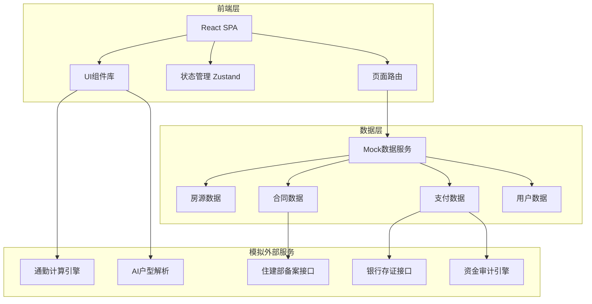
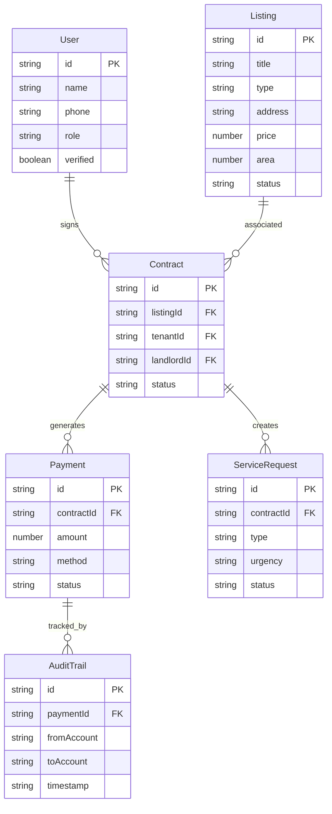

## 1. 架构设计



## 2. 技术说明

- 前端: React@18 + TypeScript + Tailwind CSS@3 + Vite
- 初始化工具: vite-init
- 后端: 无（纯前端，使用Mock数据）
- 数据库: 无（使用前端Mock数据模拟）
- 状态管理: Zustand
- 路由: React Router DOM v6
- 图标: lucide-react
- 动画: CSS animations + transitions
- 图表: 纯CSS/SVG实现数据可视化

## 3. 路由定义

| 路由 | 用途 |
|------|------|
| / | 首页，品牌展示+房源池入口+智能搜索 |
| /search | 房源搜索页，通勤地图+预算推荐+AI户型解析 |
| /listing/:id | 房源详情页，完整房源信息+预约看房入口 |
| /appointment | 预约看房页，时间锁+经纪人确认+状态跟踪 |
| /contract | 电子合同页，在线签署+银行存证+备案 |
| /payment | 支付中心，多通道支付+账单管理 |
| /service | 租后服务页，报修+派单+评价 |
| /admin | 后台管理页，审核+备案+审计+供应商管理 |

## 4. API定义（Mock）

### 4.1 房源相关

```typescript
interface Listing {
  id: string
  title: string
  type: 'ccb_direct' | 'partner' | 'personal'
  address: string
  district: string
  price: number
  area: number
  rooms: number
  halls: number
  floor: string
  orientation: string
  images: string[]
  floorPlan: string
  aiAnalysis: {
    areaBreakdown: { room: string; area: number }[]
    orientation: string
    lightingScore: number
    lightingMap: number[][]
  }
  commuteInfo: {
    metro: { station: string; minutes: number }[]
    bus: { station: string; minutes: number }[]
    drive: { destination: string; minutes: number }[]
  }
  landlord: {
    name: string
    type: 'ccb' | 'partner' | 'personal'
    verified: boolean
    rating: number
  }
  amenities: string[]
  status: 'available' | 'reserved' | 'rented'
}

interface SearchParams {
  commuteMode: 'metro' | 'bus' | 'drive'
  commuteDestination: string
  maxCommuteMinutes: number
  budgetMin: number
  budgetMax: number
  rooms: number[]
  listingType: ('ccb_direct' | 'partner' | 'personal')[]
  district: string
}
```

### 4.2 合同相关

```typescript
interface Contract {
  id: string
  listingId: string
  tenantId: string
  landlordId: string
  startDate: string
  endDate: string
  monthlyRent: number
  deposit: number
  status: 'draft' | 'signing' | 'signed' | 'filed'
  bankCertificate: {
    certificateNo: string
    hash: string
    timestamp: string
  }
  filingInfo: {
    filingNo: string
    status: 'pending' | 'filed' | 'rejected'
    filedAt: string
  }
  signatures: {
    tenant: { signed: boolean; timestamp: string }
    landlord: { signed: boolean; timestamp: string }
  }
}
```

### 4.3 支付相关

```typescript
interface Payment {
  id: string
  contractId: string
  amount: number
  method: 'ccb_card' | 'unionpay' | 'installment'
  status: 'pending' | 'processing' | 'completed' | 'failed'
  createdAt: string
  installmentPlan?: {
    totalMonths: number
    monthlyAmount: number
    interestRate: number
  }
  auditTrail: {
    from: string
    to: string
    intermediateAccounts: string[]
    timestamp: string
  }[]
}
```

### 4.4 租后服务相关

```typescript
interface ServiceRequest {
  id: string
  contractId: string
  type: 'plumbing' | 'electrical' | 'appliance' | 'structural' | 'other'
  urgency: 'low' | 'medium' | 'high'
  description: string
  images: string[]
  status: 'submitted' | 'dispatched' | 'in_progress' | 'completed'
  assignedProvider: {
    id: string
    name: string
    rating: number
  }
  rating?: {
    score: number
    comment: string
    ratedAt: string
  }
}
```

## 5. 服务器架构图

不适用（纯前端项目，无后端服务器）

## 6. 数据模型

### 6.1 数据模型定义



### 6.2 数据定义语言

不适用（纯前端项目，使用TypeScript接口定义Mock数据结构）
