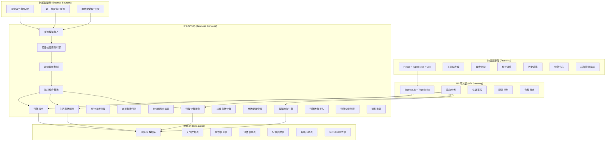
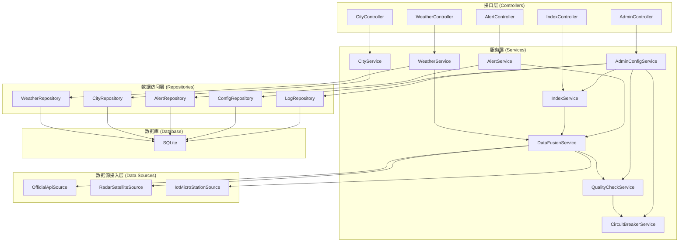

# 高精度气象数据融合服务平台 - 技术架构文档

## 1. 架构设计



## 2. 技术描述

### 2.1 前端技术栈
- **框架**: React 18 + TypeScript
- **构建工具**: Vite 5
- **样式方案**: Tailwind CSS 3
- **状态管理**: Zustand
- **路由管理**: React Router v6
- **图表库**: Recharts
- **图标库**: Lucide React
- **HTTP客户端**: Axios
- **动画**: Framer Motion (可选)

### 2.2 后端技术栈
- **框架**: Express.js 4
- **语言**: TypeScript
- **数据库**: SQLite (better-sqlite3)
- **数据校验**: Zod
- **日志**: Pino

### 2.3 技术选型说明
- **SQLite**: 轻量级关系型数据库，适合演示和中小规模应用，无需额外部署
- **Zustand**: 轻量状态管理，相比 Redux 更简洁，适合中等复杂度应用
- **Recharts**: 基于 React 的图表库，与 React 生态集成好，支持多种图表类型
- **Zod**: TypeScript-first 数据校验库，类型安全且易用

## 3. 路由定义

### 3.1 前端路由

| 路由路径 | 页面名称 | 说明 |
|---------|---------|------|
| `/` | 首页仪表盘 | 天气概览、分钟降水、生活指数、预警提醒 |
| `/cities` | 城市管理 | 关注城市列表、搜索添加城市 |
| `/forecast` | 预报详情 | 24小时预报、15天趋势 |
| `/history` | 历史对比 | 历史天气图表、多维度对比 |
| `/alerts` | 预警中心 | 预警列表、预警详情 |
| `/admin` | 后台管理首页 | 数据质量概览 |
| `/admin/quality` | 数据质量监控 | 接入状态、质量评分、规则引擎 |
| `/admin/circuit-breaker` | 熔断管理 | 熔断状态、熔断日志 |
| `/admin/index-config` | 指数参数配置 | 12类指数算法参数调整 |
| `/admin/api` | 接口管理 | API概览、调用统计、密钥管理 |

### 3.2 后端API路由

| 路由路径 | 方法 | 功能描述 |
|---------|------|---------|
| `/api/weather/current` | GET | 获取当前天气 |
| `/api/weather/minutely` | GET | 获取分钟级降水预报 |
| `/api/weather/hourly` | GET | 获取24小时逐时预报 |
| `/api/weather/daily` | GET | 获取15天趋势预报 |
| `/api/weather/grid` | GET | 获取500米网格降水数据 |
| `/api/indices` | GET | 获取12类生活指数 |
| `/api/alerts` | GET | 获取灾害预警列表 |
| `/api/alerts/:id` | GET | 获取预警详情 |
| `/api/cities` | GET | 获取城市列表 |
| `/api/cities/search` | GET | 搜索城市 |
| `/api/history/compare` | GET | 历史天气对比 |
| `/api/admin/data-sources` | GET | 数据源状态列表 |
| `/api/admin/data-sources/:id` | PUT | 更新数据源配置 |
| `/api/admin/quality-rules` | GET | 质量校验规则列表 |
| `/api/admin/quality-rules` | PUT | 更新质量校验规则 |
| `/api/admin/circuit-breaker` | GET | 熔断状态列表 |
| `/api/admin/circuit-breaker/:id` | POST | 手动熔断/恢复 |
| `/api/admin/index-params` | GET | 指数参数列表 |
| `/api/admin/index-params` | PUT | 更新指数参数 |
| `/api/admin/api-keys` | GET | API密钥列表 |
| `/api/admin/api-stats` | GET | 接口调用统计 |

## 4. API数据定义

### 4.1 核心数据类型

```typescript
// 城市信息
interface City {
  id: string;
  name: string;
  province: string;
  country: string;
  latitude: number;
  longitude: number;
  adcode: string;
}

// 当前天气
interface CurrentWeather {
  cityId: string;
  cityName: string;
  temperature: number;
  feelsLike: number;
  weather: string;
  weatherCode: string;
  humidity: number;
  windDirection: string;
  windSpeed: number;
  windScale: string;
  pressure: number;
  visibility: number;
  uvIndex: number;
  precipitation: number;
  updateTime: string;
  dataSources: string[];
}

// 分钟级降水预报
interface MinutelyPrecipitation {
  cityId: string;
  startTime: string;
  endTime: string;
  step: number;  // 分钟步长
  gridSize: number;  // 网格大小(米)
  precipitation: {
    time: string;
    value: number;  // 降水量(mm)
    gridData?: number[][];  // 500米网格数据
  }[];
  summary: string;
}

// 逐时预报
interface HourlyForecast {
  time: string;
  temperature: number;
  weather: string;
  weatherCode: string;
  precipitation: number;
  windDirection: string;
  windSpeed: number;
  humidity: number;
}

// 每日预报
interface DailyForecast {
  date: string;
  dayWeather: string;
  nightWeather: string;
  tempHigh: number;
  tempLow: number;
  precipitation: number;
  precipitationProbability: number;
  windDirectionDay: string;
  windSpeedDay: number;
  humidity: number;
  uvIndex: number;
  sunrise: string;
  sunset: string;
}

// 生活指数
interface LifeIndex {
  type: string;        // 指数类型: aqi, pm25, uv, feels_like, dressing, car_wash, sports, cold, drying, travel, traffic, comfort
  name: string;        // 指数名称
  value: number | string;  // 指数值
  level: string;       // 等级: 优/良/轻度/中度/重度 等
  levelCode: number;   // 等级编码 1-5
  description: string; // 描述建议
  updateTime: string;
}

// 灾害预警
interface WeatherAlert {
  id: string;
  cityId: string;
  cityName: string;
  type: string;        // 预警类型: 暴雨、高温、寒潮等
  typeCode: string;
  level: string;       // 预警级别: 蓝色、黄色、橙色、红色
  levelCode: number;   // 1-4 蓝黄橙红
  title: string;
  content: string;
  defenseGuide: string;
  startTime: string;
  endTime: string;
  publishTime: string;
  source: string;
}

// 数据源状态
interface DataSource {
  id: string;
  name: string;
  type: 'official' | 'radar' | 'iot';
  status: 'online' | 'offline' | 'degraded' | 'circuit_break';
  uptime: number;      // 可用性百分比
  latency: number;     // 平均延迟(ms)
  successRate: number; // 成功率
  qualityScore: number; // 质量评分
  lastUpdate: string;
  circuitBreakReason?: string;
  circuitBreakTime?: string;
}

// 质量校验规则
interface QualityRule {
  id: string;
  name: string;
  field: string;
  operator: '>' | '<' | '>=' | '<=' | '==' | '!=' | 'range';
  threshold: number | [number, number];
  weight: number;      // 权重
  enabled: boolean;
  description: string;
}

// 指数参数配置
interface IndexParameter {
  indexType: string;
  indexName: string;
  parameters: {
    key: string;
    name: string;
    value: number;
    min: number;
    max: number;
    step: number;
    unit: string;
    description: string;
  }[];
  version: string;
  updateTime: string;
}
```

## 5. 服务端架构图



## 6. 数据模型

### 6.1 数据模型ER图

```mermaid
erDiagram
    cities ||--o{ weather_current : has
    cities ||--o{ weather_hourly : has
    cities ||--o{ weather_daily : has
    cities ||--o{ weather_alerts : has
    cities ||--o{ minutely_precipitation : has
    cities ||--o{ life_indices : has
    
    data_sources ||--o{ quality_check_logs : produces
    data_sources ||--o{ circuit_break_logs : has
    
    index_parameters ||--o{ life_indices : "calculates"
    
    api_keys ||--o{ api_call_logs : produces

    cities {
        string id PK
        string name
        string province
        string country
        float latitude
        float longitude
        string adcode
        datetime created_at
        datetime updated_at
    }
    
    weather_current {
        integer id PK
        string city_id FK
        float temperature
        float feels_like
        string weather
        string weather_code
        float humidity
        string wind_direction
        float wind_speed
        float pressure
        float visibility
        float uv_index
        float precipitation
        string data_sources
        datetime update_time
    }
    
    weather_hourly {
        integer id PK
        string city_id FK
        datetime forecast_time
        float temperature
        string weather
        string weather_code
        float precipitation
        string wind_direction
        float wind_speed
        float humidity
    }
    
    weather_daily {
        integer id PK
        string city_id FK
        date forecast_date
        string day_weather
        string night_weather
        float temp_high
        float temp_low
        float precipitation
        float precip_probability
        float uv_index
        string sunrise
        string sunset
    }
    
    weather_alerts {
        string id PK
        string city_id FK
        string type
        string type_code
        string level
        integer level_code
        string title
        text content
        text defense_guide
        datetime start_time
        datetime end_time
        datetime publish_time
        string source
    }
    
    minutely_precipitation {
        integer id PK
        string city_id FK
        datetime start_time
        datetime end_time
        integer step_minutes
        integer grid_size
        text grid_data
        datetime update_time
    }
    
    life_indices {
        integer id PK
        string city_id FK
        string index_type
        string index_name
        string value
        string level
        integer level_code
        text description
        datetime update_time
    }
    
    data_sources {
        string id PK
        string name
        string type
        string status
        float uptime
        integer latency
        float success_rate
        float quality_score
        datetime last_update
        string circuit_break_reason
        datetime circuit_break_time
    }
    
    quality_rules {
        string id PK
        string name
        string field
        string operator
        string threshold
        float weight
        boolean enabled
        text description
    }
    
    circuit_break_logs {
        integer id PK
        string source_id FK
        string action
        string reason
        datetime action_time
    }
    
    index_parameters {
        integer id PK
        string index_type
        string index_name
        text parameters
        string version
        datetime update_time
    }
    
    api_keys {
        string id PK
        string key_name
        string api_key
        string status
        integer rate_limit
        datetime created_at
        datetime expires_at
    }
    
    api_call_logs {
        integer id PK
        string api_key_id FK
        string endpoint
        string method
        integer status_code
        integer response_time
        datetime call_time
        string ip_address
    }
    
    user_cities {
        integer id PK
        string user_session
        string city_id FK
        integer sort_order
        datetime created_at
    }
```



### 6.2 数据库初始化脚本

```sql
-- 城市信息表
CREATE TABLE IF NOT EXISTS cities (
  id TEXT PRIMARY KEY,
  name TEXT NOT NULL,
  province TEXT,
  country TEXT DEFAULT '中国',
  latitude REAL NOT NULL,
  longitude REAL NOT NULL,
  adcode TEXT,
  created_at DATETIME DEFAULT CURRENT_TIMESTAMP,
  updated_at DATETIME DEFAULT CURRENT_TIMESTAMP
);

-- 当前天气表
CREATE TABLE IF NOT EXISTS weather_current (
  id INTEGER PRIMARY KEY AUTOINCREMENT,
  city_id TEXT NOT NULL,
  temperature REAL,
  feels_like REAL,
  weather TEXT,
  weather_code TEXT,
  humidity REAL,
  wind_direction TEXT,
  wind_speed REAL,
  pressure REAL,
  visibility REAL,
  uv_index REAL,
  precipitation REAL,
  data_sources TEXT,
  update_time DATETIME,
  FOREIGN KEY (city_id) REFERENCES cities(id)
);

-- 逐时预报
CREATE TABLE IF NOT EXISTS weather_hourly (
  id INTEGER PRIMARY KEY AUTOINCREMENT,
  city_id TEXT NOT NULL,
  forecast_time DATETIME NOT NULL,
  temperature REAL,
  weather TEXT,
  weather_code TEXT,
  precipitation REAL,
  wind_direction TEXT,
  wind_speed REAL,
  humidity REAL,
  FOREIGN KEY (city_id) REFERENCES cities(id)
);

-- 每日预报
CREATE TABLE IF NOT EXISTS weather_daily (
  id INTEGER PRIMARY KEY AUTOINCREMENT,
  city_id TEXT NOT NULL,
  forecast_date DATE NOT NULL,
  day_weather TEXT,
  night_weather TEXT,
  temp_high REAL,
  temp_low REAL,
  precipitation REAL,
  precip_probability REAL,
  uv_index REAL,
  sunrise TEXT,
  sunset TEXT,
  FOREIGN KEY (city_id) REFERENCES cities(id)
);

-- 灾害预警
CREATE TABLE IF NOT EXISTS weather_alerts (
  id TEXT PRIMARY KEY,
  city_id TEXT NOT NULL,
  type TEXT NOT NULL,
  type_code TEXT,
  level TEXT NOT NULL,
  level_code INTEGER,
  title TEXT,
  content TEXT,
  defense_guide TEXT,
  start_time DATETIME,
  end_time DATETIME,
  publish_time DATETIME,
  source TEXT,
  FOREIGN KEY (city_id) REFERENCES cities(id)
);

-- 分钟降水
CREATE TABLE IF NOT EXISTS minutely_precipitation (
  id INTEGER PRIMARY KEY AUTOINCREMENT,
  city_id TEXT NOT NULL,
  start_time DATETIME,
  end_time DATETIME,
  step_minutes INTEGER DEFAULT 5,
  grid_size INTEGER DEFAULT 500,
  grid_data TEXT,
  update_time DATETIME,
  FOREIGN KEY (city_id) REFERENCES cities(id)
);

-- 生活指数
CREATE TABLE IF NOT EXISTS life_indices (
  id INTEGER PRIMARY KEY AUTOINCREMENT,
  city_id TEXT NOT NULL,
  index_type TEXT NOT NULL,
  index_name TEXT NOT NULL,
  value TEXT,
  level TEXT,
  level_code INTEGER,
  description TEXT,
  update_time DATETIME,
  FOREIGN KEY (city_id) REFERENCES cities(id)
);

-- 数据源
CREATE TABLE IF NOT EXISTS data_sources (
  id TEXT PRIMARY KEY,
  name TEXT NOT NULL,
  type TEXT NOT NULL,
  status TEXT DEFAULT 'online',
  uptime REAL DEFAULT 99.9,
  latency INTEGER DEFAULT 100,
  success_rate REAL DEFAULT 99.5,
  quality_score REAL DEFAULT 95,
  last_update DATETIME,
  circuit_break_reason TEXT,
  circuit_break_time DATETIME
);

-- 质量规则
CREATE TABLE IF NOT EXISTS quality_rules (
  id TEXT PRIMARY KEY,
  name TEXT NOT NULL,
  field TEXT NOT NULL,
  operator TEXT NOT NULL,
  threshold TEXT NOT NULL,
  weight REAL DEFAULT 1.0,
  enabled INTEGER DEFAULT 1,
  description TEXT
);

-- 熔断日志
CREATE TABLE IF NOT EXISTS circuit_break_logs (
  id INTEGER PRIMARY KEY AUTOINCREMENT,
  source_id TEXT NOT NULL,
  action TEXT NOT NULL,
  reason TEXT,
  action_time DATETIME DEFAULT CURRENT_TIMESTAMP,
  FOREIGN KEY (source_id) REFERENCES data_sources(id)
);

-- 指数参数
CREATE TABLE IF NOT EXISTS index_parameters (
  id INTEGER PRIMARY KEY AUTOINCREMENT,
  index_type TEXT NOT NULL UNIQUE,
  index_name TEXT NOT NULL,
  parameters TEXT NOT NULL,
  version TEXT,
  update_time DATETIME DEFAULT CURRENT_TIMESTAMP
);

-- API密钥
CREATE TABLE IF NOT EXISTS api_keys (
  id TEXT PRIMARY KEY,
  key_name TEXT NOT NULL,
  api_key TEXT NOT NULL UNIQUE,
  status TEXT DEFAULT 'active',
  rate_limit INTEGER DEFAULT 1000,
  created_at DATETIME DEFAULT CURRENT_TIMESTAMP,
  expires_at DATETIME
);

-- API调用日志
CREATE TABLE IF NOT EXISTS api_call_logs (
  id INTEGER PRIMARY KEY AUTOINCREMENT,
  api_key_id TEXT,
  endpoint TEXT,
  method TEXT,
  status_code INTEGER,
  response_time INTEGER,
  call_time DATETIME DEFAULT CURRENT_TIMESTAMP,
  ip_address TEXT,
  FOREIGN KEY (api_key_id) REFERENCES api_keys(id)
);

-- 用户关注城市
CREATE TABLE IF NOT EXISTS user_cities (
  id INTEGER PRIMARY KEY AUTOINCREMENT,
  user_session TEXT NOT NULL,
  city_id TEXT NOT NULL,
  sort_order INTEGER DEFAULT 0,
  created_at DATETIME DEFAULT CURRENT_TIMESTAMP,
  FOREIGN KEY (city_id) REFERENCES cities(id)
);

-- 索引
CREATE INDEX IF NOT EXISTS idx_weather_current_city ON weather_current(city_id);
CREATE INDEX IF NOT EXISTS idx_weather_hourly_city ON weather_hourly(city_id);
CREATE INDEX IF NOT EXISTS idx_weather_daily_city ON weather_daily(city_id);
CREATE INDEX IF NOT EXISTS idx_weather_alerts_city ON weather_alerts(city_id);
CREATE INDEX IF NOT EXISTS idx_life_indices_city ON life_indices(city_id);
CREATE INDEX IF NOT EXISTS idx_api_call_logs_key ON api_call_logs(api_key_id);
CREATE INDEX IF NOT EXISTS idx_user_cities_session ON user_cities(user_session);
```
