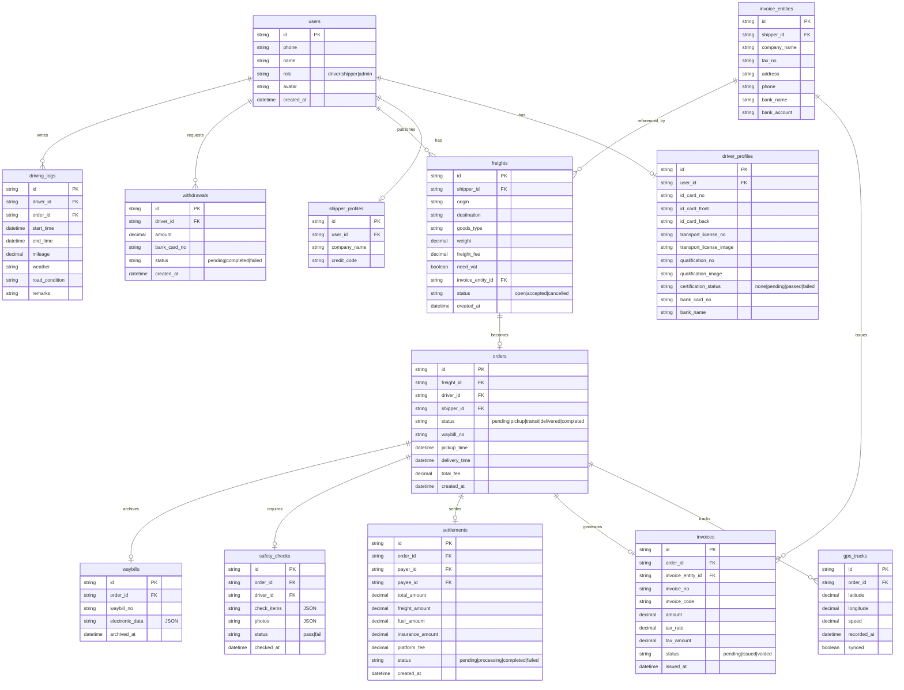

## 1. 架构设计

```mermaid
graph TB
    subgraph "前端层"
        "React SPA (Vite+Tailwind)"
        "Service Worker (离线缓存)"
        "IndexedDB (本地存储)"
    end
    subgraph "后端层"
        "Express API Server"
        "认证中间件 (JWT)"
        "业务服务层"
    end
    subgraph "数据层"
        "SQLite (主数据库)"
    end
    subgraph "外部服务(模拟)"
        "税控开票接口"
        "短信验证码服务"
        "OCR证件识别服务"
    end
    "React SPA (Vite+Tailwind)" --> "Express API Server"
    "Service Worker (离线缓存)" --> "IndexedDB (本地存储)"
    "Express API Server" --> "认证中间件 (JWT)"
    "认证中间件 (JWT)" --> "业务服务层"
    "业务服务层" --> "SQLite (主数据库)"
    "业务服务层" --> "税控开票接口"
    "业务服务层" --> "短信验证码服务"
    "业务服务层" --> "OCR证件识别服务"
```

## 2. 技术说明

- **前端**：React@18 + TailwindCSS@3 + Vite + React Router@6 + Zustand（状态管理）
- **初始化工具**：Vite
- **后端**：Express@4 + better-sqlite3
- **数据库**：SQLite（文件：server/src/data/app.sqlite）
- **离线方案**：Service Worker + IndexedDB（本地缓存货源/运单/轨迹）
- **认证**：JWT Token + 角色权限中间件
- **税控/OCR/短信**：本地模拟接口，返回Mock数据，预留真实对接字段

## 3. 路由定义

| 路由 | 用途 |
|------|------|
| / | 首页/工作台 |
| /login | 登录/注册页 |
| /freight | 货源大厅 |
| /freight/create | 发布货源（货主） |
| /freight/:id | 货源详情 |
| /orders | 运单中心 |
| /orders/:id | 运单详情 |
| /orders/:id/track | GPS轨迹 |
| /invoices | 发票管理 |
| /invoices/:id | 发票详情 |
| /invoices/entity | 开票主体管理 |
| /settlement | 结算中心 |
| /settlement/withdraw | 提现 |
| /safety | 安全台账 |
| /safety/check | 出车前检查 |
| /safety/log | 行车日志 |
| /safety/waybill | 电子路单 |
| /certification | 实名认证 |
| /profile | 个人中心 |

## 4. API 定义

### 4.1 认证模块

```typescript
POST /api/auth/login
Request: { phone: string, code: string, role: "driver" | "shipper" }
Response: { token: string, user: User }

POST /api/auth/send-code
Request: { phone: string }
Response: { success: boolean }

GET /api/auth/me
Headers: Authorization: Bearer <token>
Response: User
```

### 4.2 货源模块

```typescript
GET /api/freights?page=1&pageSize=20&needVat=true&region=
Response: { list: Freight[], total: number }

POST /api/freights
Request: FreightCreate
Response: Freight

GET /api/freights/:id
Response: Freight

POST /api/freights/:id/accept
Request: { driverId: string }
Response: Order
```

### 4.3 运单模块

```typescript
GET /api/orders?status=&page=1&pageSize=20
Response: { list: Order[], total: number }

GET /api/orders/:id
Response: Order

POST /api/orders/:id/confirm-pickup
Response: Order

POST /api/orders/:id/confirm-delivery
Response: Order

POST /api/orders/:id/gps
Request: { points: GpsPoint[] }
Response: { saved: number }
```

### 4.4 发票模块

```typescript
GET /api/invoices?status=&page=1&pageSize=20
Response: { list: Invoice[], total: number }

GET /api/invoices/:id
Response: Invoice

POST /api/invoices/generate/:orderId
Response: Invoice

GET /api/invoice-entities
Response: InvoiceEntity[]

POST /api/invoice-entities
Request: InvoiceEntityCreate
Response: InvoiceEntity
```

### 4.5 结算模块

```typescript
GET /api/settlements?status=&page=1&pageSize=20
Response: { list: Settlement[], total: number }

GET /api/settlements/:id
Response: Settlement

POST /api/settlements/:id/withdraw
Request: { amount: number, bankCardId: string }
Response: Withdrawal

GET /api/settlements/summary
Response: { availableBalance: number, frozenAmount: number, totalIncome: number }
```

### 4.6 安全台账模块

```typescript
POST /api/safety/checks
Request: SafetyCheckCreate
Response: SafetyCheck

GET /api/safety/checks?orderId=&page=1
Response: { list: SafetyCheck[], total: number }

POST /api/safety/logs
Request: DrivingLogCreate
Response: DrivingLog

GET /api/safety/logs?page=1
Response: { list: DrivingLog[], total: number }

GET /api/safety/waybills?orderId=
Response: Waybill[]

GET /api/safety/export?startDate=&endDate=
Response: Blob (CSV/JSON导出)
```

### 4.7 证件认证模块

```typescript
POST /api/certification/id-card
Request: { frontImage: File, backImage: File }
Response: { ocrResult: IdCardOCR, status: "pending" | "passed" | "failed" }

POST /api/certification/transport-license
Request: { image: File }
Response: { ocrResult: LicenseOCR, status: "pending" | "passed" | "failed" }

POST /api/certification/qualification
Request: { image: File }
Response: { ocrResult: QualificationOCR, status: "pending" | "passed" | "failed" }

GET /api/certification/status
Response: CertificationStatus
```

### 4.8 健康检查

```typescript
GET /api/health
Response: { status: "ok", timestamp: string }
```

## 5. 服务端架构图

```mermaid
graph LR
    "Router / Controller" --> "Service Layer"
    "Service Layer" --> "Repository / DAO"
    "Repository / DAO" --> "SQLite Database"
    "Service Layer" --> "External API Adapter"
    "External API Adapter" --> "税控Mock"
    "External API Adapter" --> "OCR Mock"
```

## 6. 数据模型

### 6.1 数据模型定义



### 6.2 数据定义语言

```sql
CREATE TABLE users (
    id TEXT PRIMARY KEY,
    phone TEXT NOT NULL UNIQUE,
    name TEXT NOT NULL,
    role TEXT NOT NULL CHECK(role IN ('driver', 'shipper', 'admin')),
    avatar TEXT,
    created_at TEXT NOT NULL DEFAULT (datetime('now'))
);

CREATE TABLE driver_profiles (
    id TEXT PRIMARY KEY,
    user_id TEXT NOT NULL UNIQUE REFERENCES users(id),
    id_card_no TEXT,
    id_card_front TEXT,
    id_card_back TEXT,
    transport_license_no TEXT,
    transport_license_image TEXT,
    qualification_no TEXT,
    qualification_image TEXT,
    certification_status TEXT NOT NULL DEFAULT 'none' CHECK(certification_status IN ('none', 'pending', 'passed', 'failed')),
    bank_card_no TEXT,
    bank_name TEXT
);

CREATE TABLE shipper_profiles (
    id TEXT PRIMARY KEY,
    user_id TEXT NOT NULL UNIQUE REFERENCES users(id),
    company_name TEXT,
    credit_code TEXT
);

CREATE TABLE invoice_entities (
    id TEXT PRIMARY KEY,
    shipper_id TEXT NOT NULL REFERENCES users(id),
    company_name TEXT NOT NULL,
    tax_no TEXT NOT NULL,
    address TEXT,
    phone TEXT,
    bank_name TEXT,
    bank_account TEXT
);

CREATE TABLE freights (
    id TEXT PRIMARY KEY,
    shipper_id TEXT NOT NULL REFERENCES users(id),
    origin TEXT NOT NULL,
    destination TEXT NOT NULL,
    goods_type TEXT NOT NULL,
    weight REAL NOT NULL,
    freight_fee REAL NOT NULL,
    need_vat INTEGER NOT NULL DEFAULT 0,
    invoice_entity_id TEXT REFERENCES invoice_entities(id),
    status TEXT NOT NULL DEFAULT 'open' CHECK(status IN ('open', 'accepted', 'cancelled')),
    created_at TEXT NOT NULL DEFAULT (datetime('now'))
);

CREATE TABLE orders (
    id TEXT PRIMARY KEY,
    freight_id TEXT NOT NULL REFERENCES freights(id),
    driver_id TEXT NOT NULL REFERENCES users(id),
    shipper_id TEXT NOT NULL REFERENCES users(id),
    status TEXT NOT NULL DEFAULT 'pending' CHECK(status IN ('pending', 'pickup', 'transit', 'delivered', 'completed')),
    waybill_no TEXT,
    pickup_time TEXT,
    delivery_time TEXT,
    total_fee REAL NOT NULL,
    created_at TEXT NOT NULL DEFAULT (datetime('now'))
);

CREATE TABLE gps_tracks (
    id TEXT PRIMARY KEY,
    order_id TEXT NOT NULL REFERENCES orders(id),
    latitude REAL NOT NULL,
    longitude REAL NOT NULL,
    speed REAL,
    recorded_at TEXT NOT NULL,
    synced INTEGER NOT NULL DEFAULT 1
);

CREATE TABLE invoices (
    id TEXT PRIMARY KEY,
    order_id TEXT NOT NULL REFERENCES orders(id),
    invoice_entity_id TEXT NOT NULL REFERENCES invoice_entities(id),
    invoice_no TEXT,
    invoice_code TEXT,
    amount REAL NOT NULL,
    tax_rate REAL NOT NULL,
    tax_amount REAL NOT NULL,
    status TEXT NOT NULL DEFAULT 'pending' CHECK(status IN ('pending', 'issued', 'voided')),
    issued_at TEXT
);

CREATE TABLE settlements (
    id TEXT PRIMARY KEY,
    order_id TEXT NOT NULL REFERENCES orders(id),
    payer_id TEXT NOT NULL REFERENCES users(id),
    payee_id TEXT NOT NULL REFERENCES users(id),
    total_amount REAL NOT NULL,
    freight_amount REAL NOT NULL,
    fuel_amount REAL NOT NULL,
    insurance_amount REAL NOT NULL,
    platform_fee REAL NOT NULL,
    status TEXT NOT NULL DEFAULT 'pending' CHECK(status IN ('pending', 'processing', 'completed', 'failed')),
    created_at TEXT NOT NULL DEFAULT (datetime('now'))
);

CREATE TABLE withdrawals (
    id TEXT PRIMARY KEY,
    driver_id TEXT NOT NULL REFERENCES users(id),
    amount REAL NOT NULL,
    bank_card_no TEXT NOT NULL,
    status TEXT NOT NULL DEFAULT 'pending' CHECK(status IN ('pending', 'completed', 'failed')),
    created_at TEXT NOT NULL DEFAULT (datetime('now'))
);

CREATE TABLE safety_checks (
    id TEXT PRIMARY KEY,
    order_id TEXT NOT NULL REFERENCES orders(id),
    driver_id TEXT NOT NULL REFERENCES users(id),
    check_items TEXT NOT NULL,
    photos TEXT,
    status TEXT NOT NULL CHECK(status IN ('pass', 'fail')),
    checked_at TEXT NOT NULL DEFAULT (datetime('now'))
);

CREATE TABLE driving_logs (
    id TEXT PRIMARY KEY,
    driver_id TEXT NOT NULL REFERENCES users(id),
    order_id TEXT REFERENCES orders(id),
    start_time TEXT NOT NULL,
    end_time TEXT,
    mileage REAL,
    weather TEXT,
    road_condition TEXT,
    remarks TEXT
);

CREATE TABLE waybills (
    id TEXT PRIMARY KEY,
    order_id TEXT NOT NULL REFERENCES orders(id),
    waybill_no TEXT NOT NULL,
    electronic_data TEXT NOT NULL,
    archived_at TEXT NOT NULL DEFAULT (datetime('now'))
);

CREATE INDEX idx_freights_status ON freights(status);
CREATE INDEX idx_orders_driver ON orders(driver_id);
CREATE INDEX idx_orders_shipper ON orders(shipper_id);
CREATE INDEX idx_orders_status ON orders(status);
CREATE INDEX idx_gps_order ON gps_tracks(order_id);
CREATE INDEX idx_invoices_order ON invoices(order_id);
CREATE INDEX idx_settlements_order ON settlements(order_id);
CREATE INDEX idx_safety_checks_order ON safety_checks(order_id);
CREATE INDEX idx_driving_logs_driver ON driving_logs(driver_id);
```
