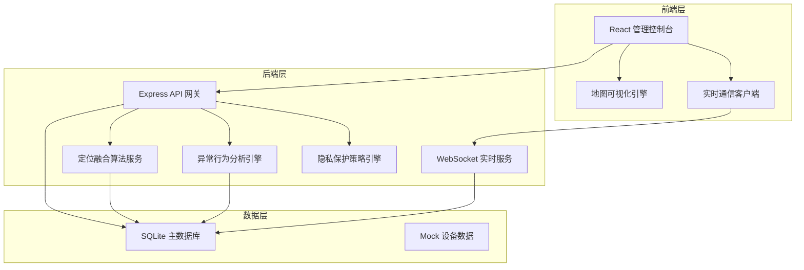
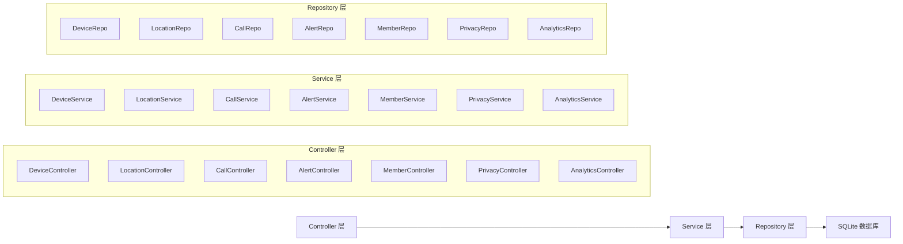
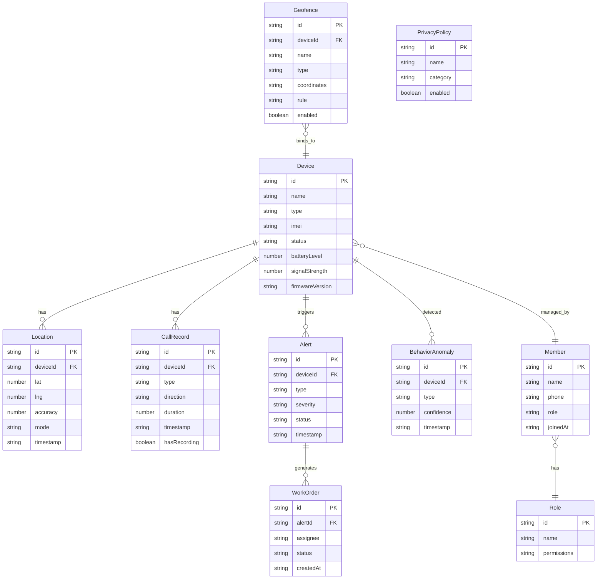

## 1. 架构设计



## 2. 技术说明

- 前端：React@18 + TypeScript + TailwindCSS@3 + Vite
- 初始化工具：vite-init（react-express-ts 模板）
- 后端：Express@4 + TypeScript (ESM)
- 数据库：SQLite（开发阶段，使用 better-sqlite3）
- 状态管理：Zustand
- 地图：Leaflet + React-Leaflet（开源地图方案）
- 图表：Recharts
- 图标：lucide-react
- 实时通信：WebSocket (ws)
- 数据模拟：Mock数据集模拟设备上报

## 3. 路由定义

| 路由 | 用途 |
|------|------|
| `/` | 仪表盘总览页 - 设备状态、告警统计、实时地图 |
| `/location` | 定位与围栏页 - 多模定位、电子围栏、轨迹回放 |
| `/calls` | 通话管理页 - 通话面板、记录列表、录音存储 |
| `/sos` | SOS告警中心页 - 告警列表、通知链路、工单分派 |
| `/devices` | 设备管理页 - 设备绑定、固件OTA、电量预警、权限配置 |
| `/members` | 成员与角色页 - 成员管理、角色配置、邀请管理 |
| `/privacy` | 隐私保护页 - 策略引擎、数据脱敏、加密监控 |
| `/analytics` | 异常行为分析页 - 异常检测、行为趋势、告警规则 |

## 4. API 定义

### 4.1 设备相关

```typescript
interface Device {
  id: string
  name: string
  type: "watch" | "shoe"
  imei: string
  status: "online" | "offline" | "sos"
  batteryLevel: number
  signalStrength: number
  firmwareVersion: string
  lastLocation: { lat: number; lng: number; accuracy: number; timestamp: string }
  settings: DeviceSettings
}

interface DeviceSettings {
  blockUnknownCalls: boolean
  restrictedApps: string[]
  classModeEnabled: boolean
  classModeSchedule: { start: string; end: string }[]
  batteryWarningThreshold: number
  batteryCriticalThreshold: number
}

// GET /api/devices - 获取设备列表
// GET /api/devices/:id - 获取设备详情
// POST /api/devices/bind - 绑定设备
// DELETE /api/devices/:id/unbind - 解绑设备
// PUT /api/devices/:id/settings - 更新设备设置
// POST /api/devices/:id/ota - 触发OTA升级
```

### 4.2 定位相关

```typescript
interface Location {
  deviceId: string
  lat: number
  lng: number
  accuracy: number
  mode: "gps" | "wifi" | "cell" | "fusion"
  timestamp: string
  speed: number
}

interface Geofence {
  id: string
  name: string
  type: "circle" | "polygon"
  coordinates: { lat: number; lng: number }[]
  radius?: number
  rule: "enter" | "exit" | "both"
  schedule: { start: string; end: string; days: number[] }
  enabled: boolean
  alertLevel: "low" | "medium" | "high"
}

// GET /api/devices/:id/locations?from=&to= - 获取历史位置
// GET /api/devices/:id/locations/realtime - 获取实时位置
// GET /api/geofences - 获取围栏列表
// POST /api/geofences - 创建围栏
// PUT /api/geofences/:id - 更新围栏
// DELETE /api/geofences/:id - 删除围栏
```

### 4.3 通话相关

```typescript
interface CallRecord {
  id: string
  deviceId: string
  type: "audio" | "video"
  direction: "inbound" | "outbound" | "missed"
  callerNumber: string
  duration: number
  timestamp: string
  hasRecording: boolean
  recordingUrl?: string
}

// GET /api/calls?deviceId=&from=&to= - 获取通话记录
// GET /api/calls/:id/recording - 获取录音文件
// POST /api/calls/dial - 发起通话
```

### 4.4 告警相关

```typescript
interface Alert {
  id: string
  type: "sos" | "geofence" | "battery" | "behavior" | "offline"
  deviceId: string
  severity: "critical" | "high" | "medium" | "low"
  status: "pending" | "acknowledged" | "resolved" | "closed"
  description: string
  location?: { lat: number; lng: number }
  timestamp: string
  notificationChain: NotificationNode[]
}

interface NotificationNode {
  role: "guardian" | "relative" | "school_admin"
  name: string
  status: "pending" | "notified" | "responded"
  notifiedAt?: string
  respondedAt?: string
}

interface WorkOrder {
  id: string
  alertId: string
  assignee: string
  status: "open" | "in_progress" | "resolved" | "closed"
  createdAt: string
  resolvedAt?: string
  notes: { author: string; content: string; timestamp: string }[]
}

// GET /api/alerts?type=&status=&from=&to= - 获取告警列表
// PUT /api/alerts/:id/acknowledge - 确认告警
// PUT /api/alerts/:id/resolve - 解决告警
// POST /api/alerts/:id/workorder - 创建工单
// PUT /api/workorders/:id - 更新工单
```

### 4.5 成员相关

```typescript
interface Member {
  id: string
  name: string
  avatar: string
  phone: string
  role: "primary_guardian" | "temporary_caregiver" | "school_admin"
  permissions: string[]
  joinedAt: string
  invitedBy: string
}

// GET /api/members - 获取成员列表
// POST /api/members/invite - 邀请成员
// PUT /api/members/:id/role - 更新角色
// DELETE /api/members/:id - 移除成员
```

### 4.6 隐私保护

```typescript
interface PrivacyPolicy {
  id: string
  name: string
  description: string
  enabled: boolean
  category: "face_blur" | "location_strip" | "call_encrypt" | "data_mask"
}

// GET /api/privacy/policies - 获取隐私策略列表
// PUT /api/privacy/policies/:id - 更新策略状态
// GET /api/privacy/encryption/status - 获取加密状态
```

### 4.7 异常行为分析

```typescript
interface BehaviorAnomaly {
  id: string
  deviceId: string
  type: "prolonged_stillness" | "nighttime_movement" | "signal_anomaly" | "unusual_route"
  confidence: number
  description: string
  timestamp: string
  resolved: boolean
}

interface BehaviorRule {
  id: string
  type: string
  threshold: number
  sensitivity: "low" | "medium" | "high"
  enabled: boolean
  timeRange?: { start: string; end: string }
}

// GET /api/analytics/anomalies?deviceId=&from=&to= - 获取异常事件
// GET /api/analytics/trends?deviceId=&period= - 获取趋势数据
// GET /api/analytics/rules - 获取告警规则
// PUT /api/analytics/rules/:id - 更新告警规则
```

## 5. 服务端架构图



## 6. 数据模型

### 6.1 数据模型定义



### 6.2 数据定义语言

```sql
CREATE TABLE devices (
  id TEXT PRIMARY KEY,
  name TEXT NOT NULL,
  type TEXT NOT NULL CHECK(type IN ('watch', 'shoe')),
  imei TEXT UNIQUE NOT NULL,
  status TEXT NOT NULL DEFAULT 'offline' CHECK(status IN ('online', 'offline', 'sos')),
  battery_level INTEGER DEFAULT 0,
  signal_strength INTEGER DEFAULT 0,
  firmware_version TEXT DEFAULT '1.0.0',
  settings TEXT DEFAULT '{}',
  created_at TEXT DEFAULT (datetime('now')),
  updated_at TEXT DEFAULT (datetime('now'))
);

CREATE TABLE locations (
  id TEXT PRIMARY KEY,
  device_id TEXT NOT NULL REFERENCES devices(id),
  lat REAL NOT NULL,
  lng REAL NOT NULL,
  accuracy REAL DEFAULT 0,
  mode TEXT NOT NULL DEFAULT 'fusion' CHECK(mode IN ('gps', 'wifi', 'cell', 'fusion')),
  speed REAL DEFAULT 0,
  timestamp TEXT NOT NULL,
  created_at TEXT DEFAULT (datetime('now'))
);

CREATE INDEX idx_locations_device_timestamp ON locations(device_id, timestamp);

CREATE TABLE geofences (
  id TEXT PRIMARY KEY,
  device_id TEXT NOT NULL REFERENCES devices(id),
  name TEXT NOT NULL,
  type TEXT NOT NULL CHECK(type IN ('circle', 'polygon')),
  coordinates TEXT NOT NULL,
  radius REAL,
  rule TEXT NOT NULL DEFAULT 'both' CHECK(rule IN ('enter', 'exit', 'both')),
  schedule TEXT DEFAULT '{}',
  enabled INTEGER DEFAULT 1,
  alert_level TEXT DEFAULT 'medium' CHECK(alert_level IN ('low', 'medium', 'high')),
  created_at TEXT DEFAULT (datetime('now'))
);

CREATE TABLE call_records (
  id TEXT PRIMARY KEY,
  device_id TEXT NOT NULL REFERENCES devices(id),
  type TEXT NOT NULL CHECK(type IN ('audio', 'video')),
  direction TEXT NOT NULL CHECK(direction IN ('inbound', 'outbound', 'missed')),
  caller_number TEXT,
  duration INTEGER DEFAULT 0,
  timestamp TEXT NOT NULL,
  has_recording INTEGER DEFAULT 0,
  recording_url TEXT,
  created_at TEXT DEFAULT (datetime('now'))
);

CREATE INDEX idx_calls_device_timestamp ON call_records(device_id, timestamp);

CREATE TABLE alerts (
  id TEXT PRIMARY KEY,
  device_id TEXT NOT NULL REFERENCES devices(id),
  type TEXT NOT NULL CHECK(type IN ('sos', 'geofence', 'battery', 'behavior', 'offline')),
  severity TEXT NOT NULL CHECK(severity IN ('critical', 'high', 'medium', 'low')),
  status TEXT NOT NULL DEFAULT 'pending' CHECK(status IN ('pending', 'acknowledged', 'resolved', 'closed')),
  description TEXT,
  location_lat REAL,
  location_lng REAL,
  notification_chain TEXT DEFAULT '[]',
  timestamp TEXT NOT NULL,
  created_at TEXT DEFAULT (datetime('now')),
  updated_at TEXT DEFAULT (datetime('now'))
);

CREATE INDEX idx_alerts_type_status ON alerts(type, status);
CREATE INDEX idx_alerts_timestamp ON alerts(timestamp);

CREATE TABLE work_orders (
  id TEXT PRIMARY KEY,
  alert_id TEXT NOT NULL REFERENCES alerts(id),
  assignee TEXT NOT NULL,
  status TEXT NOT NULL DEFAULT 'open' CHECK(status IN ('open', 'in_progress', 'resolved', 'closed')),
  notes TEXT DEFAULT '[]',
  created_at TEXT DEFAULT (datetime('now')),
  resolved_at TEXT,
  updated_at TEXT DEFAULT (datetime('now'))
);

CREATE TABLE members (
  id TEXT PRIMARY KEY,
  name TEXT NOT NULL,
  avatar TEXT,
  phone TEXT NOT NULL,
  role TEXT NOT NULL DEFAULT 'temporary_caregiver' CHECK(role IN ('primary_guardian', 'temporary_caregiver', 'school_admin')),
  permissions TEXT DEFAULT '[]',
  joined_at TEXT DEFAULT (datetime('now')),
  invited_by TEXT REFERENCES members(id)
);

CREATE TABLE behavior_anomalies (
  id TEXT PRIMARY KEY,
  device_id TEXT NOT NULL REFERENCES devices(id),
  type TEXT NOT NULL CHECK(type IN ('prolonged_stillness', 'nighttime_movement', 'signal_anomaly', 'unusual_route')),
  confidence REAL DEFAULT 0,
  description TEXT,
  timestamp TEXT NOT NULL,
  resolved INTEGER DEFAULT 0,
  created_at TEXT DEFAULT (datetime('now'))
);

CREATE INDEX idx_anomalies_device_timestamp ON behavior_anomalies(device_id, timestamp);

CREATE TABLE privacy_policies (
  id TEXT PRIMARY KEY,
  name TEXT NOT NULL,
  description TEXT,
  category TEXT NOT NULL CHECK(category IN ('face_blur', 'location_strip', 'call_encrypt', 'data_mask')),
  enabled INTEGER DEFAULT 1,
  config TEXT DEFAULT '{}',
  created_at TEXT DEFAULT (datetime('now')),
  updated_at TEXT DEFAULT (datetime('now'))
);

CREATE TABLE roles (
  id TEXT PRIMARY KEY,
  name TEXT NOT NULL,
  permissions TEXT NOT NULL DEFAULT '[]',
  created_at TEXT DEFAULT (datetime('now'))
);

INSERT INTO roles (id, name, permissions) VALUES
  ('role_1', 'primary_guardian', '["device:manage", "member:manage", "geofence:manage", "call:manage", "alert:manage", "privacy:manage", "analytics:view"]'),
  ('role_2', 'temporary_caregiver', '["location:view", "alert:receive", "call:make"]'),
  ('role_3', 'school_admin', '["location:view", "alert:receive", "geofence:view", "device:view"]');
```
