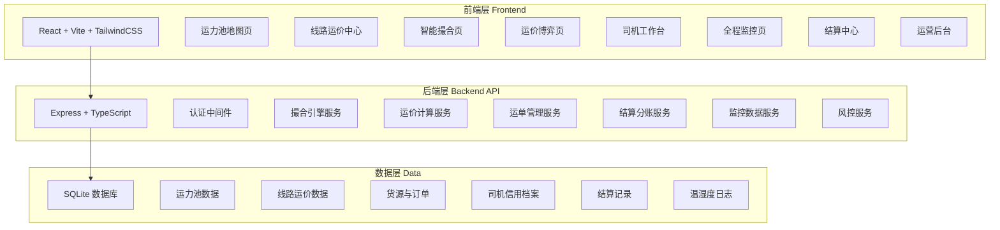
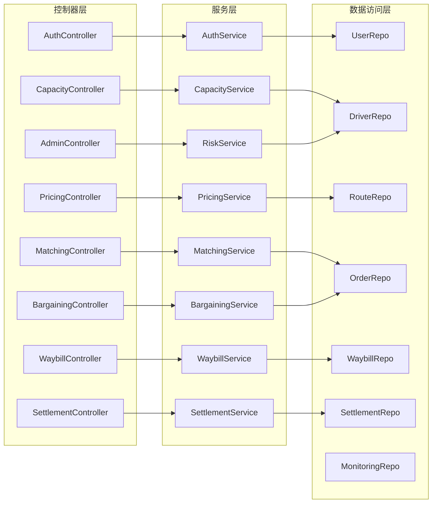
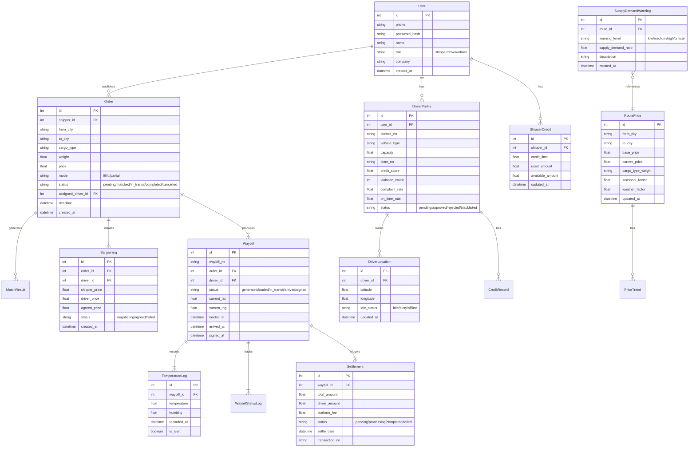

## 1. 架构设计



## 2. 技术说明

- **前端**: React@18 + TailwindCSS@3 + Vite + Zustand（状态管理）
- **初始化工具**: vite-init (react-express-ts 模板)
- **后端**: Express@4 + TypeScript（ESM模式）
- **数据库**: SQLite（data/app.sqlite），无需外部数据库服务
- **地图渲染**: 使用Canvas自绘热力图 + SVG标记点（无外部地图API依赖）
- **图表**: 内置轻量图表组件（Canvas绘制折线图/柱状图/饼图）
- **端口**: FRONTEND_PORT=48841, BACKEND_PORT=58841

## 3. 路由定义

| 路由 | 用途 |
|------|------|
| / | 首页仪表盘 |
| /login | 登录/注册页 |
| /capacity-map | 运力池地图 |
| /route-pricing | 线路运价中心 |
| /matching | 智能撮合引擎 |
| /bargaining/:orderId | 运价博弈界面 |
| /cargo | 货源管理 |
| /driver-workspace | 司机工作台 |
| /monitoring | 全程监控中心 |
| /settlement | 结算中心 |
| /admin/warning | 运营后台-供需预警 |
| /admin/risk | 运营后台-风控管理 |
| /admin/credit | 运营后台-授信管理 |
| /admin/forecast | 运营后台-预测看板 |

## 4. API定义

### 4.1 认证相关

```typescript
POST /api/auth/login
  Request: { phone: string; password: string; role: "shipper" | "driver" | "admin" }
  Response: { token: string; user: UserProfile }

POST /api/auth/register
  Request: { phone: string; password: string; role: string; name: string; company?: string; licenseNo?: string }
  Response: { userId: string; message: string }

GET /api/auth/profile
  Response: UserProfile
```

### 4.2 运力池相关

```typescript
GET /api/capacity/realtime?bounds=nw,se&status=idle&vehicleType=heavy
  Response: { drivers: DriverLocation[]; total: number; timestamp: number }

GET /api/capacity/driver/:driverId
  Response: DriverProfile

GET /api/capacity/statistics
  Response: { totalDrivers: number; idleDrivers: number; busyDrivers: number; offlineDrivers: number; byVehicleType: Record<string, number> }
```

### 4.3 线路运价相关

```typescript
GET /api/pricing/routes?from=&to=&cargoType=
  Response: { routes: RoutePrice[]; total: number }

GET /api/pricing/routes/:routeId
  Response: RoutePriceDetail

GET /api/pricing/trend?routeId=&months=6
  Response: { trend: PriceTrendPoint[]; seasonalFactors: SeasonalFactor[]; weatherImpact: WeatherImpact }

GET /api/pricing/heatmap?region=
  Response: { regions: RegionPrice[] }
```

### 4.4 撮合引擎相关

```typescript
POST /api/matching/publish
  Request: { from: string; to: string; cargoType: string; weight: number; volume?: number; price: number; mode: "ftl" | "ltl" | "partial"; deadline: string; requirements?: string }
  Response: { orderId: string; matches: MatchResult[] }

GET /api/matching/matches/:orderId
  Response: MatchResult[]

POST /api/matching/accept
  Request: { orderId: string; driverId: string; proposedPrice?: number }
  Response: { success: boolean; bargainingId?: string }

POST /api/matching/search-drivers
  Request: { from: string; to: string; vehicleType?: string; minCapacity?: number }
  Response: { drivers: DriverMatchInfo[] }
```

### 4.5 运价博弈相关

```typescript
GET /api/bargaining/:bargainingId
  Response: BargainingDetail

POST /api/bargaining/:bargainingId/offer
  Request: { price: number; message?: string }
  Response: { success: boolean; currentPrice: number; status: string }

POST /api/bargaining/:bargainingId/accept
  Response: { orderId: string; agreedPrice: number }
```

### 4.6 运单相关

```typescript
POST /api/waybill/generate
  Request: { orderId: string }
  Response: Waybill

GET /api/waybill/:waybillId
  Response: WaybillDetail

PUT /api/waybill/:waybillId/status
  Request: { status: "loaded" | "in_transit" | "arrived" | "signed"; location?: { lat: number; lng: number } }
  Response: { success: boolean }

GET /api/waybill/list?status=&page=1&pageSize=20
  Response: { waybills: WaybillSummary[]; total: number }

GET /api/waybill/:waybillId/temperature
  Response: { records: TemperatureRecord[]; alerts: TempAlert[] }
```

### 4.7 结算相关

```typescript
GET /api/settlement/pending?page=1&pageSize=20
  Response: { settlements: SettlementItem[]; total: number }

POST /api/settlement/process/:waybillId
  Response: { settlementId: string; amounts: SettlementSplit }

GET /api/settlement/:settlementId
  Response: SettlementDetail

GET /api/settlement/history?page=1&pageSize=20
  Response: { settlements: SettlementHistory[]; total: number }

POST /api/settlement/withdraw
  Request: { amount: number; bankAccount: string }
  Response: { withdrawalId: string; status: string }
```

### 4.8 运营后台相关

```typescript
GET /api/admin/warnings?page=1&pageSize=20
  Response: { warnings: SupplyDemandWarning[]; total: number }

GET /api/admin/risk/drivers?status=pending&page=1&pageSize=20
  Response: { reviews: DriverRiskReview[]; total: number }

POST /api/admin/risk/drivers/:driverId/approve
  Response: { success: boolean }

POST /api/admin/risk/drivers/:driverId/reject
  Request: { reason: string }
  Response: { success: boolean }

GET /api/admin/credit/shipper?page=1&pageSize=20
  Response: { credits: ShipperCredit[]; total: number }

POST /api/admin/credit/shipper/:shipperId
  Request: { creditLimit: number }
  Response: { success: boolean }

GET /api/admin/forecast?region=&days=30
  Response: { forecasts: ForecastPoint[]; confidence: number }

GET /api/admin/dashboard
  Response: { overview: DashboardStats; alerts: AlertItem[]; topRoutes: TopRoute[] }
```

### 4.9 健康检查

```typescript
GET /api/health
  Response: { status: "ok"; timestamp: number; db: "connected" }
```

## 5. 服务端架构图



## 6. 数据模型

### 6.1 数据模型定义



### 6.2 数据定义语言

```sql
CREATE TABLE IF NOT EXISTS users (
    id INTEGER PRIMARY KEY AUTOINCREMENT,
    phone TEXT NOT NULL UNIQUE,
    password_hash TEXT NOT NULL,
    name TEXT NOT NULL,
    role TEXT NOT NULL CHECK(role IN ('shipper','driver','admin')),
    company TEXT,
    created_at TEXT NOT NULL DEFAULT (datetime('now'))
);

CREATE TABLE IF NOT EXISTS driver_profiles (
    id INTEGER PRIMARY KEY AUTOINCREMENT,
    user_id INTEGER NOT NULL UNIQUE REFERENCES users(id),
    license_no TEXT NOT NULL,
    vehicle_type TEXT NOT NULL,
    capacity REAL NOT NULL,
    plate_no TEXT NOT NULL,
    credit_score REAL NOT NULL DEFAULT 80.0,
    violation_count INTEGER NOT NULL DEFAULT 0,
    complaint_rate REAL NOT NULL DEFAULT 0.0,
    on_time_rate REAL NOT NULL DEFAULT 100.0,
    status TEXT NOT NULL DEFAULT 'pending' CHECK(status IN ('pending','approved','rejected','blacklisted'))
);

CREATE TABLE IF NOT EXISTS driver_locations (
    id INTEGER PRIMARY KEY AUTOINCREMENT,
    driver_id INTEGER NOT NULL REFERENCES driver_profiles(id),
    latitude REAL NOT NULL,
    longitude REAL NOT NULL,
    idle_status TEXT NOT NULL DEFAULT 'idle' CHECK(idle_status IN ('idle','busy','offline')),
    updated_at TEXT NOT NULL DEFAULT (datetime('now'))
);

CREATE TABLE IF NOT EXISTS route_prices (
    id INTEGER PRIMARY KEY AUTOINCREMENT,
    from_city TEXT NOT NULL,
    to_city TEXT NOT NULL,
    base_price REAL NOT NULL,
    current_price REAL NOT NULL,
    cargo_type_weight TEXT NOT NULL DEFAULT '{}',
    seasonal_factor REAL NOT NULL DEFAULT 1.0,
    weather_factor REAL NOT NULL DEFAULT 1.0,
    updated_at TEXT NOT NULL DEFAULT (datetime('now')),
    UNIQUE(from_city, to_city)
);

CREATE TABLE IF NOT EXISTS orders (
    id INTEGER PRIMARY KEY AUTOINCREMENT,
    shipper_id INTEGER NOT NULL REFERENCES users(id),
    from_city TEXT NOT NULL,
    to_city TEXT NOT NULL,
    cargo_type TEXT NOT NULL,
    weight REAL NOT NULL,
    volume REAL,
    price REAL NOT NULL,
    mode TEXT NOT NULL CHECK(mode IN ('ftl','ltl','partial')),
    status TEXT NOT NULL DEFAULT 'pending' CHECK(status IN ('pending','matched','in_transit','completed','cancelled')),
    assigned_driver_id INTEGER REFERENCES driver_profiles(id),
    deadline TEXT,
    created_at TEXT NOT NULL DEFAULT (datetime('now'))
);

CREATE TABLE IF NOT EXISTS bargainings (
    id INTEGER PRIMARY KEY AUTOINCREMENT,
    order_id INTEGER NOT NULL REFERENCES orders(id),
    driver_id INTEGER NOT NULL REFERENCES driver_profiles(id),
    shipper_price REAL NOT NULL,
    driver_price REAL,
    agreed_price REAL,
    status TEXT NOT NULL DEFAULT 'negotiating' CHECK(status IN ('negotiating','agreed','failed')),
    created_at TEXT NOT NULL DEFAULT (datetime('now'))
);

CREATE TABLE IF NOT EXISTS waybills (
    id INTEGER PRIMARY KEY AUTOINCREMENT,
    waybill_no TEXT NOT NULL UNIQUE,
    order_id INTEGER NOT NULL REFERENCES orders(id),
    driver_id INTEGER NOT NULL REFERENCES driver_profiles(id),
    status TEXT NOT NULL DEFAULT 'generated' CHECK(status IN ('generated','loaded','in_transit','arrived','signed')),
    current_lat REAL,
    current_lng REAL,
    loaded_at TEXT,
    arrived_at TEXT,
    signed_at TEXT,
    created_at TEXT NOT NULL DEFAULT (datetime('now'))
);

CREATE TABLE IF NOT EXISTS temperature_logs (
    id INTEGER PRIMARY KEY AUTOINCREMENT,
    waybill_id INTEGER NOT NULL REFERENCES waybills(id),
    temperature REAL NOT NULL,
    humidity REAL NOT NULL,
    recorded_at TEXT NOT NULL DEFAULT (datetime('now')),
    is_alert INTEGER NOT NULL DEFAULT 0
);

CREATE TABLE IF NOT EXISTS waybill_status_logs (
    id INTEGER PRIMARY KEY AUTOINCREMENT,
    waybill_id INTEGER NOT NULL REFERENCES waybills(id),
    status TEXT NOT NULL,
    location_lat REAL,
    location_lng REAL,
    created_at TEXT NOT NULL DEFAULT (datetime('now'))
);

CREATE TABLE IF NOT EXISTS settlements (
    id INTEGER PRIMARY KEY AUTOINCREMENT,
    waybill_id INTEGER NOT NULL REFERENCES waybills(id),
    total_amount REAL NOT NULL,
    driver_amount REAL NOT NULL,
    platform_fee REAL NOT NULL,
    status TEXT NOT NULL DEFAULT 'pending' CHECK(status IN ('pending','processing','completed','failed')),
    settle_date TEXT,
    transaction_no TEXT,
    created_at TEXT NOT NULL DEFAULT (datetime('now'))
);

CREATE TABLE IF NOT EXISTS shipper_credits (
    id INTEGER PRIMARY KEY AUTOINCREMENT,
    shipper_id INTEGER NOT NULL UNIQUE REFERENCES users(id),
    credit_limit REAL NOT NULL DEFAULT 50000.0,
    used_amount REAL NOT NULL DEFAULT 0.0,
    available_amount REAL NOT NULL DEFAULT 50000.0,
    updated_at TEXT NOT NULL DEFAULT (datetime('now'))
);

CREATE TABLE IF NOT EXISTS supply_demand_warnings (
    id INTEGER PRIMARY KEY AUTOINCREMENT,
    route_id INTEGER REFERENCES route_prices(id),
    warning_level TEXT NOT NULL CHECK(warning_level IN ('low','medium','high','critical')),
    supply_demand_ratio REAL NOT NULL,
    description TEXT,
    created_at TEXT NOT NULL DEFAULT (datetime('now'))
);

CREATE INDEX IF NOT EXISTS idx_driver_locations_status ON driver_locations(idle_status);
CREATE INDEX IF NOT EXISTS idx_orders_status ON orders(status);
CREATE INDEX IF NOT EXISTS idx_orders_shipper ON orders(shipper_id);
CREATE INDEX IF NOT EXISTS idx_waybills_status ON waybills(status);
CREATE INDEX IF NOT EXISTS idx_temperature_logs_waybill ON temperature_logs(waybill_id);
CREATE INDEX IF NOT EXISTS idx_settlements_status ON settlements(status);
CREATE INDEX IF NOT EXISTS idx_route_prices_cities ON route_prices(from_city, to_city);
```
