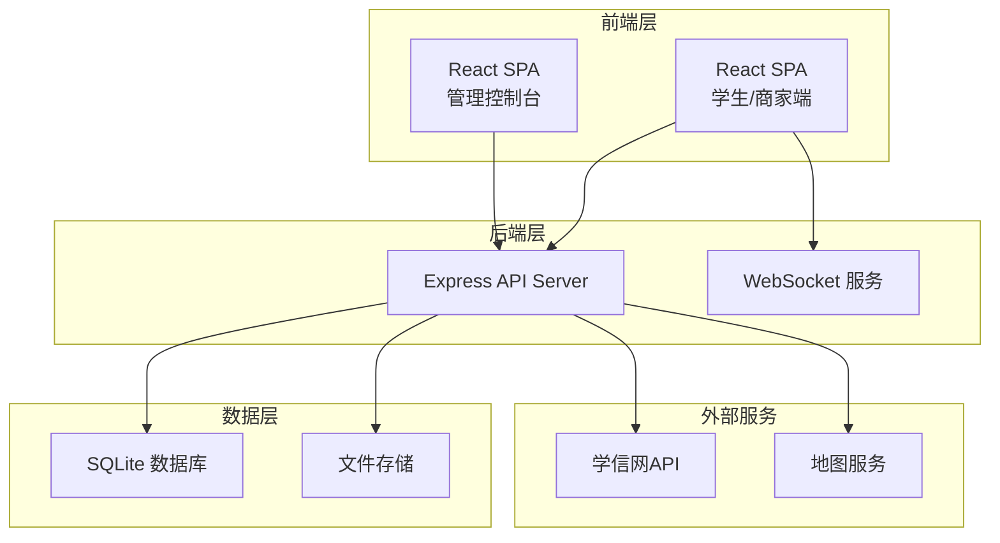
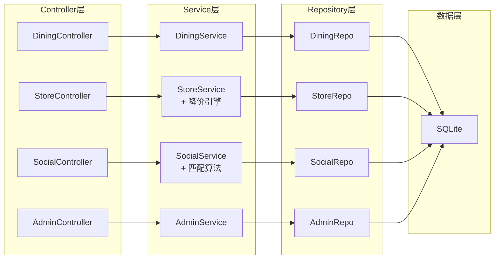
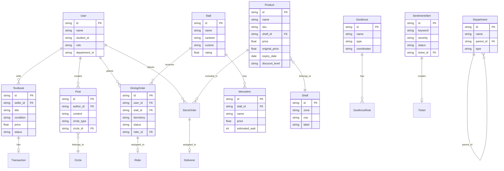

## 1. 架构设计



## 2. 技术说明

- 前端：React@18 + tailwindcss@3 + vite + zustand + react-router-dom
- 初始化工具：vite-init
- 后端：Express@4 + TypeScript（ESM格式）
- 数据库：SQLite（开发阶段mock数据辅助展示）
- 图表：recharts
- 图标：lucide-react

## 3. 路由定义

| 路由 | 用途 |
|------|------|
| / | 首页仪表盘 |
| /dining | 餐饮板块-档口列表 |
| /dining/order/:id | 餐饮-订单详情与配送追踪 |
| /dining/rider | 餐饮-西游侠骑手工作台 |
| /store | 校园超市-商品浏览 |
| /store/expiring | 超市-临期特价专区 |
| /store/deliverer | 超市-筋斗云配送员工作台 |
| /social | 社交-动态圈 |
| /social/trade | 社交-二手教材交易 |
| /social/intern | 社交-实习岗位匹配 |
| /admin | 管理控制台-概览 |
| /admin/org | 管理-院系组织架构 |
| /admin/geofence | 管理-电子围栏配置 |
| /admin/verify | 管理-学生身份核验 |
| /admin/analytics | 管理-消费行为分析 |
| /admin/sentiment | 管理-舆情监测与工单 |

## 4. API 定义

### 4.1 餐饮模块

```typescript
interface Stall {
  id: string
  name: string
  canteen: string
  cuisine: string
  rating: number
  coverImage: string
  menuItems: MenuItem[]
}

interface MenuItem {
  id: string
  name: string
  price: number
  category: string
  estimatedWait: number
}

interface DiningOrder {
  id: string
  userId: string
  stallId: string
  items: OrderItem[]
  dormitory: string
  deliveryTime: string
  status: "pending" | "confirmed" | "preparing" | "delivering" | "delivered"
  riderId?: string
  deliveryPath?: DeliveryPoint[]
  qrCode?: string
}

interface DeliveryPoint {
  lat: number
  lng: number
  timestamp: string
}

// GET /api/dining/stalls - 获取档口列表
// GET /api/dining/stalls/:id - 获取档口详情
// POST /api/dining/orders - 创建订单
// GET /api/dining/orders/:id - 获取订单详情（含配送路径）
// POST /api/dining/orders/:id/deliver - 扫码交付确认
// GET /api/dining/rider/tasks - 骑手获取待接单任务
// POST /api/dining/rider/accept/:orderId - 骑手接单
```

### 4.2 超市模块

```typescript
interface Product {
  id: string
  name: string
  sku: string
  shelfId: string
  shelfPosition: string
  price: number
  originalPrice?: number
  stock: number
  expiryDate: string
  isExpiring: boolean
  discountLevel?: "mild" | "moderate" | "urgent"
  image: string
}

interface Shelf {
  id: string
  zone: string
  row: string
  label: string
  products: Product[]
}

interface DeliveryTask {
  id: string
  orderId: string
  delivererId: string
  status: "assigned" | "picking" | "delivering" | "delivered"
  route: string[]
  estimatedTime: number
}

// GET /api/store/products - 商品列表（支持筛选）
// GET /api/store/shelves - 货架分区列表
// GET /api/store/expiring - 临期商品列表
// POST /api/store/orders - 创建超市订单
// GET /api/store/deliverer/tasks - 配送员任务池
// POST /api/store/deliverer/pick/:taskId - 配送员取单
```

### 4.3 社交模块

```typescript
interface Post {
  id: string
  authorId: string
  authorName: string
  authorAvatar: string
  content: string
  images?: string[]
  tags: string[]
  circleType: "class" | "department" | "interest"
  circleId: string
  likes: number
  comments: number
  createdAt: string
}

interface Textbook {
  id: string
  sellerId: string
  title: string
  course: string
  condition: "new" | "good" | "fair" | "poor"
  price: number
  originalPrice: number
  images: string[]
  status: "available" | "reserved" | "sold"
  escrowPayment: boolean
}

interface Internship {
  id: string
  company: string
  position: string
  requirements: string[]
  schedule: string
  matchedSkills: string[]
  matchScore: number
  creditRelated: boolean
}

// GET /api/social/posts - 动态列表
// POST /api/social/posts - 发布动态
// GET /api/social/textbooks - 二手教材列表
// POST /api/social/textbooks - 发布教材
// POST /api/social/textbooks/:id/buy - 担保支付购买
// GET /api/social/internships - 推荐实习岗位
// GET /api/social/internships/match - 智能匹配
```

### 4.4 管理控制台

```typescript
interface Department {
  id: string
  name: string
  parentId?: string
  type: "university" | "college" | "department" | "class"
  memberCount: number
}

interface Geofence {
  id: string
  name: string
  type: "delivery" | "restricted" | "service"
  coordinates: [number, number][]
  rules: string[]
}

interface VerificationResult {
  studentId: string
  name: string
  status: "verified" | "pending" | "failed"
  verifiedAt?: string
}

interface AnalyticsData {
  timeRange: string
  breakfastHeatmap: Record<string, number>
  snackRepurchaseRate: number
  consumptionTrend: { date: string; amount: number }[]
  timeDistribution: { hour: number; orders: number }[]
}

interface SentimentAlert {
  id: string
  keyword: string
  source: string
  content: string
  severity: "low" | "medium" | "high"
  status: "open" | "processing" | "resolved"
  ticketId?: string
}

// GET /api/admin/departments - 组织架构树
// POST /api/admin/departments - 创建部门
// PUT /api/admin/departments/:id - 更新部门
// GET /api/admin/geofences - 围栏列表
// POST /api/admin/geofences - 创建围栏
// POST /api/admin/verify - 批量身份核验
// GET /api/admin/analytics/consumption - 消费行为分析
// GET /api/admin/analytics/heatmap - 热力图数据
// GET /api/admin/sentiment/alerts - 舆情告警列表
// POST /api/admin/sentiment/tickets - 创建工单
// PUT /api/admin/sentiment/tickets/:id - 更新工单状态
```

## 5. 服务端架构图



## 6. 数据模型

### 6.1 数据模型定义



### 6.2 数据定义语言

```sql
CREATE TABLE users (
  id TEXT PRIMARY KEY,
  name TEXT NOT NULL,
  student_id TEXT UNIQUE,
  role TEXT NOT NULL CHECK(role IN ('student', 'merchant', 'rider', 'deliverer', 'admin')),
  department_id TEXT,
  avatar TEXT,
  phone TEXT,
  created_at DATETIME DEFAULT CURRENT_TIMESTAMP
);

CREATE TABLE stalls (
  id TEXT PRIMARY KEY,
  name TEXT NOT NULL,
  canteen TEXT NOT NULL,
  cuisine TEXT NOT NULL,
  rating REAL DEFAULT 0,
  cover_image TEXT,
  status TEXT DEFAULT 'open'
);

CREATE TABLE menu_items (
  id TEXT PRIMARY KEY,
  stall_id TEXT NOT NULL REFERENCES stalls(id),
  name TEXT NOT NULL,
  price REAL NOT NULL,
  category TEXT,
  estimated_wait INTEGER DEFAULT 10,
  available INTEGER DEFAULT 1
);

CREATE TABLE dining_orders (
  id TEXT PRIMARY KEY,
  user_id TEXT NOT NULL REFERENCES users(id),
  stall_id TEXT NOT NULL REFERENCES stalls(id),
  rider_id TEXT REFERENCES users(id),
  dormitory TEXT NOT NULL,
  delivery_time TEXT,
  status TEXT DEFAULT 'pending',
  total_price REAL,
  qr_code TEXT,
  created_at DATETIME DEFAULT CURRENT_TIMESTAMP
);

CREATE TABLE dining_order_items (
  id TEXT PRIMARY KEY,
  order_id TEXT NOT NULL REFERENCES dining_orders(id),
  menu_item_id TEXT NOT NULL REFERENCES menu_items(id),
  quantity INTEGER DEFAULT 1,
  price REAL NOT NULL
);

CREATE TABLE delivery_paths (
  id TEXT PRIMARY KEY,
  order_id TEXT NOT NULL REFERENCES dining_orders(id),
  lat REAL NOT NULL,
  lng REAL NOT NULL,
  timestamp DATETIME DEFAULT CURRENT_TIMESTAMP
);

CREATE TABLE shelves (
  id TEXT PRIMARY KEY,
  zone TEXT NOT NULL,
  row TEXT NOT NULL,
  label TEXT NOT NULL
);

CREATE TABLE products (
  id TEXT PRIMARY KEY,
  name TEXT NOT NULL,
  sku TEXT UNIQUE NOT NULL,
  shelf_id TEXT REFERENCES shelves(id),
  shelf_position TEXT,
  price REAL NOT NULL,
  original_price REAL,
  stock INTEGER DEFAULT 0,
  expiry_date DATE,
  discount_level TEXT CHECK(discount_level IN ('mild', 'moderate', 'urgent')),
  image TEXT,
  created_at DATETIME DEFAULT CURRENT_TIMESTAMP
);

CREATE TABLE store_orders (
  id TEXT PRIMARY KEY,
  user_id TEXT NOT NULL REFERENCES users(id),
  deliverer_id TEXT REFERENCES users(id),
  status TEXT DEFAULT 'pending',
  total_price REAL,
  created_at DATETIME DEFAULT CURRENT_TIMESTAMP
);

CREATE TABLE store_order_items (
  id TEXT PRIMARY KEY,
  order_id TEXT NOT NULL REFERENCES store_orders(id),
  product_id TEXT NOT NULL REFERENCES products(id),
  quantity INTEGER DEFAULT 1,
  price REAL NOT NULL
);

CREATE TABLE circles (
  id TEXT PRIMARY KEY,
  name TEXT NOT NULL,
  type TEXT NOT NULL CHECK(type IN ('class', 'department', 'interest')),
  tag TEXT
);

CREATE TABLE posts (
  id TEXT PRIMARY KEY,
  author_id TEXT NOT NULL REFERENCES users(id),
  circle_id TEXT REFERENCES circles(id),
  content TEXT NOT NULL,
  images TEXT,
  tags TEXT,
  likes INTEGER DEFAULT 0,
  comments_count INTEGER DEFAULT 0,
  created_at DATETIME DEFAULT CURRENT_TIMESTAMP
);

CREATE TABLE textbooks (
  id TEXT PRIMARY KEY,
  seller_id TEXT NOT NULL REFERENCES users(id),
  title TEXT NOT NULL,
  course TEXT,
  condition TEXT NOT NULL CHECK(condition IN ('new', 'good', 'fair', 'poor')),
  price REAL NOT NULL,
  original_price REAL NOT NULL,
  images TEXT,
  status TEXT DEFAULT 'available' CHECK(status IN ('available', 'reserved', 'sold')),
  created_at DATETIME DEFAULT CURRENT_TIMESTAMP
);

CREATE TABLE transactions (
  id TEXT PRIMARY KEY,
  textbook_id TEXT NOT NULL REFERENCES textbooks(id),
  buyer_id TEXT NOT NULL REFERENCES users(id),
  amount REAL NOT NULL,
  status TEXT DEFAULT 'escrow' CHECK(status IN ('escrow', 'released', 'refunded')),
  created_at DATETIME DEFAULT CURRENT_TIMESTAMP
);

CREATE TABLE internships (
  id TEXT PRIMARY KEY,
  company TEXT NOT NULL,
  position TEXT NOT NULL,
  requirements TEXT,
  schedule TEXT,
  credit_related INTEGER DEFAULT 0,
  created_at DATETIME DEFAULT CURRENT_TIMESTAMP
);

CREATE TABLE departments (
  id TEXT PRIMARY KEY,
  name TEXT NOT NULL,
  parent_id TEXT REFERENCES departments(id),
  type TEXT NOT NULL CHECK(type IN ('university', 'college', 'department', 'class')),
  member_count INTEGER DEFAULT 0
);

CREATE TABLE geofences (
  id TEXT PRIMARY KEY,
  name TEXT NOT NULL,
  type TEXT NOT NULL CHECK(type IN ('delivery', 'restricted', 'service')),
  coordinates TEXT NOT NULL,
  rules TEXT
);

CREATE TABLE verifications (
  id TEXT PRIMARY KEY,
  student_id TEXT NOT NULL,
  name TEXT NOT NULL,
  status TEXT DEFAULT 'pending' CHECK(status IN ('verified', 'pending', 'failed')),
  verified_at DATETIME
);

CREATE TABLE sentiment_alerts (
  id TEXT PRIMARY KEY,
  keyword TEXT NOT NULL,
  source TEXT,
  content TEXT,
  severity TEXT DEFAULT 'low' CHECK(severity IN ('low', 'medium', 'high')),
  status TEXT DEFAULT 'open' CHECK(status IN ('open', 'processing', 'resolved')),
  ticket_id TEXT,
  created_at DATETIME DEFAULT CURRENT_TIMESTAMP
);

CREATE TABLE tickets (
  id TEXT PRIMARY KEY,
  alert_id TEXT REFERENCES sentiment_alerts(id),
  title TEXT NOT NULL,
  description TEXT,
  assignee TEXT,
  status TEXT DEFAULT 'open' CHECK(status IN ('open', 'in_progress', 'resolved', 'closed')),
  created_at DATETIME DEFAULT CURRENT_TIMESTAMP
);

CREATE TABLE consumption_analytics (
  id TEXT PRIMARY KEY,
  date DATE NOT NULL,
  hour INTEGER,
  category TEXT,
  order_count INTEGER DEFAULT 0,
  total_amount REAL DEFAULT 0,
  unique_users INTEGER DEFAULT 0
);
```
