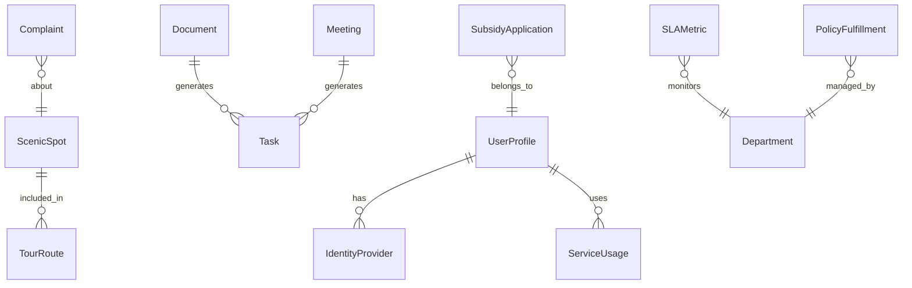

## 1. 架构设计

```mermaid
graph TB
    subgraph "前端层"
        "React SPA" --> "路由管理"
        "React SPA" --> "状态管理 Zustand"
        "React SPA" --> "UI组件库"
    end

    subgraph "数据层"
        "Mock数据服务" --> "用户画像数据"
        "Mock数据服务" --> "政务办公数据"
        "Mock数据服务" --> "文旅景区数据"
        "Mock数据服务" --> "民生服务数据"
        "Mock数据服务" --> "监控指标数据"
    end

    subgraph "外部服务对接（模拟）"
        "广西政务云认证"
        "银联/微信/支付宝"
        "全国医保平台"
        "文旅局系统"
    end

    "路由管理" --> "千人千面首页"
    "路由管理" --> "统一身份中枢"
    "路由管理" --> "智政办公"
    "路由管理" --> "智游八桂"
    "路由管理" --> "智惠民生"
    "路由管理" --> "运营监测中心"
```

## 2. 技术说明

- **前端**: React@18 + TypeScript + Tailwind CSS@3 + Vite
- **初始化工具**: vite-init
- **后端**: 无独立后端，使用前端Mock数据
- **状态管理**: Zustand
- **图表库**: Recharts（轻量级React图表）
- **图标**: Lucide React
- **路由**: React Router DOM v6

## 3. 路由定义

| 路由 | 用途 |
|------|------|
| `/` | 千人千面首页，基于角色的服务聚合展示 |
| `/identity` | 统一身份中枢，认证管理与角色切换 |
| `/gov` | 智政办公，公文摘要+会议纪要+任务督办 |
| `/tour` | 智游八桂，景区预约+路线规划+投诉直连 |
| `/livelihood` | 智惠民生，补贴申领+免证办+医保社保 |
| `/monitor` | 运营监测中心，SLA监控+政策兑现追踪 |

## 4. API定义（Mock）

### 4.1 用户相关

```typescript
interface UserProfile {
  id: string
  name: string
  role: "official" | "enterprise" | "citizen" | "tourist"
  avatar: string
  location: { city: string; lat: number; lng: number }
  preferences: string[]
}

interface IdentityProvider {
  provider: "govcloud" | "unionpay" | "wechat" | "alipay"
  status: "connected" | "disconnected" | "expired"
  lastAuth: string
}
```

### 4.2 智政办公

```typescript
interface Document {
  id: string
  title: string
  summary: string
  keywords: string[]
  status: "draft" | "reviewing" | "approved" | "archived"
  createdAt: string
  source: string
}

interface Meeting {
  id: string
  title: string
  date: string
  attendees: number
  minutes: string
  actionItems: string[]
  status: "pending" | "generating" | "completed"
}

interface Task {
  id: string
  title: string
  assignee: string
  status: "todo" | "in_progress" | "done"
  priority: "high" | "medium" | "low"
  deadline: string
  overdue: boolean
}
```

### 4.3 智游八桂

```typescript
interface ScenicSpot {
  id: string
  name: string
  level: "5A" | "4A" | "3A"
  currentVisitors: number
  maxCapacity: number
  heatLevel: "low" | "medium" | "high" | "full"
  availableSlots: { time: string; remaining: number }[]
}

interface TourRoute {
  id: string
  name: string
  spots: string[]
  duration: string
  difficulty: "easy" | "moderate" | "challenging"
  description: string
}

interface Complaint {
  id: string
  title: string
  content: string
  status: "submitted" | "processing" | "resolved"
  createdAt: string
  reply?: string
}
```

### 4.4 智惠民生

```typescript
interface SubsidyApplication {
  id: string
  type: "elderly" | "newborn" | "medical"
  applicant: string
  status: "eligible" | "applying" | "approved" | "disbursed"
  amount?: number
  timeline: { step: string; date: string; status: string }[]
}

interface MedicalInsurance {
  balance: number
  monthlyDeposit: number
  lastPayment: string
  crossRegionStatus: "active" | "inactive"
  crossRegionRecords: { hospital: string; date: string; amount: number }[]
}
```

### 4.5 运营监测

```typescript
interface SLAMetric {
  department: string
  api: string
  avgResponseTime: number
  p99ResponseTime: number
  slaTarget: number
  complianceRate: number
  status: "healthy" | "warning" | "critical"
}

interface PolicyFulfillment {
  policyName: string
  targetEnterprises: number
  reachedEnterprises: number
  totalAmount: number
  avgDisbursementDays: number
  complianceRate: number
}
```

## 5. 数据模型

### 5.1 数据模型定义



## 6. 项目结构

```
src/
├── components/         # 通用组件
│   ├── Layout.tsx      # 主布局框架
│   ├── Sidebar.tsx     # 侧边导航
│   ├── ServiceCard.tsx # 服务聚合卡片
│   ├── StatCard.tsx    # 统计指标卡片
│   ├── StatusBadge.tsx # 状态徽章
│   └── AnimatedNumber.tsx # 数字滚动动画
├── pages/
│   ├── Home.tsx        # 千人千面首页
│   ├── Identity.tsx    # 统一身份中枢
│   ├── GovOffice.tsx   # 智政办公
│   ├── SmartTour.tsx   # 智游八桂
│   ├── Livelihood.tsx  # 智惠民生
│   └── Monitor.tsx     # 运营监测中心
├── store/
│   └── useAppStore.ts  # Zustand全局状态
├── data/
│   └── mock.ts         # Mock数据定义
├── hooks/
│   └── useRole.ts      # 角色相关Hook
├── App.tsx
└── main.tsx
```
