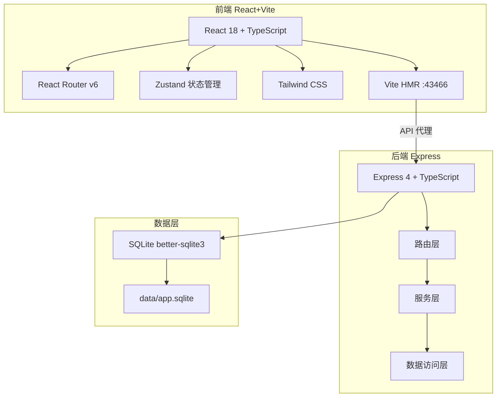

## 1. 架构设计



## 2. 技术说明
- 前端：React@18 + TailwindCSS@3 + Vite + Zustand + React Router v6
- 初始化工具：vite-init（react-express-ts 模板）
- 后端：Express@4 + TypeScript (ESM)
- 数据库：SQLite (better-sqlite3)，文件路径 data/app.sqlite
- 无外部依赖服务

## 3. 路由定义
| 路由 | 用途 |
|------|------|
| / | 首页，宠物展示 |
| /pets | 宠物列表 |
| /pets/:id | 宠物详情 |
| /apply/:petId | 领养申请 |
| /my-applications | 我的申请 |
| /review | 审核管理 |
| /review/:id | 审核详情 |
| /follow-up | 回访管理 |
| /follow-up/:id | 回访详情 |
| /dashboard | 运营看板 |
| /organization | 机构管理 |
| /volunteer | 志愿者中心 |
| /login | 登录 |
| /register | 注册 |

## 4. API 定义

### 4.1 认证
- POST /api/auth/register — 注册
- POST /api/auth/login — 登录
- GET /api/auth/me — 当前用户

### 4.2 宠物档案
- GET /api/pets — 宠物列表（支持筛选、分页）
- GET /api/pets/:id — 宠物详情
- POST /api/pets — 创建宠物档案
- PUT /api/pets/:id — 更新宠物档案
- POST /api/pets/:id/photos — 上传宠物照片

### 4.3 领养申请
- GET /api/applications — 申请列表
- GET /api/applications/:id — 申请详情
- POST /api/applications — 提交申请
- PUT /api/applications/:id — 更新/补充资料
- GET /api/applications/my — 我的申请

### 4.4 审核流程
- PUT /api/applications/:id/review — 审核操作（初筛/面谈/家访/试养/正式领养/拒绝）
- GET /api/reviews/pending — 待审核列表

### 4.5 回访计划
- GET /api/follow-ups — 回访列表
- GET /api/follow-ups/:id — 回访详情
- POST /api/follow-ups — 创建回访计划
- PUT /api/follow-ups/:id — 更新回访记录
- POST /api/follow-ups/:id/feedback — 提交反馈
- POST /api/follow-ups/:id/return — 退养处理

### 4.6 运营看板
- GET /api/dashboard/stats — 统计数据
- GET /api/dashboard/adoption-rate — 领养成功率
- GET /api/dashboard/return-reasons — 退养原因分析
- GET /api/dashboard/volunteer-tasks — 志愿者任务
- GET /api/dashboard/resource-gaps — 机构资源缺口

### 4.7 志愿者
- GET /api/volunteer/tasks — 志愿者任务列表
- PUT /api/volunteer/tasks/:id — 接取/完成任务

### 4.8 机构
- GET /api/organizations/profile — 机构信息
- GET /api/organizations/pets — 机构宠物
- GET /api/organizations/volunteers — 机构志愿者

### 4.9 系统
- GET /api/health — 健康检查

## 5. 服务架构图


## 6. 数据模型

### 6.1 ER 图

```mermaid
erDiagram
    users {
        int id PK
        string username
        string password_hash
        string role
        string name
        string phone
        string email
        string avatar
        datetime created_at
        datetime updated_at
    }
    organizations {
        int id PK
        string name
        string contact_person
        string phone
        string address
        string description
        int user_id FK
        string status
        datetime created_at
    }
    pets {
        int id PK
        string name
        string breed
        string species
        int age
        string gender
        string health_status
        string vaccination_status
        string neutered_status
        string personality_tags
        string description
        string rescue_source
        string status
        int organization_id FK
        datetime created_at
        datetime updated_at
    }
    pet_photos {
        int id PK
        int pet_id FK
        string url
        boolean is_primary
        int sort_order
    }
    applications {
        int id PK
        int pet_id FK
        int applicant_id FK
        string home_condition
        string pet_experience
        string living_environment
        string contact_name
        string contact_phone
        boolean agreement_signed
        string status
        string supplementary_info
        datetime created_at
        datetime updated_at
    }
    application_reviews {
        int id PK
        int application_id FK
        int reviewer_id FK
        string stage
        string result
        string reject_reason
        string notes
        datetime created_at
    }
    follow_ups {
        int id PK
        int application_id FK
        int pet_id FK
        int volunteer_id FK
        string status
        datetime scheduled_date
        datetime completed_date
        string feedback
        string health_status
        string abnormal_alert
        datetime created_at
        datetime updated_at
    }
    follow_up_photos {
        int id PK
        int follow_up_id FK
        string url
        datetime created_at
    }
    return_records {
        int id PK
        int application_id FK
        int pet_id FK
        string reason
        string description
        datetime created_at
    }
    volunteer_tasks {
        int id PK
        int volunteer_id FK
        int organization_id FK
        string task_type
        string status
        string description
        int related_id
        datetime due_date
        datetime completed_at
        datetime created_at
    }
    users ||--o{ applications : "submits"
    users ||--o{ organizations : "manages"
    organizations ||--o{ pets : "rescues"
    pets ||--o{ pet_photos : "has"
    pets ||--o{ applications : "applied_for"
    applications ||--o{ application_reviews : "reviewed_in"
    applications ||--o{ follow_ups : "followed_up"
    follow_ups ||--o{ follow_up_photos : "has"
    applications ||--o{ return_records : "returned_in"
    users ||--o{ volunteer_tasks : "assigned_to"
```



### 6.2 DDL

```sql
CREATE TABLE users (
    id INTEGER PRIMARY KEY AUTOINCREMENT,
    username TEXT NOT NULL UNIQUE,
    password_hash TEXT NOT NULL,
    role TEXT NOT NULL CHECK(role IN ('admin','organization','adopter','volunteer')),
    name TEXT NOT NULL,
    phone TEXT,
    email TEXT,
    avatar TEXT,
    created_at TEXT DEFAULT (datetime('now')),
    updated_at TEXT DEFAULT (datetime('now'))
);

CREATE TABLE organizations (
    id INTEGER PRIMARY KEY AUTOINCREMENT,
    name TEXT NOT NULL,
    contact_person TEXT NOT NULL,
    phone TEXT NOT NULL,
    address TEXT,
    description TEXT,
    user_id INTEGER NOT NULL REFERENCES users(id),
    status TEXT DEFAULT 'pending' CHECK(status IN ('pending','approved','rejected','suspended')),
    created_at TEXT DEFAULT (datetime('now'))
);

CREATE TABLE pets (
    id INTEGER PRIMARY KEY AUTOINCREMENT,
    name TEXT NOT NULL,
    breed TEXT,
    species TEXT NOT NULL CHECK(species IN ('dog','cat','rabbit','bird','other')),
    age INTEGER,
    gender TEXT CHECK(gender IN ('male','female','unknown')),
    health_status TEXT DEFAULT 'healthy' CHECK(health_status IN ('healthy','minor_issue','chronic','critical')),
    vaccination_status TEXT DEFAULT 'unknown' CHECK(vaccination_status IN ('complete','partial','none','unknown')),
    neutered_status TEXT DEFAULT 'unknown' CHECK(neutered_status IN ('yes','no','unknown')),
    personality_tags TEXT,
    description TEXT,
    rescue_source TEXT,
    status TEXT DEFAULT 'available' CHECK(status IN ('available','pending','trial','adopted','returned','deceased')),
    organization_id INTEGER NOT NULL REFERENCES organizations(id),
    created_at TEXT DEFAULT (datetime('now')),
    updated_at TEXT DEFAULT (datetime('now'))
);

CREATE TABLE pet_photos (
    id INTEGER PRIMARY KEY AUTOINCREMENT,
    pet_id INTEGER NOT NULL REFERENCES pets(id) ON DELETE CASCADE,
    url TEXT NOT NULL,
    is_primary INTEGER DEFAULT 0,
    sort_order INTEGER DEFAULT 0
);

CREATE TABLE applications (
    id INTEGER PRIMARY KEY AUTOINCREMENT,
    pet_id INTEGER NOT NULL REFERENCES pets(id),
    applicant_id INTEGER NOT NULL REFERENCES users(id),
    home_condition TEXT,
    pet_experience TEXT,
    living_environment TEXT,
    contact_name TEXT NOT NULL,
    contact_phone TEXT NOT NULL,
    agreement_signed INTEGER DEFAULT 0,
    status TEXT DEFAULT 'submitted' CHECK(status IN ('submitted','initial_screening','interview','home_visit','trial','adopted','rejected','returned')),
    supplementary_info TEXT,
    created_at TEXT DEFAULT (datetime('now')),
    updated_at TEXT DEFAULT (datetime('now'))
);

CREATE TABLE application_reviews (
    id INTEGER PRIMARY KEY AUTOINCREMENT,
    application_id INTEGER NOT NULL REFERENCES applications(id),
    reviewer_id INTEGER NOT NULL REFERENCES users(id),
    stage TEXT NOT NULL CHECK(stage IN ('initial_screening','interview','home_visit','trial','final')),
    result TEXT NOT NULL CHECK(result IN ('pass','reject','hold')),
    reject_reason TEXT,
    notes TEXT,
    created_at TEXT DEFAULT (datetime('now'))
);

CREATE TABLE follow_ups (
    id INTEGER PRIMARY KEY AUTOINCREMENT,
    application_id INTEGER NOT NULL REFERENCES applications(id),
    pet_id INTEGER NOT NULL REFERENCES pets(id),
    volunteer_id INTEGER REFERENCES users(id),
    status TEXT DEFAULT 'planned' CHECK(status IN ('planned','in_progress','completed','abnormal')),
    scheduled_date TEXT NOT NULL,
    completed_date TEXT,
    feedback TEXT,
    health_status TEXT,
    abnormal_alert TEXT,
    created_at TEXT DEFAULT (datetime('now')),
    updated_at TEXT DEFAULT (datetime('now'))
);

CREATE TABLE follow_up_photos (
    id INTEGER PRIMARY KEY AUTOINCREMENT,
    follow_up_id INTEGER NOT NULL REFERENCES follow_ups(id) ON DELETE CASCADE,
    url TEXT NOT NULL,
    created_at TEXT DEFAULT (datetime('now'))
);

CREATE TABLE return_records (
    id INTEGER PRIMARY KEY AUTOINCREMENT,
    application_id INTEGER NOT NULL REFERENCES applications(id),
    pet_id INTEGER NOT NULL REFERENCES pets(id),
    reason TEXT NOT NULL,
    description TEXT,
    created_at TEXT DEFAULT (datetime('now'))
);

CREATE TABLE volunteer_tasks (
    id INTEGER PRIMARY KEY AUTOINCREMENT,
    volunteer_id INTEGER REFERENCES users(id),
    organization_id INTEGER NOT NULL REFERENCES organizations(id),
    task_type TEXT NOT NULL CHECK(task_type IN ('home_visit','follow_up','transport','foster','other')),
    status TEXT DEFAULT 'available' CHECK(status IN ('available','assigned','in_progress','completed','cancelled')),
    description TEXT,
    related_id INTEGER,
    due_date TEXT,
    completed_at TEXT,
    created_at TEXT DEFAULT (datetime('now'))
);

CREATE INDEX idx_pets_status ON pets(status);
CREATE INDEX idx_pets_organization ON pets(organization_id);
CREATE INDEX idx_applications_pet ON applications(pet_id);
CREATE INDEX idx_applications_applicant ON applications(applicant_id);
CREATE INDEX idx_applications_status ON applications(status);
CREATE INDEX idx_reviews_application ON application_reviews(application_id);
CREATE INDEX idx_followups_application ON follow_ups(application_id);
CREATE INDEX idx_followups_volunteer ON follow_ups(volunteer_id);
CREATE INDEX idx_volunteer_tasks_volunteer ON volunteer_tasks(volunteer_id);
CREATE INDEX idx_volunteer_tasks_org ON volunteer_tasks(organization_id);
```

## 7. 端口配置
- FRONTEND_PORT = 43466（40000 + 3466）
- BACKEND_PORT = 53466（50000 + 3466）
- Vite strictPort = true
- 后端显式绑定 127.0.0.1:53466
- CORS 允许 http://127.0.0.1:43466
