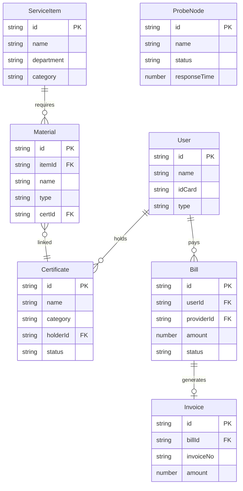

## 1. 架构设计

```mermaid
graph TB
    subgraph "前端层"
        "React SPA" --> "路由管理"
        "React SPA" --> "状态管理 Zustand"
        "React SPA" --> "UI组件库"
    end

    subgraph "数据层"
        "Mock数据服务" --> "证照数据"
        "Mock数据服务" --> "事项数据"
        "Mock数据服务" --> "缴费数据"
        "Mock数据服务" --> "监控数据"
    end

    subgraph "外部服务模拟"
        "电子证照库API" --> "407类证照接口"
        "政务流程引擎API" --> "办事指南/材料预检接口"
        "国企缴费系统API" --> "19家缴费接口"
        "拨测/NPS/热词API" --> "监控分析接口"
    end

    "React SPA" --> "Mock数据服务"
    "Mock数据服务" --> "电子证照库API"
    "Mock数据服务" --> "政务流程引擎API"
    "Mock数据服务" --> "国企缴费系统API"
    "Mock数据服务" --> "拨测/NPS/热词API"
```

## 2. 技术说明

- **前端框架**：React@18 + TypeScript + Vite
- **样式方案**：Tailwind CSS@3 + CSS变量主题系统
- **状态管理**：Zustand（轻量级全局状态）
- **路由方案**：React Router DOM v6
- **图标库**：lucide-react
- **图表库**：recharts（用于监控页数据可视化）
- **后端服务**：无独立后端，使用前端Mock数据模拟
- **数据方案**：Mock数据 + localStorage持久化

## 3. 路由定义

| 路由 | 用途 |
|------|------|
| `/` | 首页 - 全局搜索、快捷入口、热门事项、公告通知、数据看板 |
| `/certificates` | 电子证照页 - 证照库、免证办场景、授权管理 |
| `/services` | 政务办事页 - 事项导航、办事指南、材料预检、表单填充、联办编排 |
| `/services/:id` | 办事指南详情页 - 单事项完整指南 |
| `/services/joint` | 联办编排页 - 多事项联合办理 |
| `/life` | 生活服务页 - 缴费中心、电子发票、缴款凭证 |
| `/monitor` | 运营监控页 - 拨测中心、NPS采集、热词分析、缺口预警 |

## 4. API定义

### 4.1 证照相关接口

```typescript
interface Certificate {
  id: string
  name: string
  category: string
  holderName: string
  holderId: string
  issueDate: string
  expiryDate: string
  status: "valid" | "expired" | "expiring_soon"
  issuer: string
  credentialNo: string
}

interface CertificateCategory {
  id: string
  name: string
  count: number
  icon: string
}

interface ExemptionScenario {
  id: string
  itemName: string
  requiredCerts: string[]
  autoFilled: boolean
  status: "available" | "partial" | "unavailable"
}
```

### 4.2 事项相关接口

```typescript
interface ServiceItem {
  id: string
  name: string
  department: string
  category: string
  description: string
  materials: Material[]
  processSteps: ProcessStep[]
  timeLimit: string
  fee: string
  location: string
  onlineRate: number
}

interface Material {
  id: string
  name: string
  type: "required" | "optional" | "conditional"
  format: string
  certLinked?: string
  status: "provided" | "missing" | "auto_filled"
}

interface ProcessStep {
  id: string
  name: string
  description: string
  order: number
  duration: string
}

interface JointService {
  id: string
  name: string
  items: ServiceItem[]
  sharedMaterials: Material[]
  totalMaterials: number
  savedMaterials: number
}
```

### 4.3 缴费相关接口

```typescript
interface Bill {
  id: string
  serviceProvider: string
  serviceType: "gas" | "water" | "medical" | "transport" | "electric" | "other"
  amount: number
  dueDate: string
  status: "unpaid" | "paid" | "overdue"
  accountNo: string
  period: string
}

interface Invoice {
  id: string
  billId: string
  invoiceNo: string
  amount: number
  issueDate: string
  downloadUrl: string
  type: "electronic" | "voucher"
}

interface ServiceProvider {
  id: string
  name: string
  type: string
  icon: string
  billCount: number
}
```

### 4.4 监控相关接口

```typescript
interface ProbeNode {
  id: string
  name: string
  service: string
  status: "healthy" | "degraded" | "down"
  responseTime: number
  lastCheck: string
  uptime: number
}

interface NPSData {
  score: number
  totalResponses: number
  promoters: number
  passives: number
  detractors: number
  trend: { date: string; score: number }[]
  tags: { name: string; count: number; sentiment: "positive" | "neutral" | "negative" }[]
}

interface HotKeyword {
  keyword: string
  count: number
  trend: "up" | "down" | "stable"
  noResultRate: number
}

interface SupplyGap {
  id: string
  type: "coverage" | "region" | "time"
  description: string
  severity: "high" | "medium" | "low"
  affectedUsers: number
  suggestion: string
}
```

## 5. 数据模型

### 5.1 数据模型定义


