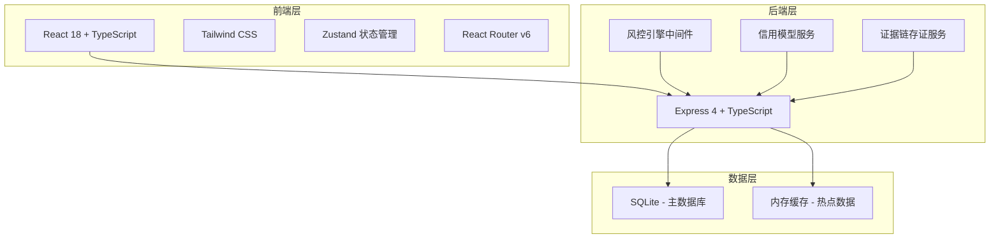
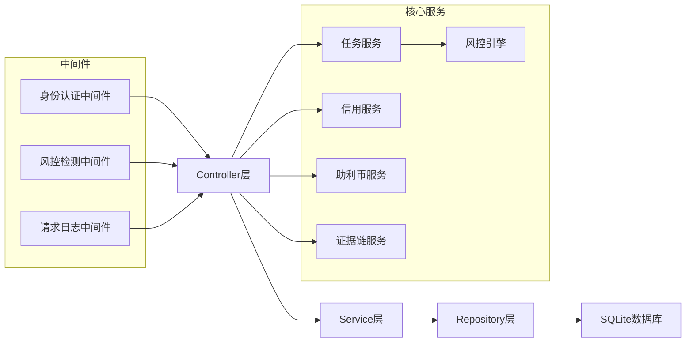
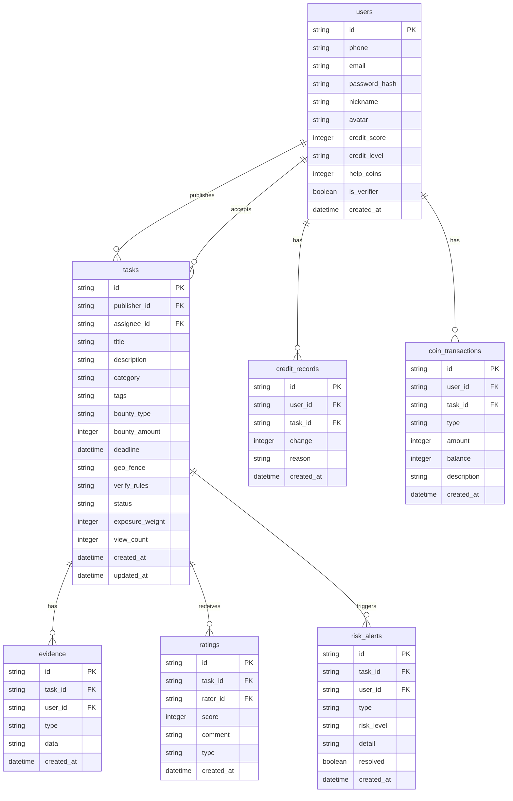

## 1. 架构设计



## 2. 技术说明

- 前端：React@18 + TailwindCSS@3 + Vite + Zustand
- 初始化工具：vite-init
- 后端：Express@4 + TypeScript（ESM格式）
- 数据库：SQLite（better-sqlite3），mock数据辅助开发
- 图表库：recharts
- 地图：Leaflet（轻量地图组件）

## 3. 路由定义

| 路由 | 用途 |
|------|------|
| / | 任务广场主页，动态排序任务流 |
| /publish | 任务发布页，两步表单 |
| /task/:id | 任务详情页，包含接单、证据链、评价 |
| /profile | 个人中心，信用看板+助利币钱包 |
| /profile/history | 任务历史记录 |
| /profile/verify | 验证记录 |
| /admin | 风控管理后台 |

## 4. API 定义

### 4.1 用户相关

```typescript
interface User {
  id: string;
  phone: string;
  email: string;
  nickname: string;
  avatar: string;
  creditScore: number;
  creditLevel: 'bronze' | 'silver' | 'gold' | 'diamond';
  helpCoins: number;
  isVerifier: boolean;
  createdAt: string;
}

// POST /api/auth/register
interface RegisterRequest {
  phone: string;
  email: string;
  password: string;
  nickname: string;
}
interface RegisterResponse { user: User; token: string; }

// POST /api/auth/login
interface LoginRequest { phone: string; password: string; }
interface LoginResponse { user: User; token: string; }

// GET /api/user/profile
interface ProfileResponse { user: User; stats: UserStats; }

interface UserStats {
  publishedTasks: number;
  completedTasks: number;
  verifiedTasks: number;
  creditHistory: CreditChangeRecord[];
}
```

### 4.2 任务相关

```typescript
interface Task {
  id: string;
  publisherId: string;
  title: string;
  description: string;
  category: 'physical' | 'online' | 'skill';
  tags: string[];
  bounty: { type: 'coins' | 'cash'; amount: number };
  deadline: string;
  geoFence?: { lat: number; lng: number; radius: number; address: string };
  verifyRules: VerifyRule[];
  status: 'open' | 'in_progress' | 'verifying' | 'completed' | 'disputed' | 'cancelled';
  assigneeId?: string;
  exposureWeight: number;
  viewCount: number;
  createdAt: string;
  updatedAt: string;
}

interface VerifyRule {
  type: 'photo' | 'location' | 'timestamp' | 'custom';
  description: string;
  required: boolean;
}

// POST /api/tasks
interface CreateTaskRequest {
  title: string;
  description: string;
  category: 'physical' | 'online' | 'skill';
  bounty: { type: 'coins' | 'cash'; amount: number };
  deadline: string;
  geoFence?: { lat: number; lng: number; radius: number; address: string };
  verifyRules: VerifyRule[];
}
interface CreateTaskResponse { task: Task; }

// GET /api/tasks?page=1&city=&category=&sort=hot&keyword=
interface TaskListResponse { tasks: Task[]; total: number; page: number; }

// GET /api/tasks/:id
interface TaskDetailResponse { task: Task; publisher: User; evidence: Evidence[]; ratings: Rating[]; }

// POST /api/tasks/:id/accept
interface AcceptTaskResponse { success: boolean; task: Task; }

// POST /api/tasks/:id/complete
interface CompleteTaskRequest { evidence: EvidenceSubmit[]; }
interface EvidenceSubmit { type: 'photo' | 'location' | 'timestamp'; data: string; }
```

### 4.3 信用与评价

```typescript
interface CreditChangeRecord {
  id: string;
  userId: string;
  taskId: string;
  change: number;
  reason: string;
  createdAt: string;
}

interface Rating {
  id: string;
  taskId: string;
  raterId: string;
  score: number;
  comment?: string;
  type: 'publisher' | 'verifier';
  createdAt: string;
}

// POST /api/tasks/:id/rate
interface RateTaskRequest { score: number; comment?: string; }

// POST /api/tasks/:id/verify
interface VerifyTaskRequest { approved: boolean; comment?: string; }

// GET /api/user/credit-history
interface CreditHistoryResponse { records: CreditChangeRecord[]; total: number; }
```

### 4.4 助利币

```typescript
interface CoinTransaction {
  id: string;
  userId: string;
  taskId?: string;
  type: 'earn' | 'spend' | 'exchange';
  amount: number;
  balance: number;
  description: string;
  createdAt: string;
}

// GET /api/user/coins
interface CoinBalanceResponse { balance: number; transactions: CoinTransaction[]; }

// POST /api/user/coins/exchange
interface ExchangeCoinsRequest { item: string; amount: number; }
interface ExchangeCoinsResponse { success: boolean; remaining: number; }

// POST /api/user/coins/boost
interface BoostTaskRequest { taskId: string; coins: number; }
interface BoostTaskResponse { success: boolean; exposureWeight: number; }
```

### 4.5 风控与管理

```typescript
interface RiskAlert {
  id: string;
  type: 'brush_order' | 'fake_location' | 'duplicate_submit';
  taskId: string;
  userId: string;
  riskLevel: 'low' | 'medium' | 'high';
  detail: string;
  resolved: boolean;
  createdAt: string;
}

// GET /api/admin/risk-alerts
interface RiskAlertsResponse { alerts: RiskAlert[]; total: number; }

// POST /api/admin/credit-model/train
interface TrainModelRequest { parameters: Record<string, number>; }
interface TrainModelResponse { modelId: string; accuracy: number; }

// GET /api/admin/stats
interface AdminStatsResponse {
  taskDistribution: { city: string; count: number }[];
  creditDistribution: { level: string; count: number }[];
  coinCirculation: { date: string; inflow: number; outflow: number }[];
  riskStats: { type: string; count: number }[];
}
```

## 5. 服务端架构图



## 6. 数据模型

### 6.1 数据模型定义



### 6.2 数据定义语言

```sql
CREATE TABLE users (
  id TEXT PRIMARY KEY,
  phone TEXT UNIQUE NOT NULL,
  email TEXT UNIQUE NOT NULL,
  password_hash TEXT NOT NULL,
  nickname TEXT NOT NULL,
  avatar TEXT DEFAULT '',
  credit_score INTEGER DEFAULT 60,
  credit_level TEXT DEFAULT 'bronze' CHECK(credit_level IN ('bronze','silver','gold','diamond')),
  help_coins INTEGER DEFAULT 0,
  is_verifier BOOLEAN DEFAULT FALSE,
  created_at TEXT DEFAULT (datetime('now'))
);

CREATE TABLE tasks (
  id TEXT PRIMARY KEY,
  publisher_id TEXT NOT NULL REFERENCES users(id),
  assignee_id TEXT REFERENCES users(id),
  title TEXT NOT NULL,
  description TEXT NOT NULL,
  category TEXT NOT NULL CHECK(category IN ('physical','online','skill')),
  tags TEXT DEFAULT '[]',
  bounty_type TEXT DEFAULT 'coins' CHECK(bounty_type IN ('coins','cash')),
  bounty_amount INTEGER DEFAULT 0,
  deadline TEXT NOT NULL,
  geo_fence TEXT DEFAULT '{}',
  verify_rules TEXT DEFAULT '[]',
  status TEXT DEFAULT 'open' CHECK(status IN ('open','in_progress','verifying','completed','disputed','cancelled')),
  exposure_weight REAL DEFAULT 1.0,
  view_count INTEGER DEFAULT 0,
  created_at TEXT DEFAULT (datetime('now')),
  updated_at TEXT DEFAULT (datetime('now'))
);

CREATE TABLE evidence (
  id TEXT PRIMARY KEY,
  task_id TEXT NOT NULL REFERENCES tasks(id),
  user_id TEXT NOT NULL REFERENCES users(id),
  type TEXT NOT NULL CHECK(type IN ('photo','location','timestamp')),
  data TEXT NOT NULL,
  created_at TEXT DEFAULT (datetime('now'))
);

CREATE TABLE ratings (
  id TEXT PRIMARY KEY,
  task_id TEXT NOT NULL REFERENCES tasks(id),
  rater_id TEXT NOT NULL REFERENCES users(id),
  score INTEGER NOT NULL CHECK(score BETWEEN 1 AND 5),
  comment TEXT DEFAULT '',
  type TEXT NOT NULL CHECK(type IN ('publisher','verifier')),
  created_at TEXT DEFAULT (datetime('now'))
);

CREATE TABLE credit_records (
  id TEXT PRIMARY KEY,
  user_id TEXT NOT NULL REFERENCES users(id),
  task_id TEXT REFERENCES tasks(id),
  change INTEGER NOT NULL,
  reason TEXT NOT NULL,
  created_at TEXT DEFAULT (datetime('now'))
);

CREATE TABLE coin_transactions (
  id TEXT PRIMARY KEY,
  user_id TEXT NOT NULL REFERENCES users(id),
  task_id TEXT REFERENCES tasks(id),
  type TEXT NOT NULL CHECK(type IN ('earn','spend','exchange')),
  amount INTEGER NOT NULL,
  balance INTEGER NOT NULL,
  description TEXT DEFAULT '',
  created_at TEXT DEFAULT (datetime('now'))
);

CREATE TABLE risk_alerts (
  id TEXT PRIMARY KEY,
  task_id TEXT REFERENCES tasks(id),
  user_id TEXT REFERENCES users(id),
  type TEXT NOT NULL CHECK(type IN ('brush_order','fake_location','duplicate_submit')),
  risk_level TEXT NOT NULL CHECK(risk_level IN ('low','medium','high')),
  detail TEXT DEFAULT '',
  resolved BOOLEAN DEFAULT FALSE,
  created_at TEXT DEFAULT (datetime('now'))
);

CREATE INDEX idx_tasks_status ON tasks(status);
CREATE INDEX idx_tasks_category ON tasks(category);
CREATE INDEX idx_tasks_publisher ON tasks(publisher_id);
CREATE INDEX idx_tasks_exposure ON tasks(exposure_weight DESC);
CREATE INDEX idx_credit_records_user ON credit_records(user_id);
CREATE INDEX idx_coin_transactions_user ON coin_transactions(user_id);
CREATE INDEX idx_risk_alerts_resolved ON risk_alerts(resolved);
```
