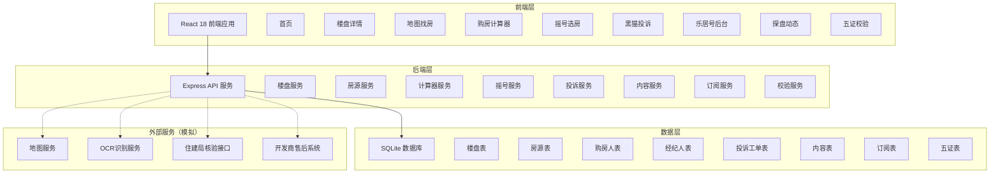
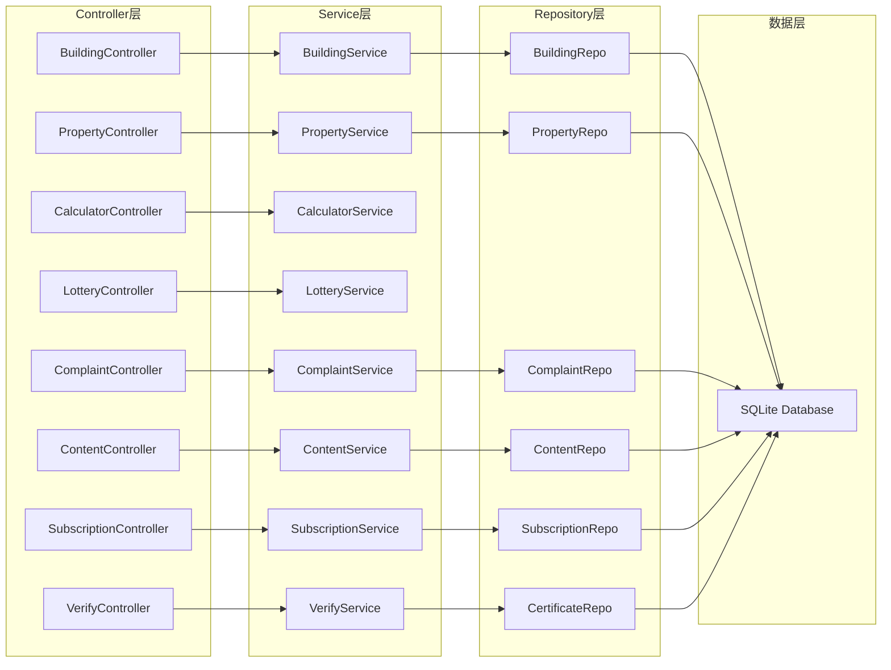
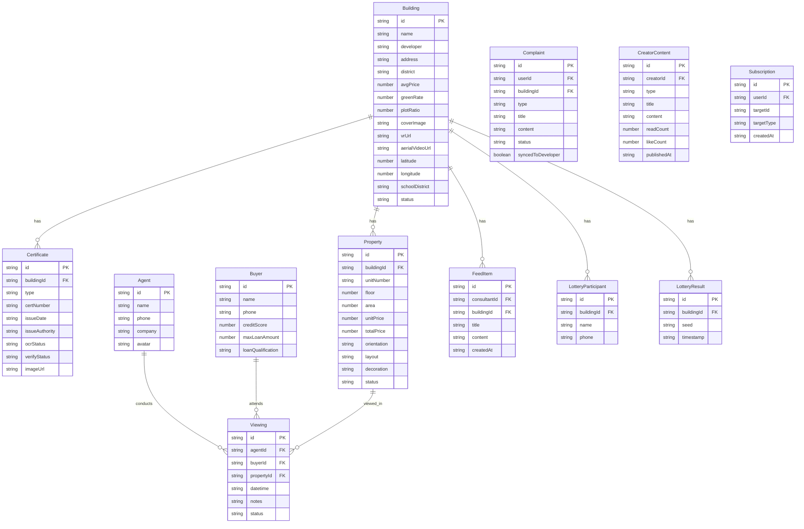

## 1. 架构设计



## 2. 技术说明

- **前端**：React@18 + TailwindCSS@3 + Vite + Zustand + React Router DOM
- **图表库**：Recharts（价格走势图、统计图表）
- **地图**：Leaflet + React-Leaflet（开源地图方案，无需API Key）
- **项目初始化工具**：vite-init
- **后端**：Express@4 + TypeScript（ESM格式）
- **数据库**：SQLite（better-sqlite3），开发阶段使用Mock数据
- **图标**：lucide-react

## 3. 路由定义

| 路由 | 用途 |
|------|------|
| `/` | 首页，热门楼盘推荐、快捷工具入口、探盘动态流 |
| `/building/:id` | 楼盘详情页，含VR嵌入、价格走势、五证核验、一房一价 |
| `/map` | 地图找房页，热力图叠加、筛选器、房源聚合 |
| `/calculator` | 购房计算器页，组合贷试算+税费明细+还款计划 |
| `/lottery/:buildingId` | 摇号选房页，摇号模拟器+算法演示+结果公示 |
| `/complaint` | 黑猫投诉页，投诉提交+工单追踪 |
| `/complaint/:id` | 投诉工单详情页 |
| `/creator` | 乐居号创作者后台，内容发布+数据统计 |
| `/feed` | 探盘动态页，动态流+订阅管理 |
| `/verify` | 五证校验页，OCR识别+住建局核验 |

## 4. API定义

### 4.1 楼盘相关API

```typescript
interface Building {
  id: string;
  name: string;
  developer: string;
  address: string;
  district: string;
  avgPrice: number;
  priceHistory: { month: string; price: number }[];
  areaRange: string;
  typeRange: string;
  greenRate: number;
  plotRatio: number;
  coverImage: string;
  vrUrl?: string;
  aerialVideoUrl?: string;
  latitude: number;
  longitude: number;
  schoolDistrict: string;
  certificates: Certificate[];
  status: "在售" | "待开" | "售罄";
  tags: string[];
  createdAt: string;
  updatedAt: string;
}

interface Certificate {
  id: string;
  buildingId: string;
  type: "建设用地规划许可证" | "建设工程规划许可证" | "建筑工程施工许可证" | "国有土地使用证" | "商品房预售许可证";
  certNumber: string;
  issueDate: string;
  issueAuthority: string;
  ocrStatus: "pending" | "recognized" | "failed";
  verifyStatus: "pending" | "verified" | "mismatch" | "expired";
  imageUrl: string;
}

// GET /api/buildings - 楼盘列表（支持筛选）
// GET /api/buildings/:id - 楼盘详情
// GET /api/buildings/:id/price-history - 价格走势数据
// GET /api/buildings/:id/certificates - 五证信息
```

### 4.2 房源相关API

```typescript
interface Property {
  id: string;
  buildingId: string;
  unitNumber: string;
  floor: number;
  totalFloors: number;
  area: number;
  unitPrice: number;
  totalPrice: number;
  orientation: string;
  layout: string;
  decoration: "毛坯" | "简装" | "精装";
  status: "在售" | "已订" | "已售";
  tags: string[];
}

// GET /api/buildings/:id/properties - 楼盘房源列表（一房一价）
// GET /api/properties/:id - 房源详情
// GET /api/properties/map - 地图搜索（含坐标、热力图数据）
```

### 4.3 购房计算器API

```typescript
interface CalculatorRequest {
  totalPrice: number;
  commercialLoan: number;
  commercialRate: number;
  fundLoan: number;
  fundRate: number;
  years: number;
  isFirstHome: boolean;
  area: number;
}

interface CalculatorResult {
  monthlyPayment: number;
  commercialMonthly: number;
  fundMonthly: number;
  totalInterest: number;
  taxes: TaxItem[];
  repaymentPlan: RepaymentItem[];
}

interface TaxItem {
  name: string;
  rate: number;
  amount: number;
  description: string;
}

interface RepaymentItem {
  month: number;
  payment: number;
  principal: number;
  interest: number;
  remaining: number;
}

// POST /api/calculator/compute - 计算购房费用
```

### 4.4 摇号相关API

```typescript
interface LotteryParticipant {
  id: string;
  name: string;
  phone: string;
  buildingId: string;
}

interface LotteryResult {
  buildingId: string;
  participants: LotteryParticipant[];
  results: { rank: number; participant: LotteryParticipant; hash: string }[];
  seed: string;
  timestamp: string;
}

// POST /api/lottery/run - 执行摇号
// GET /api/lottery/:buildingId/result - 查询摇号结果
// POST /api/lottery/:buildingId/register - 摇号报名
```

### 4.5 投诉相关API

```typescript
interface Complaint {
  id: string;
  userId: string;
  buildingId: string;
  type: string;
  title: string;
  content: string;
  attachments: string[];
  status: "submitted" | "accepted" | "processing" | "resolved" | "closed";
  timeline: { status: string; time: string; note: string }[];
  syncedToDeveloper: boolean;
  createdAt: string;
  updatedAt: string;
}

// POST /api/complaints - 提交投诉
// GET /api/complaints/:id - 投诉详情
// GET /api/complaints - 投诉列表
// PATCH /api/complaints/:id/status - 更新投诉状态
```

### 4.6 内容与订阅相关API

```typescript
interface CreatorContent {
  id: string;
  creatorId: string;
  type: "article" | "gallery";
  title: string;
  content: string;
  images: string[];
  readCount: number;
  likeCount: number;
  commentCount: number;
  publishedAt: string;
}

interface FeedItem {
  id: string;
  consultantId: string;
  consultantName: string;
  buildingId: string;
  buildingName: string;
  title: string;
  content: string;
  images: string[];
  createdAt: string;
  subscribed: boolean;
}

// POST /api/contents - 发布内容
// GET /api/contents - 内容列表
// GET /api/contents/stats - 创作者统计
// GET /api/feed - 探盘动态流
// POST /api/subscriptions - 订阅楼盘/顾问
// DELETE /api/subscriptions/:id - 取消订阅
```

### 4.7 五证校验API

```typescript
interface VerifyRequest {
  imageUrl: string;
  certType: Certificate["type"];
}

interface VerifyResult {
  certNumber: string;
  issueDate: string;
  issueAuthority: string;
  ocrConfidence: number;
  bureauVerifyStatus: "match" | "mismatch" | "not_found";
  bureauVerifyTime: string;
}

// POST /api/verify/ocr - OCR识别
// POST /api/verify/bureau - 住建局核验
```

## 5. 服务端架构图



## 6. 数据模型

### 6.1 数据模型定义



### 6.2 数据定义语言

```sql
CREATE TABLE buildings (
  id TEXT PRIMARY KEY,
  name TEXT NOT NULL,
  developer TEXT NOT NULL,
  address TEXT NOT NULL,
  district TEXT NOT NULL,
  avg_price REAL NOT NULL,
  green_rate REAL,
  plot_ratio REAL,
  cover_image TEXT,
  vr_url TEXT,
  aerial_video_url TEXT,
  latitude REAL NOT NULL,
  longitude REAL NOT NULL,
  school_district TEXT,
  status TEXT NOT NULL DEFAULT '在售',
  area_range TEXT,
  type_range TEXT,
  tags TEXT,
  created_at TEXT DEFAULT (datetime('now')),
  updated_at TEXT DEFAULT (datetime('now'))
);

CREATE TABLE certificates (
  id TEXT PRIMARY KEY,
  building_id TEXT NOT NULL REFERENCES buildings(id),
  type TEXT NOT NULL,
  cert_number TEXT NOT NULL,
  issue_date TEXT NOT NULL,
  issue_authority TEXT NOT NULL,
  ocr_status TEXT DEFAULT 'pending',
  verify_status TEXT DEFAULT 'pending',
  image_url TEXT,
  created_at TEXT DEFAULT (datetime('now'))
);

CREATE TABLE properties (
  id TEXT PRIMARY KEY,
  building_id TEXT NOT NULL REFERENCES buildings(id),
  unit_number TEXT NOT NULL,
  floor INTEGER NOT NULL,
  total_floors INTEGER NOT NULL,
  area REAL NOT NULL,
  unit_price REAL NOT NULL,
  total_price REAL NOT NULL,
  orientation TEXT NOT NULL,
  layout TEXT NOT NULL,
  decoration TEXT DEFAULT '毛坯',
  status TEXT DEFAULT '在售',
  tags TEXT,
  created_at TEXT DEFAULT (datetime('now'))
);

CREATE TABLE buyers (
  id TEXT PRIMARY KEY,
  name TEXT NOT NULL,
  phone TEXT NOT NULL UNIQUE,
  credit_score INTEGER,
  max_loan_amount REAL,
  loan_qualification TEXT,
  created_at TEXT DEFAULT (datetime('now'))
);

CREATE TABLE agents (
  id TEXT PRIMARY KEY,
  name TEXT NOT NULL,
  phone TEXT NOT NULL UNIQUE,
  company TEXT,
  avatar TEXT,
  created_at TEXT DEFAULT (datetime('now'))
);

CREATE TABLE viewings (
  id TEXT PRIMARY KEY,
  agent_id TEXT NOT NULL REFERENCES agents(id),
  buyer_id TEXT NOT NULL REFERENCES buyers(id),
  property_id TEXT NOT NULL REFERENCES properties(id),
  datetime TEXT NOT NULL,
  notes TEXT,
  status TEXT DEFAULT 'scheduled',
  created_at TEXT DEFAULT (datetime('now'))
);

CREATE TABLE complaints (
  id TEXT PRIMARY KEY,
  user_id TEXT NOT NULL,
  building_id TEXT NOT NULL REFERENCES buildings(id),
  type TEXT NOT NULL,
  title TEXT NOT NULL,
  content TEXT NOT NULL,
  attachments TEXT,
  status TEXT DEFAULT 'submitted',
  timeline TEXT,
  synced_to_developer INTEGER DEFAULT 0,
  created_at TEXT DEFAULT (datetime('now')),
  updated_at TEXT DEFAULT (datetime('now'))
);

CREATE TABLE creator_contents (
  id TEXT PRIMARY KEY,
  creator_id TEXT NOT NULL,
  type TEXT NOT NULL,
  title TEXT NOT NULL,
  content TEXT NOT NULL,
  images TEXT,
  read_count INTEGER DEFAULT 0,
  like_count INTEGER DEFAULT 0,
  comment_count INTEGER DEFAULT 0,
  published_at TEXT DEFAULT (datetime('now'))
);

CREATE TABLE feed_items (
  id TEXT PRIMARY KEY,
  consultant_id TEXT NOT NULL,
  building_id TEXT NOT NULL REFERENCES buildings(id),
  title TEXT NOT NULL,
  content TEXT NOT NULL,
  images TEXT,
  created_at TEXT DEFAULT (datetime('now'))
);

CREATE TABLE subscriptions (
  id TEXT PRIMARY KEY,
  user_id TEXT NOT NULL,
  target_id TEXT NOT NULL,
  target_type TEXT NOT NULL,
  created_at TEXT DEFAULT (datetime('now')),
  UNIQUE(user_id, target_id, target_type)
);

CREATE TABLE lottery_participants (
  id TEXT PRIMARY KEY,
  building_id TEXT NOT NULL REFERENCES buildings(id),
  name TEXT NOT NULL,
  phone TEXT NOT NULL,
  created_at TEXT DEFAULT (datetime('now'))
);

CREATE TABLE lottery_results (
  id TEXT PRIMARY KEY,
  building_id TEXT NOT NULL REFERENCES buildings(id),
  seed TEXT NOT NULL,
  results TEXT NOT NULL,
  timestamp TEXT DEFAULT (datetime('now'))
);

CREATE INDEX idx_certificates_building ON certificates(building_id);
CREATE INDEX idx_properties_building ON properties(building_id);
CREATE INDEX idx_properties_status ON properties(status);
CREATE INDEX idx_viewings_agent ON viewings(agent_id);
CREATE INDEX idx_viewings_buyer ON viewings(buyer_id);
CREATE INDEX idx_complaints_building ON complaints(building_id);
CREATE INDEX idx_feed_building ON feed_items(building_id);
CREATE INDEX idx_subscriptions_user ON subscriptions(user_id);
CREATE INDEX idx_lottery_building ON lottery_participants(building_id);
```
