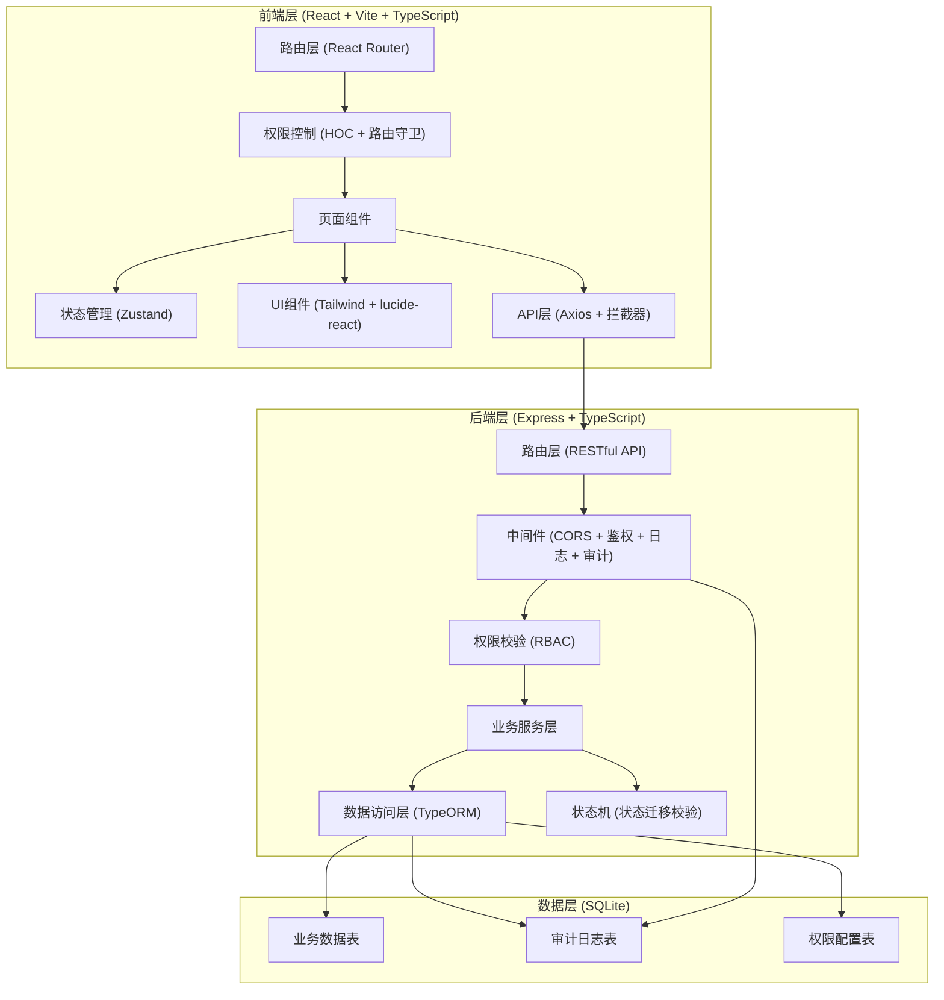
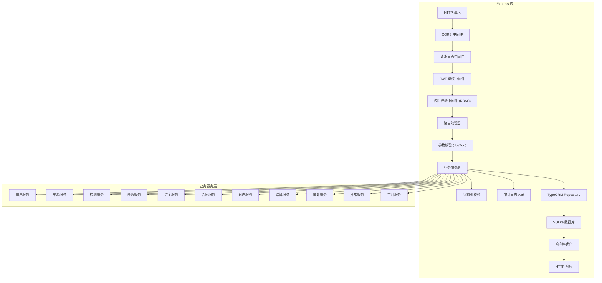

## 1. 架构设计



## 2. 技术描述

- **前端**: React@18 + TypeScript + Vite@5 + React Router@6 + Zustand@4 + TailwindCSS@3 + lucide-react + axios
- **后端**: Express@4 + TypeScript + TypeORM@0.3 + better-sqlite3 + bcryptjs + jsonwebtoken + cors
- **数据库**: SQLite (文件路径: data/app.sqlite)
- **鉴权**: JWT Token + RBAC角色权限控制
- **端口配置**: 
  - 前端端口: 42667 (40000 + tail4=2667)
  - 后端端口: 52667 (50000 + tail4=2667)
  - 备用槽位: 43667/53667 → 44667/54667 → 45667/55667 → 46667/56667 → 47667/57667

## 3. 路由定义

### 3.1 前端路由

| 路由 | 页面 | 权限角色 |
|------|------|----------|
| /login | 登录页 | 公开 |
| /dashboard | 工作台仪表盘 | 所有登录用户 |
| /cars | 车源列表 | dealer, sales, admin, customer_service |
| /cars/publish | 车源发布 | dealer |
| /cars/:id | 车源详情 | dealer, sales, buyer, inspector, admin |
| /inspections | 检测报告列表 | inspector, sales, admin |
| /inspections/:id | 检测报告详情 | inspector, sales, admin, buyer |
| /inspections/create/:carId | 上传检测报告 | inspector |
| /appointments | 预约列表 | sales, buyer, admin |
| /appointments/create | 创建预约 | buyer, sales |
| /deposits | 订金管理 | finance, sales, buyer, admin |
| /contracts | 合同管理 | sales, buyer, admin, finance |
| /transfers | 过户管理 | sales, admin, customer_service |
| /settlements | 结算管理 | finance, admin |
| /statistics | 运营统计 | admin, sales_manager |
| /audit | 审计日志 | admin |
| /exceptions | 异常处理 | admin, customer_service |
| /users | 用户管理 | admin |

### 3.2 后端API路由

| 方法 | 路径 | 功能 | 权限 |
|------|------|------|------|
| POST | /api/auth/login | 登录 | 公开 |
| GET | /api/auth/profile | 获取当前用户 | 登录 |
| GET | /api/cars | 获取车源列表 | dealer, sales, admin |
| POST | /api/cars | 发布车源 | dealer |
| GET | /api/cars/:id | 获取车源详情 | 所有登录 |
| PUT | /api/cars/:id | 更新车源 | dealer, admin |
| GET | /api/cars/vin/:vin | 校验VIN是否重复 | dealer, admin |
| GET | /api/inspections | 检测报告列表 | inspector, sales, admin |
| POST | /api/inspections | 上传检测报告 | inspector |
| PUT | /api/inspections/:id/audit | 审核检测报告 | admin |
| GET | /api/appointments | 预约列表 | sales, buyer, admin |
| POST | /api/appointments | 创建预约 | buyer, sales |
| PUT | /api/appointments/:id/status | 更新预约状态 | sales, admin |
| GET | /api/deposits | 订金列表 | finance, sales, admin |
| POST | /api/deposits | 支付订金 | buyer |
| PUT | /api/deposits/:id/refund | 订金退款 | finance, admin |
| PUT | /api/deposits/:id/release | 订金释放/扣除 | finance, admin |
| GET | /api/contracts | 合同列表 | sales, buyer, admin |
| POST | /api/contracts | 创建合同 | sales, admin |
| PUT | /api/contracts/:id/sign | 签署合同 | buyer |
| GET | /api/transfers | 过户列表 | sales, admin |
| POST | /api/transfers | 提交过户资料 | sales, buyer |
| PUT | /api/transfers/:id/complete | 确认过户完成 | admin |
| GET | /api/settlements | 结算列表 | finance, admin |
| POST | /api/settlements | 创建结算单 | finance |
| GET | /api/statistics/summary | 运营统计概览 | admin |
| GET | /api/statistics/conversion | 转化漏斗 | admin |
| GET | /api/audit-logs | 审计日志 | admin |
| GET | /api/exceptions | 异常工单列表 | admin, customer_service |
| POST | /api/exceptions | 创建异常工单 | 所有登录 |
| PUT | /api/exceptions/:id | 处理异常工单 | admin, customer_service |
| GET | /api/users | 用户列表 | admin |
| POST | /api/users | 创建用户 | admin |
| PUT | /api/users/:id | 更新用户 | admin |
| GET | /api/health | 健康检查 | 公开 |

## 4. API 类型定义

```typescript
// 用户角色
type UserRole = 'dealer' | 'buyer' | 'inspector' | 'sales' | 'customer_service' | 'finance' | 'admin';

// 车源状态
type CarStatus = 'draft' | 'pending_inspection' | 'inspecting' | 'inspection_rejected' | 'pending_audit' | 'on_sale' | 'locked' | 'sold' | 'off_shelf' | 'exception';

// 检测报告状态
type InspectionStatus = 'draft' | 'submitted' | 'approved' | 'rejected';

// 预约状态
type AppointmentStatus = 'pending' | 'confirmed' | 'completed' | 'cancelled' | 'no_show';

// 订金状态
type DepositStatus = 'pending' | 'paid' | 'locked' | 'refund_pending' | 'refunded' | 'released_to_seller' | 'deducted';

// 合同状态
type ContractStatus = 'draft' | 'pending_sign' | 'signed' | 'pending_payment' | 'paid' | 'completed' | 'cancelled';

// 过户状态
type TransferStatus = 'pending' | 'submitted' | 'reviewing' | 'approved' | 'completed' | 'rejected';

// 结算状态
type SettlementStatus = 'pending' | 'settled' | 'reconciled' | 'invoiced';

// 异常类型
type ExceptionType = 'fake_car' | 'accident_concealed' | 'deposit_refund' | 'transfer_failed' | 'mileage_dispute' | 'duplicate_sale';

// 异常状态
type ExceptionStatus = 'open' | 'investigating' | 'resolved' | 'closed';

// 通用响应
interface ApiResponse<T> {
  code: number;
  message: string;
  data: T;
  timestamp: number;
}

// 登录
interface LoginRequest {
  username: string;
  password: string;
  role: UserRole;
}

interface LoginResponse {
  token: string;
  user: User;
  permissions: string[];
}

// 用户
interface User {
  id: number;
  username: string;
  name: string;
  role: UserRole;
  phone: string;
  email?: string;
  status: 'active' | 'disabled';
  createdAt: string;
}

// 车源
interface Car {
  id: number;
  vin: string;
  brand: string;
  model: string;
  year: number;
  month: number;
  mileage: number;
  color: string;
  price: number;
  originalPrice?: number;
  configuration: string;
  images: string[];
  documents: CarDocument[];
  dealerId: number;
  dealer?: User;
  status: CarStatus;
  statusHistory: StatusHistory[];
  inspectionId?: number;
  inspection?: Inspection;
  createdAt: string;
  updatedAt: string;
}

interface CarDocument {
  type: 'registration' | 'insurance' | 'maintenance' | 'other';
  name: string;
  url: string;
}

interface StatusHistory {
  id: number;
  fromStatus: string;
  toStatus: string;
  operatorId: number;
  operator?: User;
  reason: string;
  createdAt: string;
}

// 检测报告
interface Inspection {
  id: number;
  carId: number;
  car?: Car;
  inspectorId: number;
  inspector?: User;
  accident: InspectionItem;
  waterDamage: InspectionItem;
  fireDamage: InspectionItem;
  maintenance: MaintenanceRecord[];
  paintwork: PaintworkItem[];
  roadTest: RoadTest;
  overallScore: number;
  overallComment: string;
  status: InspectionStatus;
  auditorId?: number;
  auditor?: User;
  auditComment?: string;
  auditedAt?: string;
  createdAt: string;
}

interface InspectionItem {
  result: 'normal' | 'abnormal' | 'suspicious';
  description: string;
  images?: string[];
}

interface MaintenanceRecord {
  date: string;
  mileage: number;
  item: string;
  cost: number;
  shop: string;
}

interface PaintworkItem {
  position: string;
  originalPaint: boolean;
  repainted: boolean;
  sheetMetal: boolean;
  description: string;
}

interface RoadTest {
  engine: string;
  transmission: string;
  brake: string;
  steering: string;
  suspension: string;
  overall: string;
}

// 预约
interface Appointment {
  id: number;
  carId: number;
  car?: Car;
  buyerId: number;
  buyer?: User;
  salesId?: number;
  sales?: User;
  type: 'view' | 'test_drive';
  appointmentTime: string;
  contactPhone: string;
  intentionLevel: 'high' | 'medium' | 'low';
  notes?: string;
  status: AppointmentStatus;
  followUpRecords: FollowUpRecord[];
  createdAt: string;
}

interface FollowUpRecord {
  id: number;
  operatorId: number;
  operator?: User;
  content: string;
  createdAt: string;
}

// 订金
interface Deposit {
  id: number;
  carId: number;
  car?: Car;
  buyerId: number;
  buyer?: User;
  amount: number;
  paymentMethod: string;
  transactionId: string;
  paidAt?: string;
  status: DepositStatus;
  refundReason?: string;
  refundApprovedBy?: number;
  refundApprovedAt?: string;
  releaseType?: 'to_seller' | 'deducted' | 'refunded';
  settlementId?: number;
  createdAt: string;
}

// 合同
interface Contract {
  id: number;
  carId: number;
  car?: Car;
  buyerId: number;
  buyer?: User;
  dealerId: number;
  dealer?: User;
  depositId?: number;
  deposit?: Deposit;
  totalPrice: number;
  paymentMethod: 'full' | 'installment';
  financePlan?: FinancePlan;
  status: ContractStatus;
  signedByBuyerAt?: string;
  signedByDealerAt?: string;
  createdAt: string;
}

interface FinancePlan {
  bank: string;
  downPayment: number;
  loanAmount: number;
  loanTerm: number;
  interestRate: number;
  monthlyPayment: number;
}

// 过户
interface Transfer {
  id: number;
  contractId: number;
  contract?: Contract;
  carId: number;
  car?: Car;
  documents: TransferDocument[];
  status: TransferStatus;
  reviewerId?: number;
  reviewer?: User;
  reviewComment?: string;
  reviewedAt?: string;
  completedAt?: string;
  createdAt: string;
}

interface TransferDocument {
  type: 'id_card_buyer' | 'id_card_seller' | 'registration' | 'insurance' | 'other';
  name: string;
  url: string;
}

// 结算
interface Settlement {
  id: number;
  contractId: number;
  contract?: Contract;
  carId: number;
  car?: Car;
  dealerId: number;
  dealer?: User;
  totalAmount: number;
  platformFee: number;
  feeRate: number;
  otherFees: SettlementFee[];
  amountToDealer: number;
  status: SettlementStatus;
  settledAt?: string;
  reconciledAt?: string;
  invoicedAt?: string;
  invoiceNumber?: string;
  createdAt: string;
}

interface SettlementFee {
  type: 'inspection' | 'transfer' | 'finance' | 'other';
  name: string;
  amount: number;
}

// 异常工单
interface Exception {
  id: number;
  type: ExceptionType;
  relatedType: 'car' | 'inspection' | 'appointment' | 'deposit' | 'contract' | 'transfer';
  relatedId: number;
  reporterId: number;
  reporter?: User;
  assigneeId?: number;
  assignee?: User;
  title: string;
  description: string;
  evidence: string[];
  status: ExceptionStatus;
  handlingRecords: HandlingRecord[];
  resolution?: string;
  closedAt?: string;
  createdAt: string;
}

interface HandlingRecord {
  id: number;
  operatorId: number;
  operator?: User;
  action: string;
  comment: string;
  createdAt: string;
}

// 审计日志
interface AuditLog {
  id: number;
  userId: number;
  user?: User;
  role: UserRole;
  action: string;
  resourceType: string;
  resourceId?: number;
  ipAddress: string;
  userAgent: string;
  oldValue?: any;
  newValue?: any;
  changeSummary?: string;
  createdAt: string;
}

// 运营统计
interface StatisticsSummary {
  totalCars: number;
  carsOnSale: number;
  carsSold: number;
  totalAppointments: number;
  totalDeposits: number;
  totalSettlements: number;
  totalPlatformFee: number;
  conversionRate: number;
}

interface ConversionFunnelItem {
  stage: string;
  count: number;
  rate: number;
}
```

## 5. 服务端架构图



## 6. 数据模型

### 6.1 ER 图

```mermaid
erDiagram
    USER ||--o{ CAR : "发布"
    USER ||--o{ INSPECTION : "检测/审核"
    USER ||--o{ APPOINTMENT : "预约/跟进"
    USER ||--o{ DEPOSIT : "支付/处理"
    USER ||--o{ CONTRACT : "签署"
    USER ||--o{ TRANSFER : "提交/审核"
    USER ||--o{ SETTLEMENT : "结算"
    USER ||--o{ EXCEPTION : "报告/处理"
    USER ||--o{ AUDIT_LOG : "操作"
    
    CAR ||--|| INSPECTION : "有"
    CAR ||--o{ APPOINTMENT : "被预约"
    CAR ||--|| DEPOSIT : "被锁定"
    CAR ||--|| CONTRACT : "被交易"
    CAR ||--|| TRANSFER : "过户"
    CAR ||--|| SETTLEMENT : "结算"
    CAR ||--o{ STATUS_HISTORY : "状态变更"
    
    APPOINTMENT ||--o{ FOLLOW_UP_RECORD : "有"
    
    DEPOSIT ||--|| CONTRACT : "关联"
    CONTRACT ||--|| TRANSFER : "关联"
    CONTRACT ||--|| SETTLEMENT : "关联"
    
    EXCEPTION ||--o{ HANDLING_RECORD : "有"

    USER {
        int id PK
        string username
        string password_hash
        string name
        string role
        string phone
        string email
        string status
        datetime created_at
        datetime updated_at
    }
    
    CAR {
        int id PK
        string vin UK
        string brand
        string model
        int year
        int month
        int mileage
        string color
        decimal price
        decimal original_price
        text configuration
        text images_json
        text documents_json
        int dealer_id FK
        string status
        datetime created_at
        datetime updated_at
    }
    
    INSPECTION {
        int id PK
        int car_id FK UK
        int inspector_id FK
        text accident_json
        text water_damage_json
        text fire_damage_json
        text maintenance_json
        text paintwork_json
        text road_test_json
        int overall_score
        text overall_comment
        string status
        int auditor_id FK
        text audit_comment
        datetime audited_at
        datetime created_at
    }
    
    APPOINTMENT {
        int id PK
        int car_id FK
        int buyer_id FK
        int sales_id FK
        string type
        datetime appointment_time
        string contact_phone
        string intention_level
        text notes
        string status
        datetime created_at
    }
    
    DEPOSIT {
        int id PK
        int car_id FK
        int buyer_id FK
        decimal amount
        string payment_method
        string transaction_id
        datetime paid_at
        string status
        text refund_reason
        int refund_approved_by FK
        datetime refund_approved_at
        string release_type
        int settlement_id FK
        datetime created_at
    }
    
    CONTRACT {
        int id PK
        int car_id FK
        int buyer_id FK
        int dealer_id FK
        int deposit_id FK
        decimal total_price
        string payment_method
        text finance_plan_json
        string status
        datetime signed_by_buyer_at
        datetime signed_by_dealer_at
        datetime created_at
    }
    
    TRANSFER {
        int id PK
        int contract_id FK
        int car_id FK
        text documents_json
        string status
        int reviewer_id FK
        text review_comment
        datetime reviewed_at
        datetime completed_at
        datetime created_at
    }
    
    SETTLEMENT {
        int id PK
        int contract_id FK
        int car_id FK
        int dealer_id FK
        decimal total_amount
        decimal platform_fee
        decimal fee_rate
        text other_fees_json
        decimal amount_to_dealer
        string status
        datetime settled_at
        datetime reconciled_at
        datetime invoiced_at
        string invoice_number
        datetime created_at
    }
    
    EXCEPTION {
        int id PK
        string type
        string related_type
        int related_id
        int reporter_id FK
        int assignee_id FK
        string title
        text description
        text evidence_json
        string status
        text resolution
        datetime closed_at
        datetime created_at
    }
    
    AUDIT_LOG {
        int id PK
        int user_id FK
        string role
        string action
        string resource_type
        int resource_id
        string ip_address
        string user_agent
        text old_value_json
        text newValue_json
        text change_summary
        datetime created_at
    }
    
    STATUS_HISTORY {
        int id PK
        int car_id FK
        string from_status
        string to_status
        int operator_id FK
        text reason
        datetime created_at
    }
    
    FOLLOW_UP_RECORD {
        int id PK
        int appointment_id FK
        int operator_id FK
        text content
        datetime created_at
    }
    
    HANDLING_RECORD {
        int id PK
        int exception_id FK
        int operator_id FK
        string action
        text comment
        datetime created_at
    }
```

### 6.2 DDL 语句

```sql
-- 用户表
CREATE TABLE users (
    id INTEGER PRIMARY KEY AUTOINCREMENT,
    username VARCHAR(50) NOT NULL UNIQUE,
    password_hash VARCHAR(255) NOT NULL,
    name VARCHAR(100) NOT NULL,
    role VARCHAR(50) NOT NULL CHECK (role IN ('dealer', 'buyer', 'inspector', 'sales', 'customer_service', 'finance', 'admin')),
    phone VARCHAR(20) NOT NULL,
    email VARCHAR(100),
    status VARCHAR(20) NOT NULL DEFAULT 'active' CHECK (status IN ('active', 'disabled')),
    created_at DATETIME DEFAULT CURRENT_TIMESTAMP,
    updated_at DATETIME DEFAULT CURRENT_TIMESTAMP
);

CREATE INDEX idx_users_role ON users(role);
CREATE INDEX idx_users_status ON users(status);

-- 车源表
CREATE TABLE cars (
    id INTEGER PRIMARY KEY AUTOINCREMENT,
    vin VARCHAR(17) NOT NULL UNIQUE,
    brand VARCHAR(50) NOT NULL,
    model VARCHAR(100) NOT NULL,
    year INTEGER NOT NULL,
    month INTEGER NOT NULL,
    mileage INTEGER NOT NULL,
    color VARCHAR(30) NOT NULL,
    price DECIMAL(12,2) NOT NULL,
    original_price DECIMAL(12,2),
    configuration TEXT,
    images_json TEXT NOT NULL DEFAULT '[]',
    documents_json TEXT NOT NULL DEFAULT '[]',
    dealer_id INTEGER NOT NULL,
    status VARCHAR(30) NOT NULL DEFAULT 'draft' CHECK (status IN ('draft', 'pending_inspection', 'inspecting', 'inspection_rejected', 'pending_audit', 'on_sale', 'locked', 'sold', 'off_shelf', 'exception')),
    created_at DATETIME DEFAULT CURRENT_TIMESTAMP,
    updated_at DATETIME DEFAULT CURRENT_TIMESTAMP,
    FOREIGN KEY (dealer_id) REFERENCES users(id)
);

CREATE INDEX idx_cars_dealer_id ON cars(dealer_id);
CREATE INDEX idx_cars_status ON cars(status);
CREATE INDEX idx_cars_brand ON cars(brand);
CREATE INDEX idx_cars_price ON cars(price);

-- 状态历史表
CREATE TABLE status_history (
    id INTEGER PRIMARY KEY AUTOINCREMENT,
    car_id INTEGER NOT NULL,
    from_status VARCHAR(30) NOT NULL,
    to_status VARCHAR(30) NOT NULL,
    operator_id INTEGER NOT NULL,
    reason TEXT,
    created_at DATETIME DEFAULT CURRENT_TIMESTAMP,
    FOREIGN KEY (car_id) REFERENCES cars(id),
    FOREIGN KEY (operator_id) REFERENCES users(id)
);

CREATE INDEX idx_status_history_car_id ON status_history(car_id);

-- 检测报告表
CREATE TABLE inspections (
    id INTEGER PRIMARY KEY AUTOINCREMENT,
    car_id INTEGER NOT NULL UNIQUE,
    inspector_id INTEGER NOT NULL,
    accident_json TEXT NOT NULL,
    water_damage_json TEXT NOT NULL,
    fire_damage_json TEXT NOT NULL,
    maintenance_json TEXT NOT NULL DEFAULT '[]',
    paintwork_json TEXT NOT NULL DEFAULT '[]',
    road_test_json TEXT NOT NULL,
    overall_score INTEGER NOT NULL,
    overall_comment TEXT NOT NULL,
    status VARCHAR(30) NOT NULL DEFAULT 'draft' CHECK (status IN ('draft', 'submitted', 'approved', 'rejected')),
    auditor_id INTEGER,
    audit_comment TEXT,
    audited_at DATETIME,
    created_at DATETIME DEFAULT CURRENT_TIMESTAMP,
    FOREIGN KEY (car_id) REFERENCES cars(id),
    FOREIGN KEY (inspector_id) REFERENCES users(id),
    FOREIGN KEY (auditor_id) REFERENCES users(id)
);

CREATE INDEX idx_inspections_inspector_id ON inspections(inspector_id);
CREATE INDEX idx_inspections_status ON inspections(status);

-- 预约表
CREATE TABLE appointments (
    id INTEGER PRIMARY KEY AUTOINCREMENT,
    car_id INTEGER NOT NULL,
    buyer_id INTEGER NOT NULL,
    sales_id INTEGER,
    type VARCHAR(20) NOT NULL CHECK (type IN ('view', 'test_drive')),
    appointment_time DATETIME NOT NULL,
    contact_phone VARCHAR(20) NOT NULL,
    intention_level VARCHAR(20) NOT NULL DEFAULT 'medium' CHECK (intention_level IN ('high', 'medium', 'low')),
    notes TEXT,
    status VARCHAR(20) NOT NULL DEFAULT 'pending' CHECK (status IN ('pending', 'confirmed', 'completed', 'cancelled', 'no_show')),
    created_at DATETIME DEFAULT CURRENT_TIMESTAMP,
    FOREIGN KEY (car_id) REFERENCES cars(id),
    FOREIGN KEY (buyer_id) REFERENCES users(id),
    FOREIGN KEY (sales_id) REFERENCES users(id)
);

CREATE INDEX idx_appointments_car_id ON appointments(car_id);
CREATE INDEX idx_appointments_buyer_id ON appointments(buyer_id);
CREATE INDEX idx_appointments_sales_id ON appointments(sales_id);
CREATE INDEX idx_appointments_status ON appointments(status);
CREATE INDEX idx_appointments_time ON appointments(appointment_time);

-- 跟进记录表
CREATE TABLE follow_up_records (
    id INTEGER PRIMARY KEY AUTOINCREMENT,
    appointment_id INTEGER NOT NULL,
    operator_id INTEGER NOT NULL,
    content TEXT NOT NULL,
    created_at DATETIME DEFAULT CURRENT_TIMESTAMP,
    FOREIGN KEY (appointment_id) REFERENCES appointments(id),
    FOREIGN KEY (operator_id) REFERENCES users(id)
);

-- 订金表
CREATE TABLE deposits (
    id INTEGER PRIMARY KEY AUTOINCREMENT,
    car_id INTEGER NOT NULL,
    buyer_id INTEGER NOT NULL,
    amount DECIMAL(12,2) NOT NULL,
    payment_method VARCHAR(50) NOT NULL,
    transaction_id VARCHAR(100) NOT NULL,
    paid_at DATETIME,
    status VARCHAR(30) NOT NULL DEFAULT 'pending' CHECK (status IN ('pending', 'paid', 'locked', 'refund_pending', 'refunded', 'released_to_seller', 'deducted')),
    refund_reason TEXT,
    refund_approved_by INTEGER,
    refund_approved_at DATETIME,
    release_type VARCHAR(30) CHECK (release_type IN ('to_seller', 'deducted', 'refunded')),
    settlement_id INTEGER,
    created_at DATETIME DEFAULT CURRENT_TIMESTAMP,
    FOREIGN KEY (car_id) REFERENCES cars(id),
    FOREIGN KEY (buyer_id) REFERENCES users(id),
    FOREIGN KEY (refund_approved_by) REFERENCES users(id)
);

CREATE INDEX idx_deposits_car_id ON deposits(car_id);
CREATE INDEX idx_deposits_buyer_id ON deposits(buyer_id);
CREATE INDEX idx_deposits_status ON deposits(status);

-- 合同表
CREATE TABLE contracts (
    id INTEGER PRIMARY KEY AUTOINCREMENT,
    car_id INTEGER NOT NULL,
    buyer_id INTEGER NOT NULL,
    dealer_id INTEGER NOT NULL,
    deposit_id INTEGER,
    total_price DECIMAL(12,2) NOT NULL,
    payment_method VARCHAR(20) NOT NULL CHECK (payment_method IN ('full', 'installment')),
    finance_plan_json TEXT,
    status VARCHAR(30) NOT NULL DEFAULT 'draft' CHECK (status IN ('draft', 'pending_sign', 'signed', 'pending_payment', 'paid', 'completed', 'cancelled')),
    signed_by_buyer_at DATETIME,
    signed_by_dealer_at DATETIME,
    created_at DATETIME DEFAULT CURRENT_TIMESTAMP,
    FOREIGN KEY (car_id) REFERENCES cars(id),
    FOREIGN KEY (buyer_id) REFERENCES users(id),
    FOREIGN KEY (dealer_id) REFERENCES users(id),
    FOREIGN KEY (deposit_id) REFERENCES deposits(id)
);

CREATE INDEX idx_contracts_car_id ON contracts(car_id);
CREATE INDEX idx_contracts_buyer_id ON contracts(buyer_id);
CREATE INDEX idx_contracts_dealer_id ON contracts(dealer_id);
CREATE INDEX idx_contracts_status ON contracts(status);

-- 过户表
CREATE TABLE transfers (
    id INTEGER PRIMARY KEY AUTOINCREMENT,
    contract_id INTEGER NOT NULL,
    car_id INTEGER NOT NULL,
    documents_json TEXT NOT NULL DEFAULT '[]',
    status VARCHAR(30) NOT NULL DEFAULT 'pending' CHECK (status IN ('pending', 'submitted', 'reviewing', 'approved', 'completed', 'rejected')),
    reviewer_id INTEGER,
    review_comment TEXT,
    reviewed_at DATETIME,
    completed_at DATETIME,
    created_at DATETIME DEFAULT CURRENT_TIMESTAMP,
    FOREIGN KEY (contract_id) REFERENCES contracts(id),
    FOREIGN KEY (car_id) REFERENCES cars(id),
    FOREIGN KEY (reviewer_id) REFERENCES users(id)
);

CREATE INDEX idx_transfers_contract_id ON transfers(contract_id);
CREATE INDEX idx_transfers_car_id ON transfers(car_id);
CREATE INDEX idx_transfers_status ON transfers(status);

-- 结算表
CREATE TABLE settlements (
    id INTEGER PRIMARY KEY AUTOINCREMENT,
    contract_id INTEGER NOT NULL,
    car_id INTEGER NOT NULL,
    dealer_id INTEGER NOT NULL,
    total_amount DECIMAL(12,2) NOT NULL,
    platform_fee DECIMAL(12,2) NOT NULL,
    fee_rate DECIMAL(5,4) NOT NULL,
    other_fees_json TEXT NOT NULL DEFAULT '[]',
    amount_to_dealer DECIMAL(12,2) NOT NULL,
    status VARCHAR(30) NOT NULL DEFAULT 'pending' CHECK (status IN ('pending', 'settled', 'reconciled', 'invoiced')),
    settled_at DATETIME,
    reconciled_at DATETIME,
    invoiced_at DATETIME,
    invoice_number VARCHAR(100),
    created_at DATETIME DEFAULT CURRENT_TIMESTAMP,
    FOREIGN KEY (contract_id) REFERENCES contracts(id),
    FOREIGN KEY (car_id) REFERENCES cars(id),
    FOREIGN KEY (dealer_id) REFERENCES users(id)
);

CREATE INDEX idx_settlements_contract_id ON settlements(contract_id);
CREATE INDEX idx_settlements_dealer_id ON settlements(dealer_id);
CREATE INDEX idx_settlements_status ON settlements(status);
CREATE INDEX idx_settlements_created ON settlements(created_at);

-- 异常工单表
CREATE TABLE exceptions (
    id INTEGER PRIMARY KEY AUTOINCREMENT,
    type VARCHAR(50) NOT NULL CHECK (type IN ('fake_car', 'accident_concealed', 'deposit_refund', 'transfer_failed', 'mileage_dispute', 'duplicate_sale')),
    related_type VARCHAR(50) NOT NULL CHECK (related_type IN ('car', 'inspection', 'appointment', 'deposit', 'contract', 'transfer')),
    related_id INTEGER NOT NULL,
    reporter_id INTEGER NOT NULL,
    assignee_id INTEGER,
    title VARCHAR(200) NOT NULL,
    description TEXT NOT NULL,
    evidence_json TEXT NOT NULL DEFAULT '[]',
    status VARCHAR(30) NOT NULL DEFAULT 'open' CHECK (status IN ('open', 'investigating', 'resolved', 'closed')),
    resolution TEXT,
    closed_at DATETIME,
    created_at DATETIME DEFAULT CURRENT_TIMESTAMP,
    FOREIGN KEY (reporter_id) REFERENCES users(id),
    FOREIGN KEY (assignee_id) REFERENCES users(id)
);

CREATE INDEX idx_exceptions_type ON exceptions(type);
CREATE INDEX idx_exceptions_related ON exceptions(related_type, related_id);
CREATE INDEX idx_exceptions_status ON exceptions(status);
CREATE INDEX idx_exceptions_assignee ON exceptions(assignee_id);

-- 异常处理记录表
CREATE TABLE handling_records (
    id INTEGER PRIMARY KEY AUTOINCREMENT,
    exception_id INTEGER NOT NULL,
    operator_id INTEGER NOT NULL,
    action VARCHAR(100) NOT NULL,
    comment TEXT NOT NULL,
    created_at DATETIME DEFAULT CURRENT_TIMESTAMP,
    FOREIGN KEY (exception_id) REFERENCES exceptions(id),
    FOREIGN KEY (operator_id) REFERENCES users(id)
);

-- 审计日志表
CREATE TABLE audit_logs (
    id INTEGER PRIMARY KEY AUTOINCREMENT,
    user_id INTEGER NOT NULL,
    role VARCHAR(50) NOT NULL,
    action VARCHAR(100) NOT NULL,
    resource_type VARCHAR(50) NOT NULL,
    resource_id INTEGER,
    ip_address VARCHAR(50) NOT NULL,
    user_agent TEXT NOT NULL,
    old_value_json TEXT,
    new_value_json TEXT,
    change_summary TEXT,
    created_at DATETIME DEFAULT CURRENT_TIMESTAMP,
    FOREIGN KEY (user_id) REFERENCES users(id)
);

CREATE INDEX idx_audit_logs_user ON audit_logs(user_id);
CREATE INDEX idx_audit_logs_action ON audit_logs(action);
CREATE INDEX idx_audit_logs_resource ON audit_logs(resource_type, resource_id);
CREATE INDEX idx_audit_logs_created ON audit_logs(created_at);

-- 权限配置表
CREATE TABLE permissions (
    id INTEGER PRIMARY KEY AUTOINCREMENT,
    role VARCHAR(50) NOT NULL,
    resource VARCHAR(50) NOT NULL,
    action VARCHAR(50) NOT NULL,
    created_at DATETIME DEFAULT CURRENT_TIMESTAMP,
    UNIQUE(role, resource, action)
);

-- 初始化权限数据
INSERT INTO permissions (role, resource, action) VALUES
-- admin 所有权限
('admin', 'car', 'create'), ('admin', 'car', 'read'), ('admin', 'car', 'update'), ('admin', 'car', 'delete'),
('admin', 'inspection', 'create'), ('admin', 'inspection', 'read'), ('admin', 'inspection', 'update'), ('admin', 'inspection', 'audit'),
('admin', 'appointment', 'create'), ('admin', 'appointment', 'read'), ('admin', 'appointment', 'update'),
('admin', 'deposit', 'create'), ('admin', 'deposit', 'read'), ('admin', 'deposit', 'update'), ('admin', 'deposit', 'refund'), ('admin', 'deposit', 'release'),
('admin', 'contract', 'create'), ('admin', 'contract', 'read'), ('admin', 'contract', 'update'), ('admin', 'contract', 'sign'),
('admin', 'transfer', 'create'), ('admin', 'transfer', 'read'), ('admin', 'transfer', 'update'), ('admin', 'transfer', 'complete'),
('admin', 'settlement', 'create'), ('admin', 'settlement', 'read'), ('admin', 'settlement', 'update'),
('admin', 'statistics', 'read'),
('admin', 'exception', 'create'), ('admin', 'exception', 'read'), ('admin', 'exception', 'update'),
('admin', 'audit', 'read'),
('admin', 'user', 'create'), ('admin', 'user', 'read'), ('admin', 'user', 'update'),
-- dealer
('dealer', 'car', 'create'), ('dealer', 'car', 'read'), ('dealer', 'car', 'update'),
('dealer', 'inspection', 'read'),
('dealer', 'contract', 'read'), ('dealer', 'contract', 'sign'),
('dealer', 'settlement', 'read'),
('dealer', 'appointment', 'read'),
-- buyer
('buyer', 'car', 'read'),
('buyer', 'inspection', 'read'),
('buyer', 'appointment', 'create'), ('buyer', 'appointment', 'read'), ('buyer', 'appointment', 'update'),
('buyer', 'deposit', 'create'), ('buyer', 'deposit', 'read'),
('buyer', 'contract', 'read'), ('buyer', 'contract', 'sign'),
('buyer', 'transfer', 'read'), ('buyer', 'transfer', 'create'),
('buyer', 'exception', 'create'), ('buyer', 'exception', 'read'),
-- inspector
('inspector', 'car', 'read'),
('inspector', 'inspection', 'create'), ('inspector', 'inspection', 'read'), ('inspector', 'inspection', 'update'),
-- sales
('sales', 'car', 'read'),
('sales', 'inspection', 'read'),
('sales', 'appointment', 'create'), ('sales', 'appointment', 'read'), ('sales', 'appointment', 'update'),
('sales', 'deposit', 'read'),
('sales', 'contract', 'create'), ('sales', 'contract', 'read'), ('sales', 'contract', 'update'),
('sales', 'transfer', 'create'), ('sales', 'transfer', 'read'), ('sales', 'transfer', 'update'),
('sales', 'exception', 'read'),
-- customer_service
('customer_service', 'car', 'read'),
('customer_service', 'exception', 'create'), ('customer_service', 'exception', 'read'), ('customer_service', 'exception', 'update'),
('customer_service', 'appointment', 'read'),
('customer_service', 'transfer', 'read'),
-- finance
('finance', 'deposit', 'read'), ('finance', 'deposit', 'refund'), ('finance', 'deposit', 'release'),
('finance', 'contract', 'read'),
('finance', 'settlement', 'create'), ('finance', 'settlement', 'read'), ('finance', 'settlement', 'update');

-- 初始化测试用户 (密码: 123456)
INSERT INTO users (username, password_hash, name, role, phone) VALUES
('admin', '$2a$10$N9qo8uLOickgx2ZMRZoMyeIjZAgcfl7p92ldGxad68LJZdL17lhWy', '系统管理员', 'admin', '13800000001'),
('dealer1', '$2a$10$N9qo8uLOickgx2ZMRZoMyeIjZAgcfl7p92ldGxad68LJZdL17lhWy', '诚信二手车行', 'dealer', '13800000002'),
('buyer1', '$2a$10$N9qo8uLOickgx2ZMRZoMyeIjZAgcfl7p92ldGxad68LJZdL17lhWy', '张先生', 'buyer', '13800000003'),
('inspector1', '$2a$10$N9qo8uLOickgx2ZMRZoMyeIjZAgcfl7p92ldGxad68LJZdL17lhWy', '李检测师', 'inspector', '13800000004'),
('sales1', '$2a$10$N9qo8uLOickgx2ZMRZoMyeIjZAgcfl7p92ldGxad68LJZdL17lhWy', '王销售', 'sales', '13800000005'),
('cs1', '$2a$10$N9qo8uLOickgx2ZMRZoMyeIjZAgcfl7p92ldGxad68LJZdL17lhWy', '赵客服', 'customer_service', '13800000006'),
('finance1', '$2a$10$N9qo8uLOickgx2ZMRZoMyeIjZAgcfl7p92ldGxad68LJZdL17lhWy', '孙财务', 'finance', '13800000007');
```

## 7. 项目目录结构

```
m4v2-12667/
├── .env                          # 环境变量（端口配置等）
├── .trae/documents/
│   ├── prd.md                    # PRD产品需求文档
│   └── technical-architecture.md # 技术架构文档
├── data/
│   └── app.sqlite                # SQLite数据库文件
├── frontend/
│   ├── package.json
│   ├── tsconfig.json
│   ├── vite.config.ts
│   ├── tailwind.config.js
│   ├── postcss.config.js
│   ├── index.html
│   ├── src/
│   │   ├── main.tsx
│   │   ├── App.tsx
│   │   ├── api/                  # API请求层
│   │   ├── components/           # 公共组件
│   │   ├── hooks/                # 自定义hooks
│   │   ├── pages/                # 页面组件
│   │   ├── store/                # Zustand状态管理
│   │   ├── types/                # TypeScript类型定义
│   │   ├── utils/                # 工具函数
│   │   └── styles/               # 全局样式
│   └── public/
├── backend/
│   ├── package.json
│   ├── tsconfig.json
│   ├── src/
│   │   ├── index.ts              # 应用入口
│   │   ├── config/               # 配置
│   │   ├── middleware/           # 中间件
│   │   ├── routes/               # 路由
│   │   ├── services/             # 业务服务层
│   │   ├── entities/             # TypeORM实体
│   │   ├── repositories/         # 数据访问层
│   │   ├── types/                # 类型定义
│   │   └── utils/                # 工具函数
│   └── migrations/               # 数据库迁移
├── frontend.log                  # 前端日志
├── backend.log                   # 后端日志
└── README.md
```
