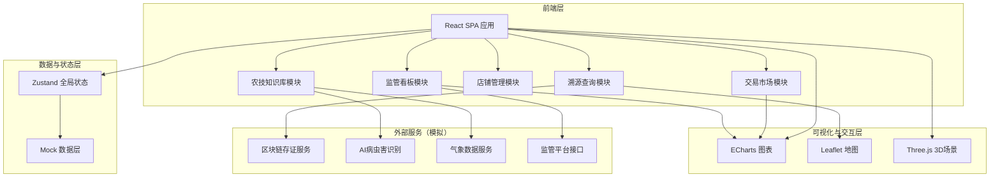
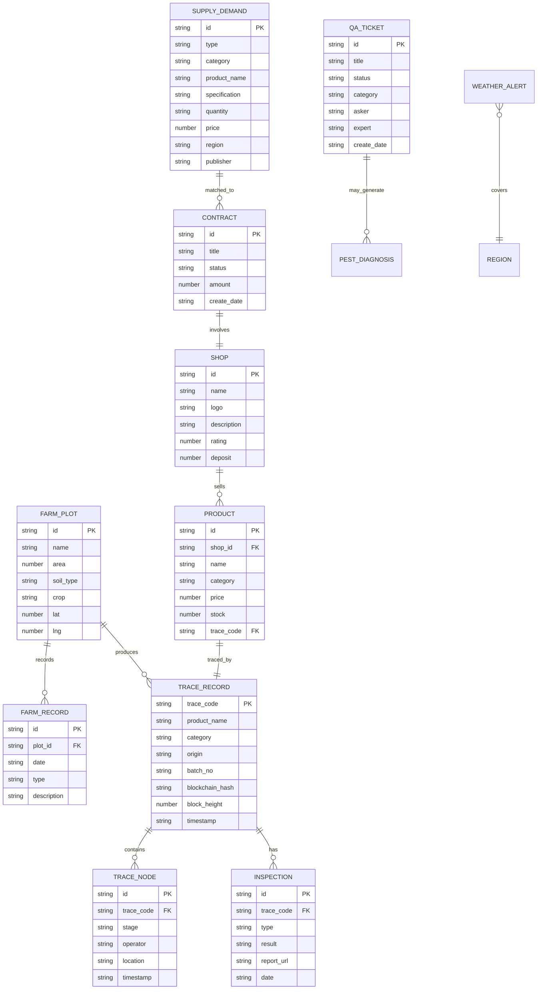

## 1. 架构设计



## 2. 技术说明

- **前端框架**：React@18 + TypeScript + Vite
- **样式方案**：TailwindCSS@3 + CSS Modules（复杂组件）
- **状态管理**：Zustand
- **路由**：React Router v6
- **图表库**：ECharts（价格走势、质量趋势、数据看板）
- **地图**：Leaflet + React-Leaflet（地块管理、物流轨迹）
- **3D场景**：Three.js + @react-three/fiber + @react-three/drei（首页Hero背景）
- **动画**：Framer Motion（页面转场、微交互）
- **数据层**：前端Mock数据（无后端），使用JSON模拟所有业务数据
- **初始化工具**：Vite

## 3. 路由定义

| 路由 | 用途 |
|------|------|
| `/` | 溯源首页，平台入口，数据看板 |
| `/trace/:code` | 溯源查询结果页，展示全链条信息 |
| `/trace` | 溯源码输入页 |
| `/farm` | 种植档案管理 |
| `/farm/plot/:id` | 地块详情与农事日历 |
| `/process` | 加工流转管理 |
| `/logistics` | 物流追踪 |
| `/logistics/:id` | 运单详情与实时监控 |
| `/market` | 交易市场，供需大厅 |
| `/market/price` | 价格行情 |
| `/shop` | 店铺管理 |
| `/shop/:id` | 店铺详情 |
| `/contract` | 电子合同管理 |
| `/contract/:id` | 合同签署页 |
| `/knowledge` | 农技知识库首页 |
| `/knowledge/qa` | 专家问答 |
| `/knowledge/diagnose` | 病虫害识别 |
| `/knowledge/weather` | 气象预警 |
| `/supervision` | 监管数据看板 |
| `/supervision/report` | 趋势分析报告 |

## 4. API定义（Mock接口）

```typescript
interface TraceRecord {
  traceCode: string
  productName: string
  category: string
  origin: string
  batchNo: string
  blockchainHash: string
  blockHeight: number
  timestamp: string
  nodes: TraceNode[]
  inspections: Inspection[]
}

interface TraceNode {
  stage: "production" | "processing" | "logistics" | "wholesale" | "retail"
  operator: string
  location: string
  timestamp: string
  details: Record<string, unknown>
}

interface Inspection {
  type: string
  result: "passed" | "failed" | "pending"
  reportUrl: string
  date: string
}

interface SupplyDemand {
  id: string
  type: "supply" | "demand"
  category: string
  productName: string
  specification: string
  quantity: string
  price: number
  region: string
  publisher: string
  publishDate: string
  matchScore?: number
}

interface ShopInfo {
  id: string
  name: string
  logo: string
  description: string
  rating: number
  deposit: number
  products: Product[]
}

interface Product {
  id: string
  name: string
  category: string
  price: number
  stock: number
  traceCode: string
  images: string[]
}

interface Contract {
  id: string
  title: string
  parties: string[]
  status: "draft" | "signing" | "signed" | "fulfilling" | "completed" | "disputed"
  amount: number
  createDate: string
  signDate?: string
  terms: string[]
}

interface QATicket {
  id: string
  title: string
  description: string
  images?: string[]
  status: "pending" | "assigned" | "answered" | "closed"
  category: string
  asker: string
  expert?: string
  answer?: string
  createDate: string
  answerDate?: string
  rating?: number
}

interface PestDiagnosis {
  id: string
  imageUrl: string
  pestName: string
  confidence: number
  description: string
  treatment: string[]
  prevention: string[]
}

interface WeatherAlert {
  id: string
  level: "red" | "orange" | "yellow" | "blue"
  type: string
  region: string
  description: string
  startTime: string
  endTime: string
  advice: string
}

interface FarmPlot {
  id: string
  name: string
  area: number
  soilType: string
  crop: string
  location: { lat: number; lng: number }
  records: FarmRecord[]
}

interface FarmRecord {
  date: string
  type: "sowing" | "fertilizing" | "irrigating" | "spraying" | "harvesting"
  description: string
  inputs?: { name: string; amount: string }[]
}

interface SupervisionData {
  totalBatches: number
  tracedBatches: number
  traceRate: number
  passRate: number
  violationRate: number
  categoryStats: { category: string; count: number; passRate: number }[]
  regionStats: { region: string; count: number; passRate: number }[]
  trendData: { month: string; passRate: number; violationCount: number }[]
}
```

## 5. 数据模型

### 5.1 数据模型定义



### 5.2 数据定义语言

所有数据使用前端TypeScript类型定义 + JSON Mock文件，无需数据库DDL。Mock数据存储在 `src/mocks/` 目录下：

- `traceRecords.json` — 溯源记录与节点数据
- `farmPlots.json` — 地块与农事记录
- `supplyDemand.json` — 供需信息
- `shops.json` — 店铺与商品数据
- `contracts.json` — 合同数据
- `qaTickets.json` — 问答工单
- `weatherAlerts.json` — 气象预警
- `supervisionData.json` — 监管统计数据
