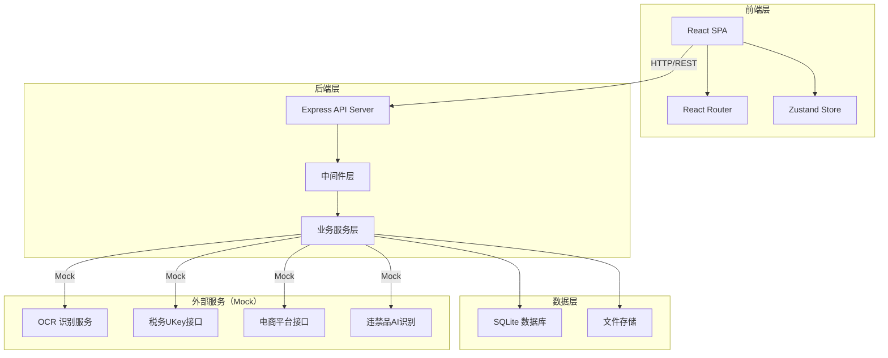
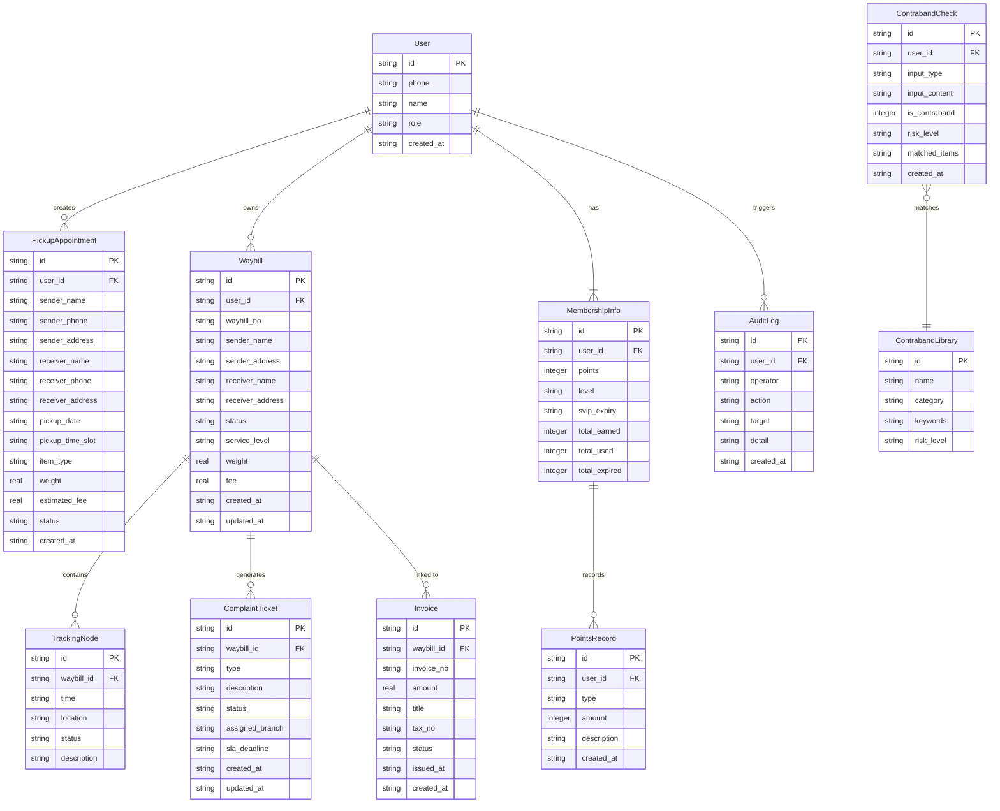

## 1. 架构设计



## 2. 技术说明

- **前端**：React@18 + TypeScript + Tailwind CSS@3 + Vite
- **初始化工具**：vite-init（react-express-ts 模板）
- **状态管理**：Zustand
- **路由**：React Router DOM v6
- **后端**：Express@4 + TypeScript（ESM）
- **数据库**：SQLite（better-sqlite3）
- **图标库**：lucide-react
- **外部服务**：全部采用Mock数据模拟（OCR、税务UKey、电商平台、AI识别）

## 3. 路由定义

| 路由 | 用途 |
|------|------|
| / | 控制台首页，数据概览仪表盘 |
| /pickup | 预约取件，时间窗选择与地址补全 |
| /scan | 面单识别，扫码与OCR上传 |
| /waybill | 运单管理，批量导入与模板打印 |
| /tracking | 物流追踪，订单聚合与时间线 |
| /contraband | 违禁品识别，图像与文本双重校验 |
| /freight | 运费计算，动态费用与时效预估 |
| /complaint | 投诉工单，自动分派与SLA倒计时 |
| /invoice | 电子发票，开具与下载 |
| /membership | 会员中心，积分与SVIP权益 |

## 4. API 定义

### 4.1 预约取件

```typescript
interface PickupAppointment {
  id: string;
  senderName: string;
  senderPhone: string;
  senderAddress: string;
  receiverName: string;
  receiverPhone: string;
  receiverAddress: string;
  pickupDate: string;
  pickupTimeSlot: "morning" | "afternoon" | "evening";
  itemType: string;
  weight: number;
  estimatedFee: number;
  status: "pending" | "confirmed" | "picked_up" | "cancelled";
  createdAt: string;
}

// POST /api/pickup - 创建预约取件
// GET /api/pickup - 获取预约列表
// GET /api/pickup/:id - 获取预约详情
// PUT /api/pickup/:id - 更新预约
// DELETE /api/pickup/:id - 取消预约
```

### 4.2 面单识别

```typescript
interface WaybillScanResult {
  id: string;
  waybillNo: string;
  senderName: string;
  senderPhone: string;
  senderAddress: string;
  receiverName: string;
  receiverPhone: string;
  receiverAddress: string;
  scanType: "barcode" | "ocr";
  confidence: number;
  createdAt: string;
}

// POST /api/scan/barcode - 扫码识别
// POST /api/scan/ocr - OCR上传识别
// GET /api/scan/history - 识别历史
```

### 4.3 运单管理

```typescript
interface Waybill {
  id: string;
  waybillNo: string;
  senderName: string;
  senderAddress: string;
  receiverName: string;
  receiverAddress: string;
  status: "created" | "picked_up" | "in_transit" | "delivered" | "returned";
  serviceLevel: "standard" | "express" | "same_day";
  weight: number;
  fee: number;
  createdAt: string;
  updatedAt: string;
}

// POST /api/waybill - 创建运单
// POST /api/waybill/batch - 批量导入运单
// GET /api/waybill - 获取运单列表（支持筛选）
// GET /api/waybill/:id - 获取运单详情
// PUT /api/waybill/:id - 更新运单
// POST /api/waybill/print - 模板化打印
```

### 4.4 物流追踪

```typescript
interface TrackingNode {
  time: string;
  location: string;
  status: string;
  description: string;
}

interface TrackingResult {
  waybillNo: string;
  currentStatus: string;
  platform?: string;
  nodes: TrackingNode[];
}

// GET /api/tracking/:waybillNo - 查询物流追踪
// POST /api/tracking/proxy - 亲友代查
// GET /api/tracking/platforms - 获取关联平台订单
```

### 4.5 违禁品识别

```typescript
interface ContrabandResult {
  id: string;
  inputType: "image" | "text";
  inputContent: string;
  isContraband: boolean;
  riskLevel: "none" | "low" | "medium" | "high";
  matchedItems: string[];
  description: string;
  createdAt: string;
}

// POST /api/contraband/image - 图像识别
// POST /api/contraband/text - 文本校验
// GET /api/contraband/library - 违禁品库列表
```

### 4.6 运费计算

```typescript
interface FreightCalcRequest {
  senderAddress: string;
  receiverAddress: string;
  weight: number;
  volume?: number;
  serviceLevel: "standard" | "express" | "same_day";
}

interface FreightCalcResult {
  baseFee: number;
  distanceFee: number;
  weightFee: number;
  serviceFee: number;
  discount: number;
  totalFee: number;
  estimatedDays: number;
  distance: number;
}

// POST /api/freight/calculate - 运费计算
```

### 4.7 投诉工单

```typescript
interface ComplaintTicket {
  id: string;
  waybillNo: string;
  type: "damage" | "lost" | "delay" | "service" | "other";
  description: string;
  evidence?: string[];
  status: "pending" | "assigned" | "processing" | "resolved" | "closed";
  assignedBranch: string;
  slaDeadline: string;
  slaRemaining: number;
  createdAt: string;
  updatedAt: string;
}

// POST /api/complaint - 创建工单
// GET /api/complaint - 获取工单列表
// GET /api/complaint/:id - 获取工单详情
// PUT /api/complaint/:id - 更新工单
// POST /api/complaint/:id/assign - 手动分派
```

### 4.8 电子发票

```typescript
interface Invoice {
  id: string;
  invoiceNo: string;
  waybillNo: string;
  amount: number;
  title: string;
  taxNo: string;
  status: "pending" | "issued" | "failed";
  issuedAt?: string;
  downloadUrl?: string;
  createdAt: string;
}

// POST /api/invoice - 开具发票
// GET /api/invoice - 发票列表
// GET /api/invoice/:id - 发票详情
// GET /api/invoice/:id/download - 下载发票
```

### 4.9 会员中心

```typescript
interface MembershipInfo {
  userId: string;
  points: number;
  level: "normal" | "silver" | "gold" | "svip";
  svipExpiry?: string;
  totalPointsEarned: number;
  totalPointsUsed: number;
  totalPointsExpired: number;
}

interface PointsRecord {
  id: string;
  userId: string;
  type: "earn" | "use" | "expire";
  amount: number;
  description: string;
  createdAt: string;
}

interface AuditLog {
  id: string;
  operator: string;
  action: string;
  target: string;
  detail: string;
  createdAt: string;
}

// GET /api/membership/info - 会员信息
// GET /api/membership/points - 积分记录
// POST /api/membership/points/exchange - 积分兑换
// GET /api/membership/svip/benefits - SVIP权益列表
// GET /api/membership/audit-logs - 审计日志
```

## 5. 服务端架构图


## 6. 数据模型

### 6.1 数据模型定义



### 6.2 数据定义语言

```sql
CREATE TABLE users (
    id TEXT PRIMARY KEY,
    phone TEXT NOT NULL UNIQUE,
    name TEXT NOT NULL,
    role TEXT NOT NULL DEFAULT 'individual',
    created_at TEXT NOT NULL DEFAULT (datetime('now'))
);

CREATE TABLE pickup_appointments (
    id TEXT PRIMARY KEY,
    user_id TEXT NOT NULL REFERENCES users(id),
    sender_name TEXT NOT NULL,
    sender_phone TEXT NOT NULL,
    sender_address TEXT NOT NULL,
    receiver_name TEXT NOT NULL,
    receiver_phone TEXT NOT NULL,
    receiver_address TEXT NOT NULL,
    pickup_date TEXT NOT NULL,
    pickup_time_slot TEXT NOT NULL CHECK(pickup_time_slot IN ('morning','afternoon','evening')),
    item_type TEXT NOT NULL DEFAULT 'general',
    weight REAL NOT NULL DEFAULT 1.0,
    estimated_fee REAL NOT NULL DEFAULT 0,
    status TEXT NOT NULL DEFAULT 'pending' CHECK(status IN ('pending','confirmed','picked_up','cancelled')),
    created_at TEXT NOT NULL DEFAULT (datetime('now'))
);

CREATE TABLE waybills (
    id TEXT PRIMARY KEY,
    user_id TEXT NOT NULL REFERENCES users(id),
    waybill_no TEXT NOT NULL UNIQUE,
    sender_name TEXT NOT NULL,
    sender_address TEXT NOT NULL,
    receiver_name TEXT NOT NULL,
    receiver_address TEXT NOT NULL,
    status TEXT NOT NULL DEFAULT 'created' CHECK(status IN ('created','picked_up','in_transit','delivered','returned')),
    service_level TEXT NOT NULL DEFAULT 'standard' CHECK(service_level IN ('standard','express','same_day')),
    weight REAL NOT NULL DEFAULT 1.0,
    fee REAL NOT NULL DEFAULT 0,
    created_at TEXT NOT NULL DEFAULT (datetime('now')),
    updated_at TEXT NOT NULL DEFAULT (datetime('now'))
);

CREATE TABLE tracking_nodes (
    id TEXT PRIMARY KEY,
    waybill_id TEXT NOT NULL REFERENCES waybills(id),
    time TEXT NOT NULL,
    location TEXT NOT NULL,
    status TEXT NOT NULL,
    description TEXT NOT NULL
);

CREATE TABLE complaint_tickets (
    id TEXT PRIMARY KEY,
    waybill_id TEXT NOT NULL REFERENCES waybills(id),
    type TEXT NOT NULL CHECK(type IN ('damage','lost','delay','service','other')),
    description TEXT NOT NULL,
    status TEXT NOT NULL DEFAULT 'pending' CHECK(status IN ('pending','assigned','processing','resolved','closed')),
    assigned_branch TEXT,
    sla_deadline TEXT,
    created_at TEXT NOT NULL DEFAULT (datetime('now')),
    updated_at TEXT NOT NULL DEFAULT (datetime('now'))
);

CREATE TABLE invoices (
    id TEXT PRIMARY KEY,
    waybill_id TEXT NOT NULL REFERENCES waybills(id),
    invoice_no TEXT NOT NULL UNIQUE,
    amount REAL NOT NULL,
    title TEXT NOT NULL,
    tax_no TEXT NOT NULL,
    status TEXT NOT NULL DEFAULT 'pending' CHECK(status IN ('pending','issued','failed')),
    issued_at TEXT,
    created_at TEXT NOT NULL DEFAULT (datetime('now'))
);

CREATE TABLE membership_info (
    id TEXT PRIMARY KEY,
    user_id TEXT NOT NULL UNIQUE REFERENCES users(id),
    points INTEGER NOT NULL DEFAULT 0,
    level TEXT NOT NULL DEFAULT 'normal' CHECK(level IN ('normal','silver','gold','svip')),
    svip_expiry TEXT,
    total_earned INTEGER NOT NULL DEFAULT 0,
    total_used INTEGER NOT NULL DEFAULT 0,
    total_expired INTEGER NOT NULL DEFAULT 0
);

CREATE TABLE points_records (
    id TEXT PRIMARY KEY,
    user_id TEXT NOT NULL REFERENCES users(id),
    type TEXT NOT NULL CHECK(type IN ('earn','use','expire')),
    amount INTEGER NOT NULL,
    description TEXT NOT NULL,
    created_at TEXT NOT NULL DEFAULT (datetime('now'))
);

CREATE TABLE audit_logs (
    id TEXT PRIMARY KEY,
    user_id TEXT REFERENCES users(id),
    operator TEXT NOT NULL,
    action TEXT NOT NULL,
    target TEXT NOT NULL,
    detail TEXT NOT NULL,
    created_at TEXT NOT NULL DEFAULT (datetime('now'))
);

CREATE TABLE contraband_library (
    id TEXT PRIMARY KEY,
    name TEXT NOT NULL,
    category TEXT NOT NULL,
    keywords TEXT NOT NULL,
    risk_level TEXT NOT NULL CHECK(risk_level IN ('low','medium','high'))
);

CREATE TABLE contraband_checks (
    id TEXT PRIMARY KEY,
    user_id TEXT NOT NULL REFERENCES users(id),
    input_type TEXT NOT NULL CHECK(input_type IN ('image','text')),
    input_content TEXT NOT NULL,
    is_contraband INTEGER NOT NULL DEFAULT 0,
    risk_level TEXT NOT NULL DEFAULT 'none' CHECK(risk_level IN ('none','low','medium','high')),
    matched_items TEXT NOT NULL DEFAULT '[]',
    created_at TEXT NOT NULL DEFAULT (datetime('now'))
);

CREATE INDEX idx_waybills_user ON waybills(user_id);
CREATE INDEX idx_waybills_status ON waybills(status);
CREATE INDEX idx_waybills_no ON waybills(waybill_no);
CREATE INDEX idx_pickup_user ON pickup_appointments(user_id);
CREATE INDEX idx_complaint_status ON complaint_tickets(status);
CREATE INDEX idx_tracking_waybill ON tracking_nodes(waybill_id);
CREATE INDEX idx_points_user ON points_records(user_id);
CREATE INDEX idx_audit_user ON audit_logs(user_id);
CREATE INDEX idx_contraband_risk ON contraband_library(risk_level);
```
