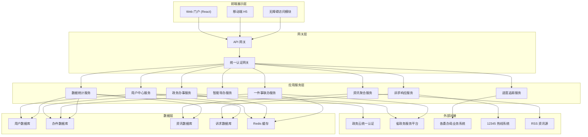
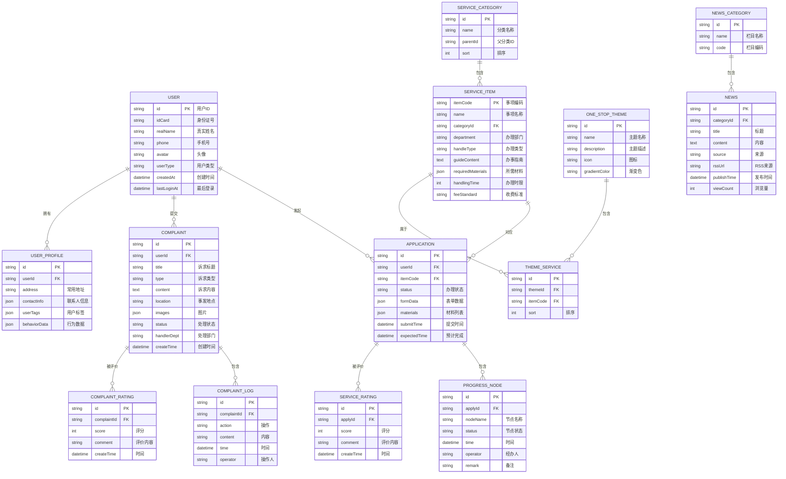
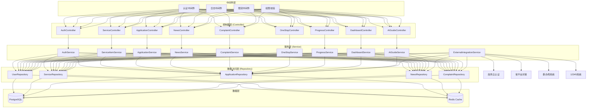

## 1. 架构设计



## 2. 技术选型

- **前端框架**：React@18 + TypeScript + Vite@5
- **状态管理**：Zustand@4
- **路由管理**：React Router@6
- **UI 框架**：TailwindCSS@3 + Ant Design@5（政务风格组件）
- **图表库**：ECharts@5
- **图标库**：lucide-react
- **HTTP 客户端**：Axios@1
- **后端框架**：Express@4 + TypeScript
- **数据库**：SQLite3（开发环境）/ PostgreSQL（生产环境）
- **缓存**：Redis
- **认证**：JWT + 政务云 OAuth2.0
- **ORM**：Prisma@5

## 3. 路由定义

| 路由 | 页面 | 说明 |
|------|------|------|
| / | 首页 | 统一入口、热门服务、资讯轮播 |
| /services | 政务办事 | 服务分类列表 |
| /services/:itemCode | 事项详情 | 办事指南、在线申报入口 |
| /services/:itemCode/apply | 在线申报 | 表单填写、材料上传 |
| /one-stop | 一件事一次办 | 主题服务列表 |
| /one-stop/:themeId | 联办详情 | 联办流程、一表填报 |
| /guide | 智能导办 | AI 助手、服务推荐 |
| /progress | 服务进度 | 办件列表 |
| /progress/:applyId | 进度详情 | 办理节点、物流信息 |
| /news | 本地资讯 | 资讯列表、分类筛选 |
| /news/:newsId | 资讯详情 | 文章内容、相关推荐 |
| /complaints | 诉求响应 | 工单列表、提交入口 |
| /complaints/submit | 诉求提交 | 工单填写 |
| /dashboard | 数据驾驶舱 | 数据统计、图表展示 |
| /profile | 个人中心 | 用户信息、我的办件 |
| /profile/settings | 设置 | 无障碍、消息通知设置 |
| /login | 登录 | 政务云统一认证 |

## 4. 数据模型

### 4.1 ER 图



### 4.2 共享类型定义

```typescript
// shared/types/index.ts

export interface User {
  id: string;
  idCard: string;
  realName: string;
  phone: string;
  avatar?: string;
  userType: 'citizen' | 'enterprise' | 'staff' | 'admin';
  createdAt: string;
  lastLoginAt: string;
}

export interface UserProfile {
  id: string;
  userId: string;
  address?: string;
  contactInfo?: ContactInfo[];
  userTags?: string[];
  behaviorData?: BehaviorData;
}

export interface ServiceCategory {
  id: string;
  name: string;
  parentId?: string;
  sort: number;
  children?: ServiceCategory[];
}

export interface ServiceItem {
  itemCode: string;
  name: string;
  categoryId: string;
  department: string;
  handleType: 'online' | 'offline' | 'hybrid';
  guideContent: string;
  requiredMaterials: MaterialItem[];
  handlingTime: number;
  feeStandard: string;
}

export interface MaterialItem {
  name: string;
  required: boolean;
  format: string[];
  maxSize: number;
  description?: string;
}

export interface OneStopTheme {
  id: string;
  name: string;
  description: string;
  icon: string;
  gradientColor: string;
  services: ThemeService[];
}

export interface ThemeService {
  id: string;
  themeId: string;
  itemCode: string;
  sort: number;
  serviceItem?: ServiceItem;
}

export interface Application {
  id: string;
  userId: string;
  itemCode: string;
  status: 'pending' | 'reviewing' | 'processing' | 'completed' | 'rejected';
  formData: Record<string, any>;
  materials: UploadedMaterial[];
  submitTime: string;
  expectedTime: string;
  serviceItem?: ServiceItem;
  progressNodes?: ProgressNode[];
}

export interface ProgressNode {
  id: string;
  applyId: string;
  nodeName: string;
  status: 'pending' | 'current' | 'completed';
  time?: string;
  operator?: string;
  remark?: string;
}

export interface NewsCategory {
  id: string;
  name: string;
  code: 'government' | 'convenience' | 'policy';
}

export interface News {
  id: string;
  categoryId: string;
  title: string;
  content: string;
  source: string;
  rssUrl?: string;
  publishTime: string;
  viewCount: number;
  category?: NewsCategory;
}

export interface Complaint {
  id: string;
  userId: string;
  title: string;
  type: string;
  content: string;
  location?: string;
  images?: string[];
  status: 'pending' | 'assigned' | 'processing' | 'replied' | 'closed';
  handlerDept?: string;
  createTime: string;
  logs?: ComplaintLog[];
}

export interface ComplaintLog {
  id: string;
  complaintId: string;
  action: string;
  content: string;
  time: string;
  operator: string;
}

export interface DashboardStats {
  todayApplications: number;
  completionRate: number;
  averageSatisfaction: number;
  pendingComplaints: number;
  applicationTrend: TrendData[];
  hotIssues: HotIssue[];
  departmentRanking: DepartmentRank[];
}
```

## 5. API 接口定义

```typescript
// shared/api/types.ts

// 用户认证
export interface LoginRequest {
  authType: 'idcard' | 'phone' | 'face';
  credential: string;
  verifyCode?: string;
}

export interface LoginResponse {
  token: string;
  user: User;
}

// 服务事项
export interface ServiceListQuery {
  categoryId?: string;
  keyword?: string;
  userType?: string;
  page?: number;
  pageSize?: number;
}

export interface ServiceListResponse {
  list: ServiceItem[];
  total: number;
}

// 办件申请
export interface SubmitApplicationRequest {
  itemCode: string;
  formData: Record<string, any>;
  materials: UploadedMaterial[];
}

export interface SubmitApplicationResponse {
  applyId: string;
  status: string;
  expectedTime: string;
}

// 诉求提交
export interface SubmitComplaintRequest {
  title: string;
  type: string;
  content: string;
  location?: string;
  images?: string[];
}

export interface PaginationResponse<T> {
  list: T[];
  total: number;
  page: number;
  pageSize: number;
}

// 数据统计
export interface DashboardResponse {
  todayApplications: number;
  completionRate: number;
  averageSatisfaction: number;
  pendingComplaints: number;
  applicationTrend: { date: string; count: number }[];
  hotIssues: { name: string; count: number }[];
  departmentRanking: { dept: string; rate: number }[];
}
```

## 6. 服务端架构



## 7. 目录结构

```
├── src/                    # 前端源码
│   ├── components/         # 公共组件
│   │   ├── layout/         # 布局组件
│   │   ├── ui/             # UI 组件
│   │   └── accessibility/  # 无障碍组件
│   ├── pages/              # 页面组件
│   ├── hooks/              # 自定义 Hooks
│   ├── stores/             # Zustand 状态
│   ├── services/           # API 服务
│   ├── utils/              # 工具函数
│   ├── types/              # 类型定义
│   ├── styles/             # 全局样式
│   ├── router/             # 路由配置
│   └── main.tsx            # 入口文件
├── api/                    # 后端源码
│   ├── src/
│   │   ├── controllers/    # 控制器
│   │   ├── services/       # 业务服务
│   │   ├── repositories/   # 数据访问
│   │   ├── middleware/     # 中间件
│   │   ├── routes/         # 路由
│   │   ├── types/          # 类型定义
│   │   ├── utils/          # 工具函数
│   │   └── server.ts       # 入口文件
│   └── prisma/             # Prisma ORM
├── shared/                 # 共享类型
├── public/                 # 静态资源
└── migrations/             # 数据库迁移
```
