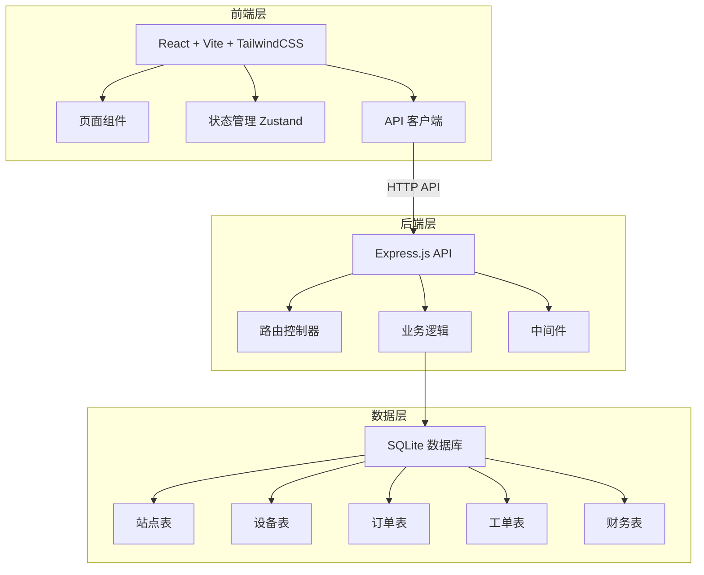
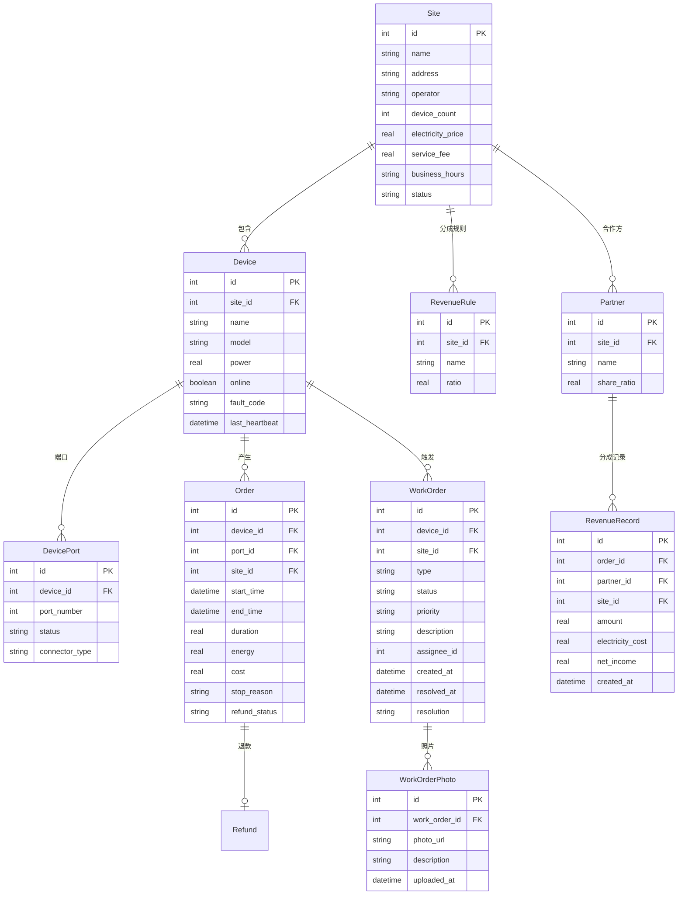

## 1. 架构设计



## 2. 技术说明

- 前端：React@18 + TailwindCSS@3 + Vite + Zustand
- 初始化工具：vite-init (react-express-ts 模板)
- 后端：Express@4 + TypeScript (ESM)
- 数据库：SQLite (better-sqlite3)
- 端口：FRONTEND_PORT=43429, BACKEND_PORT=53429

## 3. 路由定义

| 路由 | 用途 |
|------|------|
| / | 仪表盘首页 |
| /sites | 站点列表 |
| /sites/:id | 站点详情 |
| /devices | 设备列表 |
| /devices/:id | 设备详情 |
| /orders | 订单列表 |
| /orders/:id | 订单详情 |
| /work-orders | 运维工单列表 |
| /work-orders/:id | 工单详情 |
| /finance | 财务报表 |

## 4. API 定义

### 4.1 站点 API

| 方法 | 路径 | 说明 |
|------|------|------|
| GET | /api/sites | 获取站点列表 |
| GET | /api/sites/:id | 获取站点详情 |
| POST | /api/sites | 创建站点 |
| PUT | /api/sites/:id | 更新站点 |
| DELETE | /api/sites/:id | 删除站点 |

### 4.2 设备 API

| 方法 | 路径 | 说明 |
|------|------|------|
| GET | /api/devices | 获取设备列表 |
| GET | /api/devices/:id | 获取设备详情 |
| POST | /api/devices | 创建设备 |
| PUT | /api/devices/:id | 更新设备 |
| PATCH | /api/devices/:id/heartbeat | 更新心跳 |
| PATCH | /api/devices/:id/port/:portId | 更新端口状态 |

### 4.3 订单 API

| 方法 | 路径 | 说明 |
|------|------|------|
| GET | /api/orders | 获取订单列表 |
| GET | /api/orders/:id | 获取订单详情 |
| POST | /api/orders | 创建订单（扫码启动） |
| PATCH | /api/orders/:id/stop | 停止充电 |
| PATCH | /api/orders/:id/refund | 退款 |

### 4.4 工单 API

| 方法 | 路径 | 说明 |
|------|------|------|
| GET | /api/work-orders | 获取工单列表 |
| GET | /api/work-orders/:id | 获取工单详情 |
| POST | /api/work-orders | 创建工单 |
| PATCH | /api/work-orders/:id/assign | 分配工单 |
| PATCH | /api/work-orders/:id/resolve | 处理工单 |
| POST | /api/work-orders/:id/photos | 上传维修照片 |

### 4.5 财务 API

| 方法 | 路径 | 说明 |
|------|------|------|
| GET | /api/finance/summary | 收入汇总 |
| GET | /api/finance/by-site | 按站点统计 |
| GET | /api/finance/by-device | 按设备统计 |
| GET | /api/finance/by-partner | 按合作方统计 |
| GET | /api/finance/revenue-sharing | 分成明细 |

### 4.6 仪表盘 API

| 方法 | 路径 | 说明 |
|------|------|------|
| GET | /api/dashboard/stats | 总览统计 |
| GET | /api/health | 健康检查 |

## 5. 服务架构图


## 6. 数据模型

### 6.1 数据模型定义



### 6.2 数据定义语言

```sql
CREATE TABLE sites (
    id INTEGER PRIMARY KEY AUTOINCREMENT,
    name TEXT NOT NULL,
    address TEXT NOT NULL,
    operator TEXT NOT NULL,
    device_count INTEGER DEFAULT 0,
    electricity_price REAL NOT NULL DEFAULT 0.0,
    service_fee REAL NOT NULL DEFAULT 0.0,
    business_hours_start TEXT DEFAULT '00:00',
    business_hours_end TEXT DEFAULT '23:59',
    status TEXT DEFAULT 'active',
    created_at DATETIME DEFAULT CURRENT_TIMESTAMP,
    updated_at DATETIME DEFAULT CURRENT_TIMESTAMP
);

CREATE TABLE devices (
    id INTEGER PRIMARY KEY AUTOINCREMENT,
    site_id INTEGER NOT NULL,
    name TEXT NOT NULL,
    model TEXT NOT NULL,
    power REAL NOT NULL DEFAULT 0.0,
    online INTEGER DEFAULT 1,
    fault_code TEXT,
    last_heartbeat DATETIME DEFAULT CURRENT_TIMESTAMP,
    status TEXT DEFAULT 'active',
    created_at DATETIME DEFAULT CURRENT_TIMESTAMP,
    updated_at DATETIME DEFAULT CURRENT_TIMESTAMP,
    FOREIGN KEY (site_id) REFERENCES sites(id)
);

CREATE TABLE device_ports (
    id INTEGER PRIMARY KEY AUTOINCREMENT,
    device_id INTEGER NOT NULL,
    port_number INTEGER NOT NULL,
    status TEXT DEFAULT 'idle',
    connector_type TEXT DEFAULT 'AC',
    created_at DATETIME DEFAULT CURRENT_TIMESTAMP,
    FOREIGN KEY (device_id) REFERENCES devices(id)
);

CREATE TABLE orders (
    id INTEGER PRIMARY KEY AUTOINCREMENT,
    device_id INTEGER NOT NULL,
    port_id INTEGER NOT NULL,
    site_id INTEGER NOT NULL,
    start_time DATETIME DEFAULT CURRENT_TIMESTAMP,
    end_time DATETIME,
    duration REAL DEFAULT 0.0,
    energy REAL DEFAULT 0.0,
    cost REAL DEFAULT 0.0,
    stop_reason TEXT,
    refund_status TEXT DEFAULT 'none',
    refund_amount REAL DEFAULT 0.0,
    status TEXT DEFAULT 'charging',
    created_at DATETIME DEFAULT CURRENT_TIMESTAMP,
    updated_at DATETIME DEFAULT CURRENT_TIMESTAMP,
    FOREIGN KEY (device_id) REFERENCES devices(id),
    FOREIGN KEY (port_id) REFERENCES device_ports(id),
    FOREIGN KEY (site_id) REFERENCES sites(id)
);

CREATE TABLE work_orders (
    id INTEGER PRIMARY KEY AUTOINCREMENT,
    device_id INTEGER,
    site_id INTEGER,
    type TEXT NOT NULL,
    status TEXT DEFAULT 'pending',
    priority TEXT DEFAULT 'medium',
    description TEXT,
    assignee TEXT,
    created_at DATETIME DEFAULT CURRENT_TIMESTAMP,
    assigned_at DATETIME,
    resolved_at DATETIME,
    resolution TEXT,
    FOREIGN KEY (device_id) REFERENCES devices(id),
    FOREIGN KEY (site_id) REFERENCES sites(id)
);

CREATE TABLE work_order_photos (
    id INTEGER PRIMARY KEY AUTOINCREMENT,
    work_order_id INTEGER NOT NULL,
    photo_url TEXT NOT NULL,
    description TEXT,
    uploaded_at DATETIME DEFAULT CURRENT_TIMESTAMP,
    FOREIGN KEY (work_order_id) REFERENCES work_orders(id)
);

CREATE TABLE partners (
    id INTEGER PRIMARY KEY AUTOINCREMENT,
    site_id INTEGER NOT NULL,
    name TEXT NOT NULL,
    share_ratio REAL NOT NULL,
    contact TEXT,
    created_at DATETIME DEFAULT CURRENT_TIMESTAMP,
    FOREIGN KEY (site_id) REFERENCES sites(id)
);

CREATE TABLE revenue_records (
    id INTEGER PRIMARY KEY AUTOINCREMENT,
    order_id INTEGER NOT NULL,
    partner_id INTEGER NOT NULL,
    site_id INTEGER NOT NULL,
    total_amount REAL NOT NULL,
    electricity_cost REAL NOT NULL DEFAULT 0.0,
    partner_share REAL NOT NULL DEFAULT 0.0,
    platform_share REAL NOT NULL DEFAULT 0.0,
    refund_deduction REAL DEFAULT 0.0,
    created_at DATETIME DEFAULT CURRENT_TIMESTAMP,
    FOREIGN KEY (order_id) REFERENCES orders(id),
    FOREIGN KEY (partner_id) REFERENCES partners(id),
    FOREIGN KEY (site_id) REFERENCES sites(id)
);
```
