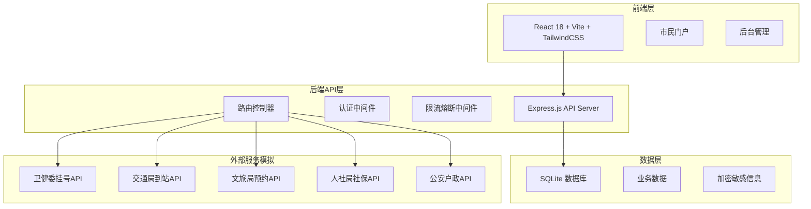
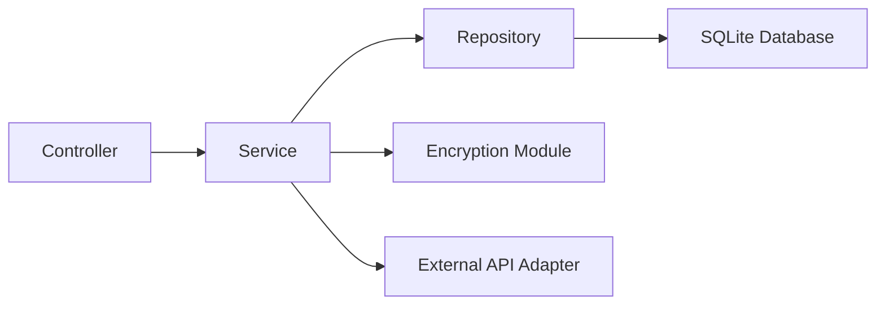

## 1. 架构设计



## 2. 技术说明

- **前端**：React@18 + TailwindCSS@3 + Vite + React Router v6 + Zustand状态管理 + Recharts图表
- **初始化工具**：Vite
- **后端**：Express@4 + better-sqlite3 + jsonwebtoken + bcryptjs + multer
- **数据库**：SQLite（data/app.sqlite），零外部依赖
- **加密**：AES-256-GCM加密敏感字段，bcrypt哈希密码
- **端口**：FRONTEND_PORT=49062, BACKEND_PORT=59062

## 3. 路由定义

### 3.1 前端路由

| 路由 | 用途 |
|------|------|
| / | 市民门户首页 |
| /login | 登录页 |
| /register | 注册页 |
| /verify | 身份核验页 |
| /health | 卫健委挂号服务 |
| /transport | 交通出行服务 |
| /tourism | 文旅预约服务 |
| /social-security | 社保查询服务 |
| /police | 公安户政服务 |
| /subscriptions | 服务订阅中心 |
| /applications | 事项申办 |
| /complaints | 市民诉求 |
| /profile | 个人中心 |
| /admin | 后台管理首页 |
| /admin/services | 部门服务治理 |
| /admin/monitor | 监控大屏 |
| /admin/tickets | 工单分拨引擎 |
| /admin/knowledge | 知识库管理 |
| /admin/users | 用户管理 |

### 3.2 后端API路由

| 路由 | 方法 | 用途 |
|------|------|------|
| /api/health | GET | 健康检查 |
| /api/auth/register | POST | 用户注册 |
| /api/auth/login | POST | 用户登录 |
| /api/auth/profile | GET | 获取当前用户信息 |
| /api/verify/sukang | GET | 获取苏康码状态 |
| /api/verify/ocr | POST | 身份证OCR识别 |
| /api/health/hospitals | GET | 医院列表 |
| /api/health/departments | GET | 科室列表 |
| /api/health/doctors | GET | 医生排班 |
| /api/health/appointments | POST | 预约挂号 |
| /api/health/appointments | GET | 我的挂号记录 |
| /api/transport/bus | GET | 公交实时到站 |
| /api/transport/metro | GET | 地铁线路查询 |
| /api/tourism/spots | GET | 景区列表 |
| /api/tourism/reservations | POST | 景区预约 |
| /api/tourism/reservations | GET | 我的预约 |
| /api/social-security/info | GET | 社保账户信息 |
| /api/social-security/records | GET | 缴费记录 |
| /api/police/guides | GET | 办事指南列表 |
| /api/subscriptions | GET | 我的订阅 |
| /api/subscriptions | POST | 创建订阅 |
| /api/subscriptions/:id | DELETE | 取消订阅 |
| /api/notifications | GET | 通知列表 |
| /api/applications | GET | 申办事项列表 |
| /api/applications | POST | 提交申办 |
| /api/applications/:id | GET | 申办详情/进度 |
| /api/complaints | GET | 诉求列表 |
| /api/complaints | POST | 提交诉求 |
| /api/complaints/:id | GET | 诉求详情 |
| /api/admin/services | GET | 已注册服务列表 |
| /api/admin/services | POST | 注册新服务 |
| /api/admin/services/:id/rate-limit | PUT | 配置限流 |
| /api/admin/services/:id/circuit | PUT | 配置熔断 |
| /api/admin/monitor | GET | 监控数据 |
| /api/admin/tickets | GET | 工单列表 |
| /api/admin/tickets/:id | PUT | 处理工单 |
| /api/admin/tickets/routes | GET | 路由规则 |
| /api/admin/tickets/routes | POST | 创建路由规则 |
| /api/admin/knowledge | GET | 知识库列表 |
| /api/admin/knowledge | POST | 新增知识条目 |
| /api/admin/knowledge/search | POST | 语义检索 |
| /api/admin/users | GET | 用户列表 |
| /api/profile | PUT | 更新个人信息 |
| /api/profile/delete-account | POST | 一键注销 |

## 4. API定义

### 4.1 通用响应格式

```typescript
interface ApiResponse<T> {
  code: number;
  message: string;
  data: T;
}

interface PaginatedResponse<T> {
  code: number;
  message: string;
  data: {
    items: T[];
    total: number;
    page: number;
    pageSize: number;
  };
}
```

### 4.2 核心数据类型

```typescript
interface User {
  id: number;
  phone: string;
  name: string;
  id_card_encrypted: string;
  sukang_status: 'green' | 'yellow' | 'red';
  verified: boolean;
  role: 'citizen' | 'operator' | 'admin';
  street: string;
  created_at: string;
}

interface Hospital {
  id: number;
  name: string;
  level: string;
  district: string;
  departments: Department[];
}

interface Appointment {
  id: number;
  user_id: number;
  hospital_id: number;
  department_id: number;
  doctor_id: number;
  appointment_time: string;
  status: 'pending' | 'confirmed' | 'cancelled';
}

interface BusArrival {
  route: string;
  station: string;
  arrivals: { minutes: number; bus_id: string }[];
}

interface TouristReservation {
  id: number;
  user_id: number;
  spot_id: number;
  date: string;
  visitors: number;
  status: 'pending' | 'confirmed' | 'cancelled';
}

interface Subscription {
  id: number;
  user_id: number;
  type: 'school_district' | 'medical_insurance' | 'traffic' | 'social_security';
  enabled: boolean;
}

interface Application {
  id: number;
  user_id: number;
  item_name: string;
  department: string;
  materials: string[];
  status: 'submitted' | 'processing' | 'approved' | 'rejected';
  progress: number;
  created_at: string;
}

interface Complaint {
  id: number;
  user_id: number;
  type: string;
  street: string;
  department: string;
  content: string;
  status: 'pending' | 'assigned' | 'processing' | 'resolved';
  assigned_to: number | null;
  created_at: string;
}

interface ServiceRegistry {
  id: number;
  name: string;
  department: string;
  endpoint: string;
  rate_limit_qps: number;
  circuit_threshold: number;
  status: 'active' | 'degraded' | 'down';
}

interface KnowledgeEntry {
  id: number;
  title: string;
  content: string;
  category: string;
  keywords: string[];
  created_at: string;
}

interface TicketRouteRule {
  id: number;
  street: string;
  department: string;
  complaint_type: string;
  priority: number;
}
```

## 5. 服务器架构图



## 6. 数据模型

### 6.1 数据模型定义


### 6.2 数据定义语言

```sql
CREATE TABLE users (
    id INTEGER PRIMARY KEY AUTOINCREMENT,
    phone TEXT NOT NULL UNIQUE,
    password_hash TEXT NOT NULL,
    name TEXT NOT NULL DEFAULT '',
    id_card_encrypted TEXT,
    sukang_status TEXT NOT NULL DEFAULT 'green',
    verified INTEGER NOT NULL DEFAULT 0,
    role TEXT NOT NULL DEFAULT 'citizen',
    street TEXT NOT NULL DEFAULT '',
    created_at TEXT NOT NULL DEFAULT (datetime('now'))
);

CREATE TABLE hospitals (
    id INTEGER PRIMARY KEY AUTOINCREMENT,
    name TEXT NOT NULL,
    level TEXT NOT NULL DEFAULT '三甲',
    district TEXT NOT NULL DEFAULT '玄武区'
);

CREATE TABLE departments (
    id INTEGER PRIMARY KEY AUTOINCREMENT,
    hospital_id INTEGER NOT NULL REFERENCES hospitals(id),
    name TEXT NOT NULL
);

CREATE TABLE doctors (
    id INTEGER PRIMARY KEY AUTOINCREMENT,
    department_id INTEGER NOT NULL REFERENCES departments(id),
    name TEXT NOT NULL,
    title TEXT NOT NULL DEFAULT '主治医师',
    schedule TEXT NOT NULL DEFAULT ''
);

CREATE TABLE appointments (
    id INTEGER PRIMARY KEY AUTOINCREMENT,
    user_id INTEGER NOT NULL REFERENCES users(id),
    doctor_id INTEGER NOT NULL REFERENCES doctors(id),
    appointment_time TEXT NOT NULL,
    status TEXT NOT NULL DEFAULT 'pending',
    created_at TEXT NOT NULL DEFAULT (datetime('now'))
);

CREATE TABLE tourist_spots (
    id INTEGER PRIMARY KEY AUTOINCREMENT,
    name TEXT NOT NULL,
    district TEXT NOT NULL DEFAULT '玄武区',
    description TEXT NOT NULL DEFAULT '',
    daily_limit INTEGER NOT NULL DEFAULT 5000
);

CREATE TABLE reservations (
    id INTEGER PRIMARY KEY AUTOINCREMENT,
    user_id INTEGER NOT NULL REFERENCES users(id),
    spot_id INTEGER NOT NULL REFERENCES tourist_spots(id),
    date TEXT NOT NULL,
    visitors INTEGER NOT NULL DEFAULT 1,
    status TEXT NOT NULL DEFAULT 'pending',
    created_at TEXT NOT NULL DEFAULT (datetime('now'))
);

CREATE TABLE subscriptions (
    id INTEGER PRIMARY KEY AUTOINCREMENT,
    user_id INTEGER NOT NULL REFERENCES users(id),
    type TEXT NOT NULL,
    enabled INTEGER NOT NULL DEFAULT 1,
    created_at TEXT NOT NULL DEFAULT (datetime('now')),
    UNIQUE(user_id, type)
);

CREATE TABLE notifications (
    id INTEGER PRIMARY KEY AUTOINCREMENT,
    user_id INTEGER NOT NULL REFERENCES users(id),
    title TEXT NOT NULL,
    content TEXT NOT NULL,
    type TEXT NOT NULL DEFAULT 'system',
    read INTEGER NOT NULL DEFAULT 0,
    created_at TEXT NOT NULL DEFAULT (datetime('now'))
);

CREATE TABLE applications (
    id INTEGER PRIMARY KEY AUTOINCREMENT,
    user_id INTEGER NOT NULL REFERENCES users(id),
    item_name TEXT NOT NULL,
    department TEXT NOT NULL,
    materials TEXT NOT NULL DEFAULT '[]',
    ocr_data TEXT,
    signature_data TEXT,
    status TEXT NOT NULL DEFAULT 'submitted',
    progress INTEGER NOT NULL DEFAULT 0,
    created_at TEXT NOT NULL DEFAULT (datetime('now'))
);

CREATE TABLE complaints (
    id INTEGER PRIMARY KEY AUTOINCREMENT,
    user_id INTEGER NOT NULL REFERENCES users(id),
    type TEXT NOT NULL,
    street TEXT NOT NULL,
    department TEXT NOT NULL DEFAULT '',
    content TEXT NOT NULL,
    status TEXT NOT NULL DEFAULT 'pending',
    assigned_to INTEGER REFERENCES users(id),
    reply TEXT,
    created_at TEXT NOT NULL DEFAULT (datetime('now')),
    updated_at TEXT NOT NULL DEFAULT (datetime('now'))
);

CREATE TABLE service_registry (
    id INTEGER PRIMARY KEY AUTOINCREMENT,
    name TEXT NOT NULL,
    department TEXT NOT NULL,
    endpoint TEXT NOT NULL,
    rate_limit_qps INTEGER NOT NULL DEFAULT 100,
    circuit_threshold REAL NOT NULL DEFAULT 0.5,
    status TEXT NOT NULL DEFAULT 'active',
    created_at TEXT NOT NULL DEFAULT (datetime('now'))
);

CREATE TABLE service_metrics (
    id INTEGER PRIMARY KEY AUTOINCREMENT,
    service_id INTEGER NOT NULL REFERENCES service_registry(id),
    metric_type TEXT NOT NULL,
    value REAL NOT NULL,
    recorded_at TEXT NOT NULL DEFAULT (datetime('now'))
);

CREATE TABLE ticket_route_rules (
    id INTEGER PRIMARY KEY AUTOINCREMENT,
    street TEXT NOT NULL,
    department TEXT NOT NULL,
    complaint_type TEXT NOT NULL,
    priority INTEGER NOT NULL DEFAULT 0
);

CREATE TABLE knowledge_entries (
    id INTEGER PRIMARY KEY AUTOINCREMENT,
    title TEXT NOT NULL,
    content TEXT NOT NULL,
    category TEXT NOT NULL DEFAULT '通用',
    keywords TEXT NOT NULL DEFAULT '[]',
    created_at TEXT NOT NULL DEFAULT (datetime('now'))
);

CREATE INDEX idx_users_phone ON users(phone);
CREATE INDEX idx_appointments_user ON appointments(user_id);
CREATE INDEX idx_reservations_user ON reservations(user_id);
CREATE INDEX idx_subscriptions_user ON subscriptions(user_id);
CREATE INDEX idx_notifications_user ON notifications(user_id);
CREATE INDEX idx_applications_user ON applications(user_id);
CREATE INDEX idx_complaints_user ON complaints(user_id);
CREATE INDEX idx_complaints_status ON complaints(status);
CREATE INDEX idx_service_metrics_service ON service_metrics(service_id);
CREATE INDEX idx_knowledge_category ON knowledge_entries(category);
```
