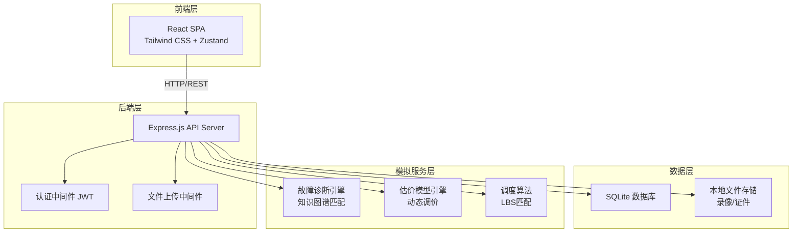
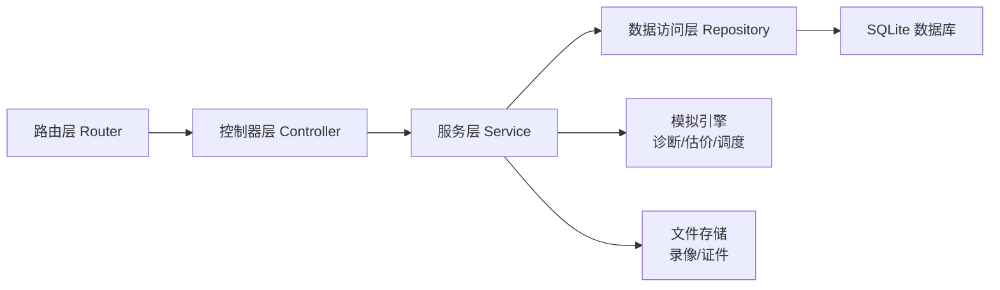
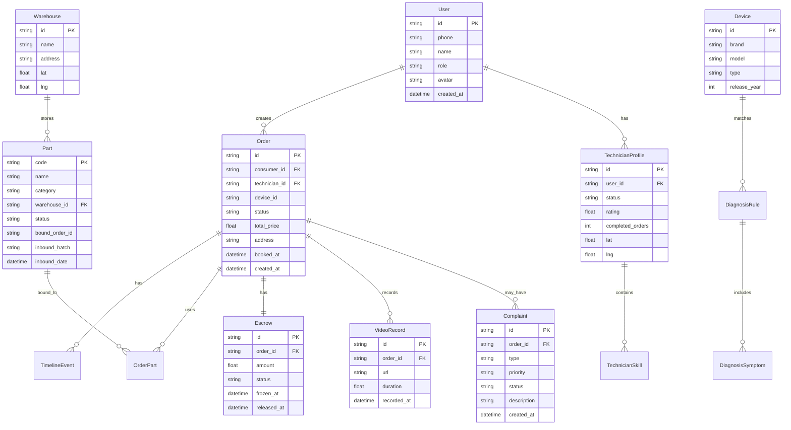

## 1. 架构设计



## 2. 技术说明

- 前端：React@18 + TailwindCSS@3 + Vite + Zustand（状态管理）+ React Router DOM
- 初始化工具：vite-init（react-express-ts 模板）
- 后端：Express@4 + TypeScript（ESM格式）
- 数据库：SQLite（better-sqlite3），使用 mock 数据填充初始状态
- 图表：Recharts（轻量React图表库）
- 地图：React-Leaflet（开源地图组件）
- 图标：lucide-react

## 3. 路由定义

| 路由 | 用途 |
|------|------|
| `/` | 首页 - 品牌展示与服务入口 |
| `/diagnosis` | 智能诊断 - 故障诊断流程 |
| `/booking` | 预约调度 - 地图选择与时段预约 |
| `/order/:id` | 维修工单详情 - 工单全链路追踪 |
| `/recycle` | 回收估价 - 设备评估与动态定价 |
| `/admin/technicians` | 技师管理 - 列表与资质审核 |
| `/admin/sla` | SLA监控看板 - 服务指标监控 |
| `/admin/inventory` | 配件库存管理 - 多仓联动 |
| `/admin/complaints` | 投诉处理工作台 - 投诉闭环管理 |

## 4. API定义

### 4.1 认证相关

```typescript
POST /api/auth/login
  Request:  { phone: string; code: string; role: "consumer" | "technician" | "admin" }
  Response: { token: string; user: User }

POST /api/auth/register
  Request:  { phone: string; name: string; role: "consumer" | "technician" }
  Response: { token: string; user: User }
```

### 4.2 智能诊断

```typescript
POST /api/diagnosis/analyze
  Request:  { deviceId: string; symptoms: string[]; sensorData?: Record<string, number> }
  Response: { results: DiagnosisResult[] }

interface DiagnosisResult {
  faultId: string;
  faultName: string;
  confidence: number;
  estimatedPrice: { min: number; max: number };
  estimatedTime: number;
  requiresParts: { partId: string; partName: string; quantity: number }[];
}
```

### 4.3 预约调度

```typescript
GET  /api/booking/available-slots?date=string&area=string
  Response: { slots: TimeSlot[]; technicians: TechnicianLocation[] }

POST /api/booking/create
  Request:  { diagnosisId?: string; deviceType: string; address: Address; slotId: string; description: string }
  Response: { orderId: string; countdown: number }

interface TimeSlot {
  slotId: string;
  startTime: string;
  endTime: string;
  available: boolean;
  technicianCount: number;
}

interface TechnicianLocation {
  techId: string;
  name: string;
  lat: number;
  lng: number;
  skills: string[];
  rating: number;
}
```

### 4.4 维修工单

```typescript
GET  /api/orders/:id
  Response: OrderDetail

POST /api/orders/:id/accept
  Request:  { technicianId: string }
  Response: { success: boolean }

POST /api/orders/:id/arrive
  Request:  { location: { lat: number; lng: number } }
  Response: { success: boolean }

POST /api/orders/:id/complete
  Request:  { partsUsed: { partCode: string; quantity: number }[]; videoUrls: string[]; notes: string }
  Response: { success: boolean }

POST /api/orders/:id/verify
  Request:  { passed: boolean; complaint?: string }
  Response: { success: boolean; escrowStatus: string }

interface OrderDetail {
  orderId: string;
  status: "pending" | "accepted" | "arrived" | "repairing" | "verifying" | "completed" | "disputed";
  consumer: User;
  technician?: User;
  device: DeviceInfo;
  diagnosis?: DiagnosisResult;
  timeline: TimelineEvent[];
  parts: PartTrace[];
  escrow: EscrowInfo;
  videoUrls: string[];
  totalPrice: number;
}
```

### 4.5 回收估价

```typescript
POST /api/recycle/estimate
  Request:  { deviceId: string; condition: DeviceCondition; usageMonths: number; repairHistory: string[] }
  Response: { estimatedPrice: number; priceRange: { min: number; max: number }; marketTrend: TrendPoint[] }

interface DeviceCondition {
  appearance: 1 | 2 | 3 | 4 | 5;
  screen: 1 | 2 | 3 | 4 | 5;
  battery: number;
  functions: { name: string; working: boolean }[];
}

interface TrendPoint {
  date: string;
  price: number;
}
```

### 4.6 技师管理

```typescript
GET  /api/admin/technicians
  Response: { technicians: TechnicianInfo[]; total: number }

PUT  /api/admin/technicians/:id/audit
  Request:  { action: "approve" | "reject"; reason?: string }
  Response: { success: boolean }

interface TechnicianInfo {
  id: string;
  name: string;
  phone: string;
  status: "pending" | "approved" | "rejected" | "suspended";
  skills: string[];
  rating: number;
  completedOrders: number;
  certificates: { type: string; url: string; verified: boolean }[];
}
```

### 4.7 SLA监控

```typescript
GET /api/admin/sla/overview
  Response: {
    avgResponseTime: number;
    avgArrivalTime: number;
    avgCompletionTime: number;
    responseTimeoutRate: number;
    arrivalTimeoutRate: number;
    completionTimeoutRate: number;
    totalOrders: number;
  }

GET /api/admin/sla/trends?period=day|week|month
  Response: { trends: SLATrendPoint[] }

GET /api/admin/sla/alerts
  Response: { alerts: SLAAlert[] }
```

### 4.8 配件库存

```typescript
GET  /api/admin/inventory/summary
  Response: { warehouses: WarehouseSummary[]; totalParts: number; lowStockAlerts: number }

GET  /api/admin/inventory/parts?warehouseId=string&search=string
  Response: { parts: PartDetail[]; total: number }

POST /api/admin/inventory/parts/:code/bind
  Request:  { orderId: string }
  Response: { success: boolean }

interface PartDetail {
  code: string;
  name: string;
  category: string;
  warehouseId: string;
  warehouseName: string;
  status: "in_stock" | "reserved" | "used" | "transferred";
  boundOrderId?: string;
  inboundBatch: string;
  inboundDate: string;
}
```

### 4.9 投诉管理

```typescript
GET  /api/admin/complaints
  Response: { complaints: ComplaintInfo[]; total: number }

PUT  /api/admin/complaints/:id/process
  Request:  { action: "accept" | "investigate" | "resolve" | "arbitrate" | "close"; result?: string; compensation?: number }
  Response: { success: boolean }

interface ComplaintInfo {
  id: string;
  orderId: string;
  consumerId: string;
  consumerName: string;
  type: "quality" | "service" | "price" | "parts" | "other";
  priority: "low" | "medium" | "high" | "urgent";
  status: "pending" | "accepted" | "investigating" | "resolved" | "arbitrating" | "closed";
  description: string;
  createdAt: string;
  timeline: { action: string; time: string; operator: string }[];
}
```

## 5. 服务端架构图



## 6. 数据模型

### 6.1 数据模型定义



### 6.2 数据定义语言

```sql
CREATE TABLE users (
  id TEXT PRIMARY KEY,
  phone TEXT NOT NULL UNIQUE,
  name TEXT NOT NULL,
  role TEXT NOT NULL CHECK(role IN ('consumer', 'technician', 'admin')),
  avatar TEXT,
  created_at TEXT NOT NULL DEFAULT (datetime('now'))
);

CREATE TABLE technician_profiles (
  id TEXT PRIMARY KEY,
  user_id TEXT NOT NULL REFERENCES users(id),
  status TEXT NOT NULL DEFAULT 'pending' CHECK(status IN ('pending', 'approved', 'rejected', 'suspended')),
  rating REAL NOT NULL DEFAULT 0,
  completed_orders INTEGER NOT NULL DEFAULT 0,
  lat REAL,
  lng REAL,
  skills TEXT
);

CREATE TABLE warehouses (
  id TEXT PRIMARY KEY,
  name TEXT NOT NULL,
  address TEXT NOT NULL,
  lat REAL NOT NULL,
  lng REAL NOT NULL
);

CREATE TABLE devices (
  id TEXT PRIMARY KEY,
  brand TEXT NOT NULL,
  model TEXT NOT NULL,
  type TEXT NOT NULL CHECK(type IN ('phone', 'laptop', 'tablet', 'wearable')),
  release_year INTEGER
);

CREATE TABLE diagnosis_rules (
  id TEXT PRIMARY KEY,
  device_id TEXT NOT NULL REFERENCES devices(id),
  fault_name TEXT NOT NULL,
  confidence REAL NOT NULL,
  estimated_price_min REAL NOT NULL,
  estimated_price_max REAL NOT NULL,
  estimated_time INTEGER NOT NULL,
  symptoms TEXT NOT NULL
);

CREATE TABLE orders (
  id TEXT PRIMARY KEY,
  consumer_id TEXT NOT NULL REFERENCES users(id),
  technician_id TEXT REFERENCES users(id),
  device_id TEXT REFERENCES devices(id),
  status TEXT NOT NULL DEFAULT 'pending' CHECK(status IN ('pending', 'accepted', 'arrived', 'repairing', 'verifying', 'completed', 'disputed')),
  total_price REAL NOT NULL DEFAULT 0,
  address TEXT NOT NULL,
  booked_at TEXT,
  created_at TEXT NOT NULL DEFAULT (datetime('now'))
);

CREATE TABLE timeline_events (
  id TEXT PRIMARY KEY,
  order_id TEXT NOT NULL REFERENCES orders(id),
  status TEXT NOT NULL,
  operator_id TEXT REFERENCES users(id),
  note TEXT,
  created_at TEXT NOT NULL DEFAULT (datetime('now'))
);

CREATE TABLE parts (
  code TEXT PRIMARY KEY,
  name TEXT NOT NULL,
  category TEXT NOT NULL,
  warehouse_id TEXT NOT NULL REFERENCES warehouses(id),
  status TEXT NOT NULL DEFAULT 'in_stock' CHECK(status IN ('in_stock', 'reserved', 'used', 'transferred')),
  bound_order_id TEXT REFERENCES orders(id),
  inbound_batch TEXT NOT NULL,
  inbound_date TEXT NOT NULL DEFAULT (datetime('now'))
);

CREATE TABLE order_parts (
  id TEXT PRIMARY KEY,
  order_id TEXT NOT NULL REFERENCES orders(id),
  part_code TEXT NOT NULL REFERENCES parts(code),
  quantity INTEGER NOT NULL DEFAULT 1
);

CREATE TABLE escrows (
  id TEXT PRIMARY KEY,
  order_id TEXT NOT NULL UNIQUE REFERENCES orders(id),
  amount REAL NOT NULL,
  status TEXT NOT NULL DEFAULT 'frozen' CHECK(status IN ('frozen', 'released', 'refunded', 'disputed')),
  frozen_at TEXT NOT NULL DEFAULT (datetime('now')),
  released_at TEXT
);

CREATE TABLE video_records (
  id TEXT PRIMARY KEY,
  order_id TEXT NOT NULL REFERENCES orders(id),
  url TEXT NOT NULL,
  duration REAL NOT NULL,
  recorded_at TEXT NOT NULL DEFAULT (datetime('now'))
);

CREATE TABLE complaints (
  id TEXT PRIMARY KEY,
  order_id TEXT NOT NULL REFERENCES orders(id),
  consumer_id TEXT NOT NULL REFERENCES users(id),
  type TEXT NOT NULL CHECK(type IN ('quality', 'service', 'price', 'parts', 'other')),
  priority TEXT NOT NULL DEFAULT 'medium' CHECK(priority IN ('low', 'medium', 'high', 'urgent')),
  status TEXT NOT NULL DEFAULT 'pending' CHECK(status IN ('pending', 'accepted', 'investigating', 'resolved', 'arbitrating', 'closed')),
  description TEXT NOT NULL,
  result TEXT,
  compensation REAL,
  created_at TEXT NOT NULL DEFAULT (datetime('now')),
  updated_at TEXT NOT NULL DEFAULT (datetime('now'))
);

CREATE TABLE complaint_timeline (
  id TEXT PRIMARY KEY,
  complaint_id TEXT NOT NULL REFERENCES complaints(id),
  action TEXT NOT NULL,
  operator_id TEXT REFERENCES users(id),
  note TEXT,
  created_at TEXT NOT NULL DEFAULT (datetime('now'))
);

CREATE INDEX idx_orders_consumer ON orders(consumer_id);
CREATE INDEX idx_orders_technician ON orders(technician_id);
CREATE INDEX idx_orders_status ON orders(status);
CREATE INDEX idx_parts_warehouse ON parts(warehouse_id);
CREATE INDEX idx_parts_status ON parts(status);
CREATE INDEX idx_complaints_status ON complaints(status);
CREATE INDEX idx_complaints_order ON complaints(order_id);
CREATE INDEX idx_timeline_order ON timeline_events(order_id);
```
