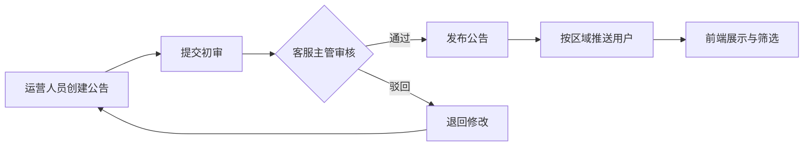

## 1. 产品概述

面向区域公用事业客户的综合Web服务工作台，支撑水、电、气三类缴费业务全流程闭环，集成公告发布、GIS服务、工单管理与对账报表能力，实现客户线上自助服务与后台运营管理一体化。服务于居民用户、企业客户及运营管理人员，提升公用事业服务效率与用户体验，满足省级能源监管数据上报要求。

## 2. 核心功能

### 2.1 用户角色

| 角色 | 注册方式 | 核心权限 |
|------|----------|----------|
| 居民用户 | 手机号注册/实名认证 | 户号绑定、费用查询、在线缴费、公告查看、服务网点查询、缴费凭证下载 |
| 企业用户 | 营业执照认证注册 | 多户号管理、批量缴费、对账报表、工单提交、电子发票 |
| 客服人员 | 后台账号分配 | 工单受理与分派、客户咨询回复、公告初审、用户信息查询 |
| 运营管理员 | 后台账号分配 | 公告审核发布、缴费对账报表、用户管理、数据统计 |
| 系统管理员 | 超级管理员 | 多级权限配置、系统设置、监管平台接口配置、审计日志 |

### 2.2 功能模块

1. **用户端首页**：快速缴费入口、户号卡片、最新公告轮播、常用功能快捷入口
2. **户号管理**：户号绑定/解绑、户号信息展示、多户号切换、户号分组
3. **缴费中心**：账单查询（水/电/气）、在线支付、缴费记录、电子凭证
4. **公告服务**：停供公告、抢修公告、按区域/类型/时间筛选、消息推送
5. **GIS服务网点**：地图展示服务中心、营业时间、服务范围、实时排队状态、在线预约
6. **个人中心**：用户信息、实名认证、消息通知、我的工单、设置
7. **后台工作台**：数据概览、待办事项、快捷入口
8. **工单管理**：工单列表、工单分派、工单处理、工单统计
9. **公告管理**：公告发布、审核流程、公告列表、推送管理
10. **对账报表**：日/月/年对账、缴费明细、分类统计、导出报表
11. **用户管理**：用户列表、用户详情、权限配置、黑名单管理
12. **系统设置**：角色权限、菜单管理、监管接口配置、系统参数

### 2.3 页面详情

| 页面名称 | 模块名称 | 功能描述 |
|----------|----------|----------|
| 用户端首页 | 顶部导航 | 登录/注册入口、消息通知、个人中心入口 |
| 用户端首页 | 快速缴费区 | 户号选择、费用类型切换、立即缴费按钮 |
| 用户端首页 | 户号卡片列表 | 展示已绑定户号、当前欠费、快捷缴费入口 |
| 用户端首页 | 公告轮播 | 最新停供/抢修公告轮播展示、查看更多 |
| 用户端首页 | 功能快捷入口 | 缴费记录、电子凭证、服务网点、在线客服 |
| 户号管理页 | 户号列表 | 已绑定户号展示、默认户号设置、删除操作 |
| 户号管理页 | 绑定户号表单 | 户号输入、户名验证、验证码、绑定提交 |
| 缴费中心页 | 账单查询 | 户号选择、费用类型、账期选择、账单详情 |
| 缴费中心页 | 在线支付 | 费用确认、支付方式选择、支付密码、支付结果 |
| 缴费中心页 | 缴费记录 | 时间筛选、类型筛选、记录列表、详情查看 |
| 缴费中心页 | 电子凭证 | 凭证列表、凭证预览、PDF下载、批量导出 |
| 公告列表页 | 筛选区域 | 区域选择、服务类型选择、时间范围选择 |
| 公告列表页 | 公告卡片 | 公告标题、类型标签、发布时间、摘要、详情入口 |
| 公告详情页 | 公告内容 | 标题、发布时间、正文、影响范围、温馨提示 |
| GIS服务网点页 | 地图区域 | 地图展示、服务网点标记、聚类展示 |
| GIS服务网点页 | 网点详情 | 网点名称、地址、营业时间、服务范围、排队状态 |
| GIS服务网点页 | 预约功能 | 业务类型选择、时间选择、预约提交 |
| 个人中心页 | 用户信息 | 头像、昵称、手机号、实名认证状态 |
| 个人中心页 | 功能菜单 | 我的工单、消息通知、设置、关于我们 |
| 后台登录页 | 登录表单 | 账号、密码、验证码、记住密码 |
| 后台工作台 | 数据概览 | 今日缴费笔数、金额、工单数量、公告数量等统计卡片 |
| 后台工作台 | 待办事项 | 待审核公告、待分派工单、待处理投诉 |
| 工单管理页 | 工单列表 | 工单编号、类型、状态、创建时间、操作 |
| 工单管理页 | 工单详情 | 工单内容、处理记录、分派操作、状态流转 |
| 公告管理页 | 公告列表 | 公告标题、类型、状态、审核流程、操作 |
| 公告管理页 | 新建公告 | 标题、内容、类型、影响区域、发布时间、提交审核 |
| 对账报表页 | 统计概览 | 缴费总额、笔数、分类占比、趋势图 |
| 对账报表页 | 明细查询 | 时间范围、类型筛选、明细列表、导出Excel |
| 用户管理页 | 用户列表 | 用户信息、状态、注册时间、操作 |
| 系统设置页 | 角色权限 | 角色列表、权限配置、菜单分配 |
| 系统设置页 | 监管接口 | 省级能源监管平台接口配置、数据同步记录 |

## 3. 核心流程

### 3.1 缴费业务流程
用户登录后绑定户号，选择费用类型与账期查询账单，确认费用后选择支付方式完成支付，系统生成电子凭证并同步至省级监管平台。

### 3.2 公告审核发布流程
运营人员创建公告并提交初审，客服主管审核通过后发布，系统按区域推送给对应用户，公告展示在前端并支持筛选查询。

### 3.3 工单处理流程
用户提交工单或系统自动生成工单，客服人员受理并根据类型分派给对应部门，处理完成后用户确认评价，工单归档。

## 4. 用户界面设计

### 4.1 设计风格

**整体风格**：专业稳重、简洁高效的政务服务风格，体现公用事业的可靠性与便民性。

- **主色调**：科技蓝 (#165DFF)，代表信任、专业、可靠
- **辅助色**：
  - 水业务：水蓝色 #00B8D9
  - 电业务：橙黄色 #FF8800
  - 气业务：翠绿色 #00B42A
  - 警示红：#F53F3F（停供、抢修等警示类）
- **中性色**：深灰 #1D2129、中灰 #4E5969、浅灰 #C9CDD4、背景灰 #F2F3F5
- **按钮风格**：圆角 6px，主按钮实心填充，次要按钮描边，悬停有轻微上浮效果
- **字体**：
  - 标题：思源黑体 Bold，清晰有力
  - 正文：思源黑体 Regular，可读性强
  - 数字：等宽字体，便于对账阅读
- **布局风格**：顶部导航 + 左侧菜单（后台），卡片式内容布局，信息层级清晰
- **图标风格**：线性图标，统一 2px 线条宽度，与主色调一致

### 4.2 页面设计概览

| 页面名称 | 模块名称 | UI元素 |
|----------|----------|--------|
| 用户端首页 | 快速缴费区 | 大卡片布局、三类费用Tab切换、醒目缴费按钮、渐变背景 |
| 用户端首页 | 户号卡片 | 横向滑动卡片、户号信息、欠费金额高亮、快捷操作 |
| 用户端首页 | 公告轮播 | 顶部通栏轮播、类型标签、自动轮播+手动切换 |
| 缴费中心页 | 账单查询 | Tab切换费用类型、日期选择器、账单明细表格 |
| 缴费中心页 | 支付确认 | 费用汇总卡片、支付方式图标网格、支付密码弹窗 |
| GIS服务网点页 | 地图区域 | 全屏地图、自定义Marker、信息浮窗、缩放控制 |
| GIS服务网点页 | 网点列表 | 侧边栏列表、距离排序、排队状态实时显示 |
| 后台工作台 | 数据概览 | 统计卡片网格、渐变色块、数字动画、趋势小图 |
| 后台工作台 | 待办事项 | 列表式布局、红点提醒、快捷处理按钮 |
| 对账报表页 | 统计图表 | 柱状图+折线图组合、图例切换、数据钻取 |
| 对账报表页 | 明细表格 | 固定表头、斑马纹、排序、分页、导出按钮 |

### 4.3 响应式

- 采用桌面优先设计，用户端适配平板和移动端
- 用户端移动端：底部导航栏、卡片堆叠布局、触摸优化
- 后台管理端：桌面端优先，平板适配，移动端提供精简功能
- 断点：>=1440px（大屏）、>=1024px（桌面）、>=768px（平板）、<768px（手机）

### 4.4 动效与交互

- 页面加载：骨架屏渐入，内容区块错峰出现
- 卡片悬停：轻微上浮 + 阴影加深
- 按钮点击：缩放反馈 0.98
- 弹窗出现：从中心淡入放大
- Tab切换：下划线平滑过渡
- 数字变化：滚动数字动画
- 地图Marker：点击弹跳效果
- 通知消息：右上角滑入 + 轻微晃动
