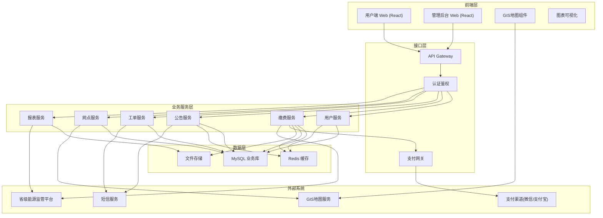
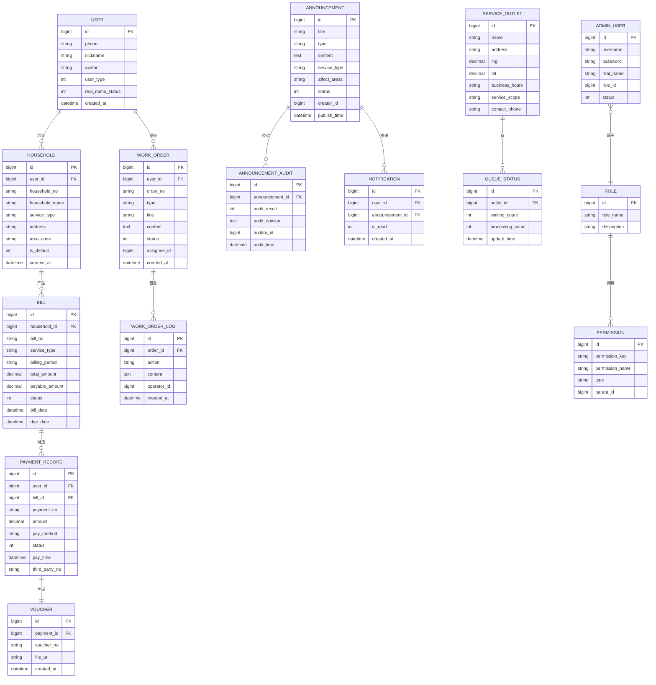

## 1. 架构设计



## 2. 技术描述

- **前端框架**: React@18 + TypeScript + Vite
- **UI组件库**: Ant Design@5 + 定制主题
- **状态管理**: Zustand
- **路由**: React Router@6
- **样式方案**: Tailwind CSS@3 + SCSS Modules
- **图表库**: ECharts@5
- **地图组件**: 高德地图 JS API / Leaflet
- **HTTP客户端**: Axios + 拦截器封装
- **后端模拟**: Mock.js + Vite插件 (开发阶段)
- **代码规范**: ESLint + Prettier
- **构建工具**: Vite@5

## 3. 路由定义

### 3.1 用户端路由

| 路由路径 | 页面名称 | 说明 |
|----------|----------|------|
| / | 首页 | 用户端首页，快速缴费入口 |
| /login | 登录页 | 用户登录/注册 |
| /household | 户号管理 | 户号绑定、列表管理 |
| /payment | 缴费中心 | 账单查询、在线缴费 |
| /payment/records | 缴费记录 | 历史缴费记录查询 |
| /payment/voucher | 电子凭证 | 凭证列表、下载 |
| /announcements | 公告列表 | 停供/抢修公告列表 |
| /announcements/:id | 公告详情 | 单条公告详情页 |
| /service-map | 服务网点 | GIS地图、网点查询 |
| /profile | 个人中心 | 用户信息、设置 |
| /profile/work-orders | 我的工单 | 用户工单列表 |
| /profile/messages | 消息通知 | 系统消息列表 |

### 3.2 管理后台路由

| 路由路径 | 页面名称 | 说明 |
|----------|----------|------|
| /admin/login | 后台登录 | 管理员登录 |
| /admin/dashboard | 工作台 | 数据概览、待办事项 |
| /admin/payment | 缴费管理 | 缴费记录、对账 |
| /admin/payment/reconciliation | 对账报表 | 日/月/年对账 |
| /admin/announcements | 公告管理 | 公告列表、审核 |
| /admin/announcements/create | 新建公告 | 创建公告表单 |
| /admin/work-orders | 工单管理 | 工单列表、分派 |
| /admin/work-orders/:id | 工单详情 | 工单处理详情 |
| /admin/users | 用户管理 | 用户列表、详情 |
| /admin/outlets | 网点管理 | 服务网点CRUD |
| /admin/system/roles | 角色权限 | 角色管理、权限配置 |
| /admin/system/regulatory | 监管接口 | 省级平台接口配置 |
| /admin/system/audit | 审计日志 | 操作日志查询 |

## 4. 数据模型

### 4.1 数据模型定义



### 4.2 核心数据字典

**用户类型 (user_type)**:
- 1: 居民用户
- 2: 企业用户

**服务类型 (service_type)**:
- water: 供水
- electricity: 供电
- gas: 供气

**账单状态 (bill.status)**:
- 0: 未缴费
- 1: 已缴费
- 2: 已逾期
- 3: 已作废

**支付状态 (payment_record.status)**:
- 0: 待支付
- 1: 支付成功
- 2: 支付失败
- 3: 已退款

**工单状态 (work_order.status)**:
- 0: 待受理
- 1: 处理中
- 2: 待用户确认
- 3: 已完成
- 4: 已关闭

**公告状态 (announcement.status)**:
- 0: 草稿
- 1: 待审核
- 2: 已发布
- 3: 已驳回
- 4: 已下架

## 5. 核心API定义

### 5.1 用户相关

```typescript
// 用户登录
interface LoginRequest {
  phone: string;
  password: string;
  captcha?: string;
}

interface LoginResponse {
  token: string;
  userInfo: {
    id: number;
    phone: string;
    nickname: string;
    avatar: string;
    userType: number;
    realNameStatus: number;
  };
}

// 户号绑定
interface BindHouseholdRequest {
  householdNo: string;
  householdName: string;
  serviceType: 'water' | 'electricity' | 'gas';
  captcha: string;
}
```

### 5.2 缴费相关

```typescript
// 账单查询
interface BillQueryParams {
  householdId: number;
  serviceType?: string;
  billingPeriod?: string;
  status?: number;
  page: number;
  pageSize: number;
}

interface BillVO {
  id: number;
  billNo: string;
  householdNo: string;
  householdName: string;
  serviceType: string;
  billingPeriod: string;
  totalAmount: number;
  payableAmount: number;
  status: number;
  billDate: string;
  dueDate: string;
  details: BillDetail[];
}

// 支付下单
interface PaymentCreateRequest {
  billIds: number[];
  payMethod: string;
}

interface PaymentCreateResponse {
  paymentNo: string;
  totalAmount: number;
  payParams: any;
}
```

### 5.3 公告相关

```typescript
// 公告列表
interface AnnouncementQueryParams {
  type?: string;
  serviceType?: string;
  areaCode?: string;
  page: number;
  pageSize: number;
}

interface AnnouncementVO {
  id: number;
  title: string;
  type: string;
  serviceType: string;
  affectAreas: string[];
  summary: string;
  publishTime: string;
}
```

### 5.4 工单相关

```typescript
// 工单创建
interface WorkOrderCreateRequest {
  type: string;
  title: string;
  content: string;
  householdId?: number;
  images?: string[];
}

// 工单分派
interface WorkOrderAssignRequest {
  orderId: number;
  assigneeId: number;
  remark?: string;
}
```

### 5.5 报表相关

```typescript
// 缴费统计
interface PaymentStatisticsVO {
  totalAmount: number;
  totalCount: number;
  waterAmount: number;
  electricityAmount: number;
  gasAmount: number;
  dailyTrend: { date: string; amount: number; count: number }[];
  typeRatio: { type: string; amount: number; ratio: number }[];
}
```

## 6. 项目目录结构

```
src/
├── assets/              # 静态资源
│   ├── images/
│   ├── icons/
│   └── styles/
├── components/          # 公共组件
│   ├── Layout/
│   ├── BillCard/
│   ├── HouseholdSelector/
│   ├── PaymentMethod/
│   └── StatusTag/
├── pages/               # 页面组件
│   ├── user/           # 用户端页面
│   │   ├── Home/
│   │   ├── Login/
│   │   ├── Household/
│   │   ├── Payment/
│   │   ├── Announcement/
│   │   ├── ServiceMap/
│   │   └── Profile/
│   └── admin/          # 管理后台页面
│       ├── Login/
│       ├── Dashboard/
│       ├── Payment/
│       ├── Announcement/
│       ├── WorkOrder/
│       ├── User/
│       └── System/
├── hooks/               # 自定义Hooks
│   ├── useAuth.ts
│   ├── usePayment.ts
│   └── useMap.ts
├── services/            # API服务
│   ├── request.ts       # axios封装
│   ├── user.ts
│   ├── payment.ts
│   ├── announcement.ts
│   ├── workOrder.ts
│   └── report.ts
├── store/               # 状态管理
│   ├── userStore.ts
│   ├── paymentStore.ts
│   └── appStore.ts
├── types/               # TypeScript类型定义
│   ├── user.ts
│   ├── payment.ts
│   └── common.ts
├── utils/               # 工具函数
│   ├── format.ts
│   ├── validate.ts
│   ├── storage.ts
│   └── export.ts
├── mock/                # Mock数据
│   ├── index.ts
│   ├── user.ts
│   └── payment.ts
├── router/              # 路由配置
│   ├── index.tsx
│   ├── userRoutes.tsx
│   └── adminRoutes.tsx
├── App.tsx
└── main.tsx
```
