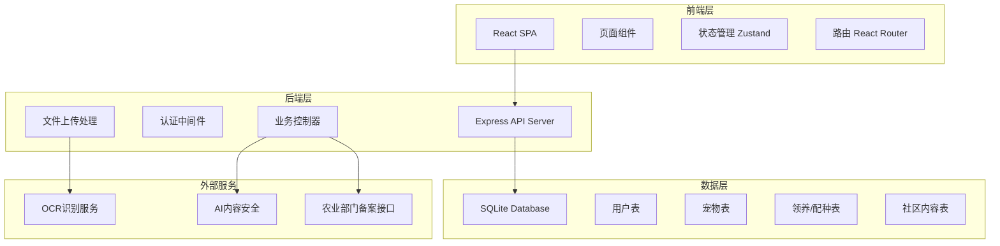
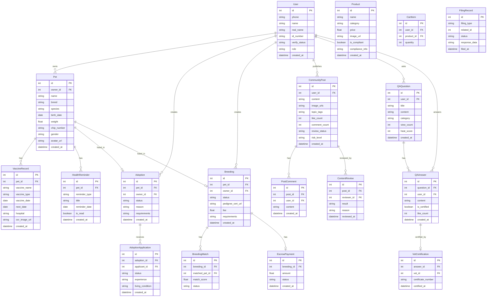

## 1. 架构设计



## 2. 技术说明

- **前端**：React@18 + TailwindCSS@3 + Vite + Zustand + React Router DOM
- **初始化工具**：vite-init（react-express-ts 模板）
- **后端**：Express@4 + TypeScript（ESM）
- **数据库**：SQLite（better-sqlite3），Mock数据演示
- **文件处理**：Multer（图片/证书上传）
- **图标库**：lucide-react
- **外部服务**：OCR/AI/备案接口以Mock方式模拟

## 3. 路由定义

| 路由 | 用途 |
|------|------|
| `/` | 首页，平台入口 |
| `/pets` | 宠物档案列表 |
| `/pets/:id` | 宠物档案详情 |
| `/pets/new` | 创建宠物档案 |
| `/adoption` | 领养中心 |
| `/adoption/:id` | 领养详情 |
| `/adoption/publish` | 发布送养 |
| `/breeding` | 配种广场 |
| `/breeding/:id` | 配种详情 |
| `/breeding/publish` | 发布配种需求 |
| `/qa` | 问答社区 |
| `/qa/:id` | 问题详情 |
| `/qa/ask` | 提问 |
| `/shop` | 宠物商城 |
| `/shop/:id` | 商品详情 |
| `/shop/cart` | 购物车 |
| `/community` | 社区动态 |
| `/profile` | 个人中心 |
| `/profile/verify` | 实名认证 |
| `/admin` | 管理后台 |
| `/admin/review` | 内容审核队列 |
| `/admin/supervision` | 交易监管 |
| `/admin/filing` | 备案管理 |

## 4. API定义

### 4.1 认证相关

```typescript
POST   /api/auth/register      // 注册
POST   /api/auth/login         // 登录
POST   /api/auth/verify-realname // 实名认证
GET    /api/auth/me            // 获取当前用户信息
```

### 4.2 宠物档案

```typescript
GET    /api/pets               // 获取宠物列表
POST   /api/pets               // 创建宠物档案
GET    /api/pets/:id           // 获取宠物详情
PUT    /api/pets/:id           // 更新宠物信息
POST   /api/pets/:id/vaccine   // 添加疫苗/驱虫记录
POST   /api/pets/:id/ocr       // OCR识别疫苗记录
GET    /api/pets/:id/reminders // 获取健康提醒
```

### 4.3 领养流程

```typescript
GET    /api/adoption           // 获取领养列表
POST   /api/adoption           // 发布送养信息
GET    /api/adoption/:id       // 获取领养详情
POST   /api/adoption/:id/apply // 提交领养申请
PUT    /api/adoption/:id/review // 审核领养申请
PUT    /api/adoption/:id/confirm // 线下交接确认
GET    /api/adoption/:id/flow  // 获取流程状态
```

### 4.4 配种撮合

```typescript
GET    /api/breeding           // 获取配种需求列表
POST   /api/breeding           // 发布配种需求
GET    /api/breeding/:id       // 获取配种详情
POST   /api/breeding/:id/match // 获取撮合推荐
POST   /api/breeding/:id/agreement // 签署配种协议
POST   /api/breeding/:id/escrow    // 费用托管
PUT    /api/breeding/:id/complete  // 确认完成
```

### 4.5 问答社区

```typescript
GET    /api/qa                 // 获取问题列表
POST   /api/qa                 // 提问
GET    /api/qa/:id             // 获取问题详情
POST   /api/qa/:id/answer     // 回答问题
PUT    /api/qa/:id/certify    // 兽医认证答案
GET    /api/qa/knowledge-graph // 获取知识图谱
```

### 4.6 宠物商城

```typescript
GET    /api/shop/products      // 获取商品列表
GET    /api/shop/products/:id  // 获取商品详情
POST   /api/shop/cart          // 添加购物车
GET    /api/shop/cart          // 获取购物车
DELETE /api/shop/cart/:id      // 删除购物车项
POST   /api/shop/order         // 下单
```

### 4.7 社区动态

```typescript
GET    /api/community          // 获取动态列表
POST   /api/community          // 发布动态
POST   /api/community/:id/like    // 点赞
POST   /api/community/:id/comment // 评论
POST   /api/community/:id/report  // 举报
```

### 4.8 管理后台

```typescript
GET    /api/admin/review-queue     // 获取审核队列
PUT    /api/admin/review/:id       // 审核操作
GET    /api/admin/supervision      // 交易监管数据
GET    /api/admin/filing           // 备案记录
POST   /api/admin/filing/sync      // 同步备案到农业部门
GET    /api/admin/users            // 用户管理列表
PUT    /api/admin/users/:id        // 用户操作
```

## 5. 服务器架构图

```mermaid
graph LR
    "Controller层" --> "Service层"
    "Service层" --> "Repository层"
    "Repository层" --> "SQLite数据库"
    "Service层" --> "OCR服务"
    "Service层" --> "AI安全服务"
    "Service层" --> "备案接口"
```

## 6. 数据模型

### 6.1 数据模型定义



### 6.2 数据定义语言

```sql
CREATE TABLE users (
    id INTEGER PRIMARY KEY AUTOINCREMENT,
    phone TEXT NOT NULL UNIQUE,
    name TEXT NOT NULL,
    password_hash TEXT NOT NULL,
    real_name TEXT,
    id_number TEXT,
    id_card_image_url TEXT,
    verify_status TEXT DEFAULT 'unverified' CHECK(verify_status IN ('unverified', 'pending', 'verified', 'rejected')),
    role TEXT DEFAULT 'owner' CHECK(role IN ('owner', 'adopter', 'vet', 'admin', 'reviewer')),
    vet_license TEXT,
    avatar_url TEXT,
    created_at DATETIME DEFAULT CURRENT_TIMESTAMP
);

CREATE TABLE pets (
    id INTEGER PRIMARY KEY AUTOINCREMENT,
    owner_id INTEGER NOT NULL REFERENCES users(id),
    name TEXT NOT NULL,
    breed TEXT NOT NULL,
    species TEXT NOT NULL CHECK(species IN ('dog', 'cat', 'bird', 'rabbit', 'hamster', 'other')),
    birth_date DATE,
    weight REAL,
    chip_number TEXT UNIQUE,
    gender TEXT CHECK(gender IN ('male', 'female', 'unknown')),
    avatar_url TEXT,
    is_sterilized BOOLEAN DEFAULT 0,
    created_at DATETIME DEFAULT CURRENT_TIMESTAMP
);

CREATE TABLE vaccine_records (
    id INTEGER PRIMARY KEY AUTOINCREMENT,
    pet_id INTEGER NOT NULL REFERENCES pets(id),
    vaccine_name TEXT NOT NULL,
    vaccine_type TEXT NOT NULL CHECK(vaccine_type IN ('vaccine', 'deworming', 'flea_tick')),
    vaccine_date DATE NOT NULL,
    next_date DATE,
    hospital TEXT,
    ocr_image_url TEXT,
    ocr_confidence REAL,
    created_at DATETIME DEFAULT CURRENT_TIMESTAMP
);

CREATE TABLE health_reminders (
    id INTEGER PRIMARY KEY AUTOINCREMENT,
    pet_id INTEGER NOT NULL REFERENCES pets(id),
    reminder_type TEXT NOT NULL CHECK(reminder_type IN ('vaccine', 'deworming', 'checkup', 'flea_tick')),
    title TEXT NOT NULL,
    reminder_date DATE NOT NULL,
    is_read BOOLEAN DEFAULT 0,
    created_at DATETIME DEFAULT CURRENT_TIMESTAMP
);

CREATE TABLE adoptions (
    id INTEGER PRIMARY KEY AUTOINCREMENT,
    pet_id INTEGER NOT NULL REFERENCES pets(id),
    owner_id INTEGER NOT NULL REFERENCES users(id),
    status TEXT DEFAULT 'pending_review' CHECK(status IN ('pending_review', 'active', 'in_progress', 'completed', 'cancelled')),
    reason TEXT,
    requirements TEXT,
    images TEXT,
    created_at DATETIME DEFAULT CURRENT_TIMESTAMP
);

CREATE TABLE adoption_applications (
    id INTEGER PRIMARY KEY AUTOINCREMENT,
    adoption_id INTEGER NOT NULL REFERENCES adoptions(id),
    applicant_id INTEGER NOT NULL REFERENCES users(id),
    status TEXT DEFAULT 'submitted' CHECK(status IN ('submitted', 'under_review', 'approved', 'rejected', 'confirmed')),
    experience TEXT,
    living_condition TEXT,
    has_other_pets BOOLEAN,
    created_at DATETIME DEFAULT CURRENT_TIMESTAMP
);

CREATE TABLE breedings (
    id INTEGER PRIMARY KEY AUTOINCREMENT,
    pet_id INTEGER NOT NULL REFERENCES pets(id),
    owner_id INTEGER NOT NULL REFERENCES users(id),
    status TEXT DEFAULT 'pending_review' CHECK(status IN ('pending_review', 'active', 'matched', 'agreed', 'in_escrow', 'completed', 'cancelled')),
    pedigree_cert_url TEXT,
    fee REAL DEFAULT 0,
    requirements TEXT,
    images TEXT,
    created_at DATETIME DEFAULT CURRENT_TIMESTAMP
);

CREATE TABLE breeding_matches (
    id INTEGER PRIMARY KEY AUTOINCREMENT,
    breeding_id INTEGER NOT NULL REFERENCES breedings(id),
    matched_pet_id INTEGER NOT NULL REFERENCES pets(id),
    match_score REAL,
    status TEXT DEFAULT 'suggested' CHECK(status IN ('suggested', 'contacted', 'agreed', 'declined'))
);

CREATE TABLE escrow_payments (
    id INTEGER PRIMARY KEY AUTOINCREMENT,
    breeding_id INTEGER NOT NULL REFERENCES breedings(id),
    amount REAL NOT NULL,
    payer_id INTEGER NOT NULL REFERENCES users(id),
    status TEXT DEFAULT 'pending' CHECK(status IN ('pending', 'held', 'released', 'refunded')),
    created_at DATETIME DEFAULT CURRENT_TIMESTAMP
);

CREATE TABLE qa_questions (
    id INTEGER PRIMARY KEY AUTOINCREMENT,
    user_id INTEGER NOT NULL REFERENCES users(id),
    title TEXT NOT NULL,
    content TEXT NOT NULL,
    category TEXT,
    view_count INTEGER DEFAULT 0,
    heat_score REAL DEFAULT 0,
    created_at DATETIME DEFAULT CURRENT_TIMESTAMP
);

CREATE TABLE qa_answers (
    id INTEGER PRIMARY KEY AUTOINCREMENT,
    question_id INTEGER NOT NULL REFERENCES qa_questions(id),
    user_id INTEGER NOT NULL REFERENCES users(id),
    content TEXT NOT NULL,
    is_certified BOOLEAN DEFAULT 0,
    like_count INTEGER DEFAULT 0,
    created_at DATETIME DEFAULT CURRENT_TIMESTAMP
);

CREATE TABLE vet_certifications (
    id INTEGER PRIMARY KEY AUTOINCREMENT,
    answer_id INTEGER NOT NULL REFERENCES qa_answers(id),
    vet_id INTEGER NOT NULL REFERENCES users(id),
    certificate_number TEXT,
    certified_at DATETIME DEFAULT CURRENT_TIMESTAMP
);

CREATE TABLE community_posts (
    id INTEGER PRIMARY KEY AUTOINCREMENT,
    user_id INTEGER NOT NULL REFERENCES users(id),
    content TEXT NOT NULL,
    image_urls TEXT,
    topic_tags TEXT,
    like_count INTEGER DEFAULT 0,
    comment_count INTEGER DEFAULT 0,
    review_status TEXT DEFAULT 'pending' CHECK(review_status IN ('pending', 'approved', 'rejected', 'flagged')),
    risk_level TEXT DEFAULT 'low' CHECK(risk_level IN ('low', 'medium', 'high')),
    created_at DATETIME DEFAULT CURRENT_TIMESTAMP
);

CREATE TABLE post_comments (
    id INTEGER PRIMARY KEY AUTOINCREMENT,
    post_id INTEGER NOT NULL REFERENCES community_posts(id),
    user_id INTEGER NOT NULL REFERENCES users(id),
    content TEXT NOT NULL,
    created_at DATETIME DEFAULT CURRENT_TIMESTAMP
);

CREATE TABLE content_reviews (
    id INTEGER PRIMARY KEY AUTOINCREMENT,
    post_id INTEGER NOT NULL REFERENCES community_posts(id),
    reviewer_id INTEGER NOT NULL REFERENCES users(id),
    result TEXT CHECK(result IN ('approved', 'rejected', 'banned')),
    reason TEXT,
    reviewed_at DATETIME DEFAULT CURRENT_TIMESTAMP
);

CREATE TABLE products (
    id INTEGER PRIMARY KEY AUTOINCREMENT,
    name TEXT NOT NULL,
    category TEXT NOT NULL,
    price REAL NOT NULL,
    image_url TEXT,
    description TEXT,
    is_compliant BOOLEAN DEFAULT 1,
    compliance_info TEXT,
    stock INTEGER DEFAULT 0,
    created_at DATETIME DEFAULT CURRENT_TIMESTAMP
);

CREATE TABLE cart_items (
    id INTEGER PRIMARY KEY AUTOINCREMENT,
    user_id INTEGER NOT NULL REFERENCES users(id),
    product_id INTEGER NOT NULL REFERENCES products(id),
    quantity INTEGER DEFAULT 1
);

CREATE TABLE filing_records (
    id INTEGER PRIMARY KEY AUTOINCREMENT,
    filing_type TEXT NOT NULL CHECK(filing_type IN ('adoption', 'breeding', 'transaction')),
    related_id INTEGER NOT NULL,
    status TEXT DEFAULT 'pending' CHECK(status IN ('pending', 'submitted', 'confirmed', 'failed')),
    request_data TEXT,
    response_data TEXT,
    filed_at DATETIME DEFAULT CURRENT_TIMESTAMP
);

CREATE INDEX idx_pets_owner ON pets(owner_id);
CREATE INDEX idx_vaccine_pet ON vaccine_records(pet_id);
CREATE INDEX idx_reminders_pet_date ON health_reminders(pet_id, reminder_date);
CREATE INDEX idx_adoptions_status ON adoptions(status);
CREATE INDEX idx_breedings_status ON breedings(status);
CREATE INDEX idx_qa_heat ON qa_questions(heat_score DESC);
CREATE INDEX idx_posts_created ON community_posts(created_at DESC);
CREATE INDEX idx_posts_review ON community_posts(review_status);
CREATE INDEX idx_filing_status ON filing_records(status);
```
