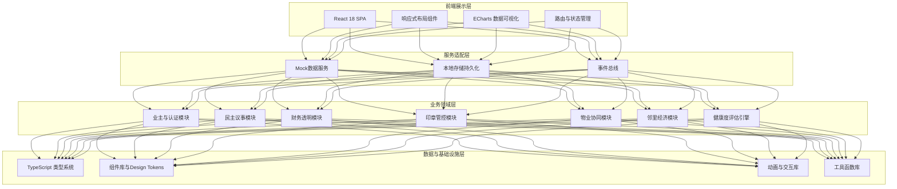
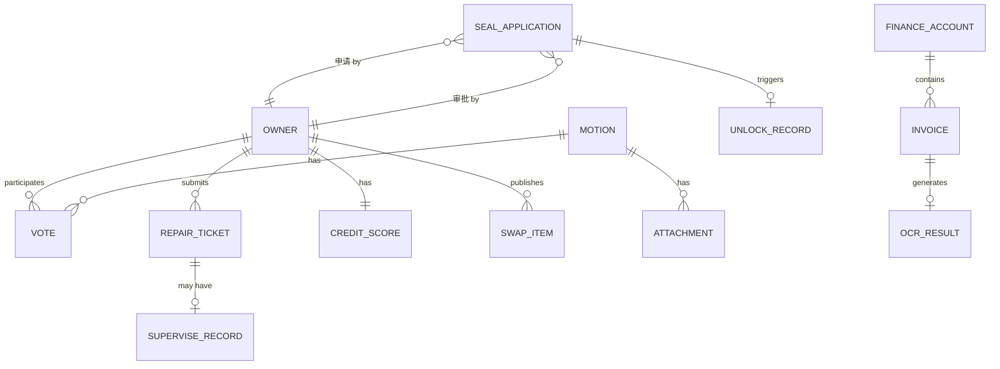

## 1. 架构设计



## 2. 技术选型说明

- **前端框架**: React@18 + TypeScript@5，严格类型约束
- **构建工具**: Vite@5，快速冷启动与热更新
- **样式方案**: TailwindCSS@3 + CSS Variables，原子化CSS + 设计令牌
- **路由管理**: React Router@6，嵌套路由与懒加载
- **状态管理**: Zustand，轻量级状态管理 + localStorage持久化
- **图表可视化**: Apache ECharts@5，雷达图、热力图、趋势图
- **UI组件**: Headless UI + 自定义业务组件，不引入重型UI库
- **动效方案**: Framer Motion，页面过渡与微交互动画
- **图标方案**: Lucide React，线性风格图标库
- **数据方案**: 前端Mock数据 + MSW（可选），纯前端演示模式

## 3. 路由定义

| 路由路径 | 页面名称 | 模块归属 |
|----------|----------|----------|
| `/dashboard` | 工作台首页 | 核心首页 |
| `/council/motions` | 议案列表 | 民主议事 |
| `/council/motions/new` | 发起议案 | 民主议事 |
| `/council/motions/:id` | 议案详情与投票 | 民主议事 |
| `/finance/overview` | 财务总览 | 财务透明 |
| `/finance/invoices` | 票据管理 | 财务透明 |
| `/finance/audit` | 审计报告 | 财务透明 |
| `/seal/applications` | 用章申请列表 | 印章管控 |
| `/seal/applications/new` | 用章申请 | 印章管控 |
| `/seal/cabinet` | 印章柜监控 | 印章管控 |
| `/property/tickets` | 报修工单大厅 | 物业协同 |
| `/property/tickets/:id` | 工单详情 | 物业协同 |
| `/property/supervision` | 街道督办中心 | 物业协同 |
| `/economy/home` | 邻里经济首页 | 邻里经济 |
| `/economy/swap` | 旧物置换广场 | 邻里经济 |
| `/economy/crowdfunding` | 众筹预售 | 邻里经济 |
| `/economy/exchange` | 能量兑换中心 | 邻里经济 |
| `/admin/owners` | 业主管理 | 基础管理 |
| `/admin/council` | 业委会管理 | 基础管理 |
| `/admin/property` | 物业公司管理 | 基础管理 |
| `/admin/street` | 街道监管中心 | 基础管理 |

## 4. 核心TypeScript类型定义

```typescript
// 业主相关类型
interface Owner {
  id: string;
  name: string;
  idCardEncrypted: string;
  building: string;
  unit: string;
  room: string;
  verifyStatus: 'pending' | 'verified' | 'rejected';
  faceVerified: boolean;
  propertyCertVerified: boolean;
  joinDate: string;
}

// 议案与投票
interface Motion {
  id: string;
  title: string;
  content: string;
  attachments: Attachment[];
  status: 'draft' | 'publicity' | 'voting' | 'passed' | 'rejected';
  voteType: 'anonymous' | 'realname';
  publicityStart: string;
  voteStart: string;
  voteEnd: string;
  initiator: string;
  blockchainHash?: string;
  voteStats: {
    totalVoters: number;
    votedCount: number;
    agreeCount: number;
    disagreeCount: number;
    abstainCount: number;
  };
}

// 财务相关
interface FinanceAccount {
  id: string;
  name: string;
  code: string;
  parentId: string | null;
  type: 'income' | 'expense';
  children?: FinanceAccount[];
}

interface Invoice {
  id: string;
  amount: number;
  type: 'income' | 'expense';
  invoiceNo: string;
  date: string;
  vendor: string;
  ocrResult?: OCRResult;
  verified: boolean;
  accountId: string;
}

// 印章相关
interface SealApplication {
  id: string;
  applicant: string;
  reason: string;
  sealType: 'official' | 'finance' | 'contract';
  useTime: string;
  attachments: Attachment[];
  status: 'pending' | 'approved' | 'rejected' | 'in_use' | 'returned';
  approver?: string;
  approveTime?: string;
  unlockRecordId?: string;
  videoUrl?: string;
}

// 工单相关
interface RepairTicket {
  id: string;
  title: string;
  description: string;
  photos: string[];
  location: string;
  submitter: string;
  submitTime: string;
  status: 'pending_assign' | 'assigned' | 'processing' | 'completed' | 'escalated';
  assignee?: string;
  assignTime?: string;
  completeTime?: string;
  completionProof?: string[];
  rating?: number;
  escalated: boolean;
  superviseRecord?: SuperviseRecord;
}

// 邻里经济
interface CreditScore {
  ownerId: string;
  points: number;
  energy: number;
  level: number;
}

interface SwapItem {
  id: string;
  title: string;
  description: string;
  images: string[];
  pricePoints: number;
  ownerId: string;
  status: 'available' | 'reserved' | 'swapped';
}

// 健康度评估
interface CommunityHealth {
  paymentRate: number;
  participationRate: number;
  complaintResolutionRate: number;
  overallScore: number;
  trend: {
    date: string;
    score: number;
  }[];
}
```

## 5. 前端目录结构

```
src/
├── components/           # 通用组件
│   ├── layout/          # 布局组件（侧边栏、顶栏、面包屑）
│   ├── charts/          # 图表组件
│   ├── ui/              # 基础UI组件（Card、Button、Modal等）
│   └── business/        # 业务通用组件
├── pages/               # 页面组件
│   ├── dashboard/
│   ├── council/
│   ├── finance/
│   ├── seal/
│   ├── property/
│   ├── economy/
│   └── admin/
├── stores/              # Zustand状态管理
│   ├── auth.ts
│   ├── council.ts
│   ├── finance.ts
│   └── ...
├── types/               # TypeScript类型定义
│   ├── index.ts
│   ├── council.ts
│   ├── finance.ts
│   └── ...
├── mock/                # Mock数据
│   ├── data/
│   └── index.ts
├── utils/               # 工具函数
├── hooks/               # 自定义Hooks
├── styles/              # 全局样式与主题
│   ├── globals.css
│   └── theme.ts
├── router/              # 路由配置
├── App.tsx
└── main.tsx
```

## 6. 数据模型关系



## 7. 设计令牌与主题

```typescript
// 主题配色
const theme = {
  colors: {
    primary: '#1E40AF',
    primaryLight: '#3B82F6',
    secondary: '#0EA5E9',
    success: '#10B981',
    warning: '#F97316',
    danger: '#EF4444',
    bg: {
      primary: '#F8FAFC',
      secondary: '#FFFFFF',
      tertiary: '#F1F5F9',
    },
    text: {
      primary: '#0F172A',
      secondary: '#475569',
      tertiary: '#94A3B8',
    },
    border: '#E2E8F0',
  },
  fonts: {
    display: '"Source Han Serif SC", "Noto Serif SC", serif',
    body: '"Source Han Sans SC", "Noto Sans SC", sans-serif',
  },
  radius: {
    sm: '4px',
    md: '8px',
    lg: '12px',
    xl: '16px',
  },
  shadows: {
    card: '0 1px 3px rgba(0,0,0,0.08), 0 1px 2px rgba(0,0,0,0.04)',
    cardHover: '0 10px 25px rgba(0,0,0,0.08), 0 4px 10px rgba(0,0,0,0.04)',
    modal: '0 25px 50px rgba(0,0,0,0.15)',
  },
};
```
