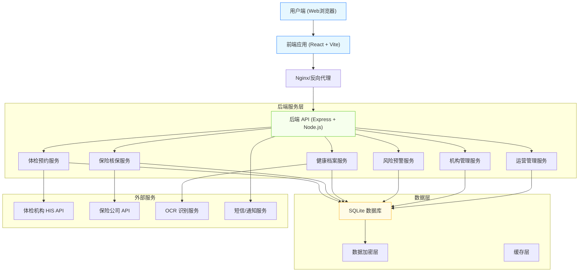
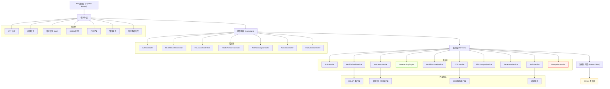
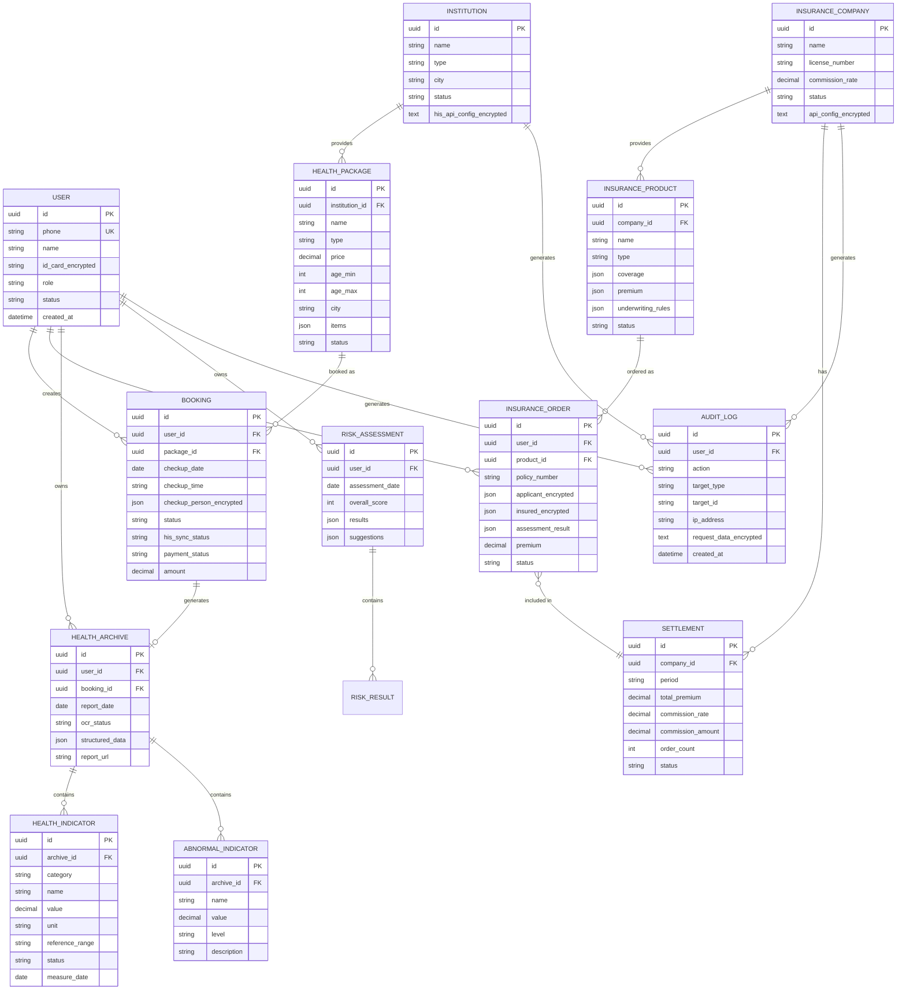

# 健康保障垂直领域 SaaS 服务平台 - 技术架构文档

## 1. 架构设计



## 2. 技术栈说明

### 2.1 前端技术栈
- **框架**: React@18 + TypeScript
- **构建工具**: Vite@5 (启用 HMR 热更新, strictPort)
- **样式方案**: TailwindCSS@3 + CSS 变量
- **状态管理**: Zustand (轻量级状态管理)
- **路由**: React Router@6
- **UI 组件**: Ant Design@5 + 自定义业务组件
- **图表**: ECharts@5 (健康趋势图、风险分析图)
- **HTTP 客户端**: Axios (拦截器、自动重试)
- **表单校验**: React Hook Form + Zod

### 2.2 后端技术栈
- **运行时**: Node.js@20 LTS
- **Web 框架**: Express@4
- **语言**: TypeScript
- **ORM**: Prisma@5 (支持 SQLite, 类型安全)
- **数据库**: SQLite (文件存储: ./data/app.sqlite)
- **认证**: JWT (access token + refresh token)
- **加密**: bcrypt (密码) + AES-256 (敏感数据)
- **日志**: Winston (结构化日志)
- **API 文档**: Swagger/OpenAPI

### 2.3 开发规范
- **代码规范**: ESLint + Prettier
- **Git 规范**: Conventional Commits
- **环境变量**: dotenv (从 .env 加载)
- **进程管理**: PM2 (生产环境)

## 3. 路由定义

### 3.1 前端路由 (React Router)

| 路由路径 | 页面名称 | 权限要求 |
|----------|----------|----------|
| `/` | 首页 | 公开 |
| `/health-check` | 体检套餐列表 | 公开 |
| `/health-check/:id` | 体检套餐详情 | 公开 |
| `/health-check/booking/:id` | 体检预约 | 登录用户 |
| `/insurance` | 保险商城 | 公开 |
| `/insurance/compare` | 保险产品对比 | 登录用户 |
| `/insurance/:id` | 保险产品详情 | 公开 |
| `/insurance/apply/:id` | 投保流程 | 登录用户 |
| `/health-archive` | 健康档案中心 | 登录用户 |
| `/health-archive/:id` | 报告详情 | 登录用户 |
| `/health-archive/upload` | 报告上传 | 登录用户 |
| `/risk-warning` | 风险预警 | 登录用户 |
| `/login` | 登录 | 公开 |
| `/register` | 注册 | 公开 |
| `/profile` | 个人中心 | 登录用户 |
| `/orders` | 我的订单 | 登录用户 |
| `/admin` | 管理后台首页 | 管理员 |
| `/admin/institutions` | 机构审核 | 管理员 |
| `/admin/insurance` | 保司管理 | 管理员 |
| `/admin/settlement` | 佣金结算 | 管理员 |
| `/admin/compliance` | 合规中心 | 管理员 |
| `/institution` | 机构后台首页 | 机构用户 |
| `/institution/packages` | 套餐管理 | 机构用户 |
| `/institution/bookings` | 预约管理 | 机构用户 |
| `/institution/reports` | 报告管理 | 机构用户 |
| `/insurance-company` | 保司后台首页 | 保司用户 |
| `/insurance-company/products` | 产品管理 | 保司用户 |
| `/insurance-company/underwriting` | 核保规则 | 保司用户 |
| `/insurance-company/orders` | 保单管理 | 保司用户 |

### 3.2 后端 API 路由

| 方法 | 路径 | 模块 | 说明 |
|------|------|------|------|
| GET | `/api/health` | 系统 | 健康检查 |
| POST | `/api/auth/login` | 认证 | 用户登录 |
| POST | `/api/auth/register` | 认证 | 用户注册 |
| GET | `/api/auth/me` | 认证 | 获取当前用户 |
| GET | `/api/health-check/packages` | 体检 | 套餐列表(支持筛选) |
| GET | `/api/health-check/packages/:id` | 体检 | 套餐详情 |
| POST | `/api/health-check/bookings` | 体检 | 创建预约 |
| GET | `/api/health-check/bookings` | 体检 | 预约列表 |
| GET | `/api/health-check/bookings/:id` | 体检 | 预约详情 |
| PUT | `/api/health-check/bookings/:id/status` | 体检 | 更新预约状态 |
| GET | `/api/insurance/products` | 保险 | 产品列表 |
| GET | `/api/insurance/products/:id` | 保险 | 产品详情 |
| POST | `/api/insurance/underwriting/evaluate` | 保险 | 核保评估 |
| POST | `/api/insurance/orders` | 保险 | 创建投保订单 |
| GET | `/api/insurance/orders` | 保险 | 保单列表 |
| POST | `/api/health-archive/reports` | 档案 | 上传体检报告 |
| GET | `/api/health-archive/reports` | 档案 | 报告列表 |
| GET | `/api/health-archive/reports/:id` | 档案 | 报告详情 |
| GET | `/api/health-archive/trends` | 档案 | 健康趋势数据 |
| GET | `/api/risk-warning/assessments` | 预警 | 风险评估列表 |
| POST | `/api/risk-warning/analyze` | 预警 | 慢性病风险分析 |
| GET | `/api/admin/institutions` | 管理 | 机构列表 |
| PUT | `/api/admin/institutions/:id/approve` | 管理 | 机构审核 |
| GET | `/api/admin/insurance-companies` | 管理 | 保司列表 |
| PUT | `/api/admin/insurance-companies/:id/approve` | 管理 | 保司审核 |
| GET | `/api/admin/settlements` | 管理 | 结算记录 |
| POST | `/api/admin/settlements/calculate` | 管理 | 佣金计算 |
| GET | `/api/admin/compliance/logs` | 管理 | 操作日志 |

## 4. API 数据模型 (TypeScript)

```typescript
// 用户模型
interface User {
  id: string;
  phone: string;
  name: string;
  email?: string;
  idCard?: string;
  avatar?: string;
  role: 'USER' | 'INSTITUTION' | 'INSURANCE' | 'ADMIN';
  status: 'ACTIVE' | 'INACTIVE' | 'SUSPENDED';
  createdAt: Date;
  updatedAt: Date;
}

// 体检机构
interface Institution {
  id: string;
  name: string;
  type: 'HOSPITAL' | 'HEALTH_CENTER';
  city: string;
  address: string;
  phone: string;
  level: string;
  description: string;
  logoUrl?: string;
  status: 'PENDING' | 'APPROVED' | 'REJECTED';
  approvedAt?: Date;
  hisApiConfig?: Record<string, unknown>;
}

// 体检套餐
interface HealthPackage {
  id: string;
  institutionId: string;
  name: string;
  type: 'GENERAL' | 'PREMIUM' | 'SPECIALIZED' | 'CUSTOM';
  price: number;
  originalPrice: number;
  ageMin: number;
  ageMax: number;
  gender: 'ALL' | 'MALE' | 'FEMALE';
  city: string;
  items: PackageItem[];
  description: string;
  notice: string;
  status: 'ACTIVE' | 'INACTIVE';
}

interface PackageItem {
  name: string;
  description: string;
  category: string;
}

// 体检预约
interface Booking {
  id: string;
  userId: string;
  packageId: string;
  checkupDate: Date;
  checkupTime: string;
  checkupPerson: CheckupPerson;
  status: 'PENDING' | 'CONFIRMED' | 'CHECKED' | 'CANCELLED';
  hisSyncStatus: 'PENDING' | 'SYNCED' | 'FAILED';
  hisOrderId?: string;
  paymentStatus: 'UNPAID' | 'PAID' | 'REFUNDED';
  amount: number;
  createdAt: Date;
}

interface CheckupPerson {
  name: string;
  idCard: string;
  phone: string;
  gender: 'MALE' | 'FEMALE';
  age: number;
}

// 保险公司
interface InsuranceCompany {
  id: string;
  name: string;
  licenseNumber: string;
  contactName: string;
  contactPhone: string;
  apiConfig?: Record<string, unknown>;
  commissionRate: number;
  status: 'PENDING' | 'APPROVED' | 'REJECTED';
  approvedAt?: Date;
}

// 保险产品
interface InsuranceProduct {
  id: string;
  companyId: string;
  name: string;
  type: 'CRITICAL_ILLNESS' | 'MEDICAL' | 'ACCIDENT' | 'LIFE';
  coverage: CoverageDetails;
  premium: PremiumInfo;
  underwritingRules: UnderwritingRule[];
  description: string;
  status: 'ACTIVE' | 'INACTIVE';
}

interface CoverageDetails {
  coverageAmount: number;
  deductible: number;
  coverageScope: string[];
  renewalTerms: string;
  waitingPeriod: number;
}

interface PremiumInfo {
  baseAmount: number;
  ageCoefficient: Record<string, number>;
  genderCoefficient: Record<string, number>;
}

interface UnderwritingRule {
  id: string;
  question: string;
  type: 'YES_NO' | 'MULTIPLE_CHOICE';
  options: UnderwritingOption[];
  abnormalConditions: string[];
}

interface UnderwritingOption {
  value: string;
  label: string;
  result: 'STANDARD' | 'SUBSTANDARD' | 'REJECT';
  extraPremium?: number;
  exclusions?: string[];
}

// 核保评估
interface UnderwritingAssessment {
  productId: string;
  answers: Record<string, string>;
  result: 'STANDARD' | 'SUBSTANDARD' | 'REJECT';
  abnormalItems: AbnormalItem[];
  extraPremium?: number;
  exclusions?: string[];
}

interface AbnormalItem {
  questionId: string;
  question: string;
  answer: string;
  riskLevel: 'HIGH' | 'MEDIUM' | 'LOW';
  description: string;
}

// 投保订单
interface InsuranceOrder {
  id: string;
  userId: string;
  productId: string;
  policyNumber?: string;
  applicant: PolicyPerson;
  insured: PolicyPerson;
  beneficiary?: string;
  assessmentResult: UnderwritingAssessment;
  premium: number;
  status: 'PENDING' | 'PAID' | 'EFFECTIVE' | 'EXPIRED' | 'CANCELLED';
  effectiveDate?: Date;
  expiryDate?: Date;
  createdAt: Date;
}

interface PolicyPerson {
  name: string;
  idCard: string;
  phone: string;
  gender: 'MALE' | 'FEMALE';
  birthday: Date;
}

// 健康档案
interface HealthArchive {
  id: string;
  userId: string;
  bookingId?: string;
  reportDate: Date;
  reportUrl?: string;
  ocrStatus: 'PENDING' | 'PROCESSING' | 'COMPLETED' | 'FAILED';
  structuredData?: HealthReportData;
  createdAt: Date;
}

interface HealthReportData {
  basicInfo: BasicHealthInfo;
  indicators: HealthIndicator[];
  abnormalItems: AbnormalIndicator[];
  summary: string;
  suggestions: string[];
}

interface BasicHealthInfo {
  height: number;
  weight: number;
  bmi: number;
  bloodPressure: string;
  heartRate: number;
}

interface HealthIndicator {
  category: string;
  name: string;
  value: number;
  unit: string;
  referenceRange: string;
  status: 'NORMAL' | 'HIGH' | 'LOW';
  measureDate: Date;
}

interface AbnormalIndicator {
  name: string;
  value: number;
  referenceRange: string;
  level: 'MILD' | 'MODERATE' | 'SEVERE';
  description: string;
}

// 风险预警
interface RiskAssessment {
  id: string;
  userId: string;
  assessmentDate: Date;
  diabetesRisk: RiskResult;
  hypertensionRisk: RiskResult;
  cardiovascularRisk: RiskResult;
  overallScore: number;
  suggestions: string[];
}

interface RiskResult {
  level: 'LOW' | 'MEDIUM' | 'HIGH';
  score: number;
  indicators: RiskIndicator[];
}

interface RiskIndicator {
  name: string;
  value: number;
  trend: 'UP' | 'DOWN' | 'STABLE';
  weight: number;
}

// 佣金结算
interface Settlement {
  id: string;
  companyId: string;
  period: string;
  totalPremium: number;
  commissionRate: number;
  commissionAmount: number;
  orderCount: number;
  status: 'PENDING' | 'PAID' | 'CANCELLED';
  createdAt: Date;
}

// 操作日志 (合规)
interface AuditLog {
  id: string;
  userId: string;
  action: string;
  targetType: string;
  targetId?: string;
  ipAddress: string;
  userAgent: string;
  requestData?: Record<string, unknown>;
  responseData?: Record<string, unknown>;
  createdAt: Date;
}
```

## 5. 服务端架构图



## 6. 数据模型

### 6.1 ER 图



### 6.2 DDL 语句

```sql
-- 用户表
CREATE TABLE IF NOT EXISTS users (
    id TEXT PRIMARY KEY,
    phone TEXT UNIQUE NOT NULL,
    name TEXT NOT NULL,
    id_card_encrypted TEXT,
    email TEXT,
    avatar TEXT,
    password_hash TEXT NOT NULL,
    role TEXT NOT NULL DEFAULT 'USER',
    status TEXT NOT NULL DEFAULT 'ACTIVE',
    institution_id TEXT,
    insurance_company_id TEXT,
    created_at DATETIME DEFAULT CURRENT_TIMESTAMP,
    updated_at DATETIME DEFAULT CURRENT_TIMESTAMP,
    FOREIGN KEY (institution_id) REFERENCES institutions(id),
    FOREIGN KEY (insurance_company_id) REFERENCES insurance_companies(id)
);

CREATE INDEX idx_users_phone ON users(phone);
CREATE INDEX idx_users_role ON users(role);

-- 体检机构表
CREATE TABLE IF NOT EXISTS institutions (
    id TEXT PRIMARY KEY,
    name TEXT NOT NULL,
    type TEXT NOT NULL,
    city TEXT NOT NULL,
    address TEXT,
    phone TEXT,
    level TEXT,
    description TEXT,
    logo_url TEXT,
    status TEXT NOT NULL DEFAULT 'PENDING',
    approved_at DATETIME,
    approved_by TEXT,
    his_api_config_encrypted TEXT,
    created_at DATETIME DEFAULT CURRENT_TIMESTAMP,
    updated_at DATETIME DEFAULT CURRENT_TIMESTAMP
);

CREATE INDEX idx_institutions_city ON institutions(city);
CREATE INDEX idx_institutions_status ON institutions(status);

-- 体检套餐表
CREATE TABLE IF NOT EXISTS health_packages (
    id TEXT PRIMARY KEY,
    institution_id TEXT NOT NULL,
    name TEXT NOT NULL,
    type TEXT NOT NULL,
    price DECIMAL(10,2) NOT NULL,
    original_price DECIMAL(10,2),
    age_min INTEGER NOT NULL DEFAULT 0,
    age_max INTEGER NOT NULL DEFAULT 150,
    gender TEXT NOT NULL DEFAULT 'ALL',
    city TEXT NOT NULL,
    items TEXT NOT NULL,
    description TEXT,
    notice TEXT,
    status TEXT NOT NULL DEFAULT 'ACTIVE',
    created_at DATETIME DEFAULT CURRENT_TIMESTAMP,
    updated_at DATETIME DEFAULT CURRENT_TIMESTAMP,
    FOREIGN KEY (institution_id) REFERENCES institutions(id)
);

CREATE INDEX idx_packages_institution ON health_packages(institution_id);
CREATE INDEX idx_packages_city ON health_packages(city);
CREATE INDEX idx_packages_type ON health_packages(type);
CREATE INDEX idx_packages_price ON health_packages(price);
CREATE INDEX idx_packages_age ON health_packages(age_min, age_max);
CREATE INDEX idx_packages_status ON health_packages(status);

-- 体检预约表
CREATE TABLE IF NOT EXISTS bookings (
    id TEXT PRIMARY KEY,
    user_id TEXT NOT NULL,
    package_id TEXT NOT NULL,
    checkup_date DATE NOT NULL,
    checkup_time TEXT NOT NULL,
    checkup_person_encrypted TEXT NOT NULL,
    status TEXT NOT NULL DEFAULT 'PENDING',
    his_sync_status TEXT NOT NULL DEFAULT 'PENDING',
    his_order_id TEXT,
    payment_status TEXT NOT NULL DEFAULT 'UNPAID',
    amount DECIMAL(10,2) NOT NULL,
    report_id TEXT,
    created_at DATETIME DEFAULT CURRENT_TIMESTAMP,
    updated_at DATETIME DEFAULT CURRENT_TIMESTAMP,
    FOREIGN KEY (user_id) REFERENCES users(id),
    FOREIGN KEY (package_id) REFERENCES health_packages(id)
);

CREATE INDEX idx_bookings_user ON bookings(user_id);
CREATE INDEX idx_bookings_package ON bookings(package_id);
CREATE INDEX idx_bookings_date ON bookings(checkup_date);
CREATE INDEX idx_bookings_status ON bookings(status);

-- 保险公司表
CREATE TABLE IF NOT EXISTS insurance_companies (
    id TEXT PRIMARY KEY,
    name TEXT NOT NULL,
    license_number TEXT NOT NULL UNIQUE,
    contact_name TEXT,
    contact_phone TEXT,
    api_config_encrypted TEXT,
    commission_rate DECIMAL(5,4) NOT NULL DEFAULT 0.10,
    status TEXT NOT NULL DEFAULT 'PENDING',
    approved_at DATETIME,
    approved_by TEXT,
    created_at DATETIME DEFAULT CURRENT_TIMESTAMP,
    updated_at DATETIME DEFAULT CURRENT_TIMESTAMP
);

CREATE INDEX idx_companies_status ON insurance_companies(status);

-- 保险产品表
CREATE TABLE IF NOT EXISTS insurance_products (
    id TEXT PRIMARY KEY,
    company_id TEXT NOT NULL,
    name TEXT NOT NULL,
    type TEXT NOT NULL,
    coverage TEXT NOT NULL,
    premium TEXT NOT NULL,
    underwriting_rules TEXT NOT NULL,
    description TEXT,
    status TEXT NOT NULL DEFAULT 'ACTIVE',
    created_at DATETIME DEFAULT CURRENT_TIMESTAMP,
    updated_at DATETIME DEFAULT CURRENT_TIMESTAMP,
    FOREIGN KEY (company_id) REFERENCES insurance_companies(id)
);

CREATE INDEX idx_products_company ON insurance_products(company_id);
CREATE INDEX idx_products_type ON insurance_products(type);
CREATE INDEX idx_products_status ON insurance_products(status);

-- 投保订单表
CREATE TABLE IF NOT EXISTS insurance_orders (
    id TEXT PRIMARY KEY,
    user_id TEXT NOT NULL,
    product_id TEXT NOT NULL,
    policy_number TEXT UNIQUE,
    applicant_encrypted TEXT NOT NULL,
    insured_encrypted TEXT NOT NULL,
    beneficiary TEXT,
    assessment_result TEXT NOT NULL,
    premium DECIMAL(10,2) NOT NULL,
    status TEXT NOT NULL DEFAULT 'PENDING',
    effective_date DATE,
    expiry_date DATE,
    settlement_id TEXT,
    created_at DATETIME DEFAULT CURRENT_TIMESTAMP,
    updated_at DATETIME DEFAULT CURRENT_TIMESTAMP,
    FOREIGN KEY (user_id) REFERENCES users(id),
    FOREIGN KEY (product_id) REFERENCES insurance_products(id),
    FOREIGN KEY (settlement_id) REFERENCES settlements(id)
);

CREATE INDEX idx_orders_user ON insurance_orders(user_id);
CREATE INDEX idx_orders_product ON insurance_orders(product_id);
CREATE INDEX idx_orders_status ON insurance_orders(status);
CREATE INDEX idx_orders_settlement ON insurance_orders(settlement_id);

-- 健康档案表
CREATE TABLE IF NOT EXISTS health_archives (
    id TEXT PRIMARY KEY,
    user_id TEXT NOT NULL,
    booking_id TEXT,
    report_date DATE NOT NULL,
    report_url TEXT,
    ocr_status TEXT NOT NULL DEFAULT 'PENDING',
    structured_data TEXT,
    created_at DATETIME DEFAULT CURRENT_TIMESTAMP,
    updated_at DATETIME DEFAULT CURRENT_TIMESTAMP,
    FOREIGN KEY (user_id) REFERENCES users(id),
    FOREIGN KEY (booking_id) REFERENCES bookings(id)
);

CREATE INDEX idx_archives_user ON health_archives(user_id);
CREATE INDEX idx_archives_date ON health_archives(report_date);
CREATE INDEX idx_archives_ocr_status ON health_archives(ocr_status);

-- 健康指标表
CREATE TABLE IF NOT EXISTS health_indicators (
    id TEXT PRIMARY KEY,
    archive_id TEXT NOT NULL,
    category TEXT NOT NULL,
    name TEXT NOT NULL,
    value DECIMAL(10,2) NOT NULL,
    unit TEXT,
    reference_range TEXT,
    status TEXT NOT NULL DEFAULT 'NORMAL',
    measure_date DATE NOT NULL,
    created_at DATETIME DEFAULT CURRENT_TIMESTAMP,
    FOREIGN KEY (archive_id) REFERENCES health_archives(id)
);

CREATE INDEX idx_indicators_archive ON health_indicators(archive_id);
CREATE INDEX idx_indicators_name ON health_indicators(name);
CREATE INDEX idx_indicators_date ON health_indicators(measure_date);

-- 异常指标表
CREATE TABLE IF NOT EXISTS abnormal_indicators (
    id TEXT PRIMARY KEY,
    archive_id TEXT NOT NULL,
    name TEXT NOT NULL,
    value DECIMAL(10,2) NOT NULL,
    reference_range TEXT,
    level TEXT NOT NULL,
    description TEXT,
    created_at DATETIME DEFAULT CURRENT_TIMESTAMP,
    FOREIGN KEY (archive_id) REFERENCES health_archives(id)
);

CREATE INDEX idx_abnormal_archive ON abnormal_indicators(archive_id);
CREATE INDEX idx_abnormal_level ON abnormal_indicators(level);

-- 风险评估表
CREATE TABLE IF NOT EXISTS risk_assessments (
    id TEXT PRIMARY KEY,
    user_id TEXT NOT NULL,
    assessment_date DATE NOT NULL,
    diabetes_risk TEXT,
    hypertension_risk TEXT,
    cardiovascular_risk TEXT,
    overall_score INTEGER NOT NULL,
    suggestions TEXT,
    created_at DATETIME DEFAULT CURRENT_TIMESTAMP,
    FOREIGN KEY (user_id) REFERENCES users(id)
);

CREATE INDEX idx_risk_user ON risk_assessments(user_id);
CREATE INDEX idx_risk_date ON risk_assessments(assessment_date);

-- 佣金结算表
CREATE TABLE IF NOT EXISTS settlements (
    id TEXT PRIMARY KEY,
    company_id TEXT NOT NULL,
    period TEXT NOT NULL,
    total_premium DECIMAL(12,2) NOT NULL,
    commission_rate DECIMAL(5,4) NOT NULL,
    commission_amount DECIMAL(12,2) NOT NULL,
    order_count INTEGER NOT NULL,
    status TEXT NOT NULL DEFAULT 'PENDING',
    paid_at DATETIME,
    created_at DATETIME DEFAULT CURRENT_TIMESTAMP,
    FOREIGN KEY (company_id) REFERENCES insurance_companies(id)
);

CREATE INDEX idx_settlements_company ON settlements(company_id);
CREATE INDEX idx_settlements_period ON settlements(period);
CREATE INDEX idx_settlements_status ON settlements(status);

-- 审计日志表
CREATE TABLE IF NOT EXISTS audit_logs (
    id TEXT PRIMARY KEY,
    user_id TEXT,
    action TEXT NOT NULL,
    target_type TEXT NOT NULL,
    target_id TEXT,
    ip_address TEXT,
    user_agent TEXT,
    request_data_encrypted TEXT,
    response_data_encrypted TEXT,
    created_at DATETIME DEFAULT CURRENT_TIMESTAMP
);

CREATE INDEX idx_audit_user ON audit_logs(user_id);
CREATE INDEX idx_audit_action ON audit_logs(action);
CREATE INDEX idx_audit_target ON audit_logs(target_type, target_id);
CREATE INDEX idx_audit_created ON audit_logs(created_at);

-- 初始化数据
INSERT OR IGNORE INTO users (id, phone, name, password_hash, role, status)
VALUES ('admin-001', '13800000000', '系统管理员', 
        '$2b$10$YourEncryptedPasswordHere', 'ADMIN', 'ACTIVE');
```

## 7. 安全与合规设计

### 7.1 数据加密
- **敏感字段加密**：身份证、手机号、健康数据、API 配置等使用 AES-256-CBC 加密存储
- **密码加密**：bcrypt 算法，cost factor = 12
- **密钥管理**：加密密钥存储在 .env 文件，生产环境使用 KMS
- **传输加密**：全站 HTTPS，HSTS 配置

### 7.2 访问控制
- **JWT 认证**：双 token 机制（access token 15分钟，refresh token 7天）
- **RBAC 权限**：基于角色的细粒度权限控制
- **接口限流**：针对登录、注册、查询等接口的限流策略
- **SQL 注入防护**：使用 Prisma ORM 参数化查询

### 7.3 合规要求
- **操作审计**：所有敏感操作记录审计日志，不可篡改
- **数据隔离**：用户数据基于 user_id 行级隔离
- **隐私保护**：符合《个人信息保护法》，支持数据导出和删除
- **保险合规**：保司准入审核、产品信息可追溯、销售行为记录
