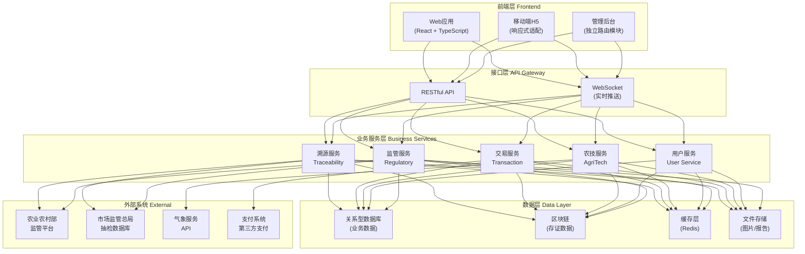
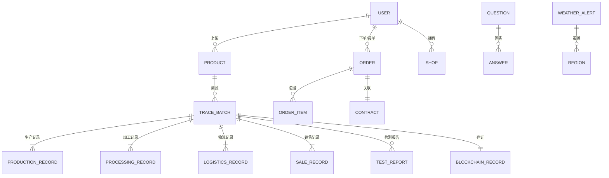

# 农产品全链条可信溯源与交易协同平台 技术架构文档

## 1. 架构设计



## 2. 技术选型

### 2.1 前端技术栈

| 技术 | 选型 | 说明 |
|------|------|------|
| 框架 | React 18 | 组件化开发，生态丰富 |
| 语言 | TypeScript 5 | 类型安全，提升可维护性 |
| 构建工具 | Vite 5 | 极速热更新，开发体验好 |
| 样式方案 | TailwindCSS 3 | 原子化CSS，开发效率高 |
| 状态管理 | Zustand | 轻量级状态管理，API简洁 |
| 路由 | React Router v6 | 声明式路由，支持嵌套路由 |
| UI组件库 | 自定义组件 + Headless UI | 保持设计独特性，避免千篇一律 |
| 图表库 | ECharts 5 | 功能强大，支持多种图表 |
| 图标 | Lucide React | 线性图标，风格统一 |
| 动画 | Framer Motion | 流畅的React动画库 |
| HTTP请求 | Axios | 请求拦截器，统一错误处理 |

### 2.2 后端技术栈（可选）

| 技术 | 选型 | 说明 |
|------|------|------|
| 框架 | Express.js 4 | 轻量级Node.js框架 |
| 语言 | TypeScript | 前后端类型统一 |
| 数据库 | SQLite (演示) / PostgreSQL (生产) | 关系型数据库 |
| ORM | Prisma | 类型安全的数据库访问 |
| 认证 | JWT | 无状态Token认证 |

### 2.3 项目初始化方案

- 项目模板：`react-express-ts`（前后端一体）
- 包管理器：npm（若存在pnpm则使用pnpm）
- 初始数据：Mock数据，便于前端演示开发

## 3. 路由定义

| 路由路径 | 页面名称 | 模块 | 说明 |
|----------|----------|------|------|
| `/` | 首页 | 首页 | 数据看板、功能入口 |
| `/trace` | 溯源查询 | 溯源系统 | 输入溯源码查询 |
| `/trace/:code` | 溯源详情 | 溯源系统 | 全链路溯源信息 |
| `/market/b2b` | B2B批发市场 | 交易市场 | 批量采购、供需大厅 |
| `/market/b2c` | B2C零售商城 | 交易市场 | 零售商品列表 |
| `/product/:id` | 商品详情 | 交易市场 | 商品信息、购买 |
| `/shop` | 店铺中心 | 店铺管理 | 我的店铺 |
| `/orders` | 订单中心 | 交易协同 | 订单列表管理 |
| `/contracts` | 电子合同 | 交易协同 | 合同管理签署 |
| `/agtech/qa` | 农技问答 | 农技服务 | 专家问答广场 |
| `/agtech/pest` | 病虫害识别 | 农技服务 | 图像识别诊断 |
| `/agtech/weather` | 气象预警 | 农技服务 | 天气预报预警 |
| `/regulatory` | 监管中心 | 监管中心 | 数据总览分析 |
| `/regulatory/reports` | 分析报告 | 监管中心 | 质量分析报告 |
| `/profile` | 个人中心 | 用户中心 | 账户设置 |

## 4. 目录结构

```
may-89138/
├── .trae/
│   └── documents/          # 项目文档
├── src/                    # 前端源码
│   ├── components/         # 公共组件
│   │   ├── layout/         # 布局组件（Header、Sidebar、Footer）
│   │   ├── ui/             # UI基础组件（Button、Card、Modal等）
│   │   └── chart/          # 图表组件
│   ├── pages/              # 页面组件
│   │   ├── Home/           # 首页
│   │   ├── Traceability/   # 溯源系统
│   │   ├── Market/         # 交易市场
│   │   ├── Shop/           # 店铺中心
│   │   ├── Orders/         # 订单中心
│   │   ├── Contracts/      # 电子合同
│   │   ├── AgTech/         # 农技服务
│   │   ├── Regulatory/     # 监管中心
│   │   └── Profile/        # 个人中心
│   ├── hooks/              # 自定义Hooks
│   ├── store/              # Zustand状态管理
│   ├── utils/              # 工具函数
│   ├── types/              # TypeScript类型定义
│   ├── mock/               # Mock数据
│   ├── assets/             # 静态资源
│   ├── App.tsx             # 应用入口
│   ├── main.tsx            # 渲染入口
│   └── index.css           # 全局样式
├── api/                    # 后端源码（Express）
│   ├── routes/             # 路由
│   ├── controllers/        # 控制器
│   ├── services/           # 业务逻辑
│   ├── models/             # 数据模型
│   └── index.ts            # 服务入口
├── shared/                 # 前后端共享类型
├── public/                 # 公共静态资源
├── index.html              # HTML入口
├── vite.config.ts          # Vite配置
├── tailwind.config.js      # Tailwind配置
├── tsconfig.json           # TypeScript配置
└── package.json            # 项目依赖
```

## 5. 数据模型

### 5.1 核心数据实体关系



### 5.2 主要数据实体

#### 用户 (User)
- id: string - 用户ID
- name: string - 姓名/企业名称
- role: string - 角色类型
- phone: string - 手机号
- email: string - 邮箱
- avatar: string - 头像
- verified: boolean - 认证状态
- creditScore: number - 信用分
- region: string - 所在地区
- createdAt: Date - 注册时间

#### 溯源批次 (TraceBatch)
- id: string - 批次ID
- traceCode: string - 溯源码（唯一）
- productName: string - 产品名称
- category: string - 品类
- specification: string - 规格
- producer: string - 生产者/企业
- origin: string - 产地
- productionDate: Date - 生产日期
- shelfLife: number - 保质期(天)
- status: string - 批次状态
- blockchainHash: string - 区块链哈希
- blockHeight: number - 区块高度
- createdAt: Date - 创建时间

#### 生产记录 (ProductionRecord)
- id: string - 记录ID
- batchId: string - 批次ID
- type: string - 操作类型（播种/施肥/浇水/施药等）
- operator: string - 操作人
- operationTime: Date - 操作时间
- description: string - 操作描述
- location: string - 操作地点

#### 检测报告 (TestReport)
- id: string - 报告ID
- batchId: string - 批次ID
- testOrg: string - 检测机构
- testDate: Date - 检测日期
- testItems: TestItem[] - 检测项目
- result: string - 检测结果（合格/不合格）
- reportFile: string - 报告文件

#### 物流记录 (LogisticsRecord)
- id: string - 记录ID
- batchId: string - 批次ID
- carrier: string - 承运商
- waybillNo: string - 运单号
- temperature: number - 温度
- humidity: number - 湿度
- location: string - 当前位置
- recordTime: Date - 记录时间

#### 商品 (Product)
- id: string - 商品ID
- name: string - 商品名称
- category: string - 品类
- images: string[] - 商品图片
- price: number - 价格
- wholesalePrice: number - 批发价
- moq: number - 最小起订量
- specification: string - 规格
- description: string - 商品描述
- traceCode: string - 关联溯源码
- sellerId: string - 卖家ID
- stock: number - 库存
- sales: number - 销量
- rating: number - 评分

#### 订单 (Order)
- id: string - 订单ID
- orderNo: string - 订单编号
- type: string - 订单类型（B2B/B2C）
- buyerId: string - 买家ID
- sellerId: string - 卖家ID
- items: OrderItem[] - 订单项
- totalAmount: number - 总金额
- status: string - 订单状态
- paymentMethod: string - 支付方式
- paidAt: Date - 支付时间
- shippedAt: Date - 发货时间
- deliveredAt: Date - 送达时间
- createdAt: Date - 创建时间

#### 电子合同 (Contract)
- id: string - 合同ID
- contractNo: string - 合同编号
- title: string - 合同标题
- content: string - 合同内容
- partyA: string - 甲方
- partyB: string - 乙方
- amount: number - 合同金额
- signedByA: boolean - 甲方已签
- signedByB: boolean - 乙方已签
- signedAt: Date - 签署时间
- status: string - 合同状态
- blockchainHash: string - 存证哈希

#### 农技问答 (Question)
- id: string - 问题ID
- title: string - 问题标题
- content: string - 问题描述
- images: string[] - 图片
- category: string - 问题分类
- askerId: string - 提问者ID
- expertId: string - 接单专家ID
- status: string - 工单状态
- answers: Answer[] - 回答列表
- createdAt: Date - 创建时间

#### 气象预警 (WeatherAlert)
- id: string - 预警ID
- type: string - 预警类型（暴雨/高温/寒潮等）
- level: string - 预警等级
- title: string - 预警标题
- content: string - 预警内容
- regions: string[] - 影响区域
- startTime: Date - 开始时间
- endTime: Date - 结束时间
- advice: string - 农事建议

## 6. 核心状态管理

使用 Zustand 管理全局状态：

- **useUserStore**：用户信息、登录状态、权限
- **useTraceStore**：溯源查询状态、当前批次信息
- **useCartStore**：购物车状态
- **useOrderStore**：订单相关状态
- **useNotificationStore**：消息通知状态

## 7. API 接口设计（Mock）

### 溯源模块
- `GET /api/trace/:code` - 查询溯源信息
- `GET /api/trace/batches` - 获取批次列表
- `POST /api/trace/batch` - 创建溯源批次

### 交易模块
- `GET /api/products` - 获取商品列表
- `GET /api/products/:id` - 获取商品详情
- `GET /api/orders` - 获取订单列表
- `POST /api/orders` - 创建订单
- `GET /api/contracts` - 获取合同列表
- `POST /api/contracts/:id/sign` - 签署合同

### 农技模块
- `GET /api/questions` - 获取问题列表
- `POST /api/questions` - 提交问题
- `POST /api/pest/identify` - 病虫害识别
- `GET /api/weather/alerts` - 获取气象预警

### 监管模块
- `GET /api/regulatory/overview` - 监管数据总览
- `GET /api/regulatory/trend` - 质量趋势数据
- `GET /api/regulatory/reports` - 分析报告列表

## 8. 性能优化策略

- 路由级代码分割（React Router + lazy）
- 图片懒加载与WebP格式优化
- 组件级 memo 优化
- 虚拟列表处理大量数据
- 合理使用缓存（SWR/React Query风格）
- 防抖节流优化高频操作

## 9. 安全措施

- JWT Token 认证
- 路由权限守卫
- XSS 防护（React默认 + 额外处理）
- CSRF 防护
- 敏感信息脱敏展示
- 操作日志记录

## 10. 开发规范

- 组件命名：PascalCase
- 文件命名：大驼峰组件、小驼峰工具函数
- 样式：优先使用Tailwind原子类，复杂样式使用CSS Modules
- 类型：优先使用TypeScript类型定义，避免any
- 提交：功能单一化，提交信息规范化
