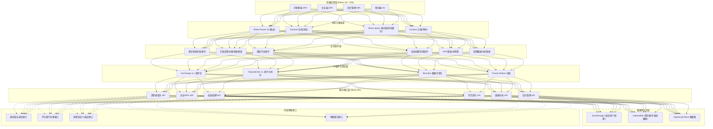
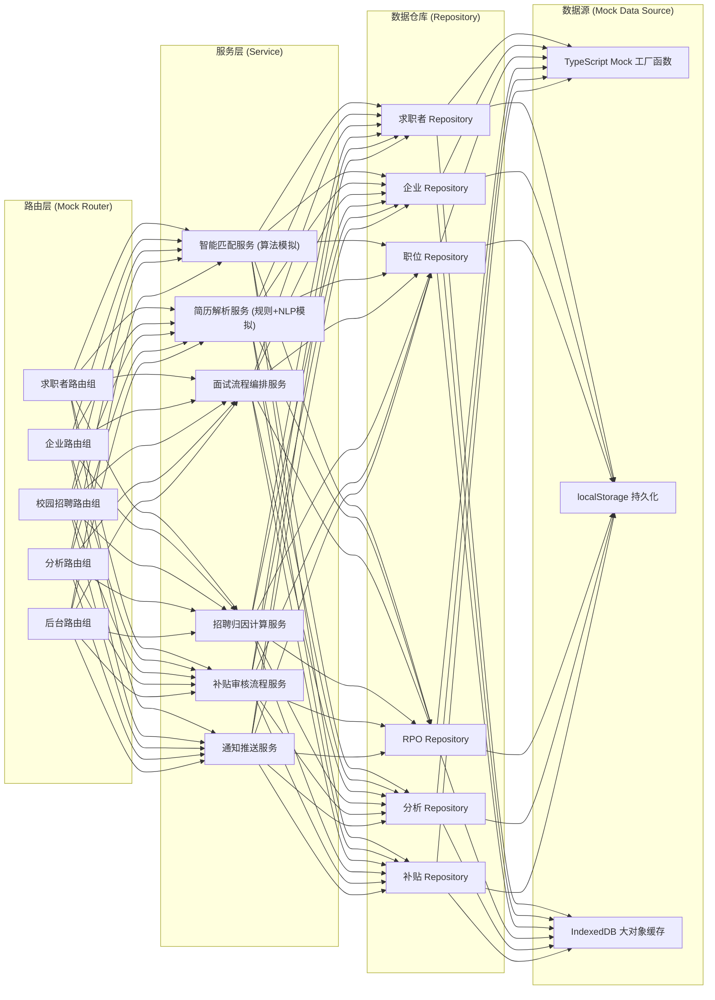
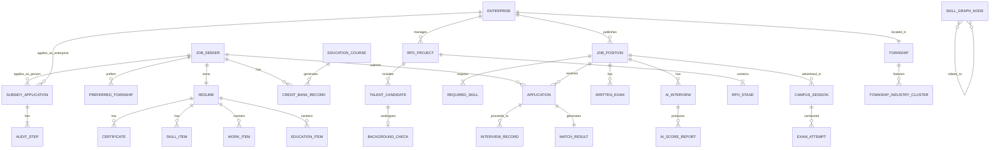

## 1. 架构设计



## 2. 技术说明

- **前端框架**：React@18.2 + TypeScript@5.x，使用 Vite@5.x 作为构建工具
- **UI 体系**：Ant Design@5.x 组件库 + TailwindCSS@3.x 原子化CSS + CSS Variables 主题系统
- **状态管理**：Zustand（轻量全局store）+ React Query（API缓存/自动重试）+ Context（主题/角色权限）
- **数据可视化**：Recharts@2.x（折线/柱状/漏斗/雷达/甘特图）
- **动效方案**：Framer Motion（页面过渡/微交互）+ TailwindCSS animate 类
- **路由方案**：React Router@6.x（嵌套路由/懒加载/角色路由守卫）
- **数据层**：TypeScript Mock Data Factory + localStorage 持久化 + IndexedDB 大容量缓存
- **表单处理**：React Hook Form@7.x + Zod 数据校验
- **HTTP 客户端**：Axios（封装拦截器/错误处理/Token注入）
- **代码规范**：ESLint + Prettier + Husky + lint-staged

## 3. 路由定义

### 3.1 求职者端路由（/jobseeker）
| 路由路径 | 页面用途 | 权限 |
|----------|----------|------|
| / | 求职者首页：镇街专区矩阵 + 智能推荐 + 快捷入口 | 公开 |
| /jobs | 职位搜索列表页：高级筛选 + 匹配度排序 | 公开 |
| /jobs/:id | 职位详情：JD展示 + 匹配度雷达 + 投递 | 登录 |
| /resume | 简历管理中心：编辑 + 解析 + 技能图谱 | 登录 |
| /resume/skill-map | 个人技能图谱可视化页 | 登录 |
| /township | 镇街专区总览：中山25镇街入口 | 公开 |
| /township/:code | 单个镇街专区：产业概览 + 属地企业 + 生活配套 | 公开 |
| /campus | 校园招聘大厅：宣讲会日历 + 笔试/面试入口 | 应届生 |
| /campus/exam/:id | 在线笔试答题页 | 受邀 |
| /campus/ai-interview/:id | AI视频面试页 | 受邀 |
| /education | 学历提升中心：课程超市 + 学分银行 | 登录 |
| /applications | 投递追踪：投递记录 + 面试安排 + 进度 | 登录 |
| /profile | 个人中心：偏好设置 + 消息 + 实名认证 | 登录 |

### 3.2 企业端路由（/enterprise）
| 路由路径 | 页面用途 | 权限 |
|----------|----------|------|
| /dashboard | 企业工作台：招聘看板 + 关键指标 | HR/RPO |
| /jobs | 职位管理：发布/编辑/下架 + 曝光统计 | HR |
| /jobs/publish | 发布职位：JD编辑器 + AI优化建议 | HR |
| /resumes | 简历收件箱：批量筛选 + 匹配度排序 + 打标 | HR |
| /resumes/:id | 简历详情 + 匹配度对比 + 面试操作 | HR |
| /interviews | 面试日历：笔试/AI面试/终面排期管理 | HR |
| /rpo | RPO项目总览：项目列表 + 状态统计 | RPO顾问 |
| /rpo/:id | RPO项目看板：甘特图 + 人才泳道 + 进度跟踪 | RPO顾问 |
| /rpo/:id/talent-pool | 项目人才池：打标 + 活跃度 + 批量触达 | RPO顾问 |
| /rpo/:id/background-checks | 背调归档：报告上传 + 分级管理 | RPO顾问 |
| /analytics | 招聘效果分析：渠道ROI + 效果漏斗 + 留存分析 | 管理员 |
| /subsidy | 政府补贴申领：补贴类型 + 申请流程 + 进度查询 | HR |
| /settings | 企业设置：基本信息 + 团队成员 + 套餐管理 | 管理员 |

### 3.3 后台管理路由（/admin）
| 路由路径 | 页面用途 | 权限 |
|----------|----------|------|
| /dashboard | 运营总览：平台数据 + 镇街招聘热力 | 运营/政府 |
| /enterprise-verification | 企业审核：营业执照 + 属地认证 + 信用评级 | 运营 |
| /township-management | 镇街专区运营：产业配置 + 推荐位 + 活动管理 | 运营 |
| /skill-graph | 技能图谱维护：岗位分类 + 技能权重 + 新兴技能 | 运营 |
| /subsidy-audit | 补贴审核：企业/个人补贴申请 + 审批流 | 政府专员 |
| /system | 系统配置：角色权限 + 消息模板 + 接口对接 | 超级管理员 |

## 4. API 定义（Mock TypeScript 接口）

### 4.1 核心实体类型定义

```typescript
// ============ 通用枚举 ============
enum TownshipCode {
  SHI_QI = 'SQ', DONG_FENG = 'DF', XIAO_LAN = 'XL', GU_ZHEN = 'GZ',
  SHA_XI = 'SX', SAN_JIAO = 'SJ', MIN_ZHONG = 'MZ', HUANG_PU = 'HP',
  // ... 共25个镇街
}

enum IndustryTag {
  HARDWARE = '五金', LIGHTING = '灯饰', APPAREL = '休闲服',
  FURNITURE = '家具', ELECTRONICS = '电子', MACHINERY = '机械装备',
  HOUSEHOLD = '家电', FOOD = '食品', NEW_ENERGY = '新能源',
  ROBOTICS = '工业机器人'
}

enum JobSeekerType { BLUE_COLLAR = '蓝领', SKILLED = '技工', GRADUATE = '应届生' }

enum InterviewStage {
  WRITTEN_EXAM = '笔试', AI_SCREENING = 'AI初筛',
  TECHNICAL = '技术面', HR = 'HR终面', DIRECTOR = '总监面'
}

// ============ 求职者 ============
interface JobSeeker {
  id: string;
  phone: string;
  name: string;
  type: JobSeekerType;
  idVerified: boolean;
  resumeId: string;
  preferredTownships: TownshipCode[];
  preferredSalaryRange: [number, number];
  createdAt: Date;
}

interface Resume {
  id: string;
  jobSeekerId: string;
  basicInfo: {
    name: string; gender: '男' | '女'; age: number;
    phone: string; education: '初中' | '高中' | '中专' | '大专' | '本科' | '硕士';
    location: TownshipCode; avatar?: string;
  };
  educationList: EducationItem[];
  workExperienceList: WorkItem[];
  skillList: SkillItem[];
  certificates: string[];
  projects: ProjectItem[];
  selfEvaluation: string;
  lastUpdated: Date;
}

interface SkillItem {
  name: string;
  level: 1 | 2 | 3 | 4 | 5; // 入门→精通
  category: IndustryTag | '通用技能';
  relatedJobs: string[];
}

// ============ 企业 ============
interface Enterprise {
  id: string;
  name: string;
  licenseNo: string;
  legalPerson: string;
  registeredCapital: string;
  employeeCount: '1-50' | '51-200' | '201-500' | '501-1000' | '1000+';
  industry: IndustryTag;
  township: TownshipCode;
  verified: boolean;
  creditRating: 'A' | 'B' | 'C' | 'D';
  address: string;
  contact: { hrName: string; hrPhone: string; hrEmail: string };
  createdAt: Date;
}

interface JobPosition {
  id: string;
  enterpriseId: string;
  title: string;
  township: TownshipCode;
  salaryRange: [number, number]; // 元/月
  salaryType: '月薪' | '计件' | '日结' | '年薪';
  experience: '不限' | '应届生' | '1-3年' | '3-5年' | '5-10年' | '10年+';
  education: '不限' | '初中' | '高中' | '中专' | '大专' | '本科';
  requiredSkills: RequiredSkill[];
  jobDescription: string;
  welfareTags: string[]; // 如:包吃住/五险一金/年终奖
  channel: '招聘网站' | '内推' | '镇街' | '校园' | '猎头' | 'RPO';
  status: '草稿' | '招聘中' | '已暂停' | '已结束';
  publishedAt: Date;
  views: number;
  applicationsCount: number;
}

interface RequiredSkill {
  name: string;
  weight: number; // 0-100权重
  required: boolean;
}

// ============ 智能匹配 ============
interface MatchResult {
  positionId: string;
  resumeId: string;
  totalScore: number; // 0-100
  dimensions: {
    skillMatch: number;    // 技能匹配
    experienceMatch: number; // 经验匹配
    educationMatch: number;  // 学历匹配
    locationMatch: number;   // 地点匹配
    salaryMatch: number;     // 薪资匹配
  };
  gapAnalysis: {
    missingSkills: string[];
    suggestions: string[];
  };
  updatedAt: Date;
}

// ============ RPO项目 ============
interface RPOProject {
  id: string;
  enterpriseId: string;
  name: string;
  positions: string[]; // 职位ID列表
  headcount: number; // 总招聘人数
  filledCount: number;
  consultant: string; // RPO顾问
  status: '需求确认' | '寻访中' | '初筛' | '推荐面试' | 'Offer' | '入职' | '保用期' | '已完成';
  stages: RPOStage[];
  talentPoolIds: string[];
  budget: number;
  roi: number;
  createdAt: Date;
  deadline: Date;
}

interface RPOStage {
  name: string;
  startDate: Date;
  endDate?: Date;
  status: '待开始' | '进行中' | '已完成' | '已延期';
  assignees: string[];
  notes: string;
}

interface TalentCandidate {
  id: string;
  resumeId: string;
  projectId: string;
  tags: string[]; // 人才标签
  activityScore: number; // 活跃度0-100
  stage: InterviewStage | '待联系' | '已入职' | '已淘汰';
  touchHistory: TouchRecord[];
  backgroundCheck?: BackgroundCheck;
}

interface BackgroundCheck {
  id: string;
  candidateId: string;
  authorizationFile: string; // 授权书URL
  reportFile: string; // 背调报告URL
  result: '无风险' | '低风险' | '中风险' | '高风险';
  items: BackgroundCheckItem[];
  verifiedBy: string;
  verifiedAt: Date;
}

// ============ 校园招聘 ============
interface CampusSession {
  id: string;
  enterpriseId: string;
  university: string;
  school: string; // 学院
  date: Date;
  format: '线上' | '线下';
  venue: string;
  capacity: number;
  registered: number;
  replayUrl?: string;
  positions: string[];
}

interface WrittenExam {
  id: string;
  positionId: string;
  duration: number; // 分钟
  questions: ExamQuestion[];
  passScore: number;
}

interface ExamQuestion {
  type: '单选' | '多选' | '判断' | '简答';
  content: string;
  options?: string[];
  answer: string | string[];
  score: number;
  category: '专业技能' | '逻辑思维' | '职业性格' | '英语';
}

interface AIInterview {
  id: string;
  positionId: string;
  questions: AIQuestion[];
  durationPerQuestion: number; // 秒/题
  aiWeights: { expression: number; speech: number; semantics: number };
}

interface AIQuestion {
  question: string;
  expectedKeywords: string[];
  answerDuration: number;
}

interface AIScoreReport {
  interviewId: string;
  candidateId: string;
  totalScore: number;
  dimensions: { expression: number; speech: number; semantics: number };
  keywordHitRate: number;
  feedback: string;
}

// ============ 学历提升 ============
interface EducationCourse {
  id: string;
  title: string;
  provider: string; // 教育机构
  type: '自考' | '成考' | '职业资格';
  targetDegree: string; // 目标学历/证书
  major: string;
  duration: string;
  price: number;
  creditBankEligible: boolean;
  enrollmentLink: string;
}

interface CreditBankRecord {
  id: string;
  jobSeekerId: string;
  courseId: string;
  earnedCredits: number;
  totalCredits: number;
  progress: number;
  estimatedCertDate: Date;
  syncStatus: '待同步' | '已同步' | '认证中' | '已认证';
}

// ============ 招聘分析 ============
interface ChannelROI {
  channel: string;
  cost: number;
  views: number;
  applications: number;
  interviews: number;
  hires: number;
  cpa: number; // Cost Per Hire
  avgQualityScore: number;
  month: string;
}

interface FunnelMetrics {
  period: string;
  views: number;
  clicks: number;
  applications: number;
  screeningPass: number;
  interviews: number;
  offers: number;
  hires: number;
  retention30d: number;
  retention90d: number;
}

interface RetentionAnalysis {
  cohort: string; // 入职月份
  cohortSize: number;
  channel: string;
  positionType: string;
  township: TownshipCode;
  months: { month: number; remaining: number; attritionReason?: string }[];
}

// ============ 政府补贴 ============
interface SubsidyApplication {
  id: string;
  type: '企业吸纳就业' | '高校毕业生就业' | '技能提升' | '社保补贴';
  applicantType: '企业' | '个人';
  applicantId: string;
  employeeId?: string;
  amount: number;
  requiredDocuments: { name: string; uploaded: boolean; url?: string }[];
  status: '草稿' | '已提交' | '审核中' | '已通过' | '已驳回' | '已发放';
  auditTrail: AuditStep[];
  appliedAt: Date;
}

interface AuditStep {
  step: string;
  operator: string;
  comment: string;
  status: '待处理' | '通过' | '驳回';
  operatedAt: Date;
}
```

## 5. 服务端架构（Mock层逻辑）



## 6. 数据模型

### 6.1 实体关系图 (ER Diagram)



### 6.2 Mock数据初始化策略

| 数据实体 | 生成数量 | 生成策略 |
|----------|----------|----------|
| 镇街 (Township) | 25 | 中山真实镇街数据，固定编码 |
| 企业 (Enterprise) | 150 | 按镇街产业分布加权，每个镇街3-20家企业 |
| 职位 (JobPosition) | 800 | 每个企业3-10个职位，覆盖蓝领/技工/应届生 |
| 技能 (Skill) | 200 | 制造业岗位技能分类树，权重配置 |
| 求职者 (JobSeeker) | 500 | 三类角色分布，简历完整度随机 |
| 投递记录 (Application) | 3000 | 智能匹配算法模拟得分 |
| RPO项目 | 30 | 中大型企业真实招聘周期模拟 |
| 校园宣讲会 | 50 | 本地院校+外来院校企业联合招聘 |
| 渠道ROI数据 | 近6个月每月 | 各渠道成本/转化/留存模拟 |
| 补贴申请 | 80 | 四种补贴类型，不同审核阶段分布 |
