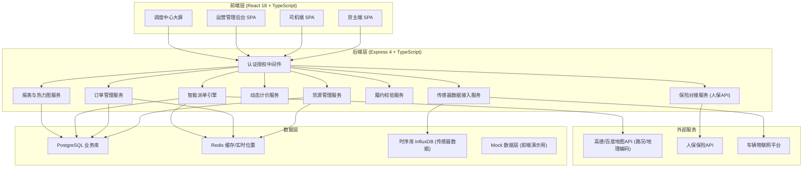

## 1. 架构设计



---

## 2. 技术选型说明

| 层级 | 技术栈 | 说明 |
|------|--------|------|
| 前端框架 | React@18 + TypeScript@5 | 组件化，类型安全 |
| 构建工具 | Vite@5 | 极速HMR，生产构建优化 |
| 状态管理 | Zustand@4 | 轻量，减少Boilerplate |
| 路由 | React Router@6 | 嵌套路由、角色权限守卫 |
| UI样式 | TailwindCSS@3 | 原子化CSS，自定义工业风主题 |
| 图表 | ECharts@5 | 热力图、仪表盘、曲线、Gantt多点配送时间轴 |
| 地图 | react-leaflet + 自定义热力图层 | 开源可离线，叠加自定义热力与车辆Marker |
| 图标 | Lucide React | 统一线性风格 |
| 后端 | Express@4 + TypeScript | REST API，中间件式扩展 |
| 数据库 | Mock 数据 + Memory Store | 前端演示全Mock，含30+订单、20+司机完整生命周期数据 |
| 实时通信 | SSE (Server-Sent Events) Mock | 模拟传感器流与派单推送 |
| HTTP客户端 | Axios + 拦截器 | 统一错误处理与鉴权Token注入 |

---

## 3. 路由定义

| 路由 | 角色 | 页面组件 | 说明 |
|------|------|----------|------|
| `/login` | 全部 | LoginPage | 登录页，角色切换 |
| `/shipper/dashboard` | 货主 | ShipperDashboard | 货主工作台首页 |
| `/shipper/publish` | 货主 | PublishCargo | 发布货源（多维属性+动态计价） |
| `/shipper/orders` | 货主 | ShipperOrderList | 货主订单列表 |
| `/shipper/orders/:id` | 货主 | OrderDetail | 订单详情+轨迹+履约校验 |
| `/shipper/heatmap` | 货主 | ShipperHeatmap | 发货热力图 |
| `/shipper/insurance` | 货主 | InsuranceCenter | 保险中心（投保记录/理赔） |
| `/driver/dashboard` | 司机 | DriverDashboard | 司机工作台（传感器面板） |
| `/driver/hall` | 司机 | OrderHall | 订单大厅（智能推荐+匹配度） |
| `/driver/orders/:id` | 司机 | DriverOrderDetail | 司机订单履约页 |
| `/dispatch/center` | 管理员 | DispatchCenter | 智能调度中心大屏 |
| `/dispatch/saturation` | 管理员 | SaturationWarning | 运力饱和度预警看板 |
| `/admin/overview` | 管理员 | AdminOverview | 运营综合大屏 |
| `/admin/orders` | 管理员 | AdminOrderManage | 订单审核管理 |
| `/admin/users` | 管理员 | UserManagement | 用户/司机管理 |
| `/admin/insurance` | 管理员 | InsuranceManage | 保险对接管理 |

---

## 4. 核心数据模型 (TypeScript 类型定义)

```typescript
// 货源/订单
interface CargoOrder {
  id: string;
  orderNo: string;
  shipperId: string;
  shipperName: string;
  // 货物多维属性
  volume: number;           // m³
  weight: number;           // kg
  tempControl: 'NORMAL' | 'REFRIGERATED' | 'FRESH' | 'DEEP_FREEZE';
  tempRange?: [number, number];
  loadingDifficulty: 'LOW' | 'MEDIUM' | 'HIGH';
  cargoValue: number;       // 货值(元)，用于保费计算
  // 多点配送
  stops: CargoStop[];
  pickupTimeWindow: [string, string];
  // 计价
  priceBreakdown: PriceBreakdown;
  totalPrice: number;
  // 保险
  insurance: InsuranceInfo;
  // 生命周期
  status: OrderStatus;
  driverId?: string;
  matchedAt?: string;
  createdAt: string;
  // 履约校验结果
  fulfillment?: FulfillmentResult;
}

interface CargoStop {
  seq: number;
  type: 'PICKUP' | 'DELIVERY';
  address: string;
  lat: number; lng: number;
  contactName: string;
  contactPhone: string;
  arrivedAt?: string;
  departedAt?: string;
  signedBy?: string;
}

// 动态计价明细
interface PriceBreakdown {
  basePrice: number;          // 基础价（距离+体积重量）
  congestionPremium: number;  // 拥堵溢价
  nightSurcharge: number;     // 夜间加成
  multiStopCoefficient: number; // 多点递增系数
  insuranceFee: number;       // 保费
  total: number;
}

// 保险信息
interface InsuranceInfo {
  enabled: boolean;
  policyNo?: string;
  premium: number;           // 保费 = 货值 * 0.3%
  coverage: number;          // 保额 = 货值
  insurer: 'PICC';
  status: 'PENDING' | 'ISSUED' | 'CLAIMED' | 'SETTLED';
}

// 司机 & 车辆
interface Driver {
  id: string;
  name: string;
  phone: string;
  avatar: string;
  licensePlate: string;
  vehicleType: 'VAN' | 'TRUCK_4M' | 'TRUCK_6M' | 'TRUCK_9M' | 'REEFER';
  maxVolume: number;
  maxWeight: number;
  tempCapability?: ('NORMAL' | 'REFRIGERATED' | 'FRESH' | 'DEEP_FREEZE')[];
  historyFulfillmentRate: number; // 历史履约率 0-1
  currentLat: number;
  currentLng: number;
  currentStatus: 'IDLE' | 'ON_DUTY' | 'IN_TRANSIT';
  saturation: number;        // 0-1 运力饱和度
  totalOrders: number;
  rating: number;            // 0-5
}

// 车辆传感器实时数据
interface VehicleSensorData {
  driverId: string;
  orderId?: string;
  timestamp: string;
  loadWeight: number;        // 载重 kg
  temperature: number;       // 货箱温度 ℃
  doorOpenCount: number;     // 累计开门次数
  doorEvents: DoorEvent[];   // 开门事件明细
  location: { lat: number; lng: number; speed: number };
}

interface DoorEvent {
  timestamp: string;
  location: { lat: number; lng: number };
  durationSec: number;
}

// 智能派单匹配结果
interface MatchCandidate {
  driverId: string;
  driver: Driver;
  overallScore: number;       // 0-100 综合匹配分
  routeScore: number;         // 实时路况+距离
  historyScore: number;       // 历史履约率
  vehicleScore: number;       // 车型匹配度
  returnEmptyScore: number;   // 返程空驶率分（越接近终点越高）
  etaMinutes: number;         // 预计到达取货点时间
}

// 履约校验
interface FulfillmentResult {
  orderId: string;
  loadCheck: CheckResult;     // 载重校验
  tempCheck: CheckResult;     // 温度校验
  doorCheck: CheckResult;     // 开门次数校验
  stopSeqCheck: CheckResult;  // 多点顺序校验
  overallPass: boolean;
  violations: Violation[];
}

interface CheckResult {
  pass: boolean;
  score: number;
  detail: string;
}

interface Violation {
  type: 'LOAD' | 'TEMP' | 'DOOR' | 'STOP_SEQ';
  timestamp: string;
  severity: 'WARNING' | 'SERIOUS';
  description: string;
}

type OrderStatus =
  | 'PUBLISHED'       // 已发布待匹配
  | 'MATCHING'        // 匹配中
  | 'MATCHED'         // 已派单待司机接单
  | 'ACCEPTED'        // 司机已接单
  | 'PICKING_UP'      // 取货中
  | 'IN_TRANSIT'      // 配送中
  | 'PARTIAL_DELIVERED' // 部分送达
  | 'DELIVERED'       // 已送达待校验
  | 'FULFILLMENT_CHECKING' // 履约校验中
  | 'COMPLETED'       // 已完成
  | 'EXCEPTION'       // 异常
  | 'CANCELLED';
```

---

## 5. 智能派单引擎核心算法伪代码

```typescript
function calculateMatchScore(order: CargoOrder, driver: Driver, traffic: TrafficData): MatchCandidate {
  // 1. 路线分 (30%): 距离+实时拥堵
  const distance = haversine(driver.currentLat, driver.currentLng, order.stops[0].lat, order.stops[0].lng);
  const congestionFactor = traffic.getCongestionFactor(driver.currentLat, driver.currentLng);
  const routeScore = normalize(100 - distance * 0.5 - congestionFactor * 20, 0, 100);

  // 2. 历史履约分 (25%): 履约率*70 + 评分*30
  const historyScore = driver.historyFulfillmentRate * 70 + (driver.rating / 5) * 30;

  // 3. 车型匹配分 (25%): 体积/重量/温控覆盖率
  const volumeFit = Math.min(1, driver.maxVolume / order.volume);
  const weightFit = Math.min(1, driver.maxWeight / order.weight);
  const tempFit = order.tempControl === 'NORMAL' ? 1 :
    (driver.tempCapability?.includes(order.tempControl) ? 1 : 0);
  const vehicleScore = (volumeFit * 40 + weightFit * 40 + tempFit * 20);

  // 4. 返程空驶优化分 (20%): 司机当前位置到终点距离越短越好
  const lastStop = order.stops[order.stops.length - 1];
  const returnDist = haversine(driver.currentLat, driver.currentLng, lastStop.lat, lastStop.lng);
  const returnEmptyScore = normalize(100 - returnDist * 0.3, 0, 100);

  const overallScore =
    routeScore * 0.30 +
    historyScore * 0.25 +
    vehicleScore * 0.25 +
    returnEmptyScore * 0.20;

  return { driverId: driver.id, driver, overallScore, routeScore, historyScore, vehicleScore, returnEmptyScore, etaMinutes: estimateETA(distance, congestionFactor) };
}
```

---

## 6. 动态计价模型

```typescript
function calculatePrice(order: CargoOrder, traffic: TrafficData): PriceBreakdown {
  const totalDist = calcRouteDistance(order.stops); // 多点总里程 km
  const { volume, weight, tempControl, loadingDifficulty } = order;

  // 基础价 = 起步价18元 + 里程(3元/km) + 体积(8元/m³) + 重量(0.5元/kg) + 温控附加
  const basePrice = 18
    + totalDist * 3
    + volume * 8
    + weight * 0.5
    + (tempControl === 'REFRIGERATED' ? 50 : tempControl === 'FRESH' ? 30 : tempControl === 'DEEP_FREEZE' ? 80 : 0)
    + (loadingDifficulty === 'MEDIUM' ? 20 : loadingDifficulty === 'HIGH' ? 50 : 0);

  // 拥堵溢价 = 基础价 * min(拥堵系数, 0.5)
  const avgCongestion = traffic.getAverageCongestion(order.stops);
  const congestionPremium = +(basePrice * Math.min(avgCongestion, 0.5)).toFixed(2);

  // 夜间加成: 22:00-06:00 加15%
  const isNight = isInNightWindow(order.pickupTimeWindow[0]);
  const nightSurcharge = isNight ? +(basePrice * 0.15).toFixed(2) : 0;

  // 多点递增系数: 基础价 * (N-2)*5% (3个点以上每多一点+5%)，上限25%
  const stopCount = order.stops.filter(s => s.type === 'DELIVERY').length;
  const multiStopRate = Math.min(Math.max(0, stopCount - 2) * 0.05, 0.25);
  const multiStopCoefficient = +(basePrice * multiStopRate).toFixed(2);

  // 保费 = 货值 * 0.3% (投保时)
  const insuranceFee = order.insurance.enabled ? +(order.cargoValue * 0.003).toFixed(2) : 0;

  const total = +(basePrice + congestionPremium + nightSurcharge + multiStopCoefficient + insuranceFee).toFixed(2);

  return { basePrice: +basePrice.toFixed(2), congestionPremium, nightSurcharge, multiStopCoefficient, insuranceFee, total };
}
```

---

## 7. 前端项目目录结构

```
src/
├── assets/                # 静态资源、全局CSS变量
├── components/
│   ├── common/           # 通用组件（Button/Card/Modal/Table）
│   ├── layout/           # 布局组件（Sidebar/Topbar/RoleLayout）
│   ├── charts/           # 图表组件（Heatmap/Gauge/SensorLine/OrderFlow）
│   ├── map/              # 地图相关（OrderMap/HeatmapLayer/VehicleMarker）
│   ├── shipper/          # 货主端专用组件
│   ├── driver/           # 司机端专用组件
│   └── dispatch/         # 调度大屏专用组件
├── hooks/                # 自定义Hooks
│   ├── useAuth.ts
│   ├── useOrderFlow.ts
│   ├── useSensorStream.ts    # 模拟SSE传感器流
│   └── useMatchingEngine.ts
├── pages/                # 页面路由组件（对应3.路由表）
├── store/                # Zustand状态
│   ├── authStore.ts
│   ├── orderStore.ts
│   ├── driverStore.ts
│   └── dispatchStore.ts
├── utils/
│   ├── pricing.ts        # 动态计价
│   ├── matching.ts       # 匹配算法
│   ├── fulfillment.ts    # 履约校验
│   ├── mockData/         # Mock数据工厂
│   └── format.ts
├── api/                  # REST API封装（Mock后端接口层）
├── types/                # 全局TypeScript类型
├── router/               # React Router配置+权限守卫
└── App.tsx / main.tsx
```

---

## 8. Mock 数据初始化策略

Mock数据包含以下种子数据以确保演示完整：
- **货主用户**：1个（演示账号登录）
- **司机池**：20个，分布在城市不同坐标，车型/温控能力/履约率各异
- **订单池**：30个订单，覆盖各种状态（PUBLISHED→COMPLETED全生命周期）
- **传感器流**：每个在途订单每2秒推送一条SensorData，包含载重/温度/开门事件波动曲线
- **路况数据**：预生成城市分区域拥堵系数矩阵
- **热力数据**：按城市10x10网格生成发货密度
- **饱和度预警**：随机2-3个区域饱和度>85%，用于演示预警看板
