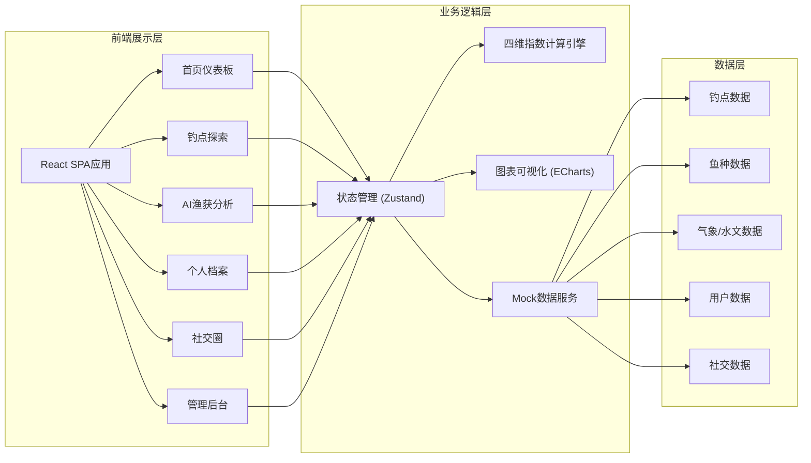
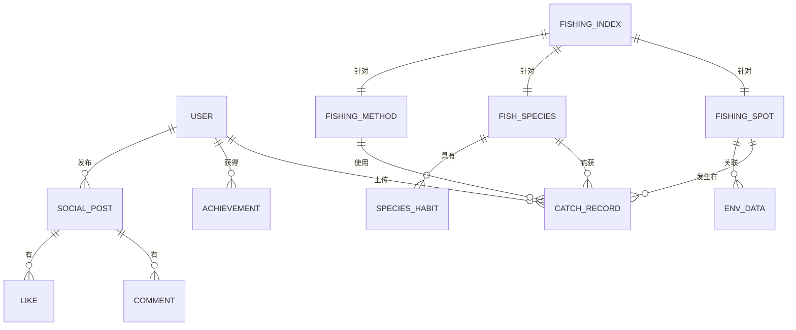

## 1. 架构设计



## 2. 技术选型说明

### 2.1 核心技术栈
- **前端框架**：React 18 + TypeScript
- **构建工具**：Vite 5
- **样式方案**：TailwindCSS 3 + CSS变量
- **状态管理**：Zustand（轻量级，适合中小型应用）
- **路由方案**：React Router v6
- **图表库**：ECharts 5（热力图、折线图、柱状图）
- **图标库**：Lucide React（轻量、美观）
- **动画库**：Framer Motion（交互动效）
- **日期处理**：date-fns
- **表单处理**：React Hook Form

### 2.2 工程化配置
- **代码规范**：ESLint + Prettier
- **提交规范**：Husky + lint-staged
- **类型检查**：TypeScript strict模式
- **路径别名**：@/ 指向 src 目录

### 2.3 数据策略
- 前端纯Mock数据，模拟真实业务场景
- 数据按模块组织，便于后续对接真实API
- 内置模拟数据生成器，支持随机数据扩展

## 3. 路由定义

| 路由路径 | 页面名称 | 模块说明 |
|---------|----------|----------|
| `/` | 首页仪表板 | 钓鱼指数概览、14天热力图、推荐钓点 |
| `/spots` | 钓点列表 | 钓点探索、筛选、地图视图 |
| `/spots/:id` | 钓点详情 | 钓点信息、环境数据、鱼种分布 |
| `/ai-analysis` | AI渔获分析 | 照片上传、分析报告、优化建议 |
| `/profile` | 个人档案 | 数据概览、时空图谱、成长曲线、图鉴 |
| `/social` | 社交圈 | 动态流、渔获分享、互动功能 |
| `/admin` | 管理后台 | 数据源、模型管理、数据看板 |
| `/admin/data-sources` | 数据源管理 | 气象数据源配置与监控 |
| `/admin/models` | 模型管理 | 指数模型版本控制 |
| `/admin/analytics` | 数据分析 | 用户行为埋点与复盘看板 |

## 4. 数据模型

### 4.1 实体关系图



### 4.2 核心数据类型定义

```typescript
// 钓点
interface FishingSpot {
  id: string;
  name: string;
  latitude: number;
  longitude: number;
  waterType: 'lake' | 'river' | 'reservoir' | 'sea' | 'pond';
  avgDepth: number;
  maxDepth: number;
  obstacles: Obstacle[];
  description: string;
  images: string[];
  rating: number;
  difficulty: 'easy' | 'medium' | 'hard';
  fishSpecies: string[];
  rules: string[];
}

// 障碍物
interface Obstacle {
  type: 'rock' | 'weed' | 'tree' | 'platform' | 'other';
  description: string;
  position?: { lat: number; lng: number };
}

// 鱼种
interface FishSpecies {
  id: string;
  name: string;
  scientificName: string;
  aliases: string[];
  image: string;
  habits: SpeciesHabit[];
  optimalTemp: [number, number];
  optimalDepth: [number, number];
  feedingTimes: string[];
  difficulty: number;
  description: string;
}

// 鱼种习性标签
interface SpeciesHabit {
  type: 'oxygen' | 'nocturnal' | 'phototaxis' | 'temperature' | 'pressure' | 'tide';
  name: string;
  description: string;
  value: number; // 影响程度 0-100
}

// 钓法
interface FishingMethod {
  id: string;
  name: string;
  type: 'tai' | 'lure' | 'sea' | 'blackpit';
  description: string;
  suitableSpecies: string[];
  suitableWater: string[];
  equipment: string[];
}

// 环境因子数据
interface EnvironmentData {
  timestamp: number;
  spotId: string;
  source: string;
  // 气象
  temperature: number;
  humidity: number;
  pressure: number;
  pressureTrend: 'rising' | 'falling' | 'stable';
  windSpeed: number;
  windDirection: number;
  // 水文
  waterTemp: number;
  dissolvedOxygen: number;
  waterLevel: number;
  // 潮汐（海水）
  tideType?: 'high' | 'low' | 'rising' | 'falling';
  tideHeight?: number;
  // 天文
  sunrise: number;
  sunset: number;
  moonrise?: number;
  moonset?: number;
  moonPhase: number; // 0-1 0=new 1=full
  moonIllumination: number; // 0-100
}

// 钓鱼指数
interface FishingIndex {
  spotId: string;
  speciesId: string;
  methodId: string;
  timestamp: number;
  overallScore: number; // 0-100
  factors: IndexFactor[];
  suggestion: string;
}

interface IndexFactor {
  name: string;
  score: number;
  weight: number;
  description: string;
}

// 渔获记录
interface CatchRecord {
  id: string;
  userId: string;
  spotId: string;
  speciesId: string;
  methodId: string;
  timestamp: number;
  duration: number; // 分钟
  weight: number;
  length: number;
  quantity: number;
  photos: string[];
  description: string;
  weatherTags: string[];
  locationVerified: boolean;
}

// 用户档案
interface UserProfile {
  id: string;
  nickname: string;
  avatar: string;
  level: number;
  totalCatches: number;
  totalHours: number;
  speciesCount: number;
  achievements: Achievement[];
  skillScore: number;
  joinDate: number;
}

// 成就
interface Achievement {
  id: string;
  name: string;
  description: string;
  icon: string;
  unlocked: boolean;
  unlockedAt?: number;
  rarity: 'common' | 'rare' | 'epic' | 'legendary';
}

// 社交动态
interface SocialPost {
  id: string;
  userId: string;
  type: 'catch' | 'checkin' | 'tip';
  spotId?: string;
  catchRecordId?: string;
  content: string;
  images: string[];
  tags: string[];
  likes: number;
  comments: number;
  createdAt: number;
  locationVerified: boolean;
}
```

## 5. 四维钓鱼指数计算引擎设计

### 5.1 计算架构
```
输入层 → 因子标准化 → 权重计算 → 综合评分 → 输出层
   ↓         ↓            ↓          ↓          ↓
 钓点    气压换算      鱼种习性    加权求和     指数分数
 鱼种    水温标准化    钓法适配    趋势修正     因子详情
 钓法    溶氧归一化    时段权重    边界校验     建议文案
 时间    潮汐修正      季节因子                热力图数据
```

### 5.2 核心算法
- **气压因子**：气压趋势 > 绝对值，上升期优于下降期
- **水温因子**：不同鱼种有不同适宜温度区间，采用正态分布评分
- **溶解氧**：与温度、气压联动计算，趋氧性鱼种权重加倍
- **潮汐因子**：涨潮/落潮交界为黄金时段，潮差越大效果越显著
- **月相因子**：夜行性鱼种受月相影响大，满月前后活跃度高
- **时段因子**：晨昏时段（黄金时段）基础分加成
- **季节修正**：根据季节调整各因子权重占比

## 6. 目录结构

```
src/
├── assets/              # 静态资源
│   ├── images/
│   └── icons/
├── components/          # 通用组件
│   ├── ui/             # 基础UI组件
│   ├── charts/         # 图表组件
│   └── layout/         # 布局组件
├── pages/               # 页面组件
│   ├── Dashboard/
│   ├── Spots/
│   ├── AIAnalysis/
│   ├── Profile/
│   ├── Social/
│   └── Admin/
├── store/               # 状态管理
│   ├── useUserStore.ts
│   ├── useSpotStore.ts
│   └── useIndexStore.ts
├── data/                # Mock数据
│   ├── spots.ts
│   ├── species.ts
│   ├── environment.ts
│   └── user.ts
├── engine/              # 业务引擎
│   ├── fishingIndex.ts  # 四维计算引擎
│   └── aiAnalysis.ts    # AI分析模拟
├── hooks/               # 自定义Hooks
├── utils/               # 工具函数
├── types/               # TypeScript类型定义
├── styles/              # 全局样式
├── router/              # 路由配置
└── App.tsx
```

## 7. 性能与体验优化

### 7.1 性能优化
- 热力图数据采用按需计算，避免一次性计算全部数据
- 图表组件懒加载，非首屏图表延迟渲染
- 图片资源使用WebP格式，配合懒加载
- 大列表采用虚拟滚动
- 状态管理按需订阅，避免不必要的重渲染

### 7.2 用户体验
- 首屏骨架屏加载动画
- 数据加载时的微交互反馈
- 热力图支持手势缩放与平移
- 平滑的页面切换过渡
- 错误状态友好提示与重试机制
