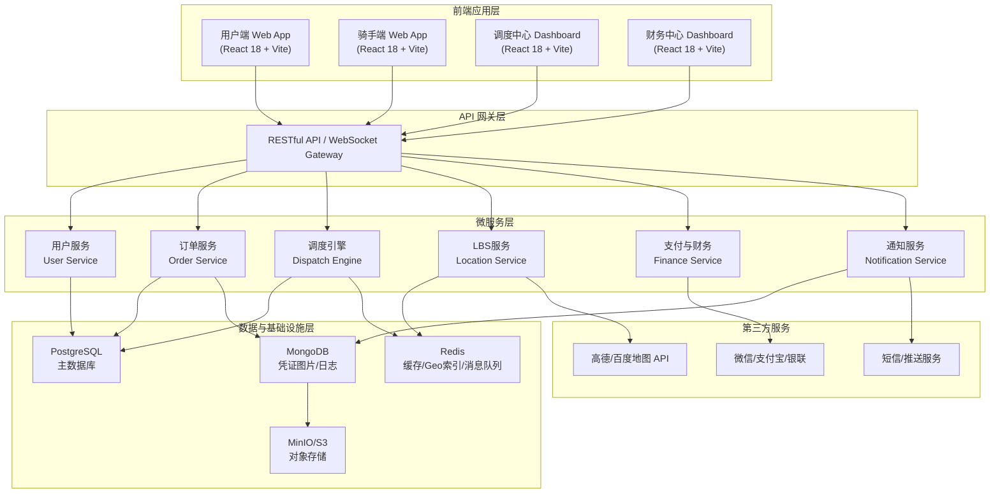
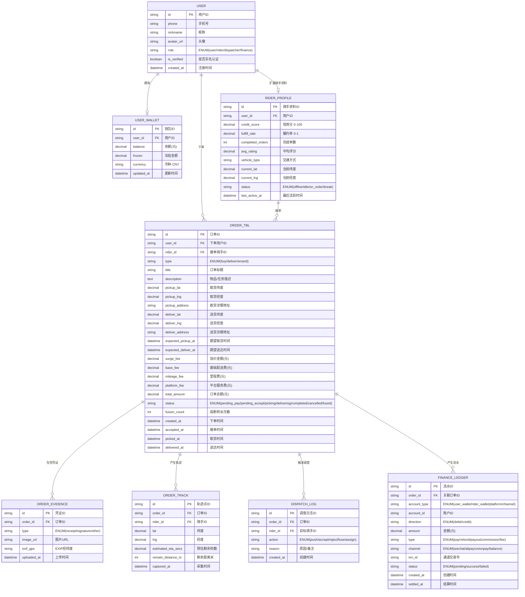

## 1. 架构设计



---

## 2. 技术选型说明

| 层级 | 技术栈 | 版本 | 选型理由 |
|------|--------|------|----------|
| 前端框架 | React | 18.x | 组件化生态成熟，Concurrent Mode适配实时更新场景 |
| 构建工具 | Vite | 5.x | 极速HMR，开发体验好，生产构建优化 |
| 路由管理 | React Router | 6.x | 声明式路由，支持嵌套与懒加载 |
| 状态管理 | Zustand | 4.x | 轻量级，开箱即用的immer支持，适配多模块状态隔离 |
| UI组件库 | 自定义 + TailwindCSS | 3.4 | 高度定制化设计，快速原子化样式开发 |
| 图表可视化 | ECharts | 5.x | 调度/财务看板数据可视化性能优秀 |
| 地图组件 | 高德地图 JS API | 2.x | 国内LBS覆盖最全，支持GeoFence/路线规划 |
| 地图模拟 | Leaflet + OpenStreetMap | 1.x | Mock模式下使用开源地图组件，无需key |
| HTTP请求 | Axios | 1.x | 请求/响应拦截器，取消请求适配重复提交防护 |
| WebSocket | socket.io-client | 4.x | 骑手位置/订单状态实时推送 |
| 动画库 | framer-motion | 11.x | 流畅路由过渡与微交互动效 |
| 表单校验 | react-hook-form + zod | 7.x/3.x | 高性能表单，zod类型推导至TS类型 |
| Mock服务 | Mock.js + MSW | 2.x | 前后端分离开发，接口Mock |

**本项目实现**：采用纯前端 SPA 架构 + Mock 数据模拟完整业务流程，便于独立运行演示。后端接口以 TypeScript 类型定义 + Mock 数据模拟，WebSocket 用定时器模拟实时推送。

---

## 3. 路由定义

### 3.1 用户端 (User App)

| 路由 | 页面用途 | 权限 |
|------|----------|------|
| / | 用户端首页，服务入口 + 热力图 + 进行中订单 | 游客/登录用户 |
| /publish | 发布订单：类型/描述/地址/时间/加价/费用 | 登录用户 |
| /order/:id | 订单追踪：实时地图/ETA/凭证/评价入口 | 登录用户 |
| /orders | 我的订单列表（全部/进行中/已完成） | 登录用户 |
| /wallet | 钱包：余额/充值/消费流水 | 登录用户 |
| /profile | 个人中心：设置/地址管理/实名认证 | 登录用户 |

### 3.2 骑手端 (Rider App)

| 路由 | 页面用途 | 权限 |
|------|----------|------|
| /rider | 骑手工作台：附近订单池推荐 | 骑手认证用户 |
| /rider/order/:id | 接单详情：路径规划/取货导航/凭证上传 | 骑手认证用户 |
| /rider/wallet | 骑手钱包：待结算/可提现/提现申请 | 骑手认证用户 |
| /rider/profile | 骑手中心：信用分/历史履约/评价汇总 | 骑手认证用户 |

### 3.3 调度中心 (Dispatch Dashboard)

| 路由 | 页面用途 | 权限 |
|------|----------|------|
| /dispatch | 调度监控大屏：全局地图/实时数据/告警面板 | 调度员 |
| /dispatch/conflicts | 订单冲突管理：时间重叠/超载/骑手异常 | 调度员 |
| /dispatch/fusion | 熔断队列：超时转派/异常恢复/人工干预 | 调度员 |

### 3.4 财务中心 (Finance Dashboard)

| 路由 | 页面用途 | 权限 |
|------|----------|------|
| /finance | 财务概览：今日流水/分账比例/通道健康度 | 财务管理员 |
| /finance/users | 用户余额管理：充值/退款/冻结/流水 | 财务管理员 |
| /finance/riders | 骑手结算：待结算/提现审核/批量打款 | 财务管理员 |
| /finance/channels | 支付通道配置：参数/权重/费率/熔断阈值 | 财务管理员 |

---

## 4. 数据模型定义



---

## 5. 前端核心模块与状态设计

### 5.1 Zustand Store 分层

```
stores/
├── userStore.ts          # 用户认证、个人信息
├── orderStore.ts         # 订单列表、当前订单详情、发布订单草稿
├── riderStore.ts         # 骑手资料、当前接单、订单池
├── dispatchStore.ts      # 调度地图、告警队列、熔断列表
├── financeStore.ts       # 财务概览、流水、提现单
└── mapStore.ts           # 地图视图状态、骑手标记、轨迹点
```

### 5.2 核心类型定义（TypeScript）

```typescript
// 用户角色
export type UserRole = 'user' | 'rider' | 'dispatcher' | 'finance';

// 订单类型
export type OrderType = 'buy' | 'deliver' | 'errand';

// 订单状态
export type OrderStatus = 
  | 'pending_pay'    // 待支付
  | 'pending_accept' // 待接单
  | 'picking'        // 取货中
  | 'delivering'     // 配送中
  | 'completed'      // 已完成
  | 'cancelled'      // 已取消
  | 'fused';         // 已熔断

// 骑手状态
export type RiderStatus = 'offline' | 'idle' | 'on_order' | 'break';

// 坐标点
export interface GeoPoint {
  lat: number;
  lng: number;
  address?: string;
}

// 订单基础结构
export interface Order {
  id: string;
  userId: string;
  riderId?: string;
  type: OrderType;
  title: string;
  description: string;
  pickup: GeoPoint;
  deliver: GeoPoint;
  expectedPickupAt: Date;
  expectedDeliverAt: Date;
  surgeFee: number;
  baseFee: number;
  mileageFee: number;
  platformFee: number;
  totalAmount: number;
  status: OrderStatus;
  fusionCount: number;
  createdAt: Date;
  acceptedAt?: Date;
  pickedAt?: Date;
  deliveredAt?: Date;
}

// 骑手档案
export interface RiderProfile {
  userId: string;
  creditScore: number;      // 0-100
  fulfillRate: number;      // 0-1
  completedOrders: number;
  avgRating: number;        // 0-5
  vehicleType: string;
  location: GeoPoint;
  status: RiderStatus;
  lastActiveAt: Date;
}

// 轨迹点
export interface TrackPoint {
  orderId: string;
  riderId: string;
  location: GeoPoint;
  etaSecs: number;
  remainDistanceM: number;
  capturedAt: Date;
}

// 匹配推荐评分
export interface OrderRiderScore {
  riderId: string;
  totalScore: number;        // 0-100
  distanceScore: number;
  creditScore: number;
  fulfillScore: number;
  distanceM: number;
  estimatedArrivalSecs: number;
}
```

### 5.3 调度引擎核心算法（前端Mock实现）

```typescript
// 候选骑手综合评分：距离×40% + 信用×30% + 履约率×30%
function computeRiderScore(rider: RiderProfile, order: Order): OrderRiderScore {
  const distanceM = haversineDistance(rider.location, order.pickup);
  
  // 距离分：3km内线性衰减
  const maxDistance = 3000;
  const distanceScore = Math.max(0, 100 * (1 - distanceM / maxDistance));
  
  // 信用分：直接0-100
  const creditScore = rider.creditScore;
  
  // 履约分：转换到0-100
  const fulfillScore = rider.fulfillRate * 100;
  
  const totalScore = 
    distanceScore * 0.4 + 
    creditScore   * 0.3 + 
    fulfillScore  * 0.3;
    
  return {
    riderId: rider.userId,
    totalScore: Math.round(totalScore * 100) / 100,
    distanceScore,
    creditScore,
    fulfillScore,
    distanceM: Math.round(distanceM),
    estimatedArrivalSecs: Math.round(distanceM / 4) // 骑手4m/s
  };
}

// 骑手时间冲突检测
function checkRiderAvailability(rider: RiderProfile, newOrder: Order, activeOrders: Order[]): boolean {
  for (const order of activeOrders) {
    if (order.riderId !== rider.userId) continue;
    if (order.status === 'completed' || order.status === 'cancelled') continue;
    
    // 时间窗重叠检测
    const newStart = newOrder.expectedPickupAt.getTime();
    const newEnd = newOrder.expectedDeliverAt.getTime();
    const exStart = order.expectedPickupAt.getTime();
    const exEnd = order.expectedDeliverAt.getTime();
    
    const hasOverlap = newStart < exEnd && exStart < newEnd;
    if (hasOverlap) return false;
  }
  return true;
}

// 超时熔断与自动转派
class FusionEngine {
  pushTimeoutMs = 180_000; // 3分钟
  maxFusionCount = 5;
  
  checkAndFuse(orderId: string, pushedAt: Date, currentCandidates: string[], allRiders: RiderProfile[]) {
    const elapsed = Date.now() - pushedAt.getTime();
    if (elapsed < this.pushTimeoutMs) return null;
    
    // 已超时，排除当前候选，从剩余骑手重新推荐
    const remainingRiders = allRiders.filter(r => !currentCandidates.includes(r.userId));
    // ...重新排序推送
  }
}
```

---

## 6. Mock 数据初始种子

### 6.1 初始骑手数据（20个模拟骑手）
- 均匀分布在模拟城市中心（市中心坐标 31.2304°N, 121.4737°E 周边3km）
- 信用分分布：80-98，履约率：0.90-0.99，完成单量：50-1500
- 交通方式：电动车(60%)、自行车(25%)、步行(10%)、摩托车(5%)

### 6.2 初始订单数据（15个进行中+历史订单）
- pending_accept: 5单，等待接单模拟熔断
- picking: 3单，骑手取货中
- delivering: 4单，配送中含轨迹
- completed: 3单，已完成可查看评价与凭证

---

## 7. 目录结构规划

```
src/
├── assets/               # 静态资源 / 图标 / 图片
├── components/           # 通用组件
│   ├── ui/               # 基础UI：Button/Card/Modal/Toast
│   ├── map/              # 地图组件：RiderMarker/OrderMarker/TrackLayer
│   └── order/            # 订单组件：OrderCard/StatusTimeline/EvidenceGallery
├── pages/                # 页面组件
│   ├── user/             # 用户端：Home/PublishOrder/OrderTrack/Orders/Wallet/Profile
│   ├── rider/            # 骑手端：Workbench/OrderDetail/Wallet/Profile
│   ├── dispatch/         # 调度端：Dashboard/Conflicts/FusionQueue
│   └── finance/          # 财务端：Overview/UserBalances/RiderPayout/Channels
├── stores/               # Zustand状态管理
├── hooks/                # 自定义hooks：useMap/useOrderTracking/useRealtime
├── types/                # TypeScript类型定义
├── utils/                # 工具函数：距离计算/金额格式化/调度算法
├── mocks/                # Mock数据与接口拦截器
├── router/               # 路由配置
└── App.tsx               # 入口
```
