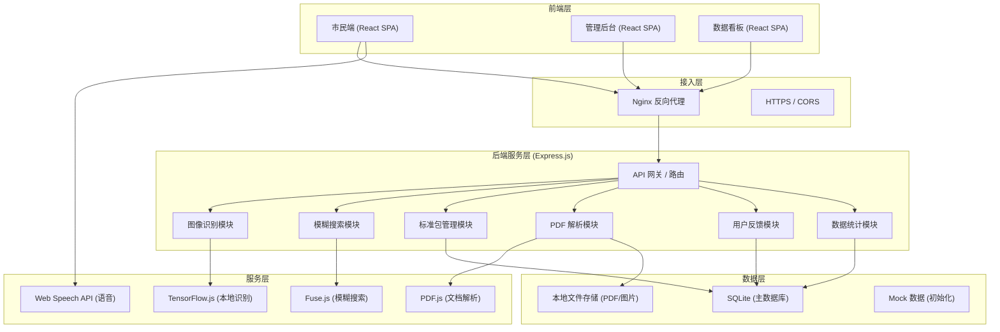
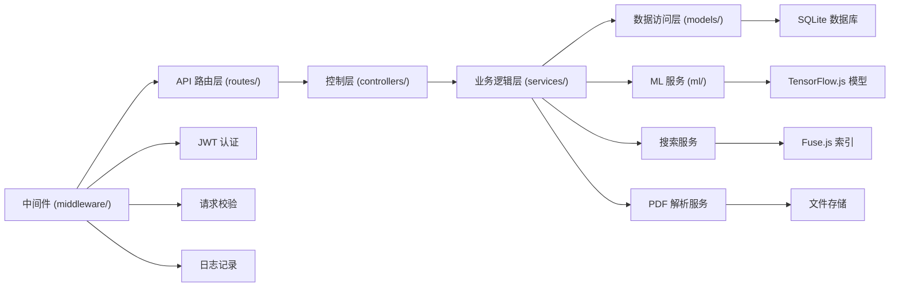

## 1. 架构设计



## 2. 技术选型说明

### 2.1 前端技术栈
- **框架**: React@18 + TypeScript
- **构建工具**: Vite@5
- **样式方案**: Tailwind CSS@3 + CSS Variables
- **路由**: React Router@6
- **状态管理**: Zustand (轻量级，避免过度设计)
- **HTTP客户端**: Axios + 拦截器
- **UI组件**: Lucide React (图标) + Headless UI (无样式组件)
- **图表可视化**: ECharts@5 (热力图、趋势图)
- **语音处理**: Web Speech API (浏览器原生)
- **相机处理**: WebRTC MediaDevices API

### 2.2 后端技术栈
- **框架**: Express@4 + TypeScript
- **数据库**: SQLite (文件型，便于部署) + better-sqlite3
- **图像识别**: TensorFlow.js + 预训练 MobileNet 模型 + 自定义分类层
- **模糊搜索**: Fuse.js (轻量级模糊匹配)
- **PDF解析**: pdf-parse (服务端解析文本)
- **文件上传**: Multer
- **身份认证**: JWT + bcrypt
- **数据校验**: Zod

### 2.3 项目目录结构
```
may-89256/
├── client/                          # 前端项目
│   ├── src/
│   │   ├── pages/                   # 页面组件
│   │   │   ├── Home.tsx
│   │   │   ├── CameraRecognition.tsx
│   │   │   ├── VoiceQuery.tsx
│   │   │   ├── Search.tsx
│   │   │   ├── Feedback.tsx
│   │   │   ├── admin/
│   │   │   │   ├── Login.tsx
│   │   │   │   ├── StandardManagement.tsx
│   │   │   │   └── PdfManagement.tsx
│   │   │   └── dashboard/
│   │   │       └── Statistics.tsx
│   │   ├── components/              # 公共组件
│   │   ├── stores/                  # Zustand 状态
│   │   ├── services/                # API 服务
│   │   ├── utils/                   # 工具函数
│   │   └── App.tsx
│   ├── package.json
│   └── vite.config.ts
│
└── server/                          # 后端项目
    ├── src/
    │   ├── routes/                  # API 路由
    │   │   ├── recognition.ts
    │   │   ├── search.ts
    │   │   ├── standards.ts
    │   │   ├── pdf.ts
    │   │   ├── feedback.ts
    │   │   ├── statistics.ts
    │   │   └── auth.ts
    │   ├── controllers/             # 控制器
    │   ├── services/                # 业务逻辑
    │   │   ├── RecognitionService.ts
    │   │   ├── SearchService.ts
    │   │   ├── StandardService.ts
    │   │   ├── PdfService.ts
    │   │   └── StatisticsService.ts
    │   ├── models/                  # 数据模型
    │   ├── middleware/              # 中间件
    │   ├── db/                      # 数据库
    │   │   ├── schema.sql
    │   │   ├── init.ts
    │   │   └── mockData.ts
    │   ├── ml/                      # 机器学习模型
    │   │   └── garbageClassifier.ts
    │   └── app.ts
    ├── uploads/                     # 文件上传目录
    └── package.json
```

## 3. 路由定义

### 3.1 前端路由 (React Router)

| 路由 | 页面 | 权限 |
|-------|------|------|
| `/` | 首页 | 公开 |
| `/camera` | 拍照识别 | 公开 |
| `/voice` | 语音查询 | 公开 |
| `/search` | 文本搜索 | 公开 |
| `/feedback` | 错误反馈 | 公开 |
| `/admin/login` | 管理员登录 | 公开 |
| `/admin/standards` | 标准包管理 | 区级管理员 |
| `/admin/pdf` | PDF管理 | 区级管理员 |
| `/dashboard` | 数据看板 | 市政监管 |

### 3.2 后端 API 路由 (Express)

| 方法 | 路由 | 模块 | 功能描述 |
|------|------|------|----------|
| POST | `/api/auth/login` | 认证 | 管理员登录 |
| GET | `/api/standards` | 标准包 | 获取城市标准列表 |
| GET | `/api/standards/:cityId` | 标准包 | 获取指定城市分类标准 |
| POST | `/api/standards` | 标准包 | 新增标准包 |
| PUT | `/api/standards/:id` | 标准包 | 更新标准包 |
| DELETE | `/api/standards/:id` | 标准包 | 删除标准包 |
| POST | `/api/recognition/image` | 图像识别 | 上传图片识别分类 |
| GET | `/api/search` | 搜索 | 模糊搜索垃圾条目 |
| POST | `/api/pdf/upload` | PDF | 上传PDF新规文件 |
| GET | `/api/pdf/:id` | PDF | 获取PDF解析内容 |
| POST | `/api/pdf/link` | PDF | 关联PDF条目与分类标准 |
| POST | `/api/feedback` | 反馈 | 提交错误投放反馈 |
| GET | `/api/statistics/misjudgments` | 统计 | 获取高频误判词条 |
| GET | `/api/statistics/accuracy` | 统计 | 获取各街道准确率数据 |
| GET | `/api/statistics/trend` | 统计 | 获取查询量趋势数据 |

## 4. API 类型定义

```typescript
// 垃圾分类标准
interface GarbageCategory {
  id: string;
  cityId: string;
  cityName: string;
  categoryCode: 'recyclable' | 'harmful' | 'kitchen' | 'other' | string; // 四类基础+扩展
  categoryName: string;
  icon: string;
  color: string;
  disposalGuidelines: string;
  commonMisconceptions: string;
  updateTimestamp: number;
}

interface GarbageItem {
  id: string;
  name: string;
  aliases: string[];
  categoryId: string;
  cityId: string;
  disposalRequirements: string;
  commonMisconceptions: string;
}

// 图像识别
interface RecognitionRequest {
  imageBase64: string;
  cityId: string;
}

interface RecognitionResult {
  success: boolean;
  predictions: Array<{
    itemName: string;
    category: GarbageCategory;
    confidence: number;
    disposalRequirements: string;
    commonMisconceptions: string;
  }>;
  processingTime: number;
}

// 模糊搜索
interface SearchResult {
  item: GarbageItem;
  category: GarbageCategory;
  matchScore: number;
  matchedAlias?: string;
}

// 错误反馈
interface FeedbackRequest {
  itemName: string;
  misjudgedCategoryId: string;
  correctCategoryId: string;
  description?: string;
  imageUrl?: string;
  location?: {
    district: string;
    street: string;
  };
  userAgent?: string;
}

// PDF管理
interface PdfDocument {
  id: string;
  cityId: string;
  fileName: string;
  fileSize: number;
  uploadTime: number;
  uploaderId: string;
  parsedContent: string;
  linkedItemIds: string[];
  version: string;
}

// 统计数据
interface StreetAccuracy {
  district: string;
  street: string;
  accuracy: number;
  totalQueries: number;
  feedbackCount: number;
}

interface MisjudgmentItem {
  itemName: string;
  count: number;
  correctCategory: string;
  misjudgedAs: string[];
}
```

## 5. 服务端架构图



## 6. 数据模型

### 6.1 ER 图

```mermaid
erDiagram
    CITY ||--o{ CATEGORY : has
    CITY ||--o{ GARBAGE_ITEM : has
    CATEGORY ||--o{ GARBAGE_ITEM : contains
    GARBAGE_ITEM ||--o{ FEEDBACK : receives
    PDF_DOCUMENT ||--o{ GARBAGE_ITEM : links
    ADMIN ||--o{ PDF_DOCUMENT : uploads
    ADMIN ||--o{ CATEGORY : manages
    FEEDBACK }o--|| STREET : "from"
    
    CITY {
        string id PK
        string name
        string province
        number createdAt
    }
    
    CATEGORY {
        string id PK
        string cityId FK
        string code
        string name
        string icon
        string color
        string guidelines
        string misconceptions
        number updateTimestamp
    }
    
    GARBAGE_ITEM {
        string id PK
        string name
        string aliases JSON
        string categoryId FK
        string cityId FK
        string requirements
        string misconceptions
    }
    
    FEEDBACK {
        string id PK
        string itemName
        string misjudgedCategoryId FK
        string correctCategoryId FK
        string description
        string imageUrl
        string district
        string street
        string userAgent
        number createdAt
    }
    
    PDF_DOCUMENT {
        string id PK
        string cityId FK
        string fileName
        number fileSize
        string uploaderId FK
        string parsedContent
        string linkedItemIds JSON
        string version
        number uploadTime
    }
    
    ADMIN {
        string id PK
        string username
        string passwordHash
        string role
        string cityId FK
        string district
    }
    
    STREET {
        string id PK
        string district
        string name
        string cityId FK
    }
```

### 6.2 DDL 语句

```sql
-- 城市表
CREATE TABLE IF NOT EXISTS cities (
  id TEXT PRIMARY KEY,
  name TEXT NOT NULL,
  province TEXT NOT NULL,
  created_at INTEGER NOT NULL DEFAULT (strftime('%s', 'now'))
);

-- 分类表 (支持四类基础+地方扩展)
CREATE TABLE IF NOT EXISTS categories (
  id TEXT PRIMARY KEY,
  city_id TEXT NOT NULL,
  code TEXT NOT NULL, -- recyclable, harmful, kitchen, other, 或地方扩展码
  name TEXT NOT NULL,
  icon TEXT NOT NULL,
  color TEXT NOT NULL,
  guidelines TEXT NOT NULL,
  misconceptions TEXT,
  update_timestamp INTEGER NOT NULL,
  FOREIGN KEY (city_id) REFERENCES cities(id)
);

-- 垃圾条目表
CREATE TABLE IF NOT EXISTS garbage_items (
  id TEXT PRIMARY KEY,
  name TEXT NOT NULL,
  aliases TEXT, -- JSON 数组
  category_id TEXT NOT NULL,
  city_id TEXT NOT NULL,
  requirements TEXT NOT NULL,
  misconceptions TEXT,
  FOREIGN KEY (category_id) REFERENCES categories(id),
  FOREIGN KEY (city_id) REFERENCES cities(id)
);

-- 创建搜索索引
CREATE INDEX IF NOT EXISTS idx_items_name ON garbage_items(name);
CREATE INDEX IF NOT EXISTS idx_items_city ON garbage_items(city_id);

-- 管理员表
CREATE TABLE IF NOT EXISTS admins (
  id TEXT PRIMARY KEY,
  username TEXT NOT NULL UNIQUE,
  password_hash TEXT NOT NULL,
  role TEXT NOT NULL, -- district_admin, municipal_admin
  city_id TEXT NOT NULL,
  district TEXT,
  FOREIGN KEY (city_id) REFERENCES cities(id)
);

-- PDF文档表
CREATE TABLE IF NOT EXISTS pdf_documents (
  id TEXT PRIMARY KEY,
  city_id TEXT NOT NULL,
  file_name TEXT NOT NULL,
  file_size INTEGER NOT NULL,
  uploader_id TEXT NOT NULL,
  parsed_content TEXT,
  linked_item_ids TEXT, -- JSON 数组
  version TEXT,
  upload_time INTEGER NOT NULL,
  FOREIGN KEY (city_id) REFERENCES cities(id),
  FOREIGN KEY (uploader_id) REFERENCES admins(id)
);

-- 用户反馈表
CREATE TABLE IF NOT EXISTS feedback (
  id TEXT PRIMARY KEY,
  item_name TEXT NOT NULL,
  misjudged_category_id TEXT,
  correct_category_id TEXT NOT NULL,
  description TEXT,
  image_url TEXT,
  district TEXT,
  street TEXT,
  user_agent TEXT,
  created_at INTEGER NOT NULL DEFAULT (strftime('%s', 'now')),
  FOREIGN KEY (misjudged_category_id) REFERENCES categories(id),
  FOREIGN KEY (correct_category_id) REFERENCES categories(id)
);

-- 街道表
CREATE TABLE IF NOT EXISTS streets (
  id TEXT PRIMARY KEY,
  district TEXT NOT NULL,
  name TEXT NOT NULL,
  city_id TEXT NOT NULL,
  FOREIGN KEY (city_id) REFERENCES cities(id)
);

-- 创建反馈索引
CREATE INDEX IF NOT EXISTS idx_feedback_item ON feedback(item_name);
CREATE INDEX IF NOT EXISTS idx_feedback_location ON feedback(district, street);
CREATE INDEX IF NOT EXISTS idx_feedback_created ON feedback(created_at);
```

### 6.3 初始化 Mock 数据

```typescript
// 预设城市
const defaultCities = [
  { id: 'shanghai', name: '上海市', province: '上海市' },
  { id: 'beijing', name: '北京市', province: '北京市' },
  { id: 'guangzhou', name: '广州市', province: '广东省' },
  { id: 'shenzhen', name: '深圳市', province: '广东省' },
];

// 四类基础分类 (各城市可扩展)
const baseCategories = [
  {
    code: 'recyclable',
    name: '可回收物',
    icon: '♻️',
    color: '#0ea5e9',
    guidelines: '轻投轻放，清洁干燥，避免污染；废纸尽量平整；立体包装物请清空内容物，清洁后压扁投放；有尖锐边角的，应包裹后投放。',
    misconceptions: '纸巾和卫生纸由于水溶性太强不可回收；一次性塑料袋、保鲜膜属于其他垃圾。'
  },
  {
    code: 'harmful',
    name: '有害垃圾',
    icon: '☠️',
    color: '#ef4444',
    guidelines: '投放时请注意轻放；易破损的请连带包装或包裹后轻放；如易挥发，请密封后投放。',
    misconceptions: '普通干电池（碱性电池）已达到低汞或无汞标准，属于其他垃圾；纽扣电池、充电电池、锂电池才是有害垃圾。'
  },
  {
    code: 'kitchen',
    name: '厨余垃圾',
    icon: '🍎',
    color: '#22c55e',
    guidelines: '纯流质的食物垃圾，如牛奶等，应直接倒进下水口；有包装物的厨余垃圾应将包装物去除后分类投放，包装物请投放到对应的可回收物或其他垃圾容器。',
    misconceptions: '大骨头、椰子壳、榴莲壳等难以腐烂的硬壳属于其他垃圾；厨余垃圾要沥干水分，去除塑料袋。'
  },
  {
    code: 'other',
    name: '其他垃圾',
    icon: '🗑️',
    color: '#6b7280',
    guidelines: '尽量沥干水分；难以辨识类别的生活垃圾投入其他垃圾容器内。',
    misconceptions: '尿不湿、烟蒂、陶瓷制品、普通一次性电池都属于其他垃圾。'
  }
];

// 常见垃圾条目
const defaultItems = [
  { name: '矿泉水瓶', aliases: ['塑料瓶', 'PET瓶'], categoryCode: 'recyclable' },
  { name: '报纸', aliases: ['旧报纸', '废报纸'], categoryCode: 'recyclable' },
  { name: '易拉罐', aliases: ['铝罐', '金属罐'], categoryCode: 'recyclable' },
  { name: '废电池', aliases: ['纽扣电池', '充电电池', '锂电池'], categoryCode: 'harmful' },
  { name: '过期药品', aliases: ['药物', '药片'], categoryCode: 'harmful' },
  { name: '剩菜剩饭', aliases: ['剩饭', '剩菜', '餐厨垃圾'], categoryCode: 'kitchen' },
  { name: '果皮', aliases: ['水果皮', '香蕉皮', '苹果皮'], categoryCode: 'kitchen' },
  { name: '餐巾纸', aliases: ['纸巾', '卫生纸', '面巾纸'], categoryCode: 'other' },
  { name: '烟蒂', aliases: ['烟头', '香烟头'], categoryCode: 'other' },
  { name: '陶瓷碎片', aliases: ['碎陶瓷', '瓷器碎片'], categoryCode: 'other' },
];

// 预设管理员账号
const defaultAdmins = [
  {
    username: 'admin_sh',
    password: 'admin123',
    role: 'district_admin',
    cityId: 'shanghai',
    district: '浦东新区'
  },
  {
    username: 'admin_municipal',
    password: 'admin123',
    role: 'municipal_admin',
    cityId: 'shanghai',
    district: null
  }
];

// 预设街道数据（以上海为例）
const defaultStreets = [
  { district: '浦东新区', name: '陆家嘴街道' },
  { district: '浦东新区', name: '张江镇' },
  { district: '浦东新区', name: '金桥开发区' },
  { district: '黄浦区', name: '南京东路街道' },
  { district: '黄浦区', name: '豫园街道' },
  { district: '徐汇区', name: '徐家汇街道' },
  { district: '徐汇区', name: '枫林路街道' },
  { district: '静安区', name: '南京西路街道' },
  { district: '静安区', name: '静安寺街道' },
];
```
