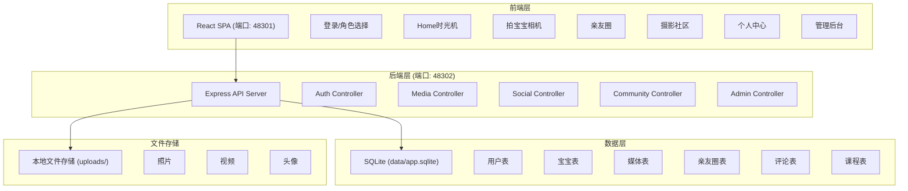
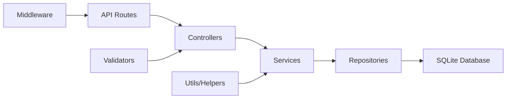
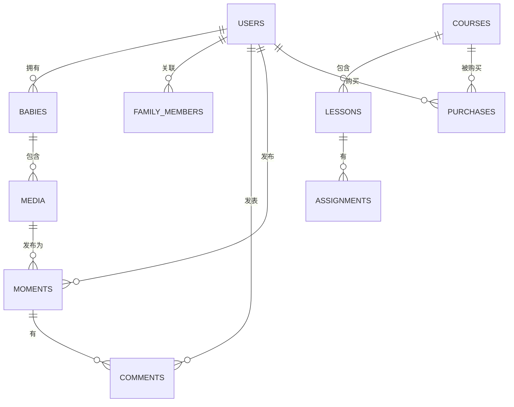

## 1. 整体架构设计



## 2. 技术选型说明

### 2.1 前端技术栈
- **框架**: React@18 + TypeScript
- **构建工具**: Vite@5
- **样式方案**: TailwindCSS@3 + CSS Modules
- **路由**: React Router@6
- **状态管理**: Zustand
- **HTTP客户端**: Axios（封装统一请求）
- **UI组件**: 自定义组件 + Lucide React图标
- **视频处理**: 原生MediaRecorder API

### 2.2 后端技术栈
- **框架**: Express@4 + TypeScript
- **数据库**: SQLite3 + better-sqlite3（同步API，性能好）
- **文件上传**: Multer
- **认证**: JWT + bcrypt
- **日志**: Winston
- **CORS**: cors中间件

### 2.3 端口规划（基于项目号4830）
- 前端端口: **48301**
- 后端端口: **48302**
- 避免常见端口（3000、5173、8000、8080）

## 3. 路由定义

### 3.1 前端路由
| 路由路径 | 页面名称 | 权限要求 |
|----------|----------|----------|
| /login | 登录选择页 | 公开 |
| /home | Home时光机 | 登录用户 |
| /camera | 拍宝宝 | 登录用户 |
| /moments | 亲友圈 | 登录用户 |
| /community | 摄影社区 | 登录用户 |
| /profile | 个人中心 | 登录用户 |
| /admin | 管理后台 | 管理员 |
| /share/:id | 分享链接页 | 公开（需密码） |

### 3.2 后端API路由
| 路由前缀 | 模块 | 说明 |
|----------|------|------|
| /api/auth | 认证 | 登录、注册、邀请码 |
| /api/users | 用户 | 用户信息、家庭成员 |
| /api/babies | 宝宝 | 宝宝档案、成长数据 |
| /api/media | 媒体 | 照片/视频上传、列表、详情 |
| /api/moments | 亲友圈 | 动态发布、列表、评论 |
| /api/community | 社区 | 热门、话题、课程 |
| /api/admin | 管理 | 统计、审核、用户管理 |

## 4. API响应格式

### 4.1 统一响应结构
```typescript
interface ApiResponse<T = any> {
  success: boolean;
  data?: T;
  message: string;
  code?: number;
}
```

### 4.2 错误码定义
| 错误码 | 说明 |
|--------|------|
| 400 | 请求参数错误 |
| 401 | 未登录/Token过期 |
| 403 | 无权限 |
| 404 | 资源不存在 |
| 500 | 服务器内部错误 |

### 4.3 请求封装要求
- 超时时间：10秒
- 自动重试：1次（网络错误时）
- 请求拦截：添加Token、请求ID
- 响应拦截：统一错误处理、Token刷新
- 错误展示：Toast提示

## 5. 后端分层架构



**目录结构**:
```
backend/
├── src/
│   ├── controllers/    # 控制器层
│   ├── services/       # 业务逻辑层
│   ├── repositories/   # 数据访问层
│   ├── middleware/     # 中间件
│   ├── validators/     # 参数校验
│   ├── utils/          # 工具函数
│   ├── types/          # TypeScript类型
│   ├── config/         # 配置
│   ├── database/       # 数据库初始化
│   └── index.ts        # 入口文件
├── data/               # SQLite数据库文件
├── uploads/            # 文件上传目录
└── package.json
```

## 6. 数据模型设计

### 6.1 ER图



### 6.2 核心数据表

#### users（用户表）
| 字段名 | 类型 | 说明 |
|--------|------|------|
| id | INTEGER PRIMARY KEY | 用户ID |
| phone | VARCHAR(20) UNIQUE | 手机号 |
| password_hash | VARCHAR(255) | 密码哈希 |
| nickname | VARCHAR(50) | 昵称 |
| avatar | VARCHAR(255) | 头像URL |
| role | VARCHAR(20) | 角色: parent/grandparent/friend/admin |
| storage_used | BIGINT | 已用存储字节 |
| storage_limit | BIGINT | 存储限额字节 |
| created_at | DATETIME | 创建时间 |
| updated_at | DATETIME | 更新时间 |

#### babies（宝宝表）
| 字段名 | 类型 | 说明 |
|--------|------|------|
| id | INTEGER PRIMARY KEY | 宝宝ID |
| user_id | INTEGER | 创建者用户ID |
| name | VARCHAR(50) | 宝宝姓名 |
| gender | VARCHAR(10) | 性别 |
| birthday | DATE | 生日 |
| avatar | VARCHAR(255) | 宝宝头像 |
| birth_weight | DECIMAL | 出生体重 |
| birth_height | DECIMAL | 出生身高 |
| created_at | DATETIME | 创建时间 |

#### media（媒体表）
| 字段名 | 类型 | 说明 |
|--------|------|------|
| id | INTEGER PRIMARY KEY | 媒体ID |
| baby_id | INTEGER | 所属宝宝ID |
| user_id | INTEGER | 上传用户ID |
| type | VARCHAR(10) | 类型: photo/video |
| file_path | VARCHAR(255) | 文件路径 |
| thumbnail_path | VARCHAR(255) | 缩略图路径 |
| file_size | BIGINT | 文件大小字节 |
| width | INTEGER | 宽度像素 |
| height | INTEGER | 高度像素 |
| duration | INTEGER | 视频时长秒 |
| caption | TEXT | 描述文字 |
| taken_at | DATETIME | 拍摄时间 |
| location | VARCHAR(255) | 拍摄地点 |
| is_favorite | BOOLEAN | 是否收藏 |
| created_at | DATETIME | 创建时间 |

#### moments（亲友圈动态）
| 字段名 | 类型 | 说明 |
|--------|------|------|
| id | INTEGER PRIMARY KEY | 动态ID |
| user_id | INTEGER | 发布用户ID |
| content | TEXT | 文字内容 |
| media_ids | TEXT | 媒体ID列表(JSON) |
| like_count | INTEGER | 点赞数 |
| comment_count | INTEGER | 评论数 |
| visibility | VARCHAR(20) | 可见性: family/public/private |
| created_at | DATETIME | 创建时间 |

#### comments（评论表）
| 字段名 | 类型 | 说明 |
|--------|------|------|
| id | INTEGER PRIMARY KEY | 评论ID |
| moment_id | INTEGER | 动态ID |
| user_id | INTEGER | 评论用户ID |
| content | TEXT | 评论内容 |
| reply_to | INTEGER | 回复某评论ID |
| created_at | DATETIME | 创建时间 |

#### courses（课程表）
| 字段名 | 类型 | 说明 |
|--------|------|------|
| id | INTEGER PRIMARY KEY | 课程ID |
| title | VARCHAR(200) | 课程标题 |
| description | TEXT | 课程描述 |
| cover_image | VARCHAR(255) | 封面图 |
| instructor | VARCHAR(100) | 讲师 |
| price | DECIMAL | 价格 |
| lesson_count | INTEGER | 课时数 |
| status | VARCHAR(20) | 状态: draft/published |
| created_at | DATETIME | 创建时间 |

## 7. 安全与防护

### 7.1 前端防护
- 全局Error Boundary捕获React渲染错误
- API请求统一封装，自动重试1次
- 所有异步页面具备loading/error/empty/data状态
- 表单防重复提交（按钮disabled状态）
- 深层属性使用可选链`?.`和默认值

### 7.2 后端防护
- 所有API参数校验（使用joi或自定义校验）
- JWT认证中间件，Token过期自动刷新
- SQL注入防护：使用参数化查询
- 文件上传：类型校验、大小限制、重命名防覆盖
- try...catch包裹所有数据库操作
- 统一错误日志记录

## 8. 启动方式

### 8.1 后端启动（后台运行）
```bash
cd backend
npm run build
nohup npm run start > ../logs/backend.log 2>&1 &
```

### 8.2 前端启动（后台运行）
```bash
cd frontend
npm run build
nohup npx serve -l 48301 dist > ../logs/frontend.log 2>&1 &
```

### 8.3 端口检查与清理
```bash
# 仅检查本项目端口
lsof -i :48301 -i :48302
# 确认cwd属于本项目后再kill
```
