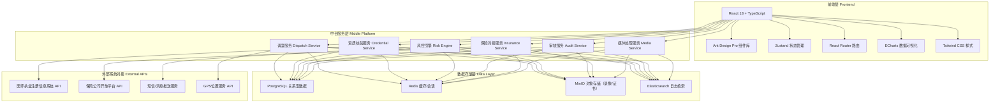

## 1. 架构设计



## 2. 技术描述

- **前端框架**：React 18 + TypeScript
- **UI组件库**：Ant Design 5.x + Tailwind CSS 3.x
- **构建工具**：Vite 5.x（别名 `@` → `src`）
- **初始化模板**：react-express-ts（前后端同构）
- **状态管理**：Zustand（按领域拆分 store）
- **路由方案**：React Router v6（嵌套路由+权限控制）
- **图表可视化**：ECharts 5.x（封装 React 组件）
- **图标库**：lucide-react
- **后端框架**：Express 4.x + TypeScript（ESM 模块）
- **数据库**：PostgreSQL 14（使用 mock 数据，前端直连模拟 API）
- **对象存储**：MinIO（模拟，前端使用 base64/FileReader 演示）
- **网络请求**：Axios（统一封装拦截器+错误处理）
- **日期处理**：day.js

## 3. 路由定义

| 路由路径 | 页面用途 | 访问角色 |
|----------|----------|----------|
| `/dashboard` | 数据看板总览 | 平台管理员/机构管理员/质控专员 |
| `/nurses` | 护士列表 | 机构管理员 |
| `/nurses/:id/verify` | 护士资质核验详情 | 机构管理员 |
| `/nurses/warnings` | 资质有效期预警 | 机构管理员 |
| `/orders` | 订单调度中心列表 | 机构管理员/调度员 |
| `/orders/:id` | 订单详情与派单 | 机构管理员 |
| `/orders/:id/risk-assessment` | 风险评估问卷填写 | 机构管理员/护士 |
| `/service/ongoing` | 进行中服务管控面板 | 护士/质控专员 |
| `/service/:id/record` | 电子护理记录录入 | 护士 |
| `/service/:id/vitals` | 生命体征与用药录入 | 护士 |
| `/audit/todo` | 待办审核列表（按角色） | 护士/质控专员/平台管理员 |
| `/audit/:id` | 审核工作台 | 对应审核角色 |
| `/audit/trail` | 审核追溯记录 | 平台管理员 |
| `/risk/tickets` | 风控工单列表 | 质控专员/平台管理员 |
| `/risk/tickets/:id` | 工单处理详情 | 质控专员/平台管理员 |
| `/risk/rules` | 风控规则配置 | 平台管理员 |
| `/insurance/policies` | 保单列表 | 机构管理员/财务 |
| `/insurance/config` | 自动投保配置 | 平台管理员 |
| `/reports/service` | 服务统计报表 | 机构管理员/平台管理员 |
| `/reports/compliance` | 合规统计报表 | 平台管理员 |
| `/reports/risk` | 风险统计报表 | 平台管理员 |
| `/login` | 登录页 | 所有用户 |

## 4. API 接口定义（模拟）

```typescript
// ============ 通用类型 ============
type PageResult<T> = { list: T[]; total: number; page: number; pageSize: number };
type ApiResponse<T> = { code: number; message: string; data: T };

// ============ 护士资质模块 ============
interface Nurse {
  id: string;
  name: string;
  phone: string;
  idCard: string;
  avatar?: string;
  certificateNumber: string;
  certificateType: '执业护士' | '执业医师' | '助产士';
  practiceScope: string[];
  certificateImage: string;
  verifyStatus: 'pending' | 'verifying' | 'verified' | 'rejected';
  verifyResult?: {
    systemChecked: boolean;
    systemMessage?: string;
    manualChecked: boolean;
    manualRemark?: string;
  };
  validUntil: string;
  organizationId: string;
  createdAt: string;
}

// GET /api/nurses → PageResult<Nurse>
// GET /api/nurses/:id → Nurse
// POST /api/nurses/:id/verify → Nurse (触发系统核验)
// POST /api/nurses/:id/approve → Nurse (人工审核通过/驳回)
// GET /api/nurses/warnings → Nurse[]

// ============ 订单调度模块 ============
type PatientType = 'elderly' | 'maternal' | 'post-hospital' | 'hospice';
type RiskLevel = 'low' | 'medium' | 'high' | 'critical';
type OrderStatus = 'created' | 'risk-assessed' | 'dispatched' | 'nurse-accepted' | 'in-service' | 'completed' | 'cancelled';

interface ServiceOrder {
  id: string;
  orderNo: string;
  patientType: PatientType;
  patientInfo: {
    name: string;
    age: number;
    gender: 'male' | 'female';
    phone: string;
    address: string;
    diagnosis?: string;
    allergies?: string[];
  };
  serviceItems: { code: string; name: string; duration: number }[];
  riskLevel: RiskLevel;
  riskAssessmentId?: string;
  nurseId?: string;
  nurseInfo?: Partial<Nurse>;
  scheduledTime: string;
  actualStartTime?: string;
  actualEndTime?: string;
  status: OrderStatus;
  auditStatus: 'not-submitted' | 'self-check' | 'quality-control' | 'platform-check' | 'all-passed';
  hasInsurance: boolean;
  policyId?: string;
  createdAt: string;
}

// GET /api/orders → PageResult<ServiceOrder>
// GET /api/orders/:id → ServiceOrder
// POST /api/orders/:id/dispatch → ServiceOrder
// POST /api/orders/:id/cancel → ServiceOrder

// ============ 风险评估模块 ============
interface RiskQuestion {
  id: string;
  category: PatientType | 'general';
  question: string;
  options: { label: string; score: number }[];
}
interface RiskAssessment {
  id: string;
  orderId: string;
  patientType: PatientType;
  answers: { questionId: string; optionIndex: number }[];
  totalScore: number;
  riskLevel: RiskLevel;
  suggestions?: string;
  createdAt: string;
}

// GET /api/risk-questions?category=xxx → RiskQuestion[]
// POST /api/risk-assessment → RiskAssessment
// GET /api/risk-assessment/:id → RiskAssessment

// ============ 服务过程管控模块 ============
interface ServiceRecord {
  id: string;
  orderId: string;
  checkIn: { time: string; gps: [number, number]; photo?: string } | null;
  checkOut: { time: string; gps: [number, number] } | null;
  recording: {
    audioUrl?: string;
    videoUrl?: string;
    encryptedHash: string;
    startTime: string;
    endTime?: string;
    duration: number;
    hasInterruptions: boolean;
  } | null;
  vitalSigns?: {
    temperature?: number;
    heartRate?: number;
    bloodPressure?: { systolic: number; diastolic: number };
    respiratoryRate?: number;
    oxygenSaturation?: number;
    bloodGlucose?: number;
    recordedAt: string;
  }[];
  medicationList?: {
    name: string;
    dosage: string;
    frequency: string;
    administered: boolean;
    remark?: string;
  }[];
  nursingNotes: {
    content: string;
    images?: string[];
    signature: string;
    createdAt: string;
  }[];
  dataBindingVerified: boolean;
}

// GET /api/service/:orderId/record → ServiceRecord
// POST /api/service/:orderId/check-in → ServiceRecord
// POST /api/service/:orderId/check-out → ServiceRecord
// POST /api/service/:orderId/recording/start | stop → ServiceRecord
// POST /api/service/:orderId/vitals → ServiceRecord
// POST /api/service/:orderId/medication → ServiceRecord
// POST /api/service/:orderId/notes → ServiceRecord

// ============ 三级审核模块 ============
type AuditStage = 'self-check' | 'quality-control' | 'platform-check';
type AuditResult = 'approved' | 'rejected' | 'pending';

interface AuditTask {
  id: string;
  orderId: string;
  stage: AuditStage;
  auditorId?: string;
  auditorName?: string;
  result: AuditResult;
  remarks?: string;
  attachments?: string[];
  startedAt: string;
  completedAt?: string;
}

// GET /api/audit/todo?stage=xxx → AuditTask[]
// GET /api/audit/:id → { task: AuditTask; order: ServiceOrder; record: ServiceRecord }
// POST /api/audit/:id/submit → AuditTask
// GET /api/audit/trail?orderId=xxx → AuditTask[]

// ============ 风控工单模块 ============
type RiskType = 'out-of-scope' | 'no-check-in' | 'recording-interrupt' | 'data-mismatch' | 'overtime' | 'complaint';

interface RiskTicket {
  id: string;
  ticketNo: string;
  orderId: string;
  nurseId?: string;
  riskType: RiskType;
  severity: 'low' | 'medium' | 'high' | 'critical';
  description: string;
  evidence: { type: string; url: string; description?: string }[];
  status: 'open' | 'investigating' | 'resolved' | 'closed';
  assigneeId?: string;
  assigneeName?: string;
  resolution?: string;
  createdAt: string;
  resolvedAt?: string;
}

// GET /api/risk/tickets → PageResult<RiskTicket>
// GET /api/risk/tickets/:id → RiskTicket
// POST /api/risk/tickets/:id/assign → RiskTicket
// POST /api/risk/tickets/:id/resolve → RiskTicket

// ============ 保险对接模块 ============
interface InsurancePolicy {
  id: string;
  policyNo: string;
  orderId: string;
  insurerName: string;
  productName: string;
  insuredName: string;
  premium: number;
  coverage: number;
  period: { start: string; end: string };
  status: 'pending' | 'active' | 'expired' | 'claimed';
  claimStatus?: 'none' | 'applied' | 'processing' | 'approved' | 'rejected';
  createdAt: string;
}

// GET /api/insurance/policies → PageResult<InsurancePolicy>
// POST /api/insurance/auto-insure?orderId=xxx → InsurancePolicy
// GET /api/insurance/config → 投保配置对象
// POST /api/insurance/config → 保存配置
```

## 5. 前端工程架构

```mermaid
graph TD
    A["src/"]
    A --> B["components/ 复用组件"]
    A --> C["pages/ 页面文件"]
    A --> D["store/ Zustand状态"]
    A --> E["api/ 接口请求"]
    A --> F["utils/ 工具函数"]
    A --> G["hooks/ 自定义Hooks"]
    A --> H["types/ 类型定义"]
    A --> I["mock/ Mock数据"]
    A --> J["layouts/ 布局组件"]
    A --> K["router/ 路由配置"]
    A --> L["assets/ 静态资源"]

    B --> B1["charts/ 图表封装"]
    B --> B2["forms/ 表单组件"]
    B --> B3["cards/ 卡片组件"]
    B --> B4["status/ 状态徽章"]
    B --> B5["timeline/ 时间轴"]

    C --> C1["dashboard/ 看板"]
    C --> C2["nurse/ 护士资质"]
    C --> C3["order/ 订单调度"]
    C --> C4["service/ 服务管控"]
    C --> C5["audit/ 审核流"]
    C --> C6["risk/ 风控工单"]
    C --> C7["insurance/ 保险"]
    C --> C8["reports/ 统计报表"]

    D --> D1["auth.store.ts"]
    D --> D2["nurse.store.ts"]
    D --> D3["order.store.ts"]
    D --> D4["service.store.ts"]
    D --> D5["audit.store.ts"]
    D --> D6["risk.store.ts"]
```



## 6. 数据模型关系（ER）

```mermaid
erDiagram
    NURSE ||--o{ CERTIFICATE : "持有"
    NURSE ||--o{ SERVICE_ORDER : "服务"
    PATIENT ||--o{ SERVICE_ORDER : "发起"
    SERVICE_ORDER ||--|| RISK_ASSESSMENT : "关联"
    SERVICE_ORDER ||--o| SERVICE_RECORD : "产生"
    SERVICE_RECORD ||--o{ VITAL_SIGN : "包含"
    SERVICE_RECORD ||--o{ MEDICATION : "包含"
    SERVICE_RECORD ||--o{ NURSING_NOTE : "包含"
    SERVICE_RECORD ||--o| MEDIA_RECORDING : "绑定"
    SERVICE_ORDER ||--o{ AUDIT_TASK : "触发"
    SERVICE_ORDER ||--o| RISK_TICKET : "可能生成"
    SERVICE_ORDER ||--o| INSURANCE_POLICY : "关联投保"

    NURSE {
        string id PK
        string name
        string certificate_no UK
        enum verify_status
        date valid_until
    }
    SERVICE_ORDER {
        string id PK
        string order_no UK
        enum patient_type
        enum risk_level
        string nurse_id FK
        enum status
    }
    RISK_ASSESSMENT {
        string id PK
        string order_id FK
        int total_score
        enum risk_level
    }
    SERVICE_RECORD {
        string id PK
        string order_id FK UK
        boolean data_binding_verified
    }
    AUDIT_TASK {
        string id PK
        string order_id FK
        enum stage
        enum result
    }
    RISK_TICKET {
        string id PK
        string order_id FK
        enum risk_type
        enum severity
        enum status
    }
    INSURANCE_POLICY {
        string id PK
        string policy_no UK
        string order_id FK
        decimal premium
    }
```
