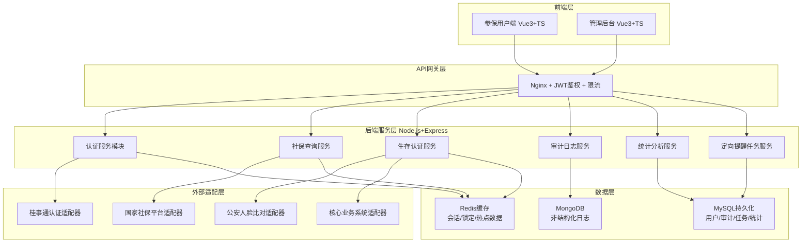
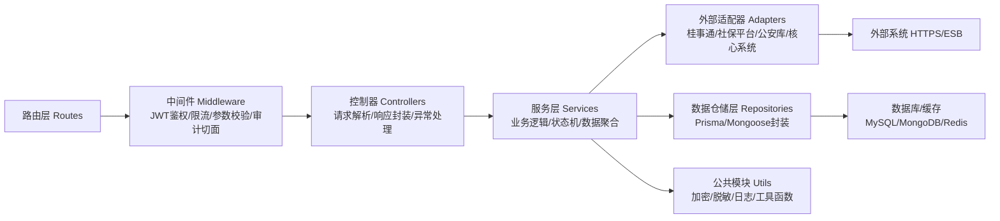

## 1. 架构设计

本平台采用前后端分离架构，前端分为用户端（C端）与管理后台（B端）两个独立应用，后端提供统一RESTful API，通过服务适配层对接外部政务系统与社保平台。全链路贯彻数据安全与操作审计原则。



## 2. 技术描述

### 2.1 前端技术栈
- **核心框架**：Vue 3.4 + TypeScript 5.4 + Vite 5.2
- **状态管理**：Pinia 2.1（用户状态、认证状态、数据缓存）
- **路由管理**：Vue Router 4.3（路由守卫、权限控制）
- **UI组件库**：Element Plus 2.7（政务风格主题定制）
- **数据可视化**：ECharts 5.5（柱状图/折线图/热力图/饼图）
- **HTTP客户端**：Axios 1.7（拦截器、Token注入、统一错误处理）
- **加解密**：crypto-js 4.2（人脸特征AES本地加密、敏感字段解密）
- **工具库**：Lodash 4.17、Day.js 1.11

### 2.2 后端技术栈
- **运行时**：Node.js 20 LTS
- **Web框架**：Express 4.19
- **语言**：TypeScript 5.4
- **ORM**：Prisma 5.14（MySQL）、Mongoose 8.4（MongoDB）
- **缓存**：ioredis 5.4
- **鉴权**：jsonwebtoken 9.0、bcryptjs 2.4
- **日志**：Winston 3.13
- **校验**：Zod 3.23（请求参数Schema校验）
- **Mock数据**：生产环境可切换Mock模式（无需真实外部接口）

### 2.3 工程初始化
- 前端用户端与管理后台：使用 Vite + vue-ts 模板分别初始化，共享公共Types与Utils包
- 后端：使用 Express Generator + TypeScript 模板，按模块化目录结构组织
- Monorepo管理：pnpm workspaces，项目根目录统一管理脚本与依赖版本

### 2.4 数据库选型
- **MySQL 8.0**：结构化数据存储（用户、任务、统计汇总、配置）
- **MongoDB 7.0**：操作审计日志、认证流水日志（高写入、灵活Schema）
- **Redis 7.0**：JWT黑名单、登录失败计数锁定、热点社保数据缓存、短信验证码

## 3. 路由定义

### 3.1 用户端路由（/user前缀为应用名）
| 路由路径 | 页面名称 | 权限要求 | 说明 |
|----------|----------|----------|------|
| / | 用户端首页 | 公开 | 登录入口、公告、功能导航 |
| /auth/callback | 桂事通回调页 | 公开 | 接收桂事通授权码，换取Token |
| /dashboard | 个人工作台 | 已认证 | 个人信息概览、快捷入口 |
| /social-insurance | 社保权益查询 | 已认证 | 四险种查询、图表对比 |
| /survival-certification | 线上生存认证 | 已认证 | 活体检测+人脸识别 |
| /certification-history | 认证记录 | 已认证 | 历史认证结果查询 |
| /profile | 个人中心 | 已认证 | 资料修改、密码管理、设备管理 |

### 3.2 管理后台路由（/admin前缀为应用名）
| 路由路径 | 页面名称 | 权限要求 | 说明 |
|----------|----------|----------|------|
| /login | 管理员登录 | 公开 | 工号+UKey双因素登录 |
| /dashboard | 数据看板 | 操作员 | 核心指标、认证趋势 |
| /statistics/query-top | 高频查询TOP10 | 操作员 | 查询事项排名分析 |
| /statistics/certification | 认证分析 | 操作员 | 通过率、地域分布、年龄分布 |
| /tasks/reminder | 定向提醒任务 | 操作员 | 未认证人员提醒创建与跟踪 |
| /audit/logs | 审计日志 | 管理员 | 全平台操作日志检索 |
| /system/users | 用户管理 | 管理员 | 账号管理、权限分配 |
| /system/config | 系统配置 | 管理员 | 锁定策略、模板配置 |

## 4. API 接口定义

### 4.1 认证模块
```typescript
// 桂事通登录相关
interface GstLoginUrlResponse { redirectUrl: string; state: string; }
interface GstCallbackRequest { code: string; state: string; }
interface LoginResponse {
  token: string;
  refreshToken: string;
  userInfo: {
    id: string;
    nameMasked: string;      // 脱敏姓名 张*三
    idCardMasked: string;    // 脱敏身份证 450***********1234
    socialCardMasked: string; // 脱敏社保卡号
    insureStatus: 'NORMAL' | 'SUSPENDED' | 'RETIRED';
  };
}

// POST /api/auth/gst/login-url → GstLoginUrlResponse
// POST /api/auth/gst/callback (GstCallbackRequest) → LoginResponse
// POST /api/auth/refresh {refreshToken:string} → LoginResponse
// POST /api/auth/logout → 204
```

### 4.2 社保查询模块
```typescript
type InsuranceType = 'PENSION' | 'UNEMPLOYMENT' | 'INJURY' | 'MATERNITY';
type QueryRange = 'MONTHLY' | 'QUARTERLY' | 'YEARLY';

interface AccountBalance {
  insuranceType: InsuranceType;
  personalAccount: number;      // 个人账户余额
  pooledAccount: number;        // 统筹账户
  updatedAt: string;            // 更新时间
}
interface PaymentDetail {
  period: string;               // 费款所属期 2025-06
  paymentBase: number;          // 缴费基数
  personalAmount: number;       // 个人缴费
  companyAmount: number;        // 单位缴费
  totalAmount: number;
  status: 'PAID' | 'UNPAID' | 'ARREARS';
}
interface BenefitRecord {
  issueDate: string;            // 发放日期
  itemName: string;             // 发放项目
  amount: number;
  bankAccountMasked: string;    // 脱敏到账账户
  status: 'ISSUED' | 'PENDING' | 'FAILED';
}
interface CompareChartData {
  period: string;
  currentValue: number;
  yoyValue: number;             // 同比值
  momValue: number;             // 环比值
  yoyChange: number;            // 同比变化率 %
  momChange: number;            // 环比变化率 %
}

// GET /api/social-insurance/:type/balance → AccountBalance
// GET /api/social-insurance/:type/payments?range=MONTHLY&page=1&size=20 → {list:PaymentDetail[], total:number}
// GET /api/social-insurance/:type/benefits?page=1&size=20 → {list:BenefitRecord[], total:number}
// GET /api/social-insurance/:type/compare?dimension=PAYMENT_BASE&range=LAST_12_MONTHS → CompareChartData[]
```

### 4.3 生存认证模块
```typescript
interface CertificationStartResponse {
  sessionId: string;
  actionSequence: ('BLINK' | 'NOD' | 'OPEN_MOUTH' | 'TURN_LEFT' | 'TURN_RIGHT')[];
  expiresAt: number;
}
interface LivenessSubmitRequest {
  sessionId: string;
  actionIndex: number;
  actionResult: boolean;
  encryptedFeatureHash: string;  // 本地AES加密后人脸特征哈希（非原始图像）
  deviceFingerprint: string;
}
interface CertificationResultResponse {
  sessionId: string;
  status: 'IN_PROGRESS' | 'SUCCESS' | 'FAILED' | 'LOCKED';
  steps: {
    livenessPassed: boolean;
    faceMatched: boolean;
    coreSynced: boolean;
  };
  matchScore?: number;           // 比对相似度 0-100
  failReason?: string;
  lockExpiresAt?: number;        // 锁定到期时间戳
  failCount?: number;            // 今日失败次数
}
interface CertificationHistoryItem {
  id: string;
  date: string;
  status: 'SUCCESS' | 'FAILED';
  channel: 'ONLINE' | 'OFFLINE';
  failReason?: string;
}

// POST /api/certification/start → CertificationStartResponse
// POST /api/certification/liveness-submit (LivenessSubmitRequest) → CertificationResultResponse
// POST /api/certification/face-match {sessionId:string, encryptedFeatureHash:string} → CertificationResultResponse
// GET /api/certification/result/:sessionId → CertificationResultResponse
// GET /api/certification/history?page=1&size=20 → {list:CertificationHistoryItem[], total:number}
```

### 4.4 管理后台统计模块
```typescript
interface DashboardSummary {
  todayCertCount: number;        // 今日认证数
  todayCertPassRate: number;     // 今日通过率 %
  todayQueryCount: number;       // 今日查询量
  activeUsers7d: number;         // 近7日活跃用户
  pendingReminderCount: number;  // 待提醒人数
}
interface PassRateTrendPoint {
  date: string;
  totalCount: number;
  successCount: number;
  failCount: number;
  lockedCount: number;
  passRate: number;
}
interface QueryTopItem {
  rank: number;
  itemName: string;
  queryCount: number;
  percentage: number;            // 占比 %
  momChange: number;             // 环比变化 %
  trend: 'UP' | 'DOWN' | 'FLAT';
}
interface UncertifiedPersonFilter {
  region?: string[];             // 地区编码
  ageRange?: [number, number];   // 年龄段
  insuranceType?: InsuranceType[];
  overdueDays?: [number, number];// 逾期认证天数
}
interface UncertifiedPerson {
  id: string;
  nameMasked: string;
  idCardMasked: string;
  region: string;
  lastCertDate: string;
  overdueDays: number;
  phoneMasked: string;
  insuranceTypes: InsuranceType[];
}
interface ReminderTask {
  id: string;
  name: string;
  createdAt: string;
  creator: string;
  totalCount: number;
  deliveredCount: number;        // 已送达
  readCount: number;             // 已读
  convertedCount: number;        // 转化认证
  status: 'DRAFT' | 'RUNNING' | 'COMPLETED' | 'CANCELLED';
  progress: number;              // 0-100
}
interface AuditLogItem {
  id: string;
  timestamp: string;
  userId: string;
  userNameMasked: string;
  operation: string;             // 操作类型
  module: string;                // 所属模块
  ip: string;
  deviceInfo: string;
  result: 'SUCCESS' | 'FAIL';
  detail: string;                // JSON详情字符串
}

// GET /api/admin/dashboard/summary → DashboardSummary
// GET /api/admin/statistics/pass-rate-trend?days=30 → PassRateTrendPoint[]
// GET /api/admin/statistics/query-top?limit=10&range=THIS_MONTH → QueryTopItem[]
// POST /api/admin/people/uncertified (UncertifiedPersonFilter) → {list:UncertifiedPerson[], total:number}
// POST /api/admin/tasks/reminder/create {filter, templateId, scheduledAt?} → ReminderTask
// GET /api/admin/tasks/reminder?page=1&size=20&status=RUNNING → {list:ReminderTask[], total:number}
// GET /api/admin/tasks/reminder/:id → ReminderTask & {persons:UncertifiedPerson[]}
// GET /api/admin/audit/logs?userId=&operation=&startDate=&endDate=&page=1&size=50 → {list:AuditLogItem[], total:number}
```

## 5. 后端服务分层架构



## 6. 数据模型

### 6.1 实体关系图

```mermaid
erDiagram
    USER ||--o{ CERTIFICATION_SESSION : has
    USER ||--o{ AUDIT_LOG : produces
    USER ||--o{ LOCK_RECORD : has
    REMINDER_TASK ||--o{ TASK_RECIPIENT : contains
    USER ||--o{ TASK_RECIPIENT : is
    USER {
        string id PK "用户ID"
        string gst_openid "桂事通OPENID"
        string name_encrypted "姓名AES加密"
        string idcard_encrypted "身份证AES加密"
        string social_card_no_encrypted "社保卡号AES加密"
        string phone_encrypted "手机号AES加密"
        string insure_status "参保状态"
        string region "所属地区编码"
        date birth_date "出生日期"
        datetime created_at
        datetime updated_at
    }
    CERTIFICATION_SESSION {
        string id PK
        string user_id FK
        string session_token "会话Token"
        string action_sequence "动作序列JSON"
        int current_step "当前步骤"
        string status "状态：IN_PROGRESS/SUCCESS/FAIL"
        int fail_count "本次会话失败次数"
        float match_score "比对分值"
        string encrypted_feature_hash "加密特征哈希"
        string device_fingerprint "设备指纹"
        string ip_address
        boolean core_synced "核心系统同步标志"
        datetime created_at
        datetime completed_at
    }
    LOCK_RECORD {
        bigint id PK
        string user_id FK
        string lock_type "LOGIN_FAIL/CERT_FAIL"
        int fail_count
        datetime locked_at
        datetime expires_at
        boolean unlocked "是否已解锁"
        string unlock_reason
    }
    AUDIT_LOG {
        ObjectId id PK
        string user_id
        string user_type "USER/ADMIN"
        string module "AUTH/SOCIAL/CERTIFY/TASK"
        string operation "具体操作类型"
        string result "SUCCESS/FAIL"
        string ip_address
        string user_agent
        string detail JSON "操作详情"
        datetime timestamp
    }
    REMINDER_TASK {
        string id PK
        string name
        string creator_id FK
        string filter_criteria JSON "筛选条件"
        bigint sms_template_id "短信模板ID"
        string status "DRAFT/RUNNING/COMPLETED"
        int total_count
        int delivered_count
        int read_count
        int converted_count
        datetime scheduled_at
        datetime created_at
        datetime completed_at
    }
    TASK_RECIPIENT {
        bigint id PK
        string task_id FK
        string user_id FK
        string phone_masked "脱敏手机号（快照）"
        string delivery_status
        boolean is_read
        boolean is_converted
        datetime delivered_at
        datetime read_at
        datetime converted_at
    }
    QUERY_STAT_DAILY {
        date stat_date PK
        string item_name PK "查询事项名称"
        int query_count
        int user_count
        datetime updated_at
    }
    CERT_STAT_DAILY {
        date stat_date PK
        string region PK
        int total_count
        int success_count
        int fail_count
        int locked_count
        datetime updated_at
    }
```

### 6.2 关键索引与DDL要点

- `USER` 表：`gst_openid` 唯一索引，`region` + `insure_status` 联合索引（筛选未认证人群）
- `CERTIFICATION_SESSION`：`user_id` + `created_at` 联合索引（查询历史），`status` + `core_synced` 索引（同步补偿任务）
- `AUDIT_LOG`：MongoDB TTL索引（timestamp, 保留365天），复合索引（user_id+timestamp, module+timestamp）
- `LOCK_RECORD`：`user_id` + `lock_type` + `expires_at` 索引（查询锁定状态）
- `QUERY_STAT_DAILY` / `CERT_STAT_DAILY`：按日期分区表，提升大范围统计查询性能
- 加密字段统一前缀 `encrypted_`，仅后端持有密钥，前端仅展示 `_masked` 脱敏字段

## 7. 安全策略清单

| 安全策略 | 实现位置 | 具体措施 |
|----------|----------|----------|
| 敏感数据脱敏 | 前端 + 后端 | 姓名/身份证/手机号/银行卡等字段，后端统一返回脱敏值，原始值加密存储；前端hover临时查看需二次手势验证 |
| 操作留痕审计 | 后端AOP切面 | 所有写操作+敏感读操作自动写入AuditLog，含用户/IP/设备/结果/详情 |
| 认证失败锁定 | 后端 + Redis | 登录/认证每失败一次计数器+1，≥3次写入LOCK_RECORD，24小时内拒绝 |
| 生物特征本地加密 | 前端 CryptoJS | 人脸特征向量经AES-256加密，密钥由设备指纹派生；服务端仅存储加密哈希，绝不保留原始图像或特征 |
| 传输安全 | 全链路 | 强制HTTPS+HSTS，后端API签名校验，防重放Nonce机制 |
| 权限控制 | 后端中间件 | JWT+RBAC，Token短时效2小时+Refresh Token，Redis黑名单支持主动注销 |
| 接口防刷 | API网关 | 按用户/IP/QPS限流，短信验证码图形验证码双因子 |
