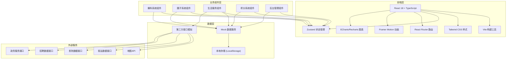
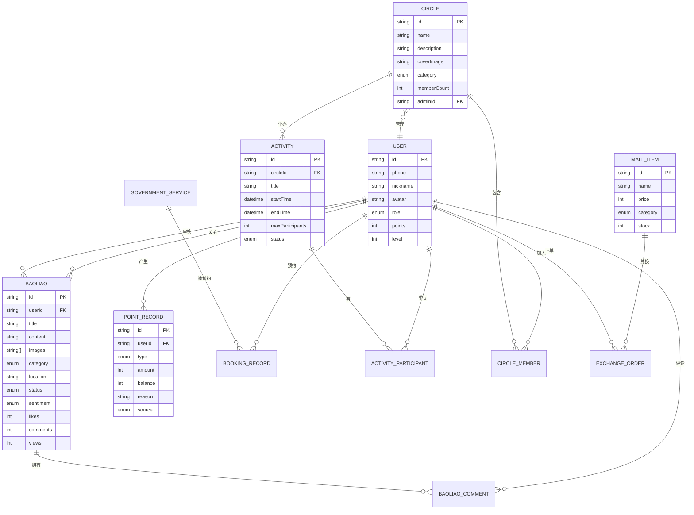

## 1. 架构设计



## 2. 技术描述

### 2.1 核心技术栈

- **前端框架**：React 18.3.1 + TypeScript 5.8
- **构建工具**：Vite 6.3.5
- **样式方案**：Tailwind CSS 3.4.17 + PostCSS 8.5
- **状态管理**：Zustand 5.0.3
- **路由管理**：React Router DOM 7.3.0
- **动画库**：Framer Motion 11.0+
- **图表库**：ECharts 5.5+、Recharts 2.10+
- **图标库**：Lucide React 0.511.0
- **工具库**：clsx 2.1.1、tailwind-merge 3.0.2
- **代码质量**：ESLint 9.25、TypeScript ESLint 8.30

### 2.2 项目初始化

项目已基于 Vite React TypeScript 模板初始化，包含完整的开发工具链配置。无需重新初始化，直接在现有基础上扩展功能模块。

### 2.3 后端与数据库

本项目采用纯前端实现方案，使用 Mock 数据模拟后端服务：
- 所有业务数据通过 TypeScript 类型定义和 Mock 数据生成器提供
- 用户数据、操作记录存储于 LocalStorage
- 第三方服务接口使用模拟数据返回
- 如后续需要真实后端，可扩展 Express.js API 服务层

## 3. 路由定义

| 路由路径 | 页面名称 | 权限要求 | 说明 |
|----------|----------|----------|------|
| `/` | 首页 | 公开 | 城市门户首页，展示爆料、圈子、服务入口 |
| `/baoliao` | 爆料列表 | 公开 | 按分类/区域展示所有爆料 |
| `/baoliao/publish` | 发布爆料 | 登录用户 | 图文/短视频爆料发布页面 |
| `/baoliao/:id` | 爆料详情 | 公开 | 单条爆料完整内容与互动 |
| `/circles` | 圈子列表 | 公开 | 所有兴趣圈子分类浏览 |
| `/circles/:id` | 圈子详情 | 公开 | 单个圈子主页与内容 |
| `/circles/:id/activity/publish` | 发布活动 | 圈子管理员 | 圈子内活动发布 |
| `/activity/:id` | 活动详情 | 公开 | 活动信息与报名管理 |
| `/services` | 生活服务首页 | 公开 | 四大服务分类入口 |
| `/services/bus` | 客运查询 | 公开 | 客运班次查询与票务 |
| `/services/cinema` | 影院排片 | 公开 | 电影查询与场次选择 |
| `/services/job` | 招聘求职 | 公开 | 岗位搜索与简历投递 |
| `/services/government` | 政务预约 | 登录用户 | 政务服务预约办理 |
| `/points` | 积分中心 | 登录用户 | 积分概览与任务中心 |
| `/points/mall` | 积分商城 | 登录用户 | 商品浏览与积分兑换 |
| `/points/donate` | 公益捐赠 | 登录用户 | 积分捐赠公益项目 |
| `/admin` | 管理后台首页 | 编辑/管理员 | 数据看板与快捷操作 |
| `/admin/review` | 爆料审核 | 编辑 | 爆料内容初审管理 |
| `/admin/heatmap` | 舆情热力图 | 政府/管理员 | 区域舆情分析可视化 |
| `/admin/stats` | 数据统计 | 管理员 | 多维度数据报表 |
| `/profile` | 个人中心 | 登录用户 | 用户信息与设置 |
| `/login` | 登录页 | 公开 | 用户登录注册 |

## 4. 数据模型定义

### 4.1 TypeScript 类型定义

```typescript
// 用户类型
interface User {
  id: string;
  phone: string;
  nickname: string;
  avatar: string;
  role: 'user' | 'creator' | 'circle_admin' | 'editor' | 'government' | 'merchant';
  points: number;
  level: number;
  location?: {
    district: string;
    address: string;
  };
  createdAt: Date;
  lastLoginAt: Date;
  isSignedInToday: boolean;
}

// 爆料类型
interface Baoliao {
  id: string;
  userId: string;
  user: User;
  title: string;
  content: string;
  images: string[];
  video?: string;
  category: 'traffic' | 'environment' | 'facility' | 'livelihood' | 'emergency' | 'other';
  categoryName: string;
  location: {
    lat: number;
    lng: number;
    address: string;
    district: string;
    street?: string;
  };
  status: 'pending' | 'approved' | 'rejected';
  rejectReason?: string;
  sentiment: 'positive' | 'neutral' | 'negative';
  likes: number;
  comments: number;
  views: number;
  isLiked: boolean;
  createdAt: Date;
  reviewedAt?: Date;
  reviewerId?: string;
}

// 爆料评论
interface BaoliaoComment {
  id: string;
  baoliaoId: string;
  userId: string;
  user: User;
  content: string;
  likes: number;
  createdAt: Date;
}

// 兴趣圈子
interface Circle {
  id: string;
  name: string;
  description: string;
  coverImage: string;
  category: 'photography' | 'parenting' | 'food' | 'outdoor' | 'sports' | 'culture' | 'other';
  categoryName: string;
  memberCount: number;
  postCount: number;
  activityCount: number;
  adminId: string;
  admin: User;
  isJoined: boolean;
  tags: string[];
  createdAt: Date;
}

// 圈子活动
interface Activity {
  id: string;
  circleId: string;
  circle: Circle;
  organizerId: string;
  organizer: User;
  title: string;
  description: string;
  coverImage: string;
  location: string;
  address: string;
  lat?: number;
  lng?: number;
  startTime: Date;
  endTime: Date;
  maxParticipants: number;
  currentParticipants: number;
  participants: User[];
  status: 'upcoming' | 'ongoing' | 'ended' | 'cancelled';
  isRegistered: boolean;
  images: string[];
  createdAt: Date;
}

// 生活服务 - 客运班次
interface BusSchedule {
  id: string;
  from: string;
  to: string;
  departureTime: string;
  arrivalTime: string;
  duration: string;
  price: number;
  seatsAvailable: number;
  busType: string;
  operator: string;
}

// 生活服务 - 电影
interface Movie {
  id: string;
  title: string;
  poster: string;
  rating: number;
  duration: string;
  genre: string[];
  releaseDate: string;
  description: string;
  nowShowing: boolean;
}

interface CinemaSchedule {
  id: string;
  movieId: string;
  movie: Movie;
  cinemaName: string;
  hall: string;
  time: string;
  price: number;
  seatsAvailable: number;
  language: string;
}

// 生活服务 - 招聘
interface Job {
  id: string;
  title: string;
  company: string;
  companyLogo: string;
  salary: string;
  salaryMin: number;
  salaryMax: number;
  location: string;
  district: string;
  experience: string;
  education: string;
  tags: string[];
  description: string;
  publishDate: string;
}

// 生活服务 - 政务服务
interface GovernmentService {
  id: string;
  name: string;
  category: string;
  department: string;
  description: string;
  requiredMaterials: string[];
  processingTime: string;
  fee: string;
  onlineBooking: boolean;
  bookingUrl?: string;
}

interface BookingRecord {
  id: string;
  serviceId: string;
  service: GovernmentService;
  userId: string;
  bookingDate: Date;
  bookingTime: string;
  status: 'pending' | 'confirmed' | 'completed' | 'cancelled';
  createdAt: Date;
}

// 积分系统
interface PointRecord {
  id: string;
  userId: string;
  type: 'earn' | 'spend';
  amount: number;
  balance: number;
  reason: string;
  source: 'login' | 'publish_baoliao' | 'join_activity' | 'invite' | 'exchange' | 'donate';
  relatedId?: string;
  createdAt: Date;
}

interface PointTask {
  id: string;
  name: string;
  description: string;
  points: number;
  type: 'daily' | 'weekly' | 'one_time';
  icon: string;
  action: string;
  completed: boolean;
  progress?: number;
  target?: number;
}

interface MallItem {
  id: string;
  name: string;
  description: string;
  image: string;
  price: number;
  category: 'coupon' | 'physical' | 'donation';
  merchantName?: string;
  stock: number;
  sold: number;
  expiryDate?: Date;
  discountRate?: number;
}

// 舆情数据
interface HeatmapData {
  district: string;
  street?: string;
  count: number;
  positive: number;
  neutral: number;
  negative: number;
  center: [number, number];
}

interface DailyStats {
  date: string;
  baoliaoCount: number;
  userCount: number;
  activityCount: number;
  positiveRate: number;
}
```

### 4.2 数据模型关系图



## 5. 目录结构设计

```
src/
├── assets/                 # 静态资源
│   ├── images/            # 图片资源
│   └── fonts/             # 字体文件
├── components/            # 公共组件
│   ├── layout/           # 布局组件
│   │   ├── Header.tsx    # 顶部导航
│   │   ├── Footer.tsx    # 底部信息
│   │   └── TabBar.tsx    # 移动端底部Tab
│   ├── common/           # 通用组件
│   │   ├── Card.tsx
│   │   ├── Button.tsx
│   │   ├── Modal.tsx
│   │   ├── Avatar.tsx
│   │   ├── Badge.tsx
│   │   └── Loading.tsx
│   └── business/         # 业务组件
│       ├── BaoliaoCard.tsx
│       ├── CircleCard.tsx
│       ├── ActivityCard.tsx
│       └── ServiceCard.tsx
├── pages/                 # 页面组件
│   ├── Home.tsx
│   ├── baoliao/
│   │   ├── List.tsx
│   │   ├── Publish.tsx
│   │   └── Detail.tsx
│   ├── circles/
│   │   ├── List.tsx
│   │   ├── Detail.tsx
│   │   └── ActivityPublish.tsx
│   ├── activity/
│   │   └── Detail.tsx
│   ├── services/
│   │   ├── Index.tsx
│   │   ├── Bus.tsx
│   │   ├── Cinema.tsx
│   │   ├── Job.tsx
│   │   └── Government.tsx
│   ├── points/
│   │   ├── Center.tsx
│   │   ├── Mall.tsx
│   │   └── Donate.tsx
│   ├── admin/
│   │   ├── Dashboard.tsx
│   │   ├── Review.tsx
│   │   ├── Heatmap.tsx
│   │   └── Stats.tsx
│   ├── Profile.tsx
│   └── Login.tsx
├── stores/                # 状态管理
│   ├── useUserStore.ts
│   ├── useBaoliaoStore.ts
│   ├── useCircleStore.ts
│   ├── useActivityStore.ts
│   ├── useServiceStore.ts
│   └── usePointStore.ts
├── data/                  # Mock数据
│   ├── mockUsers.ts
│   ├── mockBaoliaos.ts
│   ├── mockCircles.ts
│   ├── mockActivities.ts
│   ├── mockServices.ts
│   └── mockPoints.ts
├── types/                 # 类型定义
│   └── index.ts
├── utils/                 # 工具函数
│   ├── format.ts
│   ├── location.ts
│   ├── date.ts
│   └── storage.ts
├── hooks/                 # 自定义Hooks
│   ├── useLocation.ts
│   ├── usePagination.ts
│   └── useInfiniteScroll.ts
├── App.tsx               # 根组件
├── main.tsx              # 入口文件
└── index.css             # 全局样式
```

## 6. API 接口模拟定义

由于采用纯前端方案，所有 API 通过 Mock 数据服务模拟。以下是核心接口定义：

### 6.1 用户模块

```typescript
// 登录
POST /api/user/login
Request: { phone: string; code: string }
Response: { success: boolean; data: User; token: string }

// 获取用户信息
GET /api/user/info
Response: { success: boolean; data: User }

// 签到
POST /api/user/signin
Response: { success: boolean; data: { points: number; signedIn: boolean } }
```

### 6.2 爆料模块

```typescript
// 获取爆料列表
GET /api/baoliao/list
Params: { page?: number; pageSize?: number; category?: string; district?: string; sort?: 'hot' | 'latest' }
Response: { success: boolean; data: { list: Baoliao[]; total: number } }

// 发布爆料
POST /api/baoliao/publish
Request: { title: string; content: string; images: string[]; video?: string; category: string; location: object }
Response: { success: boolean; data: Baoliao }

// 获取爆料详情
GET /api/baoliao/:id
Response: { success: boolean; data: Baoliao }

// 点赞爆料
POST /api/baoliao/:id/like
Response: { success: boolean; data: { liked: boolean; likes: number } }

// 评论爆料
POST /api/baoliao/:id/comment
Request: { content: string }
Response: { success: boolean; data: BaoliaoComment }
```

### 6.3 后台管理接口

```typescript
// 获取待审核爆料
GET /api/admin/baoliao/pending
Response: { success: boolean; data: Baoliao[] }

// 审核爆料
POST /api/admin/baoliao/:id/review
Request: { status: 'approved' | 'rejected'; reason?: string }
Response: { success: boolean }

// 获取热力图数据
GET /api/admin/heatmap
Params: { dateRange?: string[]; district?: string }
Response: { success: boolean; data: HeatmapData[] }

// 获取统计数据
GET /api/admin/stats/daily
Params: { days?: number }
Response: { success: boolean; data: DailyStats[] }
```

## 7. 状态管理设计

使用 Zustand 进行状态管理，按业务模块划分 Store：

### 7.1 用户 Store
- 存储当前登录用户信息
- 管理登录/登出状态
- 处理积分变动

### 7.2 爆料 Store
- 存储爆料列表和详情
- 管理发布流程
- 处理点赞、评论交互

### 7.3 圈子 Store
- 存储圈子列表和详情
- 管理圈子成员
- 处理活动相关逻辑

### 7.4 积分 Store
- 存储积分余额和流水
- 管理任务完成状态
- 处理商城兑换

### 7.5 服务 Store
- 存储各类生活服务数据
- 管理查询条件和结果
- 处理预约流程
